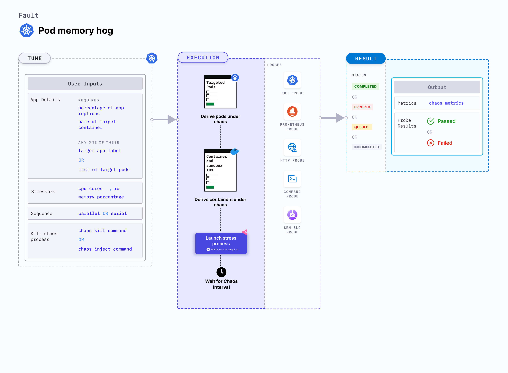

Pod memory hog is a Kubernetes pod-level chaos fault that consumes memory resources in excess, resulting in a significant spike in the memory usage of a pod.
- Simulates a condition where the memory usage of an application spikes up unexpectedly.




## Usage
<details>
<summary>View fault usage</summary>
<div>
Memory usage within containers is subject to various constraints in Kubernetes. If the limits are specified in their spec, exceeding them results in termination of the container (due to OOMKill of the primary process, often pid 1).
This restarts container dependng on policy specified. For containers with no limits on memory, node can be killed based on their oom_score. This results in a bigger blast radius. 
It simulates the situation of memory leaks in the deployment of microservices, application slowness due to memory starvation, and noisy neighbour problems due to hogging. It verifies pod priority and QoS setting for eviction purposes. It also verifies application restarts on OOM kills. 
This fault causes stress within the target container, which may result in the primary process in the container to be constrained or eat up the available system memory on the node.
</div>
</details>

## Prerequisites

- Kubernetes> 1.16.


## Default validations

The application pods should be in running state before and after chaos injection.


## Fault tunables
<details>
    <summary>Fault tunables</summary>
    <h2>Optional fields</h2>
    <table>
      <tr>
        <th> Variables </th>
        <th> Description </th>
        <th> s </th>
      </tr>
      <tr>
        <td> MEMORY_CONSUMPTION </td>
        <td>  The amount of memory used of hogging a Kubernetes pod (megabytes)</td>
        <td> Defaults to 500MB </td>
      </tr>
      <tr>
        <td> NUMBER_OF_WORKERS </td>
        <td> The number of workers used to run the stress process </td>
        <td> Defaults to 1 </td>
      </tr>  
      <tr>
        <td> TOTAL_CHAOS_DURATION </td>
        <td> The time duration for chaos insertion (seconds) </td>
        <td> Defaults to 60s </td>
      </tr>
      <tr>
        <td> LIB_IMAGE </td>
        <td> Image used to run the helper pod.</td>
        <td> Defaults to <code>litmuschaos/go-runner:1.13.8</code> </td>
      </tr>
      <tr>
        <td> STRESS_IMAGE </td>
        <td> Container run on the node at runtime by the pumba lib to inject stressors. Only used in LIB <code>pumba</code></td>
        <td> Default to <code>alexeiled/stress-ng:latest-ubuntu</code> </td>
      </tr>
      <tr>
        <td> TARGET_PODS </td>
        <td> Comma separated list of application pod name subjected to pod memory hog chaos</td>
        <td> If not provided, it will select target pods randomly based on provided appLabels</td>
      </tr>
      <tr>
        <td> TARGET_CONTAINER </td>
        <td> Name of the target container under chaos.</td>
        <td> If not provided, it will select the first container of the target pod</td>
      </tr>   
      <tr>
        <td> CONTAINER_RUNTIME </td>
        <td> container runtime interface for the cluster</td>
        <td> Defaults to containerd, supported values: docker, containerd and crio </td>
      </tr>
      <tr>
        <td> SOCKET_PATH </td>
        <td> Path of the containerd/crio/docker socket file </td>
        <td> Defaults to <code>/run/containerd/containerd.sock</code> </td>
      </tr>        
      <tr>
        <td> PODS_AFFECTED_PERC </td>
        <td> The Percentage of total pods to target </td>
        <td> Defaults to 0 (corresponds to 1 replica), provide numeric value only </td>
      </tr>
      <tr>
        <td> RAMP_TIME </td>
        <td> Period to wait before injection of chaos in sec </td>
        <td> For example, 30 </td>
      </tr>
      <tr>
        <td> SEQUENCE </td>
        <td> It defines sequence of chaos execution for multiple target pods </td>
        <td> Default value: parallel. Supported: serial, parallel </td>
      </tr>
    </table>
</details>

## Fault examples

### Common and pod-specific tunables
Refer to the [common attributes](../../common-tunables-for-all-faults) and [pod-specific tunables](./common-tunables-for-pod-faults) to tune the common tunables for all fault and pod specific tunables.

### Memory consumption

It specifies the amount of memory consumed by the target pod for a duration specified by `TOTAL_CHAOS_DURATION` environment variable. You can tune it using the `MEMORY_CONSUMPTION` environment variable.

Use the following example to tune it:

[embedmd]: # "./static/manifests/pod-memory-hog/memory-consumption.yaml yaml"

```yaml
# define the memory consumption in MB
apiVersion: litmuschaos.io/v1alpha1
kind: ChaosEngine
metadata:
  name: engine-nginx
spec:
  engineState: "active"
  annotationCheck: "false"
  appinfo:
    appns: "default"
    applabel: "app=nginx"
    appkind: "deployment"
  chaosServiceAccount: litmus-admin
  experiments:
    - name: pod-memory-hog
      spec:
        components:
          env:
            # memory consumption value
            - name: MEMORY_CONSUMPTION
              value: "500" #in MB
            - name: TOTAL_CHAOS_DURATION
              value: "60"
```

### Workers for stress

It specifies the number of workers used to stress the resources. You can tune it using the `NUMBER_OF_WORKERS` environment variable.

Use the following example to tune it:

[embedmd]: # "./static/manifests/pod-memory-hog/workers.yaml yaml"

```yaml
# number of workers used for the stress
apiVersion: litmuschaos.io/v1alpha1
kind: ChaosEngine
metadata:
  name: engine-nginx
spec:
  engineState: "active"
  annotationCheck: "false"
  appinfo:
    appns: "default"
    applabel: "app=nginx"
    appkind: "deployment"
  chaosServiceAccount: litmus-admin
  experiments:
    - name: pod-memory-hog
      spec:
        components:
          env:
            # number of workers for stress
            - name: NUMBER_OF_WORKERS
              value: "1"
            - name: TOTAL_CHAOS_DURATION
              value: "60"
```

### Container runtime and socket path

It defines the `CONTAINER_RUNTIME` and `SOCKET_PATH` envrionment variables to set the container runtime and socket file path, respectively.

- `CONTAINER_RUNTIME`: It supports `docker`, `containerd`, and `crio` runtimes. The default value is `containerd`.
- `SOCKET_PATH`: It contains path of containerd socket file by default(`/run/containerd/containerd.sock`). For `docker`, specify path as `/var/run/docker.sock`. For `crio`, specify path as `/var/run/crio/crio.sock`.
