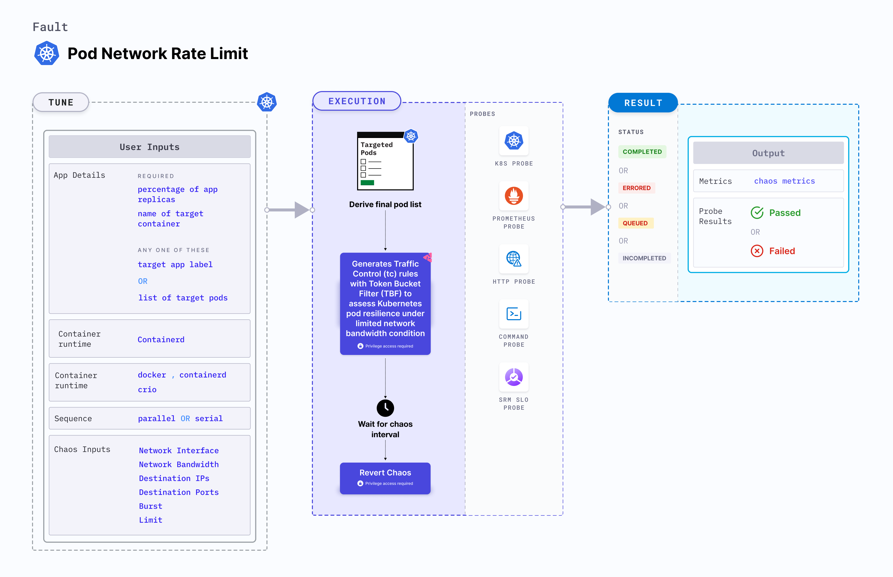

Pod network rate limit is a Kubernetes pod-level chaos fault that generates Traffic Control (tc) rules with Token Bucket Filter (TBF) to assess Kubernetes pod resilience under limited network bandwidth condition.



## Use cases
Pod network rate limit:
- Assess how well applications and services perform under constrained network bandwidth, helping identify potential bottlenecks and weaknesses.
- Ensure that critical services receive the necessary network bandwidth allocation while non-essential services are appropriately limited to maintain overall system stability.
- Evaluate the impact of network rate limits on security-related functions such as DDoS mitigation or intrusion detection, and assessing whether the system can withstand such scenarios.
- Determine the optimal network bandwidth allocation for different pods and applications to effectively plan resource usage and accommodate growth without degradation in performance.

### Permissions required

Below is a sample Kubernetes role that defines the permissions required to execute the fault.

```
apiVersion: rbac.authorization.k8s.io/v1
kind: Role
metadata:
  namespace: hce
  name: pod-network-rate-limit
spec:
  definition:
    scope: Cluster # Supports "Namespaced" mode too
permissions:
  - apiGroups: [""]
    resources: ["pods"]
    verbs: ["create", "delete", "get", "list", "patch", "deletecollection", "update"]
  - apiGroups: [""]
    resources: ["events"]
    verbs: ["create", "get", "list", "patch", "update"]
  - apiGroups: [""]
    resources: ["pods/log"]
    verbs: ["get", "list", "watch"]
  - apiGroups: [""]
    resources: ["deployments, statefulsets"]
    verbs: ["get", "list"]
  - apiGroups: [""]
    resources: ["replicasets, daemonsets"]
    verbs: ["get", "list"]
  - apiGroups: [""]
    resources: ["chaosEngines", "chaosExperiments", "chaosResults"]
    verbs: ["create", "delete", "get", "list", "patch", "update"]
  - apiGroups: ["batch"]
    resources: ["jobs"]
    verbs: ["create", "delete", "get", "list", "deletecollection"]
```

### Prerequisites
- Kubernetes > 1.16 
- The application pods should be in the running state before and after injecting chaos.


### Mandatory tunables

   <table>
      <tr>
        <th> Tunable </th>
        <th> Description </th>
        <th> Notes </th>
      </tr>
      <tr>
        <td> NETWORK_BANDWIDTH </td>
        <td> Specify the network bandwidth rate limit </td>
        <td> For more information, go to <a href="#rate-limit">rate limit</a>.</td>
      </tr>
      <tr>
        <td> BURST </td>
        <td> Specify the burst for the size of bucket, maximum amount of bytes that tokens can be available for instantaneously </td>
        <td> For more information, go to <a href="#rate-limit">rate limit</a>.</td>
      </tr>
      <tr>
        <td> LIMIT </td>
        <td> Specify the limit for the number of bytes that can be queued waiting for tokens to become available </td>
        <td> For more information, go to <a href="#rate-limit">rate limit</a>.</td>
      </tr>
    </table>

### Optional tunables
  <table>
      <tr>
        <th> Tunable </th>
        <th> Description </th>
        <th> Notes </th>
      </tr>
      <tr>
        <td> MIN_BURST </td>
        <td> Specify the size of the peakrate bucket </td>
        <td> For more information, go to <a href="#advance-tunables">advanced tunables</a>.</td>
      </tr>
      <tr>
        <td> PEAK_RATE </td>
        <td> Specify the maximum depletion rate of the bucket </td>
        <td> For more information, go to <a href="#advance-tunables">advanced tunables</a>.</td>
      </tr>
      <tr>
        <td> NETWORK_INTERFACE </td>
        <td> Name of the ethernet interface considered for shaping traffic. </td>
        <td> For more information, go to <a href="#network-interface">network interface</a>.</td>
      </tr>
      <tr>
        <td> NODE_LABEL </td>
        <td> Node label used to filter the target node if <code>TARGET_NODE</code> environment variable is not set. </td>
        <td> It is mutually exclusive with the <code>TARGET_NODE</code> environment variable. If both are provided, the fault uses <code>TARGET_NODE</code>. For more information, go to <a href="/docs/chaos-engineering/chaos-faults/kubernetes/node/common-tunables-for-node-faults#target-nodes-with-labels">node label.</a></td>
      </tr>
      <tr>
        <td> TARGET_CONTAINER </td>
        <td> Name of the container subject to network loss. Applicable for <code>containerd</code> and <code>crio</code> runtimes only.</td>
        <td> With these runtimes, if the value is not provided, the fault injects chaos on the first container of the pod. For more information, go to <a href="/docs/chaos-engineering/chaos-faults/kubernetes/pod/common-tunables-for-pod-faults#target-specific-container">target specific container</a>.</td>
      </tr>
      <tr>
        <td> CONTAINER_RUNTIME </td>
        <td> Container runtime interface for the cluster. </td>
        <td> Default: containerd. Supports docker, containerd and crio. For more information, go to <a href="#container-runtime-and-socket-path">container runtime</a>. </td>
      </tr>
      <tr>
        <td> SOCKET_PATH </td>
        <td> Path of the containerd or crio or docker socket file. </td>
        <td> Defaults to <code>/run/containerd/containerd.sock</code>. For more information, go to <a href="#container-runtime-and-socket-path">socket path</a>.</td>
      </tr>
      <tr>
        <td> TOTAL_CHAOS_DURATION </td>
        <td> Duration to inject insert chaos (in seconds). </td>
        <td> Default: 60 s. For more information, go to <a href="/docs/chaos-engineering/chaos-faults/common-tunables-for-all-faults#duration-of-the-chaos">duration of the chaos</a>. </td>
      </tr>
      <tr>
        <td> TARGET_PODS </td>
        <td> Comma-separated list of application pod names subject to pod network corruption. </td>
        <td> If not provided, the fault selects target pods randomly based on provided appLabels. For more information, go to <a href="/docs/chaos-engineering/chaos-faults/kubernetes/pod/common-tunables-for-pod-faults#target-specific-pods"> target specific pods</a>.</td>
      </tr>
      <tr>
        <td> DESTINATION_IPS </td>
        <td> Comma-separated IP addresses and ports of the services or pods or the CIDR blocks (range of IPs) whose accessibility is impacted. Comma-separated IPs or CIDRs can be provided. </td>
        <td> If the values are not provided, the fault induces network chaos for all IPs or destinations. For more information, go to <a href="#destination-ips-and-destination-hosts">destination IPs</a>.</td>
      </tr>
      <tr>
        <td> DESTINATION_HOSTS </td>
        <td> DNS names or FQDN names of the services and ports whose accessibility is impacted. </td>
        <td> If the values are not provided, the fault induces network chaos for all IPs or destinations or <code>DESTINATION_IPS</code> if already defined. For more information, go to <a href="#destination-ips-and-destination-hosts">destination hosts</a>.</td>
      </tr>
      <tr>
        <td> SOURCE_PORTS </td>
        <td> Ports of the target application, the accessibility to which is impacted </td>
        <td> Comma separated port(s) can be provided. If not provided, it will induce network chaos for all ports. For more information, go to <a href="#source-and-destination-ports">source ports.</a></td>
      </tr>
      <tr>
        <td> DESTINATION_PORTS </td>
        <td> Ports of the destination services or pods or the CIDR blocks(range of IPs), the accessibility to which is impacted </td>
        <td> Comma separated port(s) can be provided. If not provided, it will induce network chaos for all ports. For more information, go to <a href="#source-and-destination-ports">destination ports.</a></td>
      </tr>
      <tr>
        <td> PODS_AFFECTED_PERC </td>
        <td> Percentage of total pods to target. Provide numeric values. </td>
        <td> Default: 0 (corresponds to 1 replica). For more information, go to <a href="/docs/chaos-engineering/chaos-faults/kubernetes/pod/common-tunables-for-pod-faults#pod-affected-percentage">pod affected percentage</a>.</td>
      </tr>
      <tr>
        <td> RAMP_TIME </td>
        <td> Period to wait before and after injecting chaos (in seconds). </td>
        <td> For example, 30 s. For more information, go to <a href="/docs/chaos-engineering/chaos-faults/common-tunables-for-all-faults#ramp-time">ramp time</a>.</td>
      </tr>
      <tr>
        <td> LIB_IMAGE </td>
        <td> Image used to inject chaos. </td>
        <td> Default: <code>harness/chaos-go-runner:main-latest</code>. For more information, go to <a href = "/docs/chaos-engineering/chaos-faults/common-tunables-for-all-faults#image-used-by-the-helper-pod">image used by the helper pod.</a></td>
      </tr>
      <tr>
        <td> SEQUENCE </td>
        <td> Sequence of chaos execution for multiple target pods. </td>
        <td> Default: parallel. Supports serial and parallel. For more information, go to <a href="/docs/chaos-engineering/chaos-faults/common-tunables-for-all-faults#sequence-of-chaos-execution">sequence of chaos execution</a>.</td>
      </tr>
    </table>

:::tip
If the environment variables `DESTINATION_HOSTS` or `DESTINATION_IPS` are left empty, the default behaviour is to target all hosts. To limit the impact on all the hosts, you can specify the IP addresses of the service (use commas to separate multiple values) or the DNS or the FQDN names of the services in `DESTINATION_HOSTS`.
:::

### Rate limit

- `NETWORK_BANDWIDTH`: It contains the network bandwidth rate limit
- `BURST`: It contains the size of bucket, maximum amount of bytes that tokens can be available for instantaneously
- `LIMIT`: It contains the limit for the number of bytes that can be queued waiting for tokens to become available

The following YAML snippet illustrates the use of this environment variable:

[embedmd]:# (./static/manifests/pod-network-rate-limit/rate-limit.yaml yaml)
```yaml
# it injects the network rate limit
apiVersion: litmuschaos.io/v1alpha1
kind: ChaosEngine
metadata:
  name: engine-nginx
spec:
  engineState: "active"
  annotationCheck: "false"
  appinfo:
    appns: "default"
    applabel: "app=nginx"
    appkind: "deployment"
  chaosServiceAccount: litmus-admin
  experiments:
  - name: pod-network-rate-limit
    spec:
      components:
        env:
        - name: NETWORK_BANDWIDTH
          value: "1mbit"
        - name: BURST
          value: "32kb"
        - name: LIMIT
          value: "2mb"
        - name: TOTAL_CHAOS_DURATION
          value: '60'
```

### Advance tunables

- `MIN_BURST`: It contains the size of the peakrate bucket
- `PEAK_RATE`: It contains the maximum depletion rate of the bucket

The following YAML snippet illustrates the use of this environment variable:

[embedmd]:# (./static/manifests/pod-network-rate-limit/advance-tunables.yaml yaml)
```yaml
# it injects the network rate limit 
apiVersion: litmuschaos.io/v1alpha1
kind: ChaosEngine
metadata:
  name: engine-nginx
spec:
  engineState: "active"
  annotationCheck: "false"
  appinfo:
    appns: "default"
    applabel: "app=nginx"
    appkind: "deployment"
  chaosServiceAccount: litmus-admin
  experiments:
  - name: pod-network-rate-limit
    spec:
      components:
        env:
        - name: MIN_BURST
          value: '16kb'
        - name: PEAK_RATE
          value: '2mbit'
        - name: NETWORK_BANDWIDTH
          value: "1mbit"
        - name: BURST
          value: "32kb"
        - name: LIMIT
          value: "2mb"
        - name: TOTAL_CHAOS_DURATION
          value: '60'
```

### Destination IPs and destination hosts

Default IPs and hosts whose traffic is interrupted because of the network faults. Tune it by using the `DESTINATION_IPS` and `DESTINATION_HOSTS` environment variables, respectively.

- `DESTINATION_IPS`: It contains the IP addresses and ports of the services or pods or the CIDR blocks (range of IPs) whose accessibility is impacted.
- `DESTINATION_HOSTS`: It contains the DNS names or FQDN names of the services and ports whose accessibility is impacted.

<b>NOTE:</b> Ports can be specified by using a pipe (|) as a separator. While providing ports is optional, omitting them will affect all ports associated with the destination IPs and hosts.

The following YAML snippet illustrates the use of these environment variables:

[embedmd]:# (./static/manifests/pod-network-rate-limit/destination-ips-and-hosts.yaml yaml)
```yaml
# it injects the chaos for the egress traffic for specific ips/hosts
apiVersion: litmuschaos.io/v1alpha1
kind: ChaosEngine
metadata:
  name: engine-nginx
spec:
  engineState: "active"
  annotationCheck: "false"
  appinfo:
    appns: "default"
    applabel: "app=nginx"
    appkind: "deployment"
  chaosServiceAccount: litmus-admin
  experiments:
  - name: pod-network-rate-limit
    spec:
      components:
        env:
        - name: NETWORK_BANDWIDTH
          value: "1mbit"
        - name: BURST
          value: "32kb"
        - name: LIMIT
          value: "2mb"
        # supports comma separated destination ips
        - name: DESTINATION_IPS
          value: '8.8.8.8,192.168.5.6|80|8080'
        # supports comma separated destination hosts
        - name: DESTINATION_HOSTS
          value: 'nginx.default.svc.cluster.local|80,google.com'
        - name: TOTAL_CHAOS_DURATION
          value: '60'
```

### Source and destination ports

By default, the network experiments disrupt traffic for all the source and destination ports. The interruption of specific port(s) can be tuned via `SOURCE_PORTS` and `DESTINATION_PORTS` ENV.

- `SOURCE_PORTS`: It contains ports of the target application, the accessibility to which is impacted
- `DESTINATION_PORTS`: It contains the ports of the destination services or pods or the CIDR blocks(range of IPs), the accessibility to which is impacted

Use the following example to tune this:

[embedmd]:# (./static/manifests/pod-network-rate-limit/source-and-destination-ports.yaml yaml)
```yaml
# it inject the chaos for the egress traffic for specific ports
apiVersion: litmuschaos.io/v1alpha1
kind: ChaosEngine
metadata:
  name: engine-nginx
spec:
  engineState: "active"
  annotationCheck: "false"
  appinfo:
    appns: "default"
    applabel: "app=nginx"
    appkind: "deployment"
  chaosServiceAccount: litmus-admin
  experiments:
  - name: pod-network-rate-limit
    spec:
      components:
        env:
        - name: NETWORK_BANDWIDTH
          value: "1mbit"
        - name: BURST
          value: "32kb"
        - name: LIMIT
          value: "2mb"
        # supports comma separated source ports
        - name: SOURCE_PORTS
          value: '80'
        # supports comma separated destination ports
        - name: DESTINATION_PORTS
          value: '8080,9000'
        - name: TOTAL_CHAOS_DURATION
          value: '60'
```

### Network interface

Name of the ethernet interface considered to shape the traffic. Its default value is `eth0`. Tune it by using the `NETWORK_INTERFACE` environment variable.

The following YAML snippet illustrates the use of this environment variable:

[embedmd]:# (./static/manifests/pod-network-rate-limit/network-interface.yaml yaml)
```yaml
# provide the network interface
apiVersion: litmuschaos.io/v1alpha1
kind: ChaosEngine
metadata:
  name: engine-nginx
spec:
  engineState: "active"
  annotationCheck: "false"
  appinfo:
    appns: "default"
    applabel: "app=nginx"
    appkind: "deployment"
  chaosServiceAccount: litmus-admin
  experiments:
  - name: pod-network-rate-limit
    spec:
      components:
        env:
        - name: NETWORK_BANDWIDTH
          value: "1mbit"
        - name: BURST
          value: "32kb"
        - name: LIMIT
          value: "2mb"
        # name of the network interface
        - name: NETWORK_INTERFACE
          value: 'eth0'
        - name: TOTAL_CHAOS_DURATION
          value: '60'
```

### Container runtime and socket path

The `CONTAINER_RUNTIME` and `SOCKET_PATH` environment variables to set the container runtime and socket file path, respectively.

- `CONTAINER_RUNTIME`: It supports `docker`, `containerd`, and `crio` runtimes. The default value is `containerd`.
- `SOCKET_PATH`: It contains path of containerd socket file by default(`/run/containerd/containerd.sock`). For `docker`, specify path as `/var/run/docker.sock`. For `crio`, specify path as `/var/run/crio/crio.sock`.

The following YAML snippet illustrates the use of these environment variables:

[embedmd]:# (./static/manifests/pod-network-rate-limit/container-runtime-and-socket-path.yaml yaml)
```yaml
## provide the container runtime and socket file path
apiVersion: litmuschaos.io/v1alpha1
kind: ChaosEngine
metadata:
  name: engine-nginx
spec:
  engineState: "active"
  annotationCheck: "false"
  appinfo:
    appns: "default"
    applabel: "app=nginx"
    appkind: "deployment"
  chaosServiceAccount: litmus-admin
  experiments:
  - name: pod-network-rate-limit
    spec:
      components:
        env:
        - name: NETWORK_BANDWIDTH
          value: "1mbit"
        - name: BURST
          value: "32kb"
        - name: LIMIT
          value: "2mb"
        # runtime for the container
        # supports docker, containerd, crio
        - name: CONTAINER_RUNTIME
          value: 'containerd'
        # path of the socket file
        - name: SOCKET_PATH
          value: '/run/containerd/containerd.sock'
        - name: TOTAL_CHAOS_DURATION
          VALUE: '60'
```
