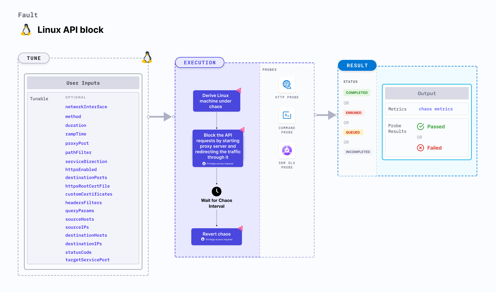

import Ossupport from './shared/note-supported-os.md'
import FaultPermissions from './shared/fault-permissions.md'

Linux API block injects API block fault into a Linux machine for a specific duration through path filtering. This results in the API not being able to send responses for the requests it receives.



## Use cases
- Validates how well your system can handle disruptions in API services for a specific pod.
- Ensures that your load balancer is effectively distributing traffic to healthy pods in the cluster.
- Checks if your system's failover mechanisms work as expected when one of the pods becomes unresponsive.
- Evaluates if your system can gracefully degrade performance when a specific component (in this case, a pod) is experiencing issues.

<Ossupport />

<FaultPermissions />

### Optional tunables
<table>
  <tr>
    <th> Tunable </th>
    <th> Description </th>
    <th> Notes </th>
  </tr>
  <tr>
      <td> networkInterface </td>
      <td> Network interface used for the proxy when the <code>SERVICE_DIRECTION</code> is ingress.</td>
      <td> Default: `eth0`. For more information, go to <a href="#advanced-fault-tunables">network interface </a>.</td>
    </tr>
  <tr>
    <td> duration </td>
    <td> Duration through which chaos is injected into the target resource. Should be provided in <code>[numeric-hours]h[numeric-minutes]m[numeric-seconds]s</code> format. </td>
    <td> Default: <code>30 s</code>. Examples: <code>1m25s</code>, <code>1h3m2s</code>, <code>1h3s</code>. For more information, go to <a href="/docs/chaos-engineering/chaos-faults/common-tunables-for-all-faults#duration-of-the-chaos">duration of the chaos </a>. </td>
  </tr>
  <tr>
    <td> rampTime </td>
    <td> Period to wait before and after injecting chaos. Should be provided in <code>[numeric-hours]h[numeric-minutes]m[numeric-seconds]s</code> format. </td>
    <td> Default: <code>0s</code>. Examples: <code>1m25s</code>, <code>1h3m2s</code>, <code>1h3s</code>. For more information, go to <a href="/docs/chaos-engineering/chaos-faults/common-tunables-for-all-faults#ramp-time">ramp time</a>. </td>
  </tr>
  <tr>
      <td> targetServicePort </td>
      <td> Port of the target service used when the <code>serviceDirection</code> is ingress.</td>
      <td> Default: 80. For more information, go to <a href="#target-service-port">target service port</a>.</td>
    </tr>
  <tr>
      <td> proxyPort </td>
      <td> Port where the proxy listens for requests. </td>
      <td> Default: 20000. For more information, go to <a href="#advanced-fault-tunables">proxy port</a>.</td>
  </tr>
  <tr>
      <td> pathFilter </td>
      <td> API path or route used for the filtering. </td>
      <td> Targets all paths if not provided. For more information, go to <a href="#path-filter">path filter </a>.</td>
  </tr>
  <tr>
      <td> serviceDirection </td>
      <td> Direction of the flow of control, `ingress` or `egress`.</td>
      <td> Default: `ingress`. For more information, go to <a href="#advanced-fault-tunables">service direction </a>.</td>
  </tr>
  <tr>
      <td> httpsEnabled </td>
      <td> Facilitate HTTPS support for both incoming and outgoing traffic. </td>
      <td> Default: false. For more information, go to <a href="#https">HTTPS</a>. </td>
  </tr>
  <tr>
      <td> destinationPorts </td>
      <td> Comma-separated list of the destination service or host ports for which `egress` traffic should be affected. </td>
      <td> Default: 80,8443. For more information, go to <a href="#destination-ports">destination ports</a></td>
  </tr>
  <tr>
      <td> httpsRootCertFile </td>
      <td> Provide the root CA certificate file name. </td>
      <td> This setting must be configured if the root CA certificate file name differs from ca-certificates.crt. Go to [root Linux] (https://go.dev/src/crypto/x509/root_linux.go) for the default certificate file names based on various Linux distributions. For more information, go to <a href="#https">HTTPS. </a></td>
  </tr>
  <tr>
      <td> customCertificates </td>
      <td> Provide the custom certificates for the proxy server to serve as intermediate certificates for HTTPS communication. </td>
      <td> HTTPS communication necessitates its use as intermediate certificates by the proxy server. These certificates should be loaded into the target application. For more information, go to <a href="#https">HTTPS. </a></td>
  </tr>
  <tr>
      <td> headersFilters </td>
      <td> Filters for HTTP request headers accept multiple comma-separated headers in the format <code>key1:value1,key2:value2</code>.</td>
      <td> For more information, go to <a href="#advanced-filters">header filters</a>.</td>
  </tr>
  <tr>
      <td> methods </td>
      <td> The HTTP request method type accepts comma-separated HTTP methods in upper cases, such as "GET,POST". </td>
      <td> For more information, go to <a href="#advanced-filters">methods</a>.</td>
  </tr>
  <tr>
      <td> queryParams </td>
      <td> HTTP request query parameter filters accept multiple comma-separated query parameters in the format of <code>param1:value1,param2:value2</code>. </td>
      <td> For more information, go to <a href="#advanced-filters">query params</a>.</td>
  </tr>
  <tr>
      <td> sourceHosts </td>
      <td> Includes comma-separated source host names as filters, indicating the origin of the HTTP request. This is specifically relevant to the "ingress" type. </td>
      <td> For more information, go to <a href="#advanced-filters">source hosts</a>.</td>
  </tr>
  <tr>
      <td> sourceIPs </td>
      <td> This includes comma-separated source IPs as filters, indicating the origin of the HTTP request. This is specifically relevant to the "ingress" type. </td>
      <td> For more information, go to <a href="#advanced-filters">source IPs</a>.</td>
  </tr>
  <tr>
      <td> destinationHosts </td>
      <td> Comma-separated destination host names are used as filters, indicating the hosts on which you call the API. This specification applies exclusively to the "egress" type. </td>
      <td> For more information, go to <a href="#advanced-filters">destination hosts</a>.</td>
  </tr>
  <tr>
      <td> destinationIPs </td>
      <td> Comma-separated destination IPs are used as filters, indicating the hosts on which you call the API. This specification applies exclusively to the "egress" type.</td>
      <td> For more information, go to <a href="#advanced-filters">destination hosts</a>.</td>
  </tr>
  <tr>
      <td> statusCode </td>
      <td> Status code for the API response. </td>
      <td> When the response is not received, it is generally `404` not found. </td>
  </tr>
</table>

### Target service port

Port of the target service. Tune it by using the `TARGET_SERVICE_PORT` environment variable.

The following YAML snippet illustrates the use of this environment variable:

[embedmd]: # "./static/manifests/pod-api-block/target-service-port.yaml yaml"

```yaml
## provide the port of the target service
apiVersion: litmuschaos.io/v1alpha1
kind: ChaosEngine
metadata:
  name: engine-nginx
spec:
  engineState: "active"
  annotationCheck: "false"
  appinfo:
    appns: "default"
    applabel: "app=nginx"
    appkind: "deployment"
  chaosServiceAccount: litmus-admin
  experiments:
    - name: pod-api-block
      spec:
        components:
          env:
            # provide the port of the target service
            - name: TARGET_SERVICE_PORT
              value: "80"
            - name: PATH_FILTER
              value: '/status'
```

### Path filter

API sub-path (or route) to filter the API calls. Tune it by using the `PATH_FILTER` environment variable.

The following YAML snippet illustrates the use of this environment variable:

[embedmd]: # "./static/manifests/pod-api-block/path-filter.yaml yaml"

```yaml
## provide api path filter
apiVersion: litmuschaos.io/v1alpha1
kind: ChaosEngine
metadata:
  name: engine-nginx
spec:
  engineState: "active"
  annotationCheck: "false"
  appinfo:
    appns: "default"
    applabel: "app=nginx"
    appkind: "deployment"
  chaosServiceAccount: litmus-admin
  experiments:
    - name: pod-api-block
      spec:
        components:
          env:
            # provide the api path filter
            - name: PATH_FILTER
              value: '/status'
            # provide the port of the targeted service
            - name: TARGET_SERVICE_PORT
              value: "80"
```

### Destination ports

Comma-separated list of the destination service or host ports for which `egress` traffic should be affected as a result of chaos testing on the target application. Tune it by using the `DESTINATION_PORTS` environment variable.

:::info note
It is applicable only for the `egress` `SERVICE_DIRECTION`.
:::

The following YAML snippet illustrates the use of this environment variable:

[embedmd]: # "./static/manifests/pod-api-block/destination-ports.yaml yaml"

```yaml
## provide destination ports
apiVersion: litmuschaos.io/v1alpha1
kind: ChaosEngine
metadata:
  name: engine-nginx
spec:
  engineState: "active"
  annotationCheck: "false"
  appinfo:
    appns: "default"
    applabel: "app=nginx"
    appkind: "deployment"
  chaosServiceAccount: litmus-admin
  experiments:
    - name: pod-api-block
      spec:
        components:
          env:
            # provide destination ports
            - name: DESTINATION_PORTS
              value: '80,443'
            # provide the api path filter
            - name: PATH_FILTER
              value: '/status'
            # provide the port of the targeted service
            - name: TARGET_SERVICE_PORT
              value: "80"
```

### HTTPS

Enable the HTTPS support for both incoming and outgoing traffic by setting the `HTTPS_ENABLED` field to `true`. Its usage varies depending on whether it is applied to `ingress` or `egress` scenarios.

#### Ingress

Set this parameter if the HTTPS URL of the target application includes a port, formatted as `https://<hostname>:port`. However, if the HTTPS URL is in the format `https://<hostname>` without a port, this setting is not required.

#### Egress

For outbound traffic, set `HTTPS_ENABLED` to `true` to enable HTTPS support for external services. This enables the establishment of TLS certificates for the proxy within the target application.

* If the HTTP client in the target application is configured to reload certificates with each API call, set `HTTPS_ENABLED` to `true`, and there is no need to provide `CUSTOM_CERTIFICATES`. However, if the root certificate directory and file name differ from `/etc/ssl/certs` and `ca-certificates.crt` respectively, set the root certificate directory path using the `HTTPS_ROOT_CERT_PATH` environment variable and the file name using the `HTTPS_ROOT_CERT_FILE_NAME` environment variable.
* If the HTTP client in the target application isn't configured to reload certificates with each API call, provide the `CUSTOM_CERTIFICATES` environment variable to the chaos experiment, and there is no need to set `HTTPS_ROOT_CERT_PATH` and `HTTPS_ROOT_CERT_FILE_NAME` environment variables. The same custom certificates should be loaded into the target application. You can generate custom certificates using the following commands:

   ```bash
   openssl req -x509 -newkey rsa:4096 -keyout key.pem -out cert.crt -days 365 -nodes -subj '/CN=*'
   cat key.pem cert.crt > ca-cert.pem
   cat ca-cert.pem | base64 # provide it inside the CUSTOM_CERTIFICATES ENV
   ```
  Load the `cert.crt` into the target application and provide the base64 encoded value of ca-cert.pem to the `CUSTOM_CERTIFICATES` environment variable.

The following YAML snippet illustrates the use of this environment variable:

[embedmd]: # "./static/manifests/pod-api-latency/https-enabled.yaml yaml"

```yaml
## enable https support
apiVersion: litmuschaos.io/v1alpha1
kind: ChaosEngine
metadata:
  name: engine-nginx
spec:
  engineState: "active"
  annotationCheck: "false"
  appinfo:
    appns: "default"
    applabel: "app=nginx"
    appkind: "deployment"
  chaosServiceAccount: litmus-admin
  experiments:
    - name: pod-api-block
      spec:
        components:
          env:
            # enable https support
            - name: HTTPS_ENABLED
              value: 'true'
            - name: CUSTOM_CERTIFICATES
              value: 'Y3VzdG9tIGNlcnRpZmljYXRlcwo='
            # provide the api path filter
            - name: PATH_FILTER
              value: '/status'
            # provide the port of the targeted service
            - name: TARGET_SERVICE_PORT
              value: "80"
```

### Advanced fault tunables

- `PROXY_PORT`: Port where the proxy listens for requests and responses.
- `SERVICE_DIRECTION`: Direction of the flow of control, either ingress or egress. It supports `ingress`, and `egress` values.
- `NETWORK_INTERFACE`: Network interface used for the proxy.

The following YAML snippet illustrates the use of this environment variable:

[embedmd]:# (./static/manifests/pod-api-block/advanced-fault-tunables.yaml yaml)
```yaml
# it injects the api modify body fault
apiVersion: litmuschaos.io/v1alpha1
kind: ChaosEngine
metadata:
  name: engine-nginx
spec:
  engineState: "active"
  annotationCheck: "false"
  appinfo:
    appns: "default"
    applabel: "app=nginx"
    appkind: "deployment"
  chaosServiceAccount: litmus-admin
  experiments:
    - name: pod-api-block
      spec:
        components:
          env:
            # provide the proxy port
            - name: PROXY_PORT
              value: '20000'
            # provide the connection type
            - name: SERVICE_DIRECTION
              value: 'ingress'
            # provide the network interface
            - name: NETWORK_INTERFACE
              value: 'eth0'
            # provide the api path filter
            - name: PATH_FILTER
              value: '/status'
            # provide the port of the targeted service
            - name: TARGET_SERVICE_PORT
              value: "80"
```

### Advanced filters

- `HEADERS_FILTERS`: The HTTP request headers filters, that accept multiple comma-separated headers in the format of `key1:value1,key2:value2`.
- `METHODS`: The HTTP request method type filters, that accept comma-separated HTTP methods in upper case, that is, `GET,POST`.
- `QUERY_PARAMS`: The HTTP request query parameters filter, accepts multiple comma-separated query parameters in the format of `param1:value1,param2:value2`.
- `SOURCE_HOSTS`: Comma-separated source host names filters, indicating the origin of the HTTP request. This is relevant to the `ingress` type, specified by `SERVICE_DIRECTION` environment variable.
- `SOURCE_IPS`: Comma-separated source IPs filters, indicating the origin of the HTTP request. This is specifically relevant to the `ingress` type, specified by `SERVICE_DIRECTION` environment variable.
- `DESTINATION_HOSTS`: Comma-separated destination host names filters, indicating the hosts on which you call the API. This specification applies exclusively to the `egress` type, specified by `SERVICE_DIRECTION` environment variable.
- `DESTINATION_IPS`: Comma-separated destination IPs filters, indicating the hosts on which you call the API. This specification applies exclusively to the `egress` type, specified by `SERVICE_DIRECTION` environment variable.

The following YAML snippet illustrates the use of this environment variable:

[embedmd]:# (./static/manifests/pod-api-block/advanced-filters.yaml yaml)
```yaml
# it injects the api block fault
apiVersion: litmuschaos.io/v1alpha1
kind: ChaosEngine
metadata:
  name: engine-nginx
spec:
  engineState: "active"
  annotationCheck: "false"
  appinfo:
    appns: "default"
    applabel: "app=nginx"
    appkind: "deployment"
  chaosServiceAccount: litmus-admin
  experiments:
    - name: pod-api-block
      spec:
        components:
          env:
            # provide the headers filters
            - name: HEADERS_FILTERS
              value: 'key1:value1,key2:value2'
            # provide the methods filters
            - name: METHODS
              value: 'GET,POST'
            # provide the query params filters
            - name: QUERY_PARAMS
              value: 'param1:value1,param2:value2'
            # provide the source hosts filters
            - name: SOURCE_HOSTS
              value: 'host1,host2'
            # provide the source ips filters
            - name: SOURCE_IPS
              value: 'ip1,ip2'
            # provide the connection type
            - name: SERVICE_DIRECTION
              value: 'ingress'
            # provide the port of the targeted service
            - name: TARGET_SERVICE_PORT
              value: "80"
```

### Container runtime and socket path

The `CONTAINER_RUNTIME` and `SOCKET_PATH` environment variables set the container runtime and socket file path, respectively.

- `CONTAINER_RUNTIME`: It supports `docker`, `containerd`, and `crio` runtimes. The default value is `containerd`.
- `SOCKET_PATH`: It contains path of containerd socket file by default(`/run/containerd/containerd.sock`). For `docker`, specify the path as `/var/run/docker.sock`. For `crio`, specify the path as `/var/run/crio/crio.sock`.

The following YAML snippet illustrates the use of these environment variables:

[embedmd]: # "./static/manifests/pod-api-block/container-runtime-and-socket-path.yaml yaml"

```yaml
## provide the container runtime and socket file path
apiVersion: litmuschaos.io/v1alpha1
kind: ChaosEngine
metadata:
  name: engine-nginx
spec:
  engineState: "active"
  annotationCheck: "false"
  appinfo:
    appns: "default"
    applabel: "app=nginx"
    appkind: "deployment"
  chaosServiceAccount: litmus-admin
  experiments:
    - name: pod-api-block
      spec:
        components:
          env:
            # runtime for the container
            # supports docker, containerd, crio
            - name: CONTAINER_RUNTIME
              value: "containerd"
            # path of the socket file
            - name: SOCKET_PATH
              value: "/run/containerd/containerd.sock"
            # provide the port of the targeted service
            - name: TARGET_SERVICE_PORT
              value: "80"
            # provide the api path filter
            - name: PATH_FILTER
              value: '/status'
```
