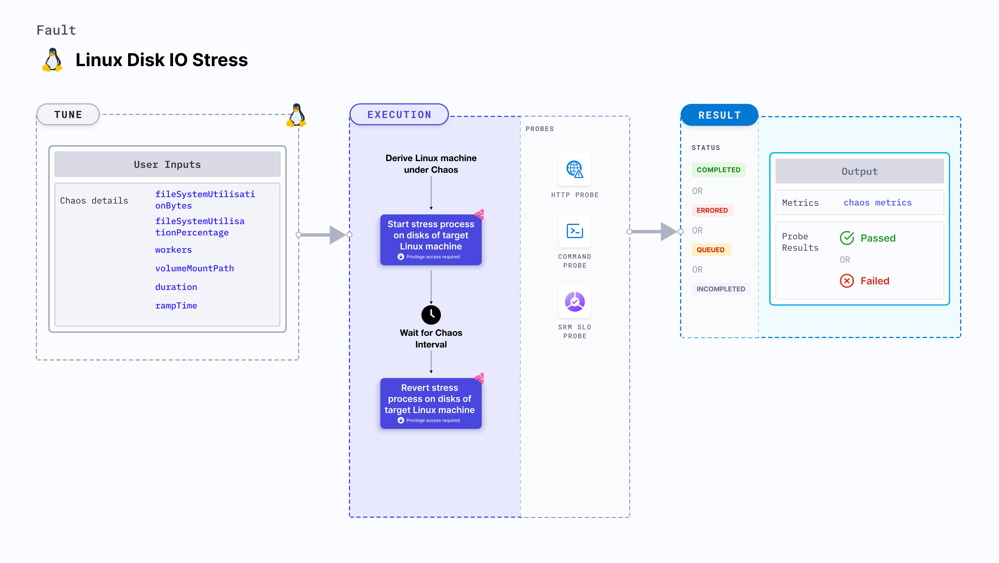

import Ossupport from './shared/note-supported-os.md'
import FaultPermissions from './shared/fault-permissions.md'


Linux disk IO stress applies stress on the disk of the target Linux machines over I/O operations for a specific duration.



## Use cases
- Simulates slower disk operations for the applications.
- Simulates noisy neighbour problems by exhausting the disk bandwidth.
- Verifies the disk performance on increasing I/O threads and varying I/O block sizes.
- Checks how the application functions under high disk latency conditions, when I/O traffic is high and includes large I/O blocks, and when other services monopolize the I/O disks.

<Ossupport />

<FaultPermissions />

### External packages
This fault uses [`stress-ng`](https://github.com/ColinIanKing/stress-ng), which is installed as part of the infrastructure installation.

### Optional tunables
<table>
  <tr>
    <th> Tunable </th>
    <th> Description </th>
    <th> Notes </th>
  </tr>
   <tr>
    <td> fileSystemUtilisation </td>
    <td> File size consumed during the disk I/O operations. </td>
    <td> Can be specified in bytes (b/B), kilobytes (k/K), megabytes (m/M), gigabytes (g/G), or percentage (%) of available storage. If no unit is provided, the value is assumed to be in bytes. Example values: <code>30m</code>, <code>1G</code>, <code>35%</code>, etc. Default: 10%. </td>
  </tr>
  <tr>
    <td> workers </td>
    <td> Number of worker processes to start. </td>
    <td> Default: 1 </td>
  </tr>
  <tr>
    <td> volumeMountPath </td>
    <td> Volume mount path used for the disk I/O operations. </td>
    <td> Default: user HOME directory </td>
  </tr>
  <tr>
    <td> duration </td>
    <td> Duration through which chaos is injected into the target resource. Should be provided in <code>[numeric-hours]h[numeric-minutes]m[numeric-seconds]s</code> format. </td>
    <td> Default: <code>30s</code>. Examples: <code>1m25s</code>, <code>1h3m2s</code>, <code>1h3s</code> </td>
  </tr>
  <tr>
    <td> rampTime </td>
    <td> Period to wait before and after injecting chaos. Should be provided in <code>[numeric-hours]h[numeric-minutes]m[numeric-seconds]s</code> format. </td>
    <td> Default: <code>0s</code>. Examples: <code>1m25s</code>, <code>1h3m2s</code>, <code>1h3s</code> </td>
  </tr>
</table>

### Workers

The `workers` input variable utilizes a specific number of workers during the disk I/O stress.

The following YAML snippet illustrates the use of this input variable:

[embedmd]:# (./static/manifests/linux-disk-io-stress/workers.yaml yaml)
```yaml
# workers to utilize
apiVersion: litmuchaos.io/v1alpha1
kind: LinuxFault
metadata:
  name: linux-disk-io-stress
  labels:
    name: disk-io-stress
spec:
  stressChaos/inputs:
    workers: 1
    fileSystemUtilisation: 10%
```

### File system utilisation

The `fileSystemUtilisation` input variable utilizes a specific amount of file system disk space or bandwidth as a part of the disk I/O operations in bytes.

The following YAML snippet illustrates the use of this input variable:

[embedmd]:# (./static/manifests/linux-disk-io-stress/file-system-utilisation.yaml yaml)
```yaml
# file system amount to be utilized
apiVersion: litmuchaos.io/v1alpha1
kind: LinuxFault
metadata:
  name: linux-disk-io-stress
  labels:
    name: disk-io-stress
spec:
  stressChaos/inputs:
    workers: 3
    fileSystemUtilisation: 50g
```

### Volume mount path
The `volumeMountPath` input variable utilizes the volume mount path where the disk I/O operations are performed.

The following YAML snippet illustrates the use of this input variable:

[embedmd]:# (./static/manifests/linux-disk-io-stress/volume-mount-path.yaml yaml)
```yaml
# configure volume mount path
apiVersion: litmuchaos.io/v1alpha1
kind: LinuxFault
metadata:
  name: linux-disk-io-stress
  labels:
    name: disk-io-stress
spec:
  stressChaos/inputs:
    workers: 1
    fileSystemUtilisation: 50%
    volumeMountPath: "/tmp"
```
