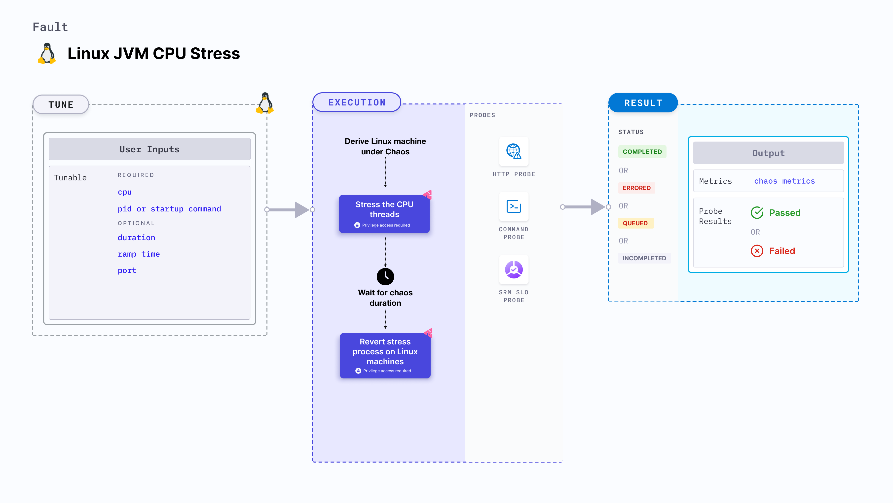

import Ossupport from './shared/note-supported-os.md'
import FaultPermissions from './shared/fault-permissions.md'

Linux JVM CPU stress consumes excessive CPU threads of the JVM.

:::tip
JVM chaos faults use the [Byteman utility](https://byteman.jboss.org/) to inject chaos faults into the JVM.
:::



## Use cases
Linux JVM CPU stress:
- Tests the system's ability to handle high payloads.
- Evaluates the application's behavior in high-stress cases.
- Induces CPU consumption and exhaustion on the target Linux machines.
- Simulates a lack of CPU threads for processes running on the application, which degrades their performance.
- Simulates application slowness due to CPU starvation.

<Ossupport />

<FaultPermissions />

### Mandatory tunables
<table>
  <tr>
    <th> Tunable </th>
    <th> Description </th>
    <th> Notes </th>
  </tr>
  <tr>
    <th> CPU </th>
    <td> The number of CPU threads that the application should consume. </td>
    <td> For example, 4. For more information, go to <a href="#cpu-threads"> CPU threads</a>.</td>
  </tr>
  <tr>
    <th> Pid </th>
    <td> The process Id that Byteman uses to target the service. This is mutually exclusive with <b>Startup command</b>. </td>
    <td> For example, <code>6429</code>. For more information, go to <a href="#pid"> process Ids</a>.</td>
  </tr>
  <tr>
    <th> Startup command </th>
    <td> The path to the JAR file or the Java application. This is mutually exclusive with <b>Pid</b>.</td>
    <td> For example, <code>/usr/local/bin/pet-clinic.jar</code>. For more information, go to <a href="#startup-command"> startup command</a>.</td>
  </tr>
</table>

### Optional tunables
<table>
  <tr>
    <th> Tunable </th>
    <th> Description </th>
    <th> Notes </th>
  </tr>
  <tr>
    <th> Duration </th>
    <td> Duration through which chaos is injected into the target resource. Should be provided in <code>[numeric-hours]h[numeric-minutes]m[numeric-seconds]s</code> format. </td>
    <td> Default: <code>30s</code>. Examples: <code>1m25s</code>, <code>1h3m2s</code>, <code>1h3s</code>. For more information, go to <a href="/docs/chaos-engineering/chaos-faults/common-tunables-for-all-faults/#duration-of-the-chaos"> duration of the chaos.</a></td>
  </tr>
  <tr>
    <th> Port </th>
    <td> Port used to Byteman to start the Byteman agent. </td>
    <td> For example, <code>9091</code>. </td>
  </tr>
  <tr>
    <th> Ramp time </th>
    <td> Period to wait before and after injecting chaos. Should be provided in <code>[numeric-hours]h[numeric-minutes]m[numeric-seconds]s</code> format. </td>
    <td> Default: <code>0s</code>. Examples: <code>1m25s</code>, <code>1h3m2s</code>, <code>1h3s</code>. For more information, go to <a href= "/docs/chaos-engineering/chaos-faults/common-tunables-for-all-faults#ramp-time">ramp time.</a></td>
  </tr>
</table>

### Pid

The process Id used by Byteman to target the services of the JVM. This is mutually exclusive with the `Startup command` input variable.

The following YAML snippet illustrates the use of this input variable:

[embedmd]:# (./static/manifests/linux-jvm-memory-stress/pid.yaml yaml)
```yaml
apiVersion: litmuchaos.io/v1alpha1
kind: LinuxFault
metadata:
  name: linux-jvm-cpu-stress
  labels:
    name: jvm-cpu-stress
spec:
  jvmChaos/inputs:
    duration: 30s
    port: 9091
    pid: 0
    cpu: 2
    startupCommand: "/usr/bin/pet-clinic.jar"
    rampTime: ""
```

### Startup command

The path to the JAR file or Java application to target the services of the Java application. This is mutually exclusive with the `Pid` input variable.

:::tip
You can simply provide the name of the file instead of the path because it is configured to accept substrings.
:::

The following YAML snippet illustrates the use of this input variable:

[embedmd]:# (./static/manifests/linux-jvm-memory-stress/startup-command.yaml yaml)
```yaml
apiVersion: litmuchaos.io/v1alpha1
kind: LinuxFault
metadata:
  name: linux-jvm-cpu-stress
  labels:
    name: jvm-cpu-stress
spec:
  jvmChaos/inputs:
    duration: 30s
    port: 9091
    pid: 0
    cpu: 2
    startupCommand: "/usr/bin/pet-clinic.jar"
    rampTime: ""
```

### CPU threads

The number of CPU threads used to simulate excessive CPU usage.

The following YAML snippet illustrates the use of this input variable:

[embedmd]:# (./static/manifests/linux-jvm-memory-stress/memory-type.yaml yaml)
```yaml
apiVersion: litmuchaos.io/v1alpha1
kind: LinuxFault
metadata:
  name: linux-jvm-cpu-stress
  labels:
    name: jvm-cpu-stress
spec:
  jvmChaos/inputs:
    duration: 30s
    port: 9091
    pid: 0
    cpu: 2
    startupCommand: ""
    rampTime: ""
```