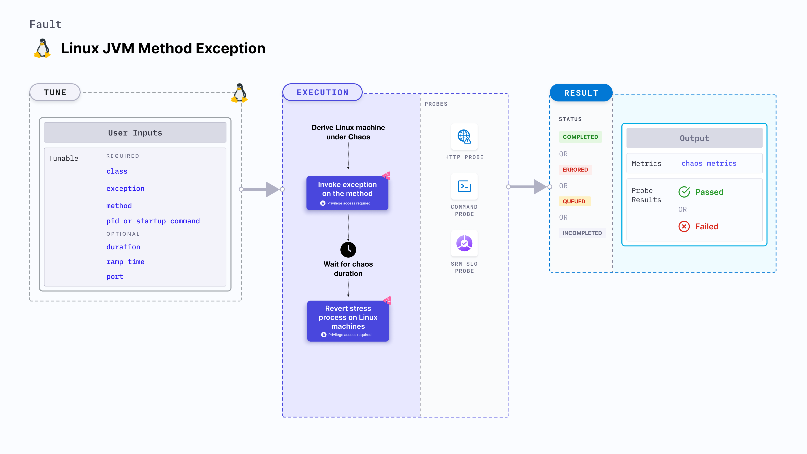

import Ossupport from './shared/note-supported-os.md'
import FaultPermissions from './shared/fault-permissions.md'


Linux JVM method exception injects chaos into a Java application to invoke an exception. The Linux JVM method exception uses the [Byteman utility](https://byteman.jboss.org/) which uses the Byteman agent to inject chaos faults into the Java application. It determines the performance and resilience of the application (or services) running on Linux JVMs.

<!--  -->

## Use cases
JVM method exception :
- Determines the resilience of an application on encountering exceptions.
- Determines how efficiently an application recovers the services.

<Ossupport />

<FaultPermissions />

### Mandatory tunables
<table>
  <tr>
    <th> Tunable </th>
    <th> Description </th>
    <th> Notes </th>
  </tr>
  <tr>
    <td> Class </td>
    <td> Specify as <b>packageName.className</b> that specifies the class in which you define the exception. </td>
    <td> For example, <code>org.framework.appName.system.WelcomeController</code>.</td>
  </tr>
  <tr>
    <td> Exception </td>
    <td> The exception you want to throw. </td>
    <td> For example, <code>NullPointerException</code>. </td>
  </tr>
  <tr>
    <td> Method </td>
    <td> The method to which exception is applied </td>
    <td> For example, <code>Welcome</code>. </td>
  </tr>
  <tr>
    <td> Pid </td>
    <td> The process Id that Byteman uses to target the service. This is mutually exclusive with <b>Startup command</b>. </td>
    <td> For example, <code>6429</code>. </td>
  </tr>
  <tr>
    <td> Startup command </td>
    <td> The path to the JAR file or the Java application. This is mutually exclusive with <b>Pid</b>.</td>
    <td> For example, <code>/usr/local/bin/pet-clinic.jar</code>. </td>
  </tr>
</table>

### Optional tunables
<table>
  <tr>
    <th> Tunable </th>
    <th> Description </th>
    <th> Notes </th>
  </tr>
  <tr>
    <td> Duration </td>
    <td> Duration through which chaos is injected into the target resource. Should be provided in <code>[numeric-hours]h[numeric-minutes]m[numeric-seconds]s</code> format. </td>
    <td> Default: <code>30s</code>. Examples: <code>1m25s</code>, <code>1h3m2s</code>, <code>1h3s</code>. </td>
  </tr>
  <tr>
    <td> Ramp time </td>
    <td> Period to wait before and after injecting chaos. Should be provided in <code>[numeric-hours]h[numeric-minutes]m[numeric-seconds]s</code> format. </td>
    <td> Default: <code>0s</code>. Examples: <code>1m25s</code>, <code>1h3m2s</code>, <code>1h3s</code>.</td>
  </tr>
  <tr>
    <td> Port </td>
    <td> Port used to Byteman to start the Byteman agent. </td>
    <td> For example, <code>9091</code>. </td>
  </tr>
</table>

### Class name

The `class` input variable targets the class name where the exception is present. Specify it as `packageName.className`.

The following YAML snippet illustrates the use of this input variable:

[embedmd]:# (./static/manifests/linux-jvm-method-exception/class-name.yaml yaml)
```yaml
apiVersion: litmuchaos.io/v1alpha1
kind: LinuxFault
metadata:
  name: linux-jvm-method-exception
  labels:
    name: jvm-method-exception
spec:
  jvmChaos/inputs:
    duration: 30s
    port: 9091
    pid: 0
    class: "org.framework.appName.system.WelcomeController"
    method: ""
    exception: ""
    startupCommand: ""
    rampTime: ""
```

### Exception

The exception you want to throw to the Java application.

The following YAML snippet illustrates the use of this input variable:

[embedmd]:# (./static/manifests/linux-jvm-method-exception/exception.yaml yaml)
```yaml
apiVersion: litmuchaos.io/v1alpha1
kind: LinuxFault
metadata:
  name: linux-jvm-method-exception
  labels:
    name: jvm-method-exception
spec:
  jvmChaos/inputs:
    duration: 30s
    port: 9091
    pid: 0
    class: ""
    method: ""
    exception: "NullPointerException("param1","param2")"
    startupCommand: ""
    rampTime: ""
```

### Method

The method name on which you apply the `Exception` input variable.

The following YAML snippet illustrates the use of this input variable:

[embedmd]:# (./static/manifests/linux-jvm-method-exception/method.yaml yaml)
```yaml
apiVersion: litmuchaos.io/v1alpha1
kind: LinuxFault
metadata:
  name: linux-jvm-method-exception
  labels:
    name: jvm-method-exception
spec:
  jvmChaos/inputs:
    duration: 30s
    port: 9091
    pid: 0
    class: ""
    method: "welcome"
    exception: ""
    startupCommand: ""
    rampTime: ""
```

### Pid

The process Id used by Byteman to target the services of the Java application. This is mutually exclusive with the `Startup command` input variable.

The following YAML snippet illustrates the use of this input variable:

[embedmd]:# (./static/manifests/linux-jvm-method-exception/pid.yaml yaml)
```yaml
apiVersion: litmuchaos.io/v1alpha1
kind: LinuxFault
metadata:
  name: linux-jvm-method-exception
  labels:
    name: jvm-method-exception
spec:
  jvmChaos/inputs:
    duration: 30s
    port: 9091
    pid: 0
    class: ""
    method: ""
    exception: ""
    startupCommand: ""
    rampTime: ""
```

### Startup command

The path to the JAR file or Java application to target the services of the Java application. This is mutually exclusive with the `Pid` input variable.

:::tip
You can simply provide the name of the file instead of the path because it is configured to accept substrings.
:::

The following YAML snippet illustrates the use of this input variable:

[embedmd]:# (./static/manifests/linux-jvm-method-exception/startup-command.yaml yaml)
```yaml
apiVersion: litmuchaos.io/v1alpha1
kind: LinuxFault
metadata:
  name: linux-jvm-method-exception
  labels:
    name: jvm-method-exception
spec:
  jvmChaos/inputs:
    duration: 30s
    port: 9091
    pid: 0
    class: ""
    method: ""
    exception: ""
    startupCommand: "/usr/bin/pet-clinic.jar"
    rampTime: ""
```