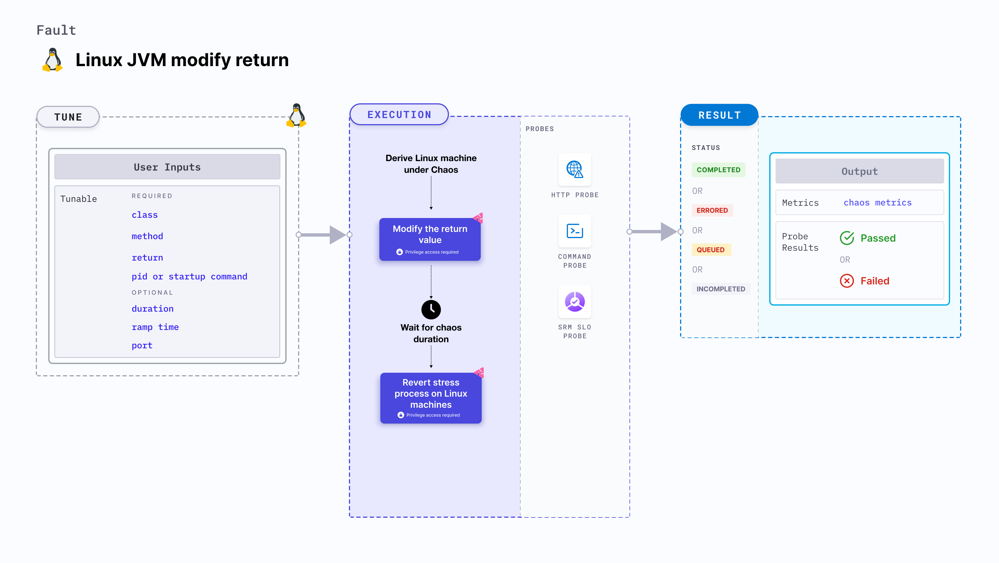

import Ossupport from './shared/note-supported-os.md'
import FaultPermissions from './shared/fault-permissions.md'

Linux JVM modify return modifies the return value of a method in a Java application for a specific duration. It is used to determine the performance and resilience of the application (or services) running on Linux machines.

:::tip
JVM chaos faults use the [Byteman utility](https://byteman.jboss.org/) to inject chaos faults into the JVM.
:::



## Use cases
Linux JVM modify return:
- Helps test the functionality of snippets of code by replacing specific portions of the request or response body to simulate different scenarios and validate how your application handles different data variations.
- Helps obscure or redact personally identifiable information (PII), such as email addresses or phone numbers, before logging or transmitting the data for security and privacy compliance.
- Determines how efficiently an application recovers and returns to normalcy.

<Ossupport />

<FaultPermissions />

### Mandatory tunables
<table>
  <tr>
    <th> Tunable </th>
    <th> Description </th>
    <th> Notes </th>
  </tr>
  <tr>
    <th> Class </th>
    <td> Specify as <b>packageName.className</b> that specifies the class in which you define the exception. </td>
    <td> For example, <code>org.framework.appName.system.WelcomeController</code>. For more information, go to <a href= "#class-name">class name.</a></td>
  </tr>
  <tr>
    <th> Pid </th>
    <td> The process Id that Byteman uses to target the service. This is mutually exclusive with <b>Startup command</b>. </td>
    <td> For example, <code>6429</code>. For more information, go to <a href="#pid"> process Ids</a>.</td>
  </tr>
  <tr>
    <th> Method </th>
    <td> The method to which exception is applied. </td>
    <td> For example, <code>Welcome</code>. For more information, go to <a href= "#method ">method name.</a></td>
  </tr>
  <tr>
    <th> Return </th>
    <td> The modified return value of the method. </td>
    <td> For example, <code>"modified string"</code>. For more information, go to <a href= "#return">return value.</a></td>
  </tr>
  <tr>
    <th> Startup command </th>
    <td> The path to the JAR file or the Java application. This is mutually exclusive with <b>Pid</b>.</td>
    <td> For example, <code>/usr/local/bin/pet-clinic.jar</code>. For more information, go to <a href= "#startup-command">startup command.</a></td>
  </tr>
</table>

### Optional tunables
<table>
  <tr>
    <th> Tunable </th>
    <th> Description </th>
    <th> Notes </th>
  </tr>
  <tr>
    <th> Duration </th>
    <td> Duration through which chaos is injected into the target resource. Should be provided in <code>[numeric-hours]h[numeric-minutes]m[numeric-seconds]s</code> format. </td>
    <td> Default: <code>30s</code>. Examples: <code>1m25s</code>, <code>1h3m2s</code>, <code>1h3s</code>. For more information, go to <a href="/docs/chaos-engineering/chaos-faults/common-tunables-for-all-faults/#duration-of-the-chaos"> duration of the chaos.</a></td>
  </tr>
  <tr>
    <th> Port </th>
    <td> Port used to Byteman to start the Byteman agent. </td>
    <td> For example, <code>9091</code>. </td>
  </tr>
  <tr>
    <th> Ramp time </th>
    <td> Period to wait before and after injecting chaos. Should be provided in <code>[numeric-hours]h[numeric-minutes]m[numeric-seconds]s</code> format. </td>
    <td> Default: <code>0s</code>. Examples: <code>1m25s</code>, <code>1h3m2s</code>, <code>1h3s</code>. For more information, go to <a href= "/docs/chaos-engineering/chaos-faults/common-tunables-for-all-faults#ramp-time">ramp time.</a></td>
  </tr>
  <tr>
    <td>  </td>
    <td>  </td>
    <td>  </td>
  </tr>
</table>

### Class name

The `class` input variable targets the class name where the exception is present. Specify it as `packageName.className`.

The following YAML snippet illustrates the use of this input variable:

[embedmd]:# (./static/manifests/linux-jvm-modify-return/class-name.yaml yaml)
```yaml
apiVersion: litmuchaos.io/v1alpha1
kind: LinuxFault
metadata:
  name: linux-jvm-modify-return
  labels:
    name: jvm-modify-return
spec:
  jvmChaos/inputs:
    duration: 30s
    port: 9091
    pid: 0
    class: "org.framework.appName.system.WelcomeController"
    method: ""
    return: ""
    startupCommand: ""
    rampTime: ""
```

### Startup command

The path to the JAR file or Java application to target the services of the Java application. This is mutually exclusive with the `Pid` input variable.

:::tip
You can simply provide the name of the file instead of the path because it is configured to accept substrings.
:::

The following YAML snippet illustrates the use of this input variable:

[embedmd]:# (./static/manifests/linux-jvm-modify-return/startup-command.yaml yaml)
```yaml
apiVersion: litmuchaos.io/v1alpha1
kind: LinuxFault
metadata:
  name: linux-jvm-modify-return
  labels:
    name: jvm-modify-return
spec:
  jvmChaos/inputs:
    duration: 30s
    port: 9091
    pid: 0
    class: ""
    method: ""
    return: ""
    startupCommand: "/usr/bin/pet-clinic.jar"
    rampTime: ""
```

### Method

The `method` whose return value you modify.

The following YAML snippet illustrates the use of this input variable:

[embedmd]:# (./static/manifests/linux-jvm-modify-return/method.yaml yaml)
```yaml
apiVersion: litmuchaos.io/v1alpha1
kind: LinuxFault
metadata:
  name: linux-jvm-modify-return
  labels:
    name: jvm-modify-return
spec:
  jvmChaos/inputs:
    duration: 30s
    port: 9091
    pid: 0
    class: ""
    method: "welcome"
    return: ""
    startupCommand: ""
    rampTime: ""
```

### Pid

The process Id used by Byteman to target the services of the Java application. This is mutually exclusive with the `Startup command` input variable.

The following YAML snippet illustrates the use of this input variable:

[embedmd]:# (./static/manifests/linux-jvm-modify-return/pid.yaml yaml)
```yaml
apiVersion: litmuchaos.io/v1alpha1
kind: LinuxFault
metadata:
  name: linux-jvm-modify-return
  labels:
    name: jvm-modify-return
spec:
  jvmChaos/inputs:
    duration: 30s
    port: 9091
    pid: 0
    class: "org.framework.appName.system.WelcomeController"
    method: ""
    return: ""
    rampTime: ""
```

### Return

The modified return value of the method in the form of a string. Tune it using the `return` input variable.

The following YAML snippet illustrates the use of this input variable:

[embedmd]:# (./static/manifests/linux-jvm-modify-return/return.yaml yaml)
```yaml
apiVersion: litmuchaos.io/v1alpha1
kind: LinuxFault
metadata:
  name: linux-jvm-modify-return
  labels:
    name: jvm-modify-return
spec:
  jvmChaos/inputs:
    duration: 30s
    port: 9091
    pid: 0
    class: ""
    method: ""
    return: "modified value"
    startupCommand: ""
    rampTime: ""
```