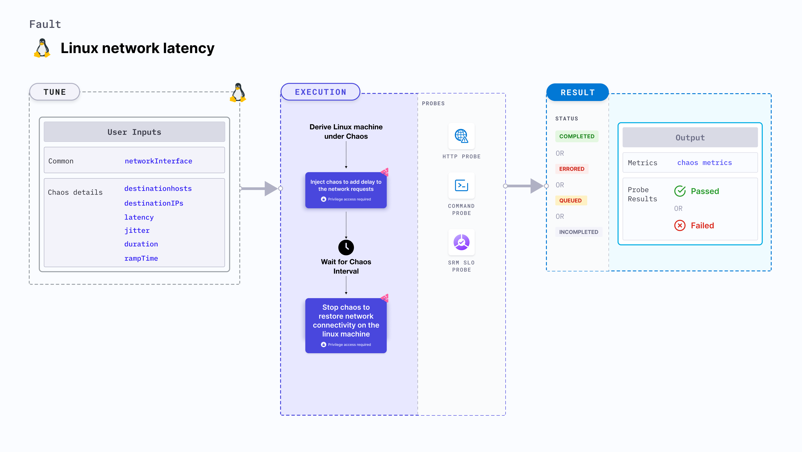

import Ossupport from './shared/note-supported-os.md'
import FaultPermissions from './shared/fault-permissions.md'


Linux network latency injects chaos to disrupt network connectivity in linux machine by adding delay to the network requests.



## Use cases
- Induces network latency on the target Linux machines.
- Simulates latency in connectivity access by delaying the network requests of the machine.

<Ossupport />

<FaultPermissions />

### Mandatory tunables
<table>
  <tr>
    <th> Tunable </th>
    <th> Description </th>
    <th> Notes </th>
  </tr>
  <tr>
    <td> networkInterfaces </td>
    <td> Network interfaces to target as comma separated values. </td>
    <td> For example: <code>eth0,ens192</code> </td>
  </tr>
</table>

### Optional tunables
<table>
  <tr>
    <th> Tunable </th>
    <th> Description </th>
    <th> Notes </th>
  </tr>
    <tr>
    <td> destinationHosts </td>
    <td> List of the target host names or keywords. For example: <code>google.com,litmuschaos.io</code> </td>
    <td> If neither <code>destinationHosts</code> and <code> destinationIPs</code> is provided, all host names/domains will be targeted </td>
  </tr>
  <tr>
    <td> destinationIPs </td>
    <td> List of comma-separated target IPs. Supports a list of target destination ports for a given IP, that are separated by a pipe (<code>|</code>). For example, <code>1.1.1.1,35.24.108.92|3000|8080</code>. </td>
    <td> If neither <code>destinationHosts</code> and <code> destinationIPs</code> is provided, all host names/domains will be targeted</td>
  </tr>
  <tr>
    <td> latency </td>
    <td> Amount of delay added to the connection in ms. For example: <code> 2000 </code> </td>
    <td> Defaults to 2000 </td>
  </tr>
  <tr>
    <td> jitter </td>
    <td> Amount of jitter to be added in ms. Jitter defines the maximum randomized deviation from the provided latency value. For example: <code> 100 </code> </td>
    <td> Defaults to 0 </td>
  </tr>
  <tr>
    <td> sourcePorts </td>
    <td> Source ports to be filtered for chaos. For example: <code> 5000,8080 </code>. </td>
    <td> Alternatively, the ports can be whitelisted, that is, filtered to be exempt from chaos. Prepend a <code>!</code> to the list of ports to be exempted. For example, <code> !5000,8080 </code>. </td>
  </tr>
  <tr>
    <td> destinationPorts </td>
    <td> Destination ports to be filtered for chaos. For example, <code> 5000,8080 </code>. </td>
    <td> Alternatively, the ports that can be whitelisted, that is, filtered to be exempt from chaos. Prepend a <code>!</code> to the list of ports to be exempted. For example, <code> !5000,8080 </code>. </td>
  </tr>
  <tr>
    <td> whitelistSSH </td>
    <td> Specifies whether the SSH connectivity should be retained during the chaos in the target machine.</td>
    <td> Default: <code>true</code>. Supports one of: <code>true</code>, <code>false</code></td>
  </tr>
  <tr>
    <td> duration </td>
    <td> Duration through which chaos is injected into the target resource. Should be provided in <code>[numeric-hours]h[numeric-minutes]m[numeric-seconds]s</code> format. </td>
    <td> Default: <code>30s</code>. Examples: <code>1m25s</code>, <code>1h3m2s</code>, <code>1h3s</code> </td>
  </tr>
  <tr>
    <td> rampTime </td>
    <td> Period to wait before and after injecting chaos. Should be provided in <code>[numeric-hours]h[numeric-minutes]m[numeric-seconds]s</code> format. </td>
    <td> Default: <code>0s</code>. Examples: <code>1m25s</code>, <code>1h3m2s</code>, <code>1h3s</code> </td>
  </tr>
</table>

### Destination hosts

The `destinationHosts` input variable subjects the comma-separated names of the target hosts to chaos.

The following YAML snippet illustrates the use of this input variable:

[embedmd]:# (./static/manifests/linux-network-latency/destination-hosts.yaml yaml)
```yaml
apiVersion: litmuchaos.io/v1alpha1
kind: LinuxFault
metadata:
  name: linux-network-latency
  labels:
    name: network-latency
spec:
  networkChaos/inputs:
    destinationHosts: 'google.com'
    networkInterfaces: "eth0"
```

### Destination IPs

The `destinationIPs` input variable subjects the comma-separated names of the target IPs to chaos. You can specify the ports to be targeted for an IP by using a pipe (`|`) as a separator. While providing ports is optional, omitting them will affect all the ports associated with the destination IPs.

The following YAML snippet illustrates the use of this input variable:

[embedmd]:# (./static/manifests/linux-network-latency/destination-ips.yaml yaml)
```yaml
apiVersion: litmuchaos.io/v1alpha1
kind: LinuxFault
metadata:
  name: linux-network-latency
  labels:
    name: network-latency
spec:
  networkChaos/inputs:
    destinationIPs: '1.1.1.1,192.168.5.6|80|8080'
    networkInterfaces: "eth0"
```

### Latency and jitter

The `latency` and `jitter` input variables add delay and a small deviation to the delay, respectively, with respect to the connection.

The following YAML snippet illustrates the use of this input variable:

[embedmd]:# (./static/manifests/linux-network-latency/latency-jitter.yaml yaml)
```yaml
apiVersion: litmuchaos.io/v1alpha1
kind: LinuxFault
metadata:
  name: linux-network-latency
  labels:
    name: network-latency
spec:
  networkChaos/inputs:
    latency: "1000"
    jitter: "200"
    networkInterfaces: "eth0"
```