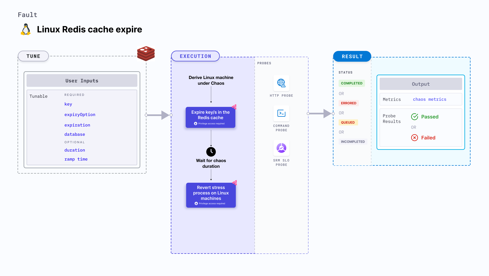

import Ossupport from './shared/note-supported-os.md'
import FaultPermissions from './shared/fault-permissions.md'
import AuthenticationDetails from './shared/redis-auth.md'

Linux Redis cache expire expires Redis cache for a specific duration. Due to this, you won't be able to access the key/s associated with the cache during chaos.



## Use cases
- Determines the resilience of Redis-dependant application when the cache expires on a Linux machine.

<Ossupport />

<FaultPermissions />

<AuthenticationDetails />

### External packages
This fault uses [`stress-ng`](https://github.com/ColinIanKing/stress-ng), which is installed as part of the infrastructure installation.

### Mandatory tunables

<table>
  <tr>
    <th> Tunable </th>
    <th> Description </th>
    <th> Notes </th>
  </tr>
  <tr>
    <td> key </td>
    <td> The key to expire in the Redis cache. </td>
    <td> For more information, go to <a href="#key"> key</a>. </td>
  </tr>
  <tr>
    <td> expiration </td>
    <td> The duration after which the key expires. </td>
    <td> For more information, go to <a href="#expiration"> expiration</a>. </td>
  </tr>
  <tr>
    <td> database </td>
    <td> Represented as integers starting from 0. </td>
    <td> For more information, go to <a href="#database"> database</a>.</td>
  </tr>
  <tr>
    <td> expiryOption </td>
    <td> Timeout applied on the key after which the key is deleted. </td>
    <td> For more information, go to <a href="#expiry-option"> expiry option</a>.</td>
  </tr>
</table>

### Optional tunables
<table>
  <tr>
    <th> Tunable </th>
    <th> Description </th>
    <th> Notes </th>
  </tr>
  <tr>
    <td> duration </td>
    <td> Duration through which chaos is injected into the target resource. Should be provided in <code>[numeric-hours]h[numeric-minutes]m[numeric-seconds]s</code> format. </td>
    <td> Default: <code>30s</code>. Examples: <code>1m25s</code>, <code>1h3m2s</code>, <code>1h3s</code>. For more information, go to <a href="/docs/chaos-engineering/chaos-faults/common-tunables-for-all-faults#duration-of-the-chaos">duration.</a></td>
  </tr>
  <tr>
    <td> rampTime </td>
    <td> Period to wait before and after injecting chaos. Should be provided in <code>[numeric-hours]h[numeric-minutes]m[numeric-seconds]s</code> format. </td>
    <td> Default: <code>0s</code>. Examples: <code>1m25s</code>, <code>1h3m2s</code>, <code>1h3s</code>. For more information, go to <a href="/docs/chaos-engineering/chaos-faults/common-tunables-for-all-faults#ramp-time">ramp time</a>. </td>
  </tr>
</table>

### Key

The `key` input variable indicates the key to be expired from the Redis cache.

The following YAML snippet illustrates the use of this input variable:

[embedmd]:# (./static/manifests/linux-redis-cache-expire/key.yaml yaml)
```yaml
apiVersion: litmuchaos.io/v1alpha1
kind: LinuxFault
metadata:
  name: redis-cache-expire
  labels:
    name: cache-expire
spec:
  redisChaos/inputs:
    duration: 30s
    expiration: ""
    key: "KeyName"
    database: 0
    expiryOption: ""
    rampTime: ""
```

### Expiration

The `expiration` input value describes the duration after which the key expires.

The following YAML snippet illustrates the use of this input variable:

[embedmd]:# (./static/manifests/linux-redis-cache-expire/expiration.yaml yaml)
```yaml
apiVersion: litmuchaos.io/v1alpha1
kind: LinuxFault
metadata:
  name: redis-cache-expire
  labels:
    name: cache-expire
spec:
  redisChaos/inputs:
    duration: 30s
    expiration: 30s
    key: ""
    database: 0
    expiryOption: ""
    rampTime: ""
```

### Expiry option

The `expiryOption` input variable sets a timeout on the key after which the key is deleted. Go to [expire command](https://redis.io/docs/latest/commands/expire/) for more information.

The following YAML snippet illustrates the use of this input variable:

[embedmd]:# (./static/manifests/linux-redis-cache-expire/expiry-option.yaml yaml)
```yaml
apiVersion: litmuchaos.io/v1alpha1
kind: LinuxFault
metadata:
  name: redis-cache-expire
  labels:
    name: cache-expire
spec:
  redisChaos/inputs:
    duration: 30s
    expiration: ""
    key: ""
    database: 0
    expiryOption: "GT"
    rampTime: ""
```

### Database

The `database` input variable is represented as an integer.

The following YAML snippet illustrates the use of this input variable:

[embedmd]:# (./static/manifests/linux-redis-cache-expire/database.yaml yaml)
```yaml
apiVersion: litmuchaos.io/v1alpha1
kind: LinuxFault
metadata:
  name: redis-cache-expire
  labels:
    name: cache-expire
spec:
  redisChaos/inputs:
    duration: 30s
    expiration: ""
    key: ""
    database: 0
    expiryOption: ""
    rampTime: ""
```