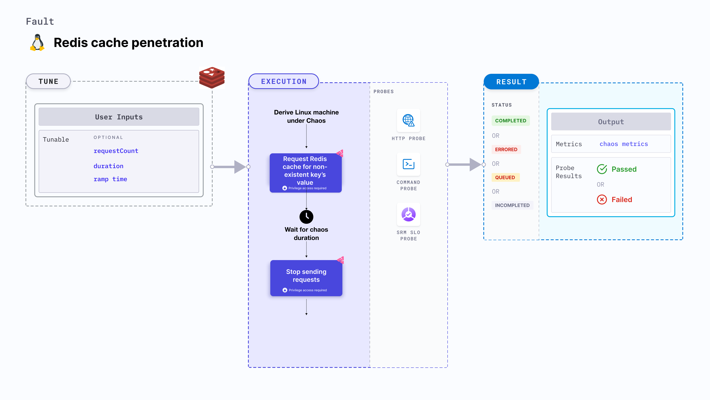

import Ossupport from './shared/note-supported-os.md'
import FaultPermissions from './shared/fault-permissions.md'
import AuthenticationDetails from './shared/redis-auth.md'

Redis cache penetration fault continuously sends cache requests to the Redis database to find the value for a non-existing key. This continuous request reduces the performance of the application.



## Use cases
- Slows down the database for responses to other requests.
- Determines the resilience of Redis-dependant application when cache requests are continuously sent to a Redis database and they result in a cache miss.

<Ossupport />

<FaultPermissions />

<AuthenticationDetails />

### Optional tunables

<table>
  <tr>
    <th> Tunable </th>
    <th> Description </th>
    <th> Notes </th>
  </tr>
  <tr>
    <td> requestCount </td>
    <td> Number of requests to be sent for accessing the cache. </td>
    <td> Default: 1000. For more information, go to <a href="#number-of-requests"> request count. </a></td>
  </tr>
  <tr>
    <td> duration </td>
    <td> Duration through which chaos is injected into the target resource. Should be provided in <code>[numeric-hours]h[numeric-minutes]m[numeric-seconds]s</code> format. </td>
    <td> Default: <code>30s</code>. Examples: <code>1m25s</code>, <code>1h3m2s</code>, <code>1h3s</code>. For more information, go to <a href="/docs/chaos-engineering/chaos-faults/common-tunables-for-all-faults#duration-of-the-chaos">duration.</a></td>
  </tr>
  <tr>
    <td> rampTime </td>
    <td> Period to wait before and after injecting chaos. Should be provided in <code>[numeric-hours]h[numeric-minutes]m[numeric-seconds]s</code> format. </td>
    <td> Default: <code>0s</code>. Examples: <code>1m25s</code>, <code>1h3m2s</code>, <code>1h3s</code>. For more information, go to <a href="/docs/chaos-engineering/chaos-faults/common-tunables-for-all-faults#ramp-time">ramp time</a>. </td>
  </tr>
</table>

### Number of requests

The `requestCount` input variable indicates the number of requests sent to access the Redis cache. Redis cache. Its default value is 1000.

The following YAML snippet illustrates the use of this input variable:

[embedmd]:# (./static/manifests/redis-cache-penetration/requests.yaml yaml)
```yaml
apiVersion: litmuchaos.io/v1alpha1
kind: LinuxFault
metadata:
  name: redis-cache-penetration
  labels:
    name: cache-penetration
spec:
  redisChaos/inputs:
    duration: 30s
    requestCount: 1000
    rampTime: ""
```