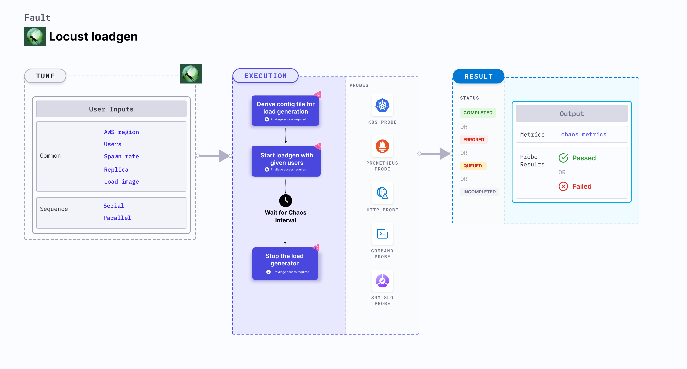

Locust loadgen fault simulates load generation on the target hosts for a specific chaos duration. This fault:
- Slows down or makes the target host unavailable due to heavy load.
- Checks the performance of the application or process running on the instance.



## Use cases
- Locust loadgen fault determines the resilience of an application under heavy load. 
- It determines how quickly the target application recovers from such a failure. 

:::note
- Kubernetes > 1.17 is required to execute this fault.
- The target host should be accessible.
- Kubernetes configmap that contains the `config.py` file is required. This file is used as a locustfile to generate load in the `CHAOS_NAMESPACE`. Below is a sample configmap:

```yaml
apiVersion: v1
kind: ConfigMap
metadata:
  name: load
  namespace: <CHAOS-NAMESPACE>
data:
  config.py: |
    import time
    from locust import HttpUser, task, between
    class QuickstartUser(HttpUser):
        wait_time = between(1, 5)
        @task
        def hello_world(self):
            self.client.get("")
```
- If you change the `config.py` file, ensure that you update the `CONFIG_MAP_FILE` environment variable in the chaos experiment with the new name.
:::


## Fault tunables

  <h3>Mandatory fields</h3>
    <table>
        <tr>
            <th> Variables </th>
            <th> Description </th>
            <th> Notes </th>
        </tr>
        <tr>
            <td> HOST </td>
            <td> Name of the target host under chaos. </td>
            <td> Provide the name of target host ex: <code>https://google.com</code>. For more information, go to <a href="https://developer.harness.io/docs/chaos-engineering/chaos-faults/load/locust-loadgen-chaos#target-host"> target host.</a></td>
        </tr>
    </table>
    <h3>Optional fields</h3>
    <table>
        <tr>
            <th> Variables </th>
            <th> Description </th>
            <th> Notes </th>
        </tr>
        <tr>
            <td> TOTAL_CHAOS_DURATION </td>
            <td> Time taken to inject chaos into the target resource (in seconds). </td>
            <td> Defaults to 60s. For more information, go to <a href="https://developer.harness.io/docs/chaos-engineering/chaos-faults/common-tunables-for-all-faults/#duration-of-the-chaos"> duration of the chaos. </a></td>
        </tr>
        <tr>
            <td> CHAOS_INTERVAL </td>
            <td> Time interval between two successive instance poweroffs (in seconds). </td>
            <td> Defaults to 60s. For more information, go to <a href="https://developer.harness.io/docs/chaos-engineering/chaos-faults/common-tunables-for-all-faults/#chaos-interval"> chaos interval.</a></td>
        </tr>
        <tr>
            <td> USERS </td>
            <td> Peak number of concurrent Locust users causing the load. </td>
            <td> Defaults <code>30</code>. For more information, go to <a href="https://developer.harness.io/docs/chaos-engineering/chaos-faults/load/locust-loadgen-chaos#number-of-users"> number of users.</a></td>
        </tr>
        <tr>
            <td> SPAWN_RATE </td>
            <td> Number of users spawned per second.</td>
            <td> Defaults <code>30</code>. For more information, go to <a href="https://developer.harness.io/docs/chaos-engineering/chaos-faults/load/locust-loadgen-chaos#spawn-rate"> spawn rate.</a></td>
        </tr>
        <tr>
            <td> REPLICA </td>
            <td> Number of helper pod replicas generating the load. </td>
            <td> Defaults to <code>1</code>. </td>
        </tr>
        <tr>
            <td> LOAD_IMAGE </td>
            <td> Image used in helper pod that contains the chaos injection logic. </td>
            <td> Defaults <code>chaosnative/locust-loadgen:latest</code>. For more information, go to <a href="https://developer.harness.io/docs/chaos-engineering/chaos-faults/load/locust-loadgen-chaos#custom-load-image"> custom load image.</a></td>
        </tr>
        <tr>
            <td> LOAD_TYPE </td>
            <td> Used as a suffix in the load file name. </td>
            <td> Defaults to <code>load</code>. </td>
        </tr>
        <tr>
            <td> RAMP_TIME </td>
            <td> Wait period before and after injecting chaos (in seconds). </td>
            <td> For example, 30s. For more information, go to <a href="https://developer.harness.io/docs/chaos-engineering/chaos-faults/common-tunables-for-all-faults/#ramp-time"> ramp time.</a></td>
        </tr>
    </table>


### Target host

It specifies the value of the target host. Tune it by using the `HOST` environment variable.

Use the following example to tune the target host:

[embedmd]:# (./static/manifests/locust-loadgen-chaos/host.yaml yaml)
```yaml
# generate load on the target host
apiVersion: litmuschaos.io/v1alpha1
kind: ChaosEngine
metadata:
  name: load-nginx
spec:
  engineState: "active"
  chaosServiceAccount: litmus-admin
  experiments:
  - name: locust-loadgen-chaos
    spec:
      components:
        env:
        - name: HOST
          value: 'https://www.google.com'
```

### Number of users

It specifies the number of users or workers involved in the load generation. Tune it by using the `USERS` environment variable.

Use the following example to tune the number of users:

[embedmd]:# (./static/manifests/locust-loadgen-chaos/users.yaml yaml)
```yaml
# provid number of users for loadgen
apiVersion: litmuschaos.io/v1alpha1
kind: ChaosEngine
metadata:
  name: load-nginx
spec:
  engineState: "active"
  chaosServiceAccount: litmus-admin
  experiments:
  - name: locust-loadgen-chaos
    spec:
      components:
        env:
        - name: USERS
          value: '100'
        - name: HOST
          value: 'https://www.google.com'
```

### Custom load image

It specifies the rate at which users are spawned per second. Tune it by using the `LOAD_IMAGE` environment variable.

Use the following example to tune the custom load image:

[embedmd]:# (./static/manifests/locust-loadgen-chaos/load-image.yaml yaml)
```yaml
# provid a custom image for load generation
apiVersion: litmuschaos.io/v1alpha1
kind: ChaosEngine
metadata:
  name: load-nginx
spec:
  engineState: "active"
  chaosServiceAccount: litmus-admin
  experiments:
  - name: locust-loadgen-chaos
    spec:
      components:
        env:
        - name: LOAD_IMAGE
          value: 'chaosnative/locust-loadgen:latest'
```

### Spawn rate

It specifies the custom image name of the load generated. Tune it by using the `SPAWN_RATE` environment variable.

Use the following example to tune the spawn rate:

[embedmd]:# (./static/manifests/locust-loadgen-chaos/spawn-rate.yaml yaml)
```yaml
# provid number of spawn users at (users per second)
apiVersion: litmuschaos.io/v1alpha1
kind: ChaosEngine
metadata:
  name: load-nginx
spec:
  engineState: "active"
  chaosServiceAccount: litmus-admin
  experiments:
  - name: locust-loadgen-chaos
    spec:
      components:
        env:
        - name: SPAWN_RATE
          value: '100'
        - name: HOST
          value: 'https://www.google.com'
```
