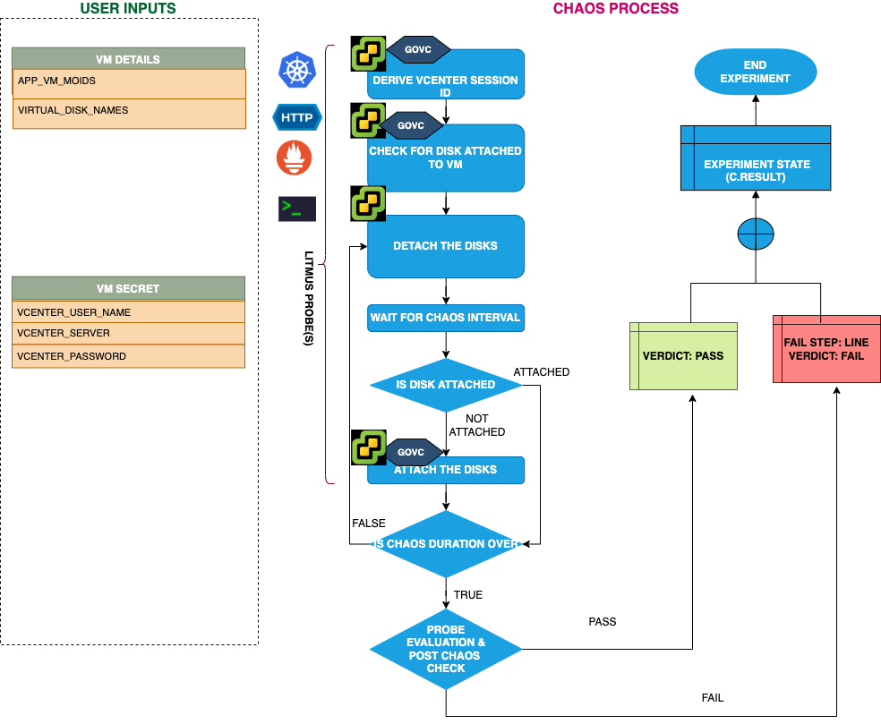

## Introduction
- VMware Disk Loss fault will detach the disks attached to a Linux OS based VMware VM.

:::tip Fault execution flow chart

:::

## Prerequisites
:::info
- Ensure that Kubernetes Version > 1.16

** vCenter Requirements **
- Ensure the connectivity of execution plane with vCenter and the hosts over 443 port. 
- Ensure that VMware tool is installed on the target VM with remote execution enabled.
- Ensure that you have sufficient vCenter permission to access hosts and VMs.
- Ensure to create a Kubernetes secret having the Vcenter credentials in the `CHAOS_NAMESPACE`. A sample secret file looks like:
```yaml
apiVersion: v1
kind: Secret
metadata:
  name: vcenter-secret
  namespace: litmus
type: Opaque
stringData:
    VCENTERSERVER: XXXXXXXXXXX
    VCENTERUSER: XXXXXXXXXXXXX
    VCENTERPASS: XXXXXXXXXXXXX
```
:::
## Default Validations
:::info
- VM should be in healthy state.
- The target disks should be attached to the VM.
:::

## Fault Tunables
<details>
    <summary>Check the Fault Tunables</summary>
    <h2>Mandatory Fields</h2>
    <table>
      <tr>
        <th> Variables </th>
        <th> Description </th>
        <th> Notes </th>
      </tr>
      <tr>
        <td> APP_VM_MOIDS </td>
        <td> Once you open VM in vCenter WebClient, you can find MOID in address field (VirtualMachine:vm-5365). Alternatively you can use the CLI to fetch the MOID </td>
        <td> vm-5365 </td>
      </tr>
      <tr>
        <td> VIRTUAL_DISK_NAMES </td>
        <td> Name of target disks provided as comma separated values </td>
        <td> disk-1.vmdk,disk-2.vmdk </td>
      </tr>
    </table>
    <h2>Optional Fields</h2>
    <table>
      <tr>
        <th> Variables </th>
        <th> Description </th>
        <th> Notes </th>
      </tr>
      <tr>
        <td> TOTAL_CHAOS_DURATION </td>
        <td> The total time duration for chaos insertion (sec) </td>
        <td> Defaults to 30s </td>
      </tr>
      <tr>
        <td> CHAOS_INTERVAL </td>
        <td> The interval (in sec) between successive instance termination </td>
        <td> Defaults to 30s </td>
      </tr>
      <tr>
        <td> SEQUENCE </td>
        <td> It defines sequence of chaos execution for multiple instance </td>
        <td> Default value: parallel. Supported: serial, parallel </td>
      </tr>
      <tr>
        <td> RAMP_TIME </td>
        <td> Period to wait before and after injection of chaos in sec </td>
        <td> Eg. 30 </td>
      </tr>
    </table>
</details>

## Fault Examples

### Common Fault Tunables
Refer the [common attributes](../common-tunables-for-all-faults) to tune the common tunables for all the faults.

### VIRTUAL_DISK_NAMES
It contains the name of target disks attached to a particular VM. It can be tuned via `VIRTUAL_DISK_NAMES` ENV.

Use the following example to tune this:

[embedmd]:# (./static/manifests/vmware-disk-loss/vm-disk-loss-diskname.yaml yaml)
```yaml
# Disk loss in the VMWare VM
apiVersion: litmuschaos.io/v1alpha1
kind: ChaosEngine
metadata:
  name: engine-nginx
spec:
  engineState: "active"
  chaosServiceAccount: litmus-admin
  experiments:
  - name: vmware-disk-loss
    spec:
      components:
        env:
        # Name of the VM
        - name: APP_VM_MOIDS
          value: 'vm-2055'
        # Name of target disk
        - name: VIRTUAL_DISK_NAMES
          value: 'disk-1.vmdk'
```

