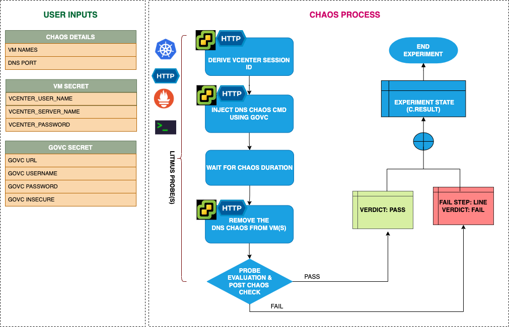

## Introduction
- It causes DNS errors in the provided VMWare VMs for a specified chaos duration.
- It helps to check the performance of the application/process running on the VMWare VMs.

:::tip Fault execution flow chart

:::

## Uses
<details>
<summary>View the uses of the fault</summary>
<div>
The fault causes DNS errors on the target VMs which can result in unavailability/distorted network connectivity from the VM to the target hosts. This will also help to produce a hypothesis where some services of an application are unreachable from the VM. This will help the user to think the mitigation steps that should be taken to overcome such situation. This fault can also be used to know how the DNS error can impact your infra and standalone tasks as well.
</div>
</details>

## Prerequisites
:::info
- Ensure that Kubernetes Version > 1.16

** vCenter Requirements **
- Ensure the connectivity of execution plane with vCenter and the hosts over 443 port. 
- Ensure that VMware tool is installed on the target VM with remote execution enabled.
- Ensure that you have sufficient vCenter permission to access hosts and VMs.
- Ensure to create a Kubernetes secret having the Vcenter credentials in the `CHAOS_NAMESPACE`. A sample secret file looks like:
```yaml
apiVersion: v1
kind: Secret
metadata:
  name: vcenter-secret
  namespace: litmus
type: Opaque
stringData:
    VCENTERSERVER: XXXXXXXXXXX
    VCENTERUSER: XXXXXXXXXXXXX
    VCENTERPASS: XXXXXXXXXXXXX
```

### NOTE
You can pass the VM credentials as secrets or as an ChaosEngine ENV variable.
:::


## Default Validations
:::info
- VM should be in healthy state before and after chaos.
:::

## Fault Tunables
<details>
    <summary>Check the Fault Tunables</summary>
    <h2>Mandatory Fields</h2>
    <table>
      <tr>
        <th> Variables </th>
        <th> Description </th>
        <th> Notes </th>
      </tr>
      <tr>
        <td> VM_USER_NAME </td>
        <td> Provide the username of the target VM(s)</td>
        <td> Multiple usernames can be provided as comma separated (for more than one VM under chaos). It is used to run the govc command.</td>
      </tr>
      <tr>
        <td> VM_PASSWORD </td>
        <td> Provide the password for the target VM(s)</td>
        <td> It is used to run the govc command.</td>
      </tr>
      <tr>
        <td> PORT </td>
        <td> Provide the DNS Port</td>
        <td> Default value is 54 </td>
      </tr>
    </table>
    <h2>Optional Fields</h2>
    <table>
      <tr>
        <th> Variables </th>
        <th> Description </th>
        <th> Notes </th>
      </tr>
      <tr>
        <td> TOTAL_CHAOS_DURATION </td>
        <td> The total time duration for chaos insertion (sec) </td>
        <td> Defaults to 30s </td>
      </tr>
      <tr>
        <td> CHAOS_INTERVAL </td>
        <td> The interval (in sec) between successive instance termination </td>
        <td> Defaults to 30s </td>
      </tr>
      <tr>
        <td> SEQUENCE </td>
        <td> It defines sequence of chaos execution for multiple instance </td>
        <td> Default value: parallel. Supported: serial, parallel </td>
      </tr>
      <tr>
        <td> RAMP_TIME </td>
        <td> Period to wait before and after injection of chaos in sec </td>
        <td> Eg. 30 </td>
      </tr>
      <tr>
        <td> TARGET_HOSTNAMES </td>
        <td> List of the target hostnames or keywords eg. '["litmuschaos","chaosnative.com"]' </td>
        <td> If not provided, all hostnames/domains will be targeted</td>
      </tr>
      <tr>
        <td> MATCH_SCHEME </td>
        <td> Determines whether the dns query has to match exactly with one of the targets or can have any of the targets as substring. Can be either exact or substring </td>
        <td> if not provided, it will be set as exact</td>
      </tr>
      <tr>
        <td> UPSTREAM_SERVER </td>
        <td> Custom upstream server to which intercepted dns requests will be forwarded </td>
        <td> defaults to the server mentioned in resolv.conf </td>
      </tr>
    </table>
    <h2>Secret Fields</h2>
     <table>
      <tr>
        <th> Variables </th>
        <th> Description </th>
        <th> Notes </th>
      </tr>
      <tr>
        <td> GOVC_URL </td>
        <td> Provide the VMCenter Server URL</td>
        <td> It is used to perform the VMware API calls using govc command and is derived from secret.</td>
      </tr>
      <tr>
        <td> GOVC_USERNAME </td>
        <td> Provide the username of VMCenter Server</td>
        <td> It is used for auth purpose and this ENV is setup using secret.</td>
      </tr>
      <tr>
        <td> GOVC_PASSWORD </td>
        <td> Provide the password of VMCenter Server</td>
        <td> It is used for auth purpose and this ENV is setup using secret.</td>
      </tr>
      <tr>
        <td> GOVC_INSECURE </td>
        <td> Provide the value as <code>true</code> </td>
        <td> It is used to run the govc in insecure mode and this ENV is setup using secret.</td>
      </tr>
     </table>
</details>

## Fault Examples

### Common Fault Tunables
Refer the [common attributes](../common-tunables-for-all-faults) to tune the common tunables for all the faults.

### Run DNS Chaos With Port

It contains the DNS port to inject the DNS chaos. The value can be provided using `PORT` Env.

Use the following example to tune this:

[embedmd]:# (./static/manifests/vmware-dns-chaos/vmware-dns-port.yaml yaml)
```yaml
# induces dns chaos on the VMWare VM
apiVersion: litmuschaos.io/v1alpha1
kind: ChaosEngine
metadata:
  name: vmware-engine
spec:
  engineState: "active"
  chaosServiceAccount: litmus-admin
  experiments:
  - name: vmware-dns-chaos
    spec:
      components:
        env:
        - name: PORT
          value: '54'
        - name: VM_NAME
          value: 'vm-1,vm-2'
        - name: VM_USER_NAME
          value: 'ubuntu,debian'
        - name: VM_PASSWORD
          value: '123,123'
```

### Run DNS Chaos With Target HostNames

It contains the list of the target host name to inject the DNS chaos. The value can be provided using `TARGET_HOSTNAMES` Env.

Use the following example to tune this:

[embedmd]:# (./static/manifests/vmware-dns-chaos/vmware-dns-target-hostnames.yaml yaml)
```yaml
# induces dns chaos on the VMware VMs
apiVersion: litmuschaos.io/v1alpha1
kind: ChaosEngine
metadata:
  name: engine-nginx
spec:
  engineState: "active"
  chaosServiceAccount: litmus-admin
  experiments:
  - name: vmware-dns-chaos
    spec:
      components:
        env:
        # list of target host names
        - name: TARGET_HOSTNAMES
          value: '["litmuschaos","chaosnative.com"]'
        - name: VM_NAME
          value: 'vm-1,vm-2'
        - name: VM_USER_NAME
          value: 'ubuntu,debian'
        - name: VM_PASSWORD
          value: '123,123'
```


### Run DNS Chaos With Match scheme

It determines whether the dns query has to match exactly with one of the targets or can have any of the targets as substring. It can be either exact or substring. The value can be provided using `MATCH_SCHEME` Env.

Use the following example to tune this:

[embedmd]:# (./static/manifests/vmware-dns-chaos/vmware-dns-match-scheme.yaml yaml)
```yaml
# induces dns chaos on the VMware VMs
apiVersion: litmuschaos.io/v1alpha1
kind: ChaosEngine
metadata:
  name: engine-nginx
spec:
  engineState: "active"
  chaosServiceAccount: litmus-admin
  experiments:
  - name: vmware-dns-chaos
    spec:
      components:
        env:
        # match scheme type
        - name: MATCH_SCHEME
          value: 'exact'
        - name: VM_NAME
          value: 'vm-1,vm-2'
        - name: VM_USER_NAME
          value: 'ubuntu,debian'
        - name: VM_PASSWORD
          value: '123,123'
```


### Run DNS Chaos With Upstream server

It contains the custom upstream server to which intercepted dns requests will be forwarded. It is defaults to the server mentioned in resolv.conf. The value can be provided using `UPSTREAM_SERVER` Env.

Use the following example to tune this:

[embedmd]:# (./static/manifests/vmware-dns-chaos/vmware-dns-upstream-server.yaml yaml)
```yaml
# induces dns chaos on the VMware VMs
apiVersion: litmuschaos.io/v1alpha1
kind: ChaosEngine
metadata:
  name: engine-nginx
spec:
  engineState: "active"
  chaosServiceAccount: litmus-admin
  experiments:
  - name: vmware-dns-chaos
    spec:
      components:
        env:
        # name of the upstream server
        - name: UPSTREAM_SERVER
          value: '8.8.8.8'
        - name: VM_NAME
          value: 'vm-1,vm-2'
        - name: VM_USER_NAME
          value: 'ubuntu,debian'
        - name: VM_PASSWORD
          value: '123,123'
```

