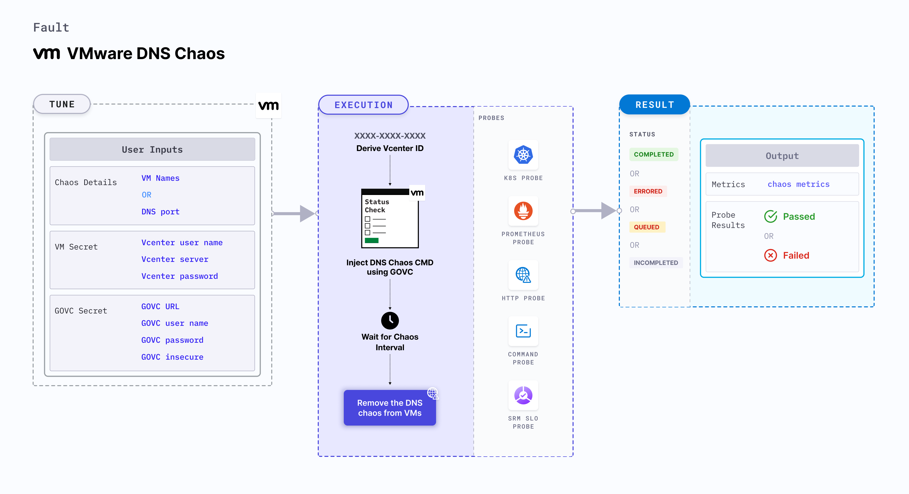

VMware DNS chaos causes DNS errors in the VMware VMs for a specific duration.
- It checks the performance of the application (or process) running on the VMware VMs.




## Usage
<details>
<summary>View fault usage</summary>
<div>
This fault causes DNS errors on the target VMs which results in unavailability (or distorted) network connectivity from the VM to the target hosts. This fault provides a hypothesis wherein certain services of an application could be unreachable from the VM. This fault determines how DNS errors impact the infrastructure and standalone tasks in the application.
</div>
</details>

## Prerequisites
- Kubernetes > 1.16
- Execution plane is connected to vCenter and the hosts on port 443. 
- VMware tool is installed on the target VM with remote execution enabled.
- Adequate vCenter permissions to access the hosts and the VMs.
- Create a Kubernetes secret that has the Vcenter credentials in the `CHAOS_NAMESPACE`. Below is a sample secret file:

```yaml
apiVersion: v1
kind: Secret
metadata:
  name: vcenter-secret
  namespace: litmus
type: Opaque
stringData:
    VCENTERSERVER: XXXXXXXXXXX
    VCENTERUSER: XXXXXXXXXXXXX
    VCENTERPASS: XXXXXXXXXXXXX
```

### Note
You can pass the VM credentials as secrets or as a `ChaosEngine` environment variable.

## Default validations
- The VM should be in a healthy state before and after injecting chaos.


## Fault tunables
<details>
    <summary>Fault tunables</summary>
    <h2>Mandatory fields</h2>
    <table>
      <tr>
        <th> Variables </th>
        <th> Description </th>
        <th> Notes </th>
      </tr>
      <tr>
        <td> VM_USER_NAME </td>
        <td> Username of the target VM(s).</td>
        <td> Multiple usernames can be provided as comma-separated values (when there are multiple VMs subject to chaos). It also helps run the govc command.</td>
      </tr>
      <tr>
        <td> VM_PASSWORD </td>
        <td> Password for the target VM(s).</td>
        <td> It helps run the govc command.</td>
      </tr>
      <tr>
        <td> PORT </td>
        <td> DNS Port</td>
        <td> Defaults to 54 </td>
      </tr>
    </table>
    <h2>Optional fields</h2>
    <table>
      <tr>
        <th> Variables </th>
        <th> Description </th>
        <th> Notes </th>
      </tr>
      <tr>
        <td> TOTAL_CHAOS_DURATION </td>
        <td> Duration that you specify, through which chaos is injected into the target resource (in seconds).</td>
        <td> Defaults to 30s. </td>
      </tr>
      <tr>
        <td> CHAOS_INTERVAL </td>
        <td> Time interval between two successive instance terminations (in seconds).</td>
        <td> Defaults to 30s. </td>
      </tr>
      <tr>
        <td> SEQUENCE </td>
        <td> Sequence of chaos execution for multiple instances. </td>
        <td> Defaults to parallel. Supports serial sequence as well. </td>
      </tr>
      <tr>
        <td> RAMP_TIME </td>
        <td> Period to wait before and after injecting chaos (in seconds).</td>
        <td> For example, 30s. </td>
      </tr>
      <tr>
        <td> TARGET_HOSTNAMES </td>
        <td> List of the target host names. If it is not provided, all host names (or domains) are targeted. </td>
        <td> For example, '["litmuschaos","chaosnative.com"]'.</td>
      </tr>
      <tr>
        <td> MATCH_SCHEME </td>
        <td> Determines whether the DNS query should exactly match the targets or can be a substring. </td>
        <td> Defaults to exact.</td>
      </tr>
      <tr>
        <td> UPSTREAM_SERVER </td>
        <td> Custom upstream server to which the intercepted DNS requests will be forwarded. </td>
        <td> Defaults to the server mentioned in resolv.conf file.</td>
      </tr>
    </table>
    <h2>Secret Fields</h2>
     <table>
      <tr>
        <th> Variables </th>
        <th> Description </th>
        <th> Notes </th>
      </tr>
      <tr>
        <td> GOVC_URL </td>
        <td> vCenter server URL used to perform API calls using the govc command.</td>
        <td> It is derived from a secret.</td>
      </tr>
      <tr>
        <td> GOVC_USERNAME </td>
        <td> Username of the vCenter server used for authentication purposes. </td>
        <td> It can be set up using a secret.</td>
      </tr>
      <tr>
        <td> GOVC_PASSWORD </td>
        <td> Password of the vCenter server used for authentication purposes. </td>
        <td> It can be set up using a secret.</td>
      </tr>
      <tr>
        <td> GOVC_INSECURE </td>
        <td> Runs the govc command in insecure mode. It is set to <code>true</code>. </td>
        <td> It can be set up using a secret.</td>
      </tr>
     </table>
</details>

## Fault examples

### Common fault tunables
Refer to the [common attributes](../common-tunables-for-all-faults) to tune the common tunables for all the faults.

### Run DNS chaos with port

It specifies the DNS port where DNS chaos is injected. You can tune it using the `PORT` environment variable.

Use the following example to tune it:

[embedmd]:# (./static/manifests/vmware-dns-chaos/vmware-dns-port.yaml yaml)
```yaml
# induces DNS chaos on the VMware VM
apiVersion: litmuschaos.io/v1alpha1
kind: ChaosEngine
metadata:
  name: VMware-engine
spec:
  engineState: "active"
  chaosServiceAccount: litmus-admin
  experiments:
  - name: VMware-DNS-chaos
    spec:
      components:
        env:
        - name: PORT
          value: '54'
        - name: VM_NAME
          value: 'vm-1,vm-2'
        - name: VM_USER_NAME
          value: 'ubuntu,debian'
        - name: VM_PASSWORD
          value: '123,123'
```

### Run DNS chaos with target host names

It contains the list of the target host names into which DNS chaos is injected. You can tune it using the `TARGET_HOSTNAMES` environment variable.

Use the following example to tune it:

[embedmd]:# (./static/manifests/vmware-dns-chaos/vmware-dns-target-hostnames.yaml yaml)
```yaml
# induces DNS chaos on the VMware VMs
apiVersion: litmuschaos.io/v1alpha1
kind: ChaosEngine
metadata:
  name: engine-nginx
spec:
  engineState: "active"
  chaosServiceAccount: litmus-admin
  experiments:
  - name: VMware-DNS-chaos
    spec:
      components:
        env:
        # list of target host names
        - name: TARGET_HOSTNAMES
          value: '["litmuschaos","chaosnative.com"]'
        - name: VM_NAME
          value: 'vm-1,vm-2'
        - name: VM_USER_NAME
          value: 'ubuntu,debian'
        - name: VM_PASSWORD
          value: '123,123'
```


### Run DNS chaos with match scheme

It determines whether the DNS query should exactly match the targets or can be a substring. You can tune it using the `MATCH_SCHEME` environment variable.

Use the following example to tune it:

[embedmd]:# (./static/manifests/vmware-dns-chaos/vmware-dns-match-scheme.yaml yaml)
```yaml
# induces DNS chaos on the VMware VMs
apiVersion: litmuschaos.io/v1alpha1
kind: ChaosEngine
metadata:
  name: engine-nginx
spec:
  engineState: "active"
  chaosServiceAccount: litmus-admin
  experiments:
  - name: VMware-DNS-chaos
    spec:
      components:
        env:
        # match scheme type
        - name: MATCH_SCHEME
          value: 'exact'
        - name: VM_NAME
          value: 'vm-1,vm-2'
        - name: VM_USER_NAME
          value: 'ubuntu,debian'
        - name: VM_PASSWORD
          value: '123,123'
```


### Run DNS chaos with upstream server

It specifies the custom upstream server to which the intercepted DNS requests are forwarded. It defaults to the server mentioned in the resolv.conf file. The value can be provided using `UPSTREAM_SERVER` environment variable.

Use the following example to tune it:

[embedmd]:# (./static/manifests/vmware-dns-chaos/vmware-dns-upstream-server.yaml yaml)
```yaml
# induces DNS chaos on the VMware VMs
apiVersion: litmuschaos.io/v1alpha1
kind: ChaosEngine
metadata:
  name: engine-nginx
spec:
  engineState: "active"
  chaosServiceAccount: litmus-admin
  experiments:
  - name: VMware-DNS-chaos
    spec:
      components:
        env:
        # name of the upstream server
        - name: UPSTREAM_SERVER
          value: '8.8.8.8'
        - name: VM_NAME
          value: 'vm-1,vm-2'
        - name: VM_USER_NAME
          value: 'ubuntu,debian'
        - name: VM_PASSWORD
          value: '123,123'
```