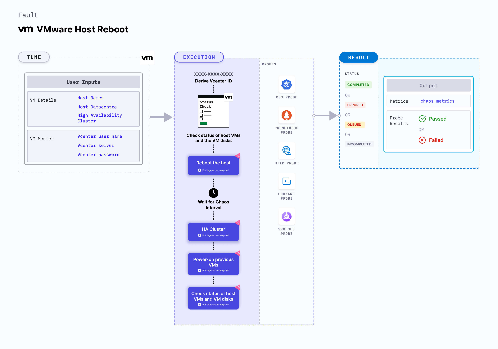

## Introduction
- VMware Host Reboot fault reboots a VMware host attached to the Vcenter.
- It helps determining VMware infrastructure resiliency upon host reboot.
- It can also be used to measure the infrastructure resiliency in case of an HA cluster.

:::tip Fault execution flow chart

:::

## Uses
<details>
<summary>View the uses of the fault</summary>
<div>
This fault has a high blast radius wherein all the VMs under the target host get disrupted. It can be used to measure the impact of host reboot on the VMs and underlying applications. It can be also used to measure the effectiveness of an HA cluster.
</div>
</details>

## Prerequisites
:::info
- Ensure that Kubernetes Version > 1.16 

**vCenter Requirements**
- Ensure the connectivity of execution plane with vCenter and the hosts over 443 port. 
- Ensure that VMware tool is installed on the target VM with remote execution enabled.
- Ensure that you have sufficient vCenter permission to access hosts and VMs.
- Ensure to create a Kubernetes secret having the Vcenter credentials in the `CHAOS_NAMESPACE`. A sample secret file looks like:
```yaml
apiVersion: v1
kind: Secret
metadata:
  name: vcenter-secret
  namespace: litmus
type: Opaque
stringData:
    VCENTERSERVER: XXXXXXXXXXX
    VCENTERUSER: XXXXXXXXXXXXX
    VCENTERPASS: XXXXXXXXXXXXX
```
### NOTE
You can pass the VM credentials as secrets or as an ChaosEngine ENV variable.
:::

## Default Validations
:::info
- Host should be in healthy state.
:::

## Fault Tunables
<details>
    <summary>Check the Fault Tunables</summary>
    <h2>Mandatory Fields</h2>
    <table>
      <tr>
        <th> Variables </th>
        <th> Description </th>
        <th> Notes </th>
      </tr>
      <tr>
        <td> HOST_NAME </td>
        <td> The name of the target host </td>
        <td> Eg. host-1 </td>
      </tr>
      <tr>
        <td> HOST_DATACENTER </td>
        <td> The name of the datacenter to which the host belongs </td>
        <td> Eg. datacenter-1 </td>
      </tr>
      <tr>
        <td> HIGH_AVAILABILITY_CLUSTER </td>
        <td> Whether the host is part of a high availability cluster </td>
        <td> Default value: disable. Supported: disable, enable </td>
      </tr>
    </table>
    <h2>Optional Fields</h2>
    <table>
      <tr>
        <th> Variables </th>
        <th> Description </th>
        <th> Notes </th>
      </tr>
      <tr>
        <td> RAMP_TIME </td>
        <td> Period to wait before and after injection of chaos in sec </td>
        <td> Eg. 30 </td>
      </tr>
    </table>
</details>

## Fault Examples

### Common Fault Tunables
Refer the [common attributes](../common-tunables-for-all-faults) to tune the common tunables for all the faults.

### Host Reboot
Reboot a vCenter host.

Use the following example to tune this:

[embedmd]:# (./static/manifests/vmware-host-reboot/host-reboot.yaml yaml)
```yaml
# vCenter host reboot
apiVersion: litmuschaos.io/v1alpha1
kind: ChaosEngine
metadata:
  name: engine-nginx
spec:
  engineState: "active"
  annotationCheck: "false"
  chaosServiceAccount: litmus-admin
  experiments:
    - name: vmware-host-reboot
      spec:
        components:
          env:
            # Name of the host
            - name: HOST_NAME
              value: 'host-1'
            # Host datacenter
            - name: HOST_DATACENTER
              value: 'datacenter-1'
```

### HA Cluster
Reboot a vCenter host which is part of an HA cluster.

Use the following example to tune this:

[embedmd]:# (./static/manifests/vmware-host-reboot/ha-host-reboot.yaml yaml)
```yaml
# vCenter HA cluster host reboot
apiVersion: litmuschaos.io/v1alpha1
kind: ChaosEngine
metadata:
  name: engine-nginx
spec:
  engineState: "active"
  annotationCheck: "false"
  chaosServiceAccount: litmus-admin
  experiments:
    - name: vmware-host-reboot
      spec:
        components:
          env:
            # Name of the host
            - name: HOST_NAME
              value: 'host-1'
            # Host datacenter
            - name: HOST_DATACENTER
              value: 'datacenter-1'
            # Is host part of HA cluster
            - name: HIGH_AVAILABILITY_CLUSTER
              value: 'enable'
```
