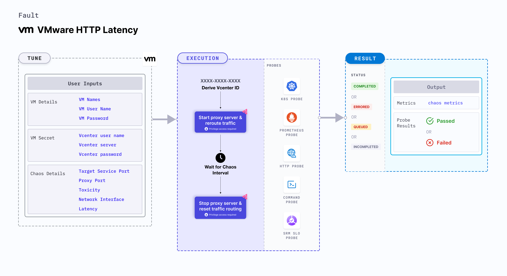

## Introduction
- It injects HTTP response latency on the service whose port is provided as `TARGET_SERVICE_PORT` by starting the proxy server and redirecting the traffic through the proxy server.
- It tests the application's resilience to lossy/flaky HTTP responses.

:::tip Fault execution flow chart

:::

## Prerequisites
:::info
- Kubernetes >= 1.17
- Vcenter access to stop and start the VM.
- Kubernetes secret that has the Vcenter credentials in the `CHAOS_NAMESPACE`. A sample secret file looks like:

```yaml
apiVersion: v1
kind: Secret
metadata:
    name: vcenter-secret
    namespace: litmus
type: Opaque
stringData:
    VCENTERSERVER: XXXXXXXXXXX
    VCENTERUSER: XXXXXXXXXXXXX
    VCENTERPASS: XXXXXXXXXXXXX
```

### NOTE
You can pass the VM credentials as a secret or as a chaosengine environment variable.
:::

## Default Validations
:::info
- The VM should be in a healthy state.
:::

## Fault Tunables

<details>
    <summary>Check the Fault Tunables</summary>
    <h2>Mandatory Fields</h2>
    <table>
        <tr>
            <th> Variables </th>
            <th> Description </th>
            <th> Notes </th>
        </tr>
        <tr>
            <td> VM_NAME </td>
            <td> Name of VMware VM</td>
            <td> For example: test-vm </td>
        </tr>
        <tr>
            <td> VM_USER_NAME </td>
            <td> Username with sudo priviliges.</td>
            <td> For example: vm-user</td>
        </tr>
        <tr>
            <td> VM_PASSWORD </td>
            <td> User password </td>
            <td> For example: 1234</td>
        </tr>
        <tr>
            <td> LATENCY </td>
            <td> Provide latency that is added to the request (in milliseconds).</td>
            <td> For example: 1000. </td>
        </tr>
        <tr>
            <td> TARGET_SERVICE_PORT </td>
            <td> Service port to target </td>
            <td> Its default value is port 80. </td>
        </tr>
    </table>
    <h2>Optional Fields</h2>
    <table>
        <tr>
            <th> Variables </th>
            <th> Description </th>
            <th> Notes </th>
        </tr>
        <tr>
            <td> TOTAL_CHAOS_DURATION </td>
            <td> The total duration to insert chaos (in seconds). </td>
            <td> Its default value is 30s. </td>
        </tr>
        <tr>
            <td> CHAOS_INTERVAL </td>
            <td> The interval between successive instance terminations (in seconds). </td>
            <td> Its default value is 30s. </td>
        </tr>
        <tr>
            <td> SEQUENCE </td>
            <td> It defines the sequence of chaos execution for multiple instances </td>
            <td> The default value is 'parallel', and it supports 'serial' value too. </td>
        </tr>
        <tr>
            <td> RAMP_TIME </td>
            <td> Period to wait before and after injection of chaos (in seconds). </td>
            <td> For example: 30 </td>
        </tr>
        <tr>
            <td> INSTALL_DEPENDENCY </td>
            <td> Whether to install the dependency to run the fault </td>
            <td> If the dependency already exists, you can turn it off. Its default value is 'True'.</td>
        </tr>
        <tr>
            <td> PROXY_PORT </td>
            <td> Port where the proxy listens for requests.</td>
            <td> Its default value is 20000 </td>
        </tr>
        <tr>
            <td> TOXICITY </td>
            <td> Percentage of HTTP requests affected. </td>
            <td> Its default value is 100 </td>
        </tr>
        <tr>
          <td> NETWORK_INTERFACE  </td>
          <td> Network interface used for the proxy. </td>
          <td> Its default value is `eth0` </td>
        </tr>
    </table>
</details>

## Fault Examples

### Common Fault Tunables

Refer to the [common attributes](../common-tunables-for-all-faults) to tune the common tunables for all the faults.

### Target Service Port

It defines the port of the target service. You can tune it using the `TARGET_SERVICE_PORT` environment variable.

Use the following example to tune it:

[embedmd]:# (./static/manifests/http-latency/target-service-port.yaml yaml)
```yaml
## provide the port of the targeted service
apiVersion: litmuschaos.io/v1alpha1
kind: ChaosEngine
metadata:
  name: engine-nginx
spec:
  engineState: "active"
  chaosServiceAccount: litmus-admin
  experiments:
  - name: vmware-http-latency
    spec:
      components:
        env:
        # provide the port of the targeted service
        - name: TARGET_SERVICE_PORT
          value: "80"
```

### Proxy Port

It defines the port where the proxy server listens for requests. You can tune it using the `PROXY_PORT` environment variable.

Use the following example to tune it:

[embedmd]:# (./static/manifests/http-latency/proxy-port.yaml yaml)
```yaml
# provide the port for proxy server
apiVersion: litmuschaos.io/v1alpha1
kind: ChaosEngine
metadata:
  name: engine-nginx
spec:
  engineState: "active"
  chaosServiceAccount: litmus-admin
  experiments:
  - name: vmware-http-latency
    spec:
      components:
        env:
        # provide the port for proxy server
        - name: PROXY_PORT
          value: '8080'
        # provide the port of the targeted service
        - name: TARGET_SERVICE_PORT
          value: "80"
```

### Latency

It defines the latency value added to the HTTP request. You can tune it using the `LATENCY` environment variable.

Use the following example to tune it:

[embedmd]:# (./static/manifests/http-latency/latency.yaml yaml)
```yaml
## provide the latency value
apiVersion: litmuschaos.io/v1alpha1
kind: ChaosEngine
metadata:
  name: engine-nginx
spec:
  engineState: "active"
  chaosServiceAccount: litmus-admin
  experiments:
  - name: vmware-http-latency
    spec:
      components:
        env:
        # provide the latency value
        - name: LATENCY
          value: '2000'
        # provide the port of the targeted service
        - name: TARGET_SERVICE_PORT
          value: "80"
```

### Toxicity

It defines the toxicity value added to the HTTP request. You can tune it using the `TOXICITY` environment variable.
Toxicity value defines the percentage of the total number of HTTP requests that are affected.

Use the following example to tune it:

[embedmd]:# (./static/manifests/http-latency/toxicity.yaml yaml)
```yaml
## provide the toxicity
apiVersion: litmuschaos.io/v1alpha1
kind: ChaosEngine
metadata:
  name: engine-nginx
spec:
  engineState: "active"
  chaosServiceAccount: litmus-admin
  experiments:
  - name: vmware-http-latency
    spec:
      components:
        env:
        # toxicity is the probability of the request to be affected
        # provide the percentage value in the range of 0-100
        # 0 means no request will be affected and 100 means all request will be affected
        - name: TOXICITY
          value: "100"
        # provide the port of the targeted service
        - name: TARGET_SERVICE_PORT
          value: "80"
```

### Network Interface

It defines the network interface to be used for the proxy. You can tune it using the `NETWORK_INTERFACE` environment variable.

Use the following example to tune it:

[embedmd]:# (./static/manifests/http-latency/network-interface.yaml yaml)
```yaml
## provide the network interface for proxy
apiVersion: litmuschaos.io/v1alpha1
kind: ChaosEngine
metadata:
  name: engine-nginx
spec:
  engineState: "active"
  chaosServiceAccount: litmus-admin
  experiments:
  - name: vmware-http-latency
    spec:
      components:
        env:
        # provide the network interface for proxy
        - name: NETWORK_INTERFACE
          value: "eth0"
        # provide the port of the targeted service
        - name: TARGET_SERVICE_PORT
          value: '80'
```
