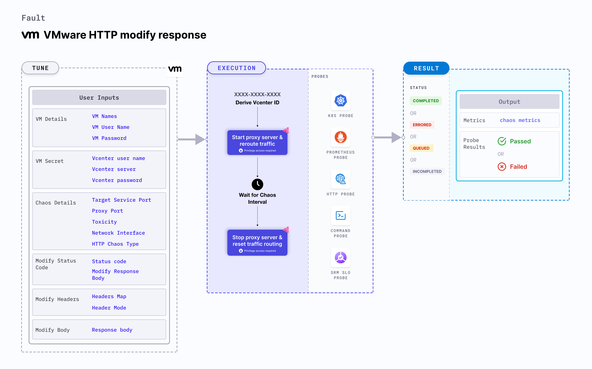

VMware HTTP modify response injects HTTP chaos by modifying the status code, body or the headers, which affects the request (or response).  
- Chaos is injected by starting the proxy server and redirecting the traffic through the proxy server.
- It tests the application's resilience to erroneous (or incorrect) HTTP response body.
- It modifies the headers of the requests and the responses of the service. This helps test the service's resilience towards incorrect or incomplete headers.




## Use cases

- VMware HTTP modify response determines the resilience of an application to modifications in the status code or body or header of the request (or response). 
- It measures how accurately the application spots incorrect HTTP response body.

:::note
- Kubernetes >= 1.17 is required to execute this fault.
- Appropriate vCenter permissions should be provided to start and stop the VMs.
- The VM should be in a healthy state before and after injecting chaos.
- Kubernetes secret has to be created that has the Vcenter credentials in the `CHAOS_NAMESPACE`. VM credentials can be passed as secrets or as a `ChaosEngine` environment variable. Below is a sample secret file:

```yaml
apiVersion: v1
kind: Secret
metadata:
    name: vcenter-secret
    namespace: litmus
type: Opaque
stringData:
    VCENTERSERVER: XXXXXXXXXXX
    VCENTERUSER: XXXXXXXXXXXXX
    VCENTERPASS: XXXXXXXXXXXXX
```
:::

## Fault tunables

  <h3>Mandatory fields</h3>
    <table>
        <tr>
            <th> Variables </th>
            <th> Description </th>
            <th> Notes </th>
        </tr>
        <tr>
            <td> VM_NAME </td>
            <td> Name of the VMware VM. </td>
            <td> For example, <code>test-vm</code>. </td>
        </tr>
        <tr>
            <td> VM_USER_NAME </td>
            <td> Username with sudo privileges.</td>
            <td> For example, <code>vm-user</code>. </td>
        </tr>
        <tr>
            <td> VM_PASSWORD </td>
            <td> User password. </td>
            <td> For example, <code>1234</code>. </td>
        </tr>
        <tr>
            <td> TARGET_SERVICE_PORT </td>
            <td> Service port to target. </td>
            <td> Defaults to port 80. For more information, go to <a href="https://developer.harness.io/docs/chaos-engineering/chaos-faults/vmware/VMware-http-modify-response#target-service-port"> target service port.</a></td>
        </tr>
        <tr>
            <td> HTTP_CHAOS_TYPE </td>
            <td> Type of the HTTP modify response chaos that is injected. </td>
            <td> Defaults to 'status_code'. It accepts 'body', and 'header' as well. For more information, go to <a href="https://developer.harness.io/docs/chaos-engineering/chaos-faults/vmware/VMware-http-modify-response#modifying-the-response-status-code"> modifying status code of the response.</a></td>
        </tr>
    </table>
    <h3> Status code modification fields </h3>
    <table>
    <tr>
        <td> STATUS_CODE </td>
        <td> Modified the status code for the HTTP response. </td>
        <td> If no value has been provided, a random value is selected from the list of supported values.
        Multiple values can be provided as comma-separated values, and a random value from the list is selected.
        Supported values include 200, 201, 202, 204, 300, 301, 302, 304, 307, 400, 401, 403, 404, 500, 501, 502, 503, 504. Defaults to a random status code. For more information, go to <a href="https://developer.harness.io/docs/chaos-engineering/chaos-faults/vmware/VMware-http-modify-response#modifying-the-response-status-code"> modify status code of response. </a></td>
    </tr>
    <tr>
        <td> MODIFY_RESPONSE_BODY </td>
        <td> Specify if the body should be modified according to the status code provided. </td>
        <td> Defaults to true, wherein the body is replaced by a default template for the status code. For more information, go to <a href="https://developer.harness.io/docs/chaos-engineering/chaos-faults/vmware/VMware-http-modify-response#modifying-the-response-status-code"> modify response body field. </a></td>
    </tr>
    </table>
    <h3> Body modification fields </h3>
    <table>
        <tr>
            <td> RESPONSE_BODY </td>
            <td> Body string used to overwrite the HTTP response body. </td>
            <td> If no value has been provided, the response will be an empty body. Defaults to empty body. For more information, go to <a href="https://developer.harness.io/docs/chaos-engineering/chaos-faults/vmware/VMware-http-modify-response#modifying-the-response-body"> response body field. </a></td>
        </tr>
    </table>
    <h3> Header modification fields</h3>
    <table>
        <tr>
            <td> HEADERS_MAP </td>
            <td> Map of the headers to modify (or add). </td>
            <td> For example, &#123;"X-Litmus-Test-Header":"X-Litmus-Test-Value"&#125;. To remove a header, set the value to "". For example, &#123;"X-Litmus-Test-Header": ""&#125;. For more information, go to <a href="https://developer.harness.io/docs/chaos-engineering/chaos-faults/vmware/VMware-http-modify-response#modifying-the-request-headers"> </a> header map field. </td>
        </tr>
        <tr>
            <td> HEADER_MODE </td>
            <td> Specify whether the response headers (or request headers) should be modified. </td>
            <td> Defaults to response. Supports request as well.  For more information, go to <a href="https://developer.harness.io/docs/chaos-engineering/chaos-faults/vmware/VMware-http-modify-response#modifying-the-request-headers"> header mode field. </a></td>
        </tr>
    </table>
    <h3>Optional fields</h3>
    <table>
        <tr>
            <th> Variables </th>
            <th> Description </th>
            <th> Notes </th>
        </tr>
        <tr>
            <td> TOTAL_CHAOS_DURATION </td>
            <td> Duration that you specify, through which chaos is injected into the target resource (in seconds). </td>
            <td> Defaults to 30s. For more information, go to <a href="https://developer.harness.io/docs/chaos-engineering/chaos-faults/common-tunables-for-all-faults#duration-of-the-chaos"> duration of the chaos. </a></td>
        </tr>
        <tr>
            <td> CHAOS_INTERVAL </td>
            <td> Time interval between two successive instance terminations (in seconds). </td>
            <td> Defaults to 30s. For more information, go to <a href="https://developer.harness.io/docs/chaos-engineering/chaos-faults/common-tunables-for-all-faults#chaos-interval"> chaos interval. </a></td>
        </tr>
        <tr>
            <td> SEQUENCE </td>
            <td> Sequence of chaos execution for multiple instances. </td>
            <td> Defaults to parallel. Supports serial sequence as well. For more information, go to <a href="https://developer.harness.io/docs/chaos-engineering/chaos-faults/common-tunables-for-all-faults#sequence-of-chaos-execution"> sequence of chaos execution.</a></td>
        </tr>
        <tr>
            <td> RAMP_TIME </td>
        <td> Period to wait before and after injecting chaos (in seconds). </td>
            <td> For example, 30s. For more information, go to <a href="https://developer.harness.io/docs/chaos-engineering/chaos-faults/common-tunables-for-all-faults#ramp-time"> ramp time.</a></td>
        </tr>
        <tr>
            <td> INSTALL_DEPENDENCY </td>
            <td> Specify whether you wish to install the dependency to run the experiment. </td>
            <td> Defaults to true. If the dependency already exists, you can turn it off. </td>
        </tr>
        <tr>
            <td> PROXY_PORT  </td>
            <td> Port where the proxy listens for requests. </td>
            <td> Defaults to 20000. For more information, go to <a href="https://developer.harness.io/docs/chaos-engineering/chaos-faults/vmware/VMware-http-modify-response#proxy-port"> proxy port.</a></td>
        </tr>
        <tr>
            <td> TOXICITY </td>
            <td> Percentage of HTTP requests that are affected. </td>
            <td> Defaults to 100. For more information, go to <a href="https://developer.harness.io/docs/chaos-engineering/chaos-faults/vmware/VMware-http-modify-response#toxicity"> toxicity.</a></td>
        </tr>
        <tr>
          <td> NETWORK_INTERFACE  </td>
          <td> Network interface used for the proxy. </td>
          <td> Defaults to eth0. For more information, go to <a href="https://developer.harness.io/docs/chaos-engineering/chaos-faults/vmware/VMware-http-modify-response#network-interface"> network interface.</a></td>
        </tr>
    </table>

### Target service port

It defines the port of the target service. Tune it by using the `TARGET_SERVICE_PORT` environment variable.

Use the following example to tune it:

[embedmd]:# (./static/manifests/http-modify-response/target-service-port.yaml yaml)
```yaml
## provide the port of the targeted service
apiVersion: litmuschaos.io/v1alpha1
kind: ChaosEngine
metadata:
  name: engine-nginx
spec:
  engineState: "active"
  chaosServiceAccount: litmus-admin
  experiments:
  - name: VMware-http-modify-response
    spec:
      components:
        env:
        # provide the port of the targeted service
        - name: TARGET_SERVICE_PORT
          value: "80"
```

### Modifying the response status code

It specifies the status code of the response that is to be modified. Tune it by using the `HTTP_CHAOS_TYPE` environment variable that is provided as the `status_code`.

[embedmd]:# (./static/manifests/http-modify-response/status-code.yaml yaml)
```yaml
## provide the headers as a map
apiVersion: litmuschaos.io/v1alpha1
kind: ChaosEngine
metadata:
  name: engine-nginx
spec:
  engineState: "active"
  chaosServiceAccount: litmus-admin
  experiments:
  - name: VMware-http-modify-response
    spec:
      components:
        env:
        # HTTP response modification chaos type
        - name: HTTP_CHAOS_TYPE
          value: "status_code"
        # modified status code for the http response
        # if no value is provided, a random status code from the supported code list will selected
        # if multiple comma separated values are provided, then a random value
        # from the provided list will be selected
        # if an invalid status code is provided, the fault will fail
        # supported status code list:
        # [200, 201, 202, 204, 300, 301, 302, 304, 307, 400, 401, 403, 404, 500, 501, 502, 503, 504]
        - name: STATUS_CODE
          value: '500'
        # whether to modify the body as per the status code provided
        - name: MODIFY_RESPONSE_BODY
          value: "true"
        # provide the port of the targeted service
        - name: TARGET_SERVICE_PORT
          value: "80"
```

### Modifying the response headers

It specifies the response header that is to be modified. Tune it by using the `HTTP_CHAOS_TYPE` environment variable that is provided as the `header`.

[embedmd]:# (./static/manifests/http-modify-response/response-headers.yaml yaml)
```yaml
## provide the headers as a map
apiVersion: litmuschaos.io/v1alpha1
kind: ChaosEngine
metadata:
  name: engine-nginx
spec:
  engineState: "active"
  chaosServiceAccount: litmus-admin
  experiments:
  - name: VMware-http-modify-response
    spec:
      components:
        env:
        # HTTP response modification chaos type
        - name: HTTP_CHAOS_TYPE
          value: "header"
        # map of headers to modify/add; Eg: {"X-Litmus-Test-Header": "X-Litmus-Test-Value"}
        # to remove a header, just set the value to ""; Eg: {"X-Litmus-Test-Header": ""}
        - name: HEADERS_MAP
          value: '{"X-Litmus-Test-Header": "X-Litmus-Test-Value"}'
        # whether to modify response headers or request headers. Accepted values: request, response
        - name: HEADER_MODE
          value: 'response'
        # provide the port of the targeted service
        - name: TARGET_SERVICE_PORT
          value: "80"
```

### Modifying the request headers

It specifies the request header that is to be modified. Tune it by using the `HTTP_CHAOS_TYPE` environment variable that is provided as the `header`.

[embedmd]:# (./static/manifests/http-modify-response/response-headers.yaml yaml)
```yaml
## provide the headers as a map
apiVersion: litmuschaos.io/v1alpha1
kind: ChaosEngine
metadata:
  name: engine-nginx
spec:
  engineState: "active"
  chaosServiceAccount: litmus-admin
  experiments:
  - name: VMware-http-modify-response
    spec:
      components:
        env:
        # HTTP response modification chaos type
        - name: HTTP_CHAOS_TYPE
          value: "header"
        # map of headers to modify/add; Eg: {"X-Litmus-Test-Header": "X-Litmus-Test-Value"}
        # to remove a header, just set the value to ""; Eg: {"X-Litmus-Test-Header": ""}
        - name: HEADERS_MAP
          value: '{"X-Litmus-Test-Header": "X-Litmus-Test-Value"}'
        # whether to modify response headers or request headers. Accepted values: request, response
        - name: HEADER_MODE
          value: 'response'
        # provide the port of the targeted service
        - name: TARGET_SERVICE_PORT
          value: "80"
```

### Modifying the response body

It specifies the response body that is to be modified. Tune it by using the `HTTP_CHAOS_TYPE` environment variable that is provided as the `body`.

[embedmd]:# (./static/manifests/http-modify-response/response-body.yaml yaml)
```yaml
## provide the headers as a map
apiVersion: litmuschaos.io/v1alpha1
kind: ChaosEngine
metadata:
  name: engine-nginx
spec:
  engineState: "active"
  chaosServiceAccount: litmus-admin
  experiments:
  - name: VMware-http-modify-response
    spec:
      components:
        env:
        # HTTP response modification chaos type
        - name: HTTP_CHAOS_TYPE
          value: "body"
        # provide the body string to overwrite the response body
        - name: RESPONSE_BODY
          value: '2000'
        # provide the port of the targeted service
        - name: TARGET_SERVICE_PORT
          value: "80"
```

### Proxy port

It specifies the port where the proxy server listens for requests. Tune it by using the `PROXY_PORT` environment variable.

Use the following example to tune it:

[embedmd]:# (./static/manifests/http-modify-response/proxy-port.yaml yaml)
```yaml
# provide the port for proxy server
apiVersion: litmuschaos.io/v1alpha1
kind: ChaosEngine
metadata:
  name: engine-nginx
spec:
  engineState: "active"
  chaosServiceAccount: litmus-admin
  experiments:
  - name: VMware-http-modify-response
    spec:
      components:
        env:
        # provide the port for proxy server
        - name: PROXY_PORT
          value: '8080'
        # provide the port of the targeted service
        - name: TARGET_SERVICE_PORT
          value: "80"
```

### Toxicity

It specifies the toxicity value added to the HTTP request. Toxicity value defines the percentage of the total number of HTTP requests that are affected. Tune it by using the `TOXICITY` environment variable.

Use the following example to tune it:

[embedmd]:# (./static/manifests/http-modify-response/toxicity.yaml yaml)
```yaml
## provide the toxicity
apiVersion: litmuschaos.io/v1alpha1
kind: ChaosEngine
metadata:
  name: engine-nginx
spec:
  engineState: "active"
  chaosServiceAccount: litmus-admin
  experiments:
  - name: VMware-http-modify-response
    spec:
      components:
        env:
        # toxicity is the probability of the request to be affected
        # provide the percentage value in the range of 0-100
        # 0 means no request will be affected and 100 means all request will be affected
        - name: TOXICITY
          value: "100"
        # provide the port of the targeted service
        - name: TARGET_SERVICE_PORT
          value: "80"
```

### Network interface

It specifies the network interface used for the proxy. Tune it by using the `NETWORK_INTERFACE` environment variable.

Use the following example to tune it:

[embedmd]:# (./static/manifests/http-modify-response/network-interface.yaml yaml)
```yaml
## provide the network interface for proxy
apiVersion: litmuschaos.io/v1alpha1
kind: ChaosEngine
metadata:
  name: engine-nginx
spec:
  engineState: "active"
  chaosServiceAccount: litmus-admin
  experiments:
  - name: VMware-http-modify-response
    spec:
      components:
        env:
        # provide the network interface for proxy
        - name: NETWORK_INTERFACE
          value: "eth0"
        # provide the port of the targeted service
        - name: TARGET_SERVICE_PORT
          value: '80'
```
