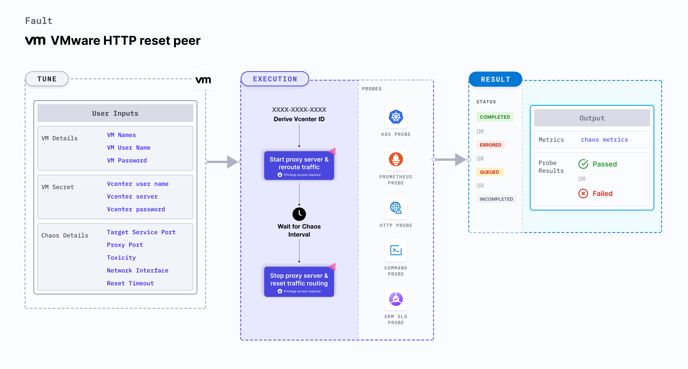

## Introduction

- It injects http reset on the service whose port is provided as TARGET_SERVICE_PORT which stops outgoing http requests by resetting the TCP connection for the requests.
- It can test the application's resilience to lossy/flaky http connection.

:::tip Fault execution flow chart

:::

## Prerequisites

:::info

- Ensure that Kubernetes Version >= 1.17
- Ensure that you have sufficient Vcenter access to stop and start the VM.
- Ensure to create a Kubernetes secret having the Vcenter credentials in the `CHAOS_NAMESPACE`. A secret file looks like:

```yaml
apiVersion: v1
kind: Secret
metadata:
    name: vcenter-secret
    namespace: litmus
type: Opaque
stringData:
    VCENTERSERVER: XXXXXXXXXXX
    VCENTERUSER: XXXXXXXXXXXXX
    VCENTERPASS: XXXXXXXXXXXXX
```

### NOTE

You can pass the VM credentials as secrets or as an chaosengine ENV variable.
:::

## Default Validations

:::info

- VM should be in healthy state.

:::

## Fault Tunables

<details>
    <summary>Check the Fault Tunables</summary>
    <h2>Mandatory Fields</h2>
    <table>
        <tr>
            <th> Variables </th>
            <th> Description </th>
            <th> Notes </th>
        </tr>
        <tr>
            <td> VM_NAME </td>
            <td> Name of VMware VM</td>
            <td> Eg: test-vm </td>
        </tr>
        <tr>
            <td> VM_USER_NAME </td>
            <td> Username with sudo privileges.</td>
            <td> Eg: vm-user</td>
        </tr>
        <tr>
            <td> VM_PASSWORD </td>
            <td> Password of the provided user</td>
            <td> Eg: 1234</td>
        </tr>
        <tr>
            <td> RESET_TIMEOUT </td>
            <td> Reset Timeout specifies after how much duration to reset the connection</td>
            <td> Defaults to 0 </td>
        </tr>
        <tr>
            <td> TARGET_SERVICE_PORT </td>
            <td> Port of the service to target </td>
            <td> Defaults to port 80 </td>
        </tr>
    </table>
    <h2>Optional Fields</h2>
    <table>
        <tr>
            <th> Variables </th>
            <th> Description </th>
            <th> Notes </th>
        </tr>
        <tr>
            <td> TOTAL_CHAOS_DURATION </td>
            <td> The total time duration for chaos insertion (sec) </td>
            <td> Defaults to 30s </td>
        </tr>
        <tr>
            <td> CHAOS_INTERVAL </td>
            <td> The interval (in sec) between successive instance termination </td>
            <td> Defaults to 30s </td>
        </tr>
        <tr>
            <td> SEQUENCE </td>
            <td> It defines sequence of chaos execution for multiple instance </td>
            <td> Default value: parallel. Supported: serial, parallel </td>
        </tr>
        <tr>
            <td> RAMP_TIME </td>
            <td> Period to wait before and after injection of chaos in sec </td>
            <td> Eg: 30 </td>
        </tr>
        <tr>
            <td> INSTALL_DEPENDENCY </td>
            <td> Whether to install the dependency to run the fault </td>
            <td> If the dependency already exists, you can turn it off. Defaults to True.</td>
        </tr>
        <tr>
            <td> PROXY_PORT </td>
            <td> Port where the proxy will be listening for requests</td>
            <td> Defaults to 20000 </td>
        </tr>
        <tr>
            <td> TOXICITY </td>
            <td> Percentage of HTTP requests to be affected </td>
            <td> Defaults to 100 </td>
        </tr>
        <tr>
          <td> NETWORK_INTERFACE </td>
          <td> Network interface to be used for the proxy</td>
          <td> Defaults to `eth0` </td>
        </tr>
    </table>
</details>

## Fault Examples

### Common Fault Tunables

Refer the [common attributes](../common-tunables-for-all-faults) to tune the common tunables for all the faults.

### Target Service Port

It defines the port of the targeted service that is being targeted. It can be tuned via `TARGET_SERVICE_PORT` ENV.

Use the following example to tune this:

[embedmd]:# (./static/manifests/http-reset-peer/target-service-port.yaml yaml)
```yaml
## provide the port of the targeted service
apiVersion: litmuschaos.io/v1alpha1
kind: ChaosEngine
metadata:
  name: engine-nginx
spec:
  engineState: "active"
  chaosServiceAccount: litmus-admin
  experiments:
  - name: vmware-http-reset-peer
    spec:
      components:
        env:
        # provide the port of the targeted service
        - name: TARGET_SERVICE_PORT
          value: "80"
```

### Proxy Port

It defines the port on which the proxy server will listen for requests. It can be tuned via `PROXY_PORT` ENV.

Use the following example to tune this:

[embedmd]:# (./static/manifests/http-reset-peer/proxy-port.yaml yaml)
```yaml
# provide the port for proxy server
apiVersion: litmuschaos.io/v1alpha1
kind: ChaosEngine
metadata:
  name: engine-nginx
spec:
  engineState: "active"
  chaosServiceAccount: litmus-admin
  experiments:
  - name: vmware-http-reset-peer
    spec:
      components:
        env:
        # provide the port for proxy server
        - name: PROXY_PORT
          value: '8080'
        # provide the port of the targeted service
        - name: TARGET_SERVICE_PORT
          value: "80"
```

### RESET TIMEOUT

It defines the reset timeout value to be added to the http request. It can be tuned via RESET_TIMEOUT ENV.

Use the following example to tune this:

[embedmd]:# (./static/manifests/http-reset-peer/reset-timeout.yaml yaml)
```yaml
## provide the reset timeout value
apiVersion: litmuschaos.io/v1alpha1
kind: ChaosEngine
metadata:
  name: engine-nginx
spec:
  engineState: "active"
  chaosServiceAccount: litmus-admin
  experiments:
  - name: vmware-http-reset-peer
    spec:
      components:
        env:
        # reset timeout specifies after how much duration to reset the connection
        - name: RESET_TIMEOUT #in ms
          value: '2000'
        # provide the port of the targeted service
        - name: TARGET_SERVICE_PORT
          value: "80"
```

### Toxicity

It defines the toxicity value to be added to the http request. It can be tuned via `TOXICITY` ENV.
Toxicity value defines the percentage of the total number of http requests to be affected.

Use the following example to tune this:

[embedmd]:# (./static/manifests/http-reset-peer/toxicity.yaml yaml)
```yaml
## provide the toxicity
apiVersion: litmuschaos.io/v1alpha1
kind: ChaosEngine
metadata:
  name: engine-nginx
spec:
  engineState: "active"
  chaosServiceAccount: litmus-admin
  experiments:
  - name: vmware-http-reset-peer
    spec:
      components:
        env:
        # toxicity is the probability of the request to be affected
        # provide the percentage value in the range of 0-100
        # 0 means no request will be affected and 100 means all request will be affected
        - name: TOXICITY
          value: "100"
        # provide the port of the targeted service
        - name: TARGET_SERVICE_PORT
          value: "80"
```

### Network Interface

It defines the network interface to be used for the proxy. It can be tuned via `NETWORK_INTERFACE` ENV.

Use the following example to tune this:

[embedmd]:# (./static/manifests/http-reset-peer/network-interface.yaml yaml)
```yaml
## provide the network interface for proxy
apiVersion: litmuschaos.io/v1alpha1
kind: ChaosEngine
metadata:
  name: engine-nginx
spec:
  engineState: "active"
  chaosServiceAccount: litmus-admin
  experiments:
  - name: vmware-http-reset-peer
    spec:
      components:
        env:
        # provide the network interface for proxy
        - name: NETWORK_INTERFACE
          value: "eth0"
        # provide the port of the targeted service
        - name: TARGET_SERVICE_PORT
          value: '80'
```
