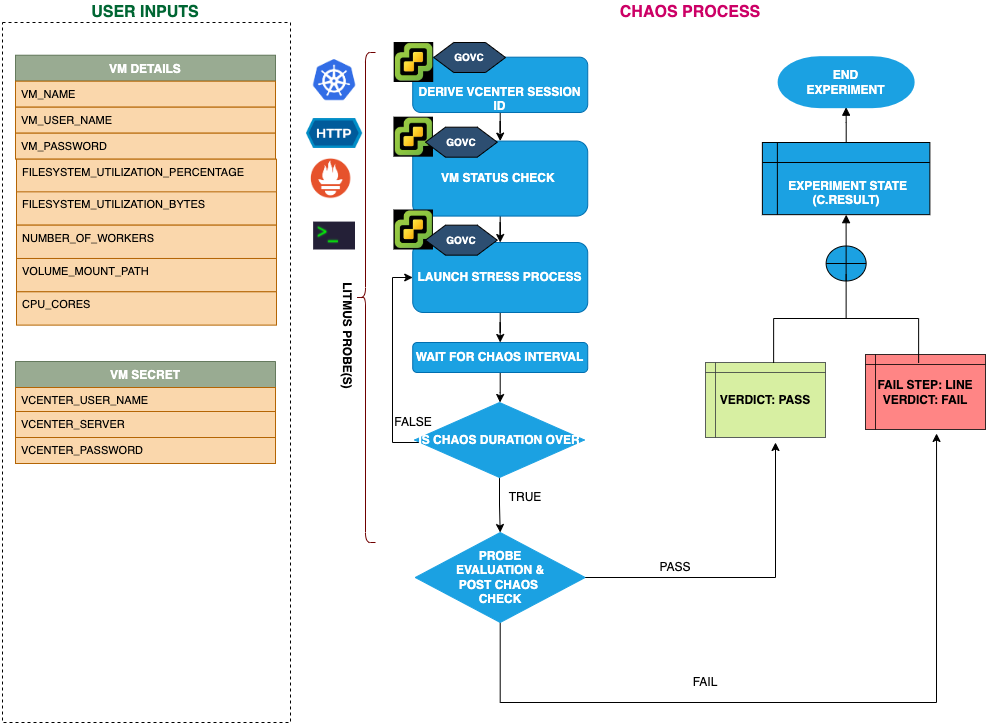

## Introduction
- This fault causes disk stress on the target VMware VMs. It aims to verify the resiliency of applications that share this disk resource to the VM. 

:::tip Fault execution flow chart

:::

## Prerequisites
:::info
- Ensure that Kubernetes Version > 1.16

** vCenter Requirements **
- Ensure the connectivity of  execution plane with vCenter and the hosts over 443 port. 
- Ensure that VMware tool is installed on the target VM with remote execution enabled.
- Ensure that you have sufficient vCenter permission to access hosts and VMs.
- Ensure to create a Kubernetes secret having the Vcenter credentials in the `CHAOS_NAMESPACE`. A sample secret file looks like:
```yaml
apiVersion: v1
kind: Secret
metadata:
  name: vcenter-secret
  namespace: litmus
type: Opaque
stringData:
    VCENTERSERVER: XXXXXXXXXXX
    VCENTERUSER: XXXXXXXXXXXXX
    VCENTERPASS: XXXXXXXXXXXXX
```
### NOTE
You can pass the VM credentials as secrets or as an ChaosEngine ENV variable.
:::


## Default Validations
:::info
- VM should be in healthy state.
:::

## Fault Tunables
<details>
    <summary>Check the Fault Tunables</summary>
    <h2>Mandatory Fields</h2>
    <table>
      <tr>
        <th> Variables </th>
        <th> Description </th>
        <th> Notes </th>
      </tr>
      <tr>
        <td> VM_NAME </td>
        <td> Name of the target VM </td>
        <td> ubuntu-vm-1 </td>
      </tr>
    </table>
    <h2>Optional Fields</h2>
    <table>
      <tr>
        <th> Variables </th>
        <th> Description </th>
        <th> Notes </th>
      </tr>
       <tr>
        <td> FILESYSTEM_UTILIZATION_PERCENTAGE </td>
        <td> Specify the size as percentage of free space on the file system </td>
        <td> </td>
      </tr>   
       <tr>
        <td> FILESYSTEM_UTILIZATION_BYTES </td>
        <td> Specify the size in GigaBytes(GB). FILESYSTEM_UTILIZATION_PERCENTAGE & FILESYSTEM_UTILIZATION_BYTES are mutually exclusive. If both are provided, FILESYSTEM_UTILIZATION_PERCENTAGE is prioritized. </td>
        <td> </td>
      </tr>  
       <tr>
        <td> NUMBER_OF_WORKERS </td>
        <td> It is the number of IO workers involved in IO disk stress </td>
        <td> Default to 4 </td>
      </tr>
       <tr>
        <td> VOLUME_MOUNT_PATH </td>
        <td> Fill the given volume mount path </td>
        <td> </td>
      </tr>   
      <tr>
        <td> CPU_CORES </td>
        <td> Number of the CPU cores subjected to CPU stress </td>
        <td> Default to 1 </td>
        </tr>
      <tr>
        <td> TOTAL_CHAOS_DURATION </td>
        <td> The total time duration for chaos insertion (sec) </td>
        <td> Defaults to 30s </td>
      </tr>
      <tr>
        <td> CHAOS_INTERVAL </td>
        <td> The interval (in sec) between successive instance termination </td>
        <td> Defaults to 30s </td>
      </tr>
      <tr>
        <td> SEQUENCE </td>
        <td> It defines sequence of chaos execution for multiple instance </td>
        <td> Default value: parallel. Supported: serial, parallel </td>
      </tr>
      <tr>
        <td> RAMP_TIME </td>
        <td> Period to wait before and after injection of chaos in sec </td>
        <td> Eg. 30 </td>
      </tr>
    </table>
</details>

## Fault Examples

### Common Fault Tunables
Refer the [common attributes](../common-tunables-for-all-faults) to tune the common tunables for all the faults.

### FILESYSTEM_UTILIZATION_PERCENTAGE
It stresses the `FILESYSTEM_UTILIZATION_PERCENTAGE` percentage of total free space available in the VM.

Use the following example to tune this:

[embedmd]:# (./static/manifests/vmware-io-stress/vm-io-stress-filesystem-utilization-percenatge.yaml yaml)
```yaml
# io-stress in the VMWare VM
apiVersion: litmuschaos.io/v1alpha1
kind: ChaosEngine
metadata:
  name: engine-nginx
spec:
  engineState: "active"
  chaosServiceAccount: litmus-admin
  experiments:
  - name: vmware-io-stress
    spec:
      components:
        env:
        # Name of the VM
        - name: VM_NAME
          value: 'test-vm-01'
        # percentage of free space of file system, need to be stressed
        - name: FILESYSTEM_UTILIZATION_PERCENTAGE
          value: '10'
```
### Filesystem Utilization Bytes
It stresses the `FILESYSTEM_UTILIZATION_BYTES` GB of the i/o of the targeted VM. It is mutually exclusive with the FILESYSTEM_UTILIZATION_PERCENTAGE ENV. If FILESYSTEM_UTILIZATION_PERCENTAGE ENV is set then it will use the percentage for the stress otherwise, it will stress the i/o based on FILESYSTEM_UTILIZATION_BYTES ENV.

Use the following example to tune this:

[embedmd]:# (./static/manifests/vmware-io-stress/vm-io-stress-filesystem-utilization-bytes.yaml yaml)
```yaml
apiVersion: litmuschaos.io/v1alpha1
kind: ChaosEngine
metadata:
  name: engine-nginx
spec:
  engineState: "active"
  chaosServiceAccount: litmus-admin
  experiments:
  - name: vmware-io-stress
    spec:
      components:
        env:
        # Name of the VM
        - name: VM_NAME
          value: 'test-vm-01'
        # size of io to be stressed
        - name: FILESYSTEM_UTILIZATION_BYTES
          value: '1' #in GB
```
### Mount Path
The volume mount path, which needs to be filled. It can be tuned with `VOLUME_MOUNT_PATH` ENV

Use the following example to tune this:

[embedmd]:# (./static/manifests/vmware-io-stress/vm-io-stress-filesystem-mount-path.yaml yaml)
```yaml
# io-stress in the VMWare VM
apiVersion: litmuschaos.io/v1alpha1
kind: ChaosEngine
metadata:
  name: engine-nginx
spec:
  engineState: "active"
  chaosServiceAccount: litmus-admin
  experiments:
  - name: vmware-io-stress
    spec:
      components:
        env:
        # Name of the VM
        - name: VM_NAME
          value: 'test-vm-01'
        # path need to be stressed/filled
        - name: VOLUME_MOUNT_PATH
          value: '/some-dir-in-container'
        # size of io to be stressed
        - name: FILESYSTEM_UTILIZATION_BYTES
          value: '1' #in GB
```
### Workers For Stress
The worker's count for the stress can be tuned with `NUMBER_OF_WORKERS` ENV.

[embedmd]:# (./static/manifests/vmware-io-stress/vm-io-stress-filesystem-worker.yaml yaml)
```yaml
# io-stress in the VMWare VM
apiVersion: litmuschaos.io/v1alpha1
kind: ChaosEngine
metadata:
  name: engine-nginx
spec:
  engineState: "active"
  chaosServiceAccount: litmus-admin
  experiments:
  - name: vmware-io-stress
    spec:
      components:
        env:
        # Name of the VM
        - name: VM_NAME
          value: 'test-vm-01'
        # number of io workers
        - name: NUMBER_OF_WORKERS
          value: '4'
        # size of io to be stressed
        - name: FILESYSTEM_UTILIZATION_BYTES
          value: '1' #in GB
```
