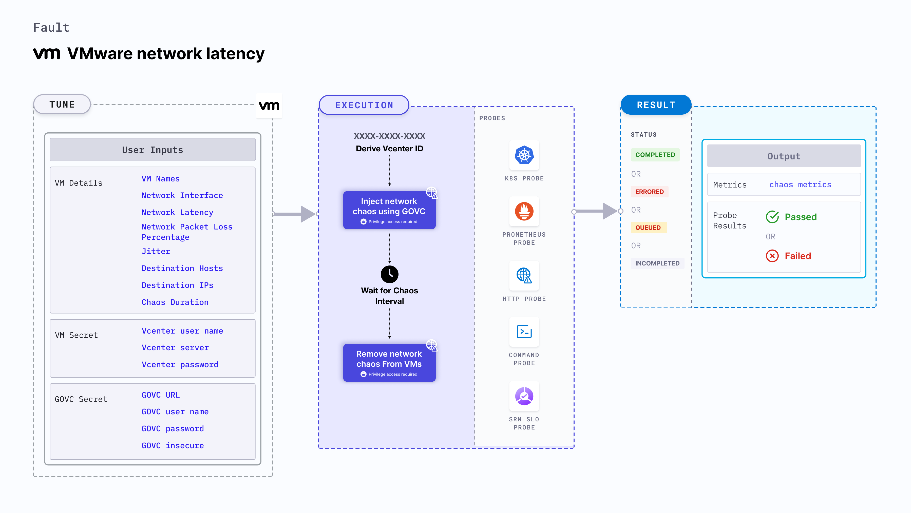

VMware network latency injects network packet latency from the VMware VM(s) into the application (or service).
- It results in flaky access to the application. 
- It causes network degradation without the VM being marked as unhealthy (or unworthy) of traffic.
- It checks the performance of the application (or process) running on the VMware VM(s).



## Use cases

- VMware network latency simulates issues within the VM network (or microservice) communication across services in different hosts.
- It helps determine the impact of degradation while accessing a microservice. 
- The VM may stall or get corrupted while waiting endlessly for a packet. The fault limits the impact (blast radius) to the traffic that you wish to test by specifying the IP addresses.
- It simulates a consistently slow network connection between microservices, for example, cross-region connectivity between active-active peers of a given service or across services or poor cni-performance in the inter-pod-communication network. 
- It simulates jittery connection with transient latency spikes between microservices.
- It simulates slow response on specific third party (or dependent) components (or services).
- It simulates degraded data-plane of service-mesh infrastructure.

:::note
- Kubernetes > 1.16 is required to execute this fault.
- Appropriate vCenter permissions should be provided to start and stop the VMs.
- The VM should be in a healthy state before and after injecting chaos.
- Kubernetes secret has to be created that has the Vcenter credentials in the `CHAOS_NAMESPACE`. VM credentials can be passed as secrets or as a `ChaosEngine` environment variable. Below is a sample secret file:
```yaml
apiVersion: v1
kind: Secret
metadata:
  name: vcenter-secret
  namespace: litmus
type: Opaque
stringData:
    VCENTERSERVER: XXXXXXXXXXX
    VCENTERUSER: XXXXXXXXXXXXX
    VCENTERPASS: XXXXXXXXXXXXX
```
:::

## Fault tunables

  <h3>Mandatory fields</h3>
    <table>
      <tr>
        <th> Variables </th>
        <th> Description </th>
        <th> Notes </th>
      </tr>
      <tr>
        <td> VM_NAMES </td>
        <td> Names of the target VMs as comma-separated values.</td>
        <td> For example, <code> vm-1,vm-2</code>. </td>
      </tr>
      <tr>
        <td> VM_USER_NAME </td>
        <td> Username of the target VM(s).</td>
        <td> Multiple usernames can be provided as comma-separated values which corresponds to more than one VM under chaos. It is used to run the govc command. </td>
      </tr>
      <tr>
        <td> VM_PASSWORD </td>
        <td> Password for the target VM(s).</td>
        <td> It is used to run the govc command. </td>
      </tr>
    </table>
    <h3>Optional fields</h3>
    <table>
      <tr>
        <th> Variables </th>
        <th> Description </th>
        <th> Notes </th>
      </tr>
      <tr>
        <td> TOTAL_CHAOS_DURATION </td>
        <td> Duration that you specify, through which chaos is injected into the target resource (in seconds). </td>
        <td> Defaults to 30s. For more information, go to <a href="https://developer.harness.io/docs/chaos-engineering/chaos-faults/common-tunables-for-all-faults#duration-of-the-chaos"> duration of the chaos. </a></td>
      </tr>
      <tr>
        <td> CHAOS_INTERVAL </td>
        <td> Time interval between two successive instance terminations (in seconds). </td>
        <td> Defaults to 30s. For more information, go to <a href="https://developer.harness.io/docs/chaos-engineering/chaos-faults/common-tunables-for-all-faults#chaos-interval"> chaos interval. </a></td>
      </tr>
      <tr>
        <td> NETWORK_LATENCY </td>
        <td> Delay (in milliseconds). Provide numeric value only.</td>
        <td> Defaults to 2000 ms. For more information, go to <a href="https://developer.harness.io/docs/chaos-engineering/chaos-faults/vmware/VMware-network-latency#network-packet-latency"> network packet latency.</a></td>
      </tr>
      <tr>
        <td> JITTER </td>
        <td> Network jitter (in milliseconds). Provide numeric value only.</td>
        <td> Defaults to 0. For more information, go to <a href="https://developer.harness.io/docs/chaos-engineering/chaos-faults/vmware/VMware-network-latency#run-with-jitter"> run with jitter.</a></td>
      </tr>
      <tr>
        <td> DESTINATION_IPS </td>
        <td> IP addresses of the services or pods whose accessibility you want to affect. You can also specify a CIDR block. </td>
        <td> Comma-separated IPs (or CIDRs) can be provided. If it has not been provided, network chaos is induced on all IPs (or destinations). For more information, go to <a href="https://developer.harness.io/docs/chaos-engineering/chaos-faults/vmware/VMware-network-latency#run-with-destination-ips-and-destination-hosts"> run with destination IPs. </a></td>
      </tr>
      <tr>
        <td> DESTINATION_HOSTS </td>
        <td> DNS names (or FQDN names) of the services whose accessibility is affected. </td>
        <td> If it has not been provided, network chaos is induced on all IPs (or destinations). For more information, go to <a href="https://developer.harness.io/docs/chaos-engineering/chaos-faults/vmware/VMware-network-latency#run-with-destination-ips-and-destination-hosts"> run with destination hosts. </a></td>
      </tr>
      <tr>
        <td> SEQUENCE </td>
        <td> Sequence of chaos execution for multiple instances. </td>
        <td> Defaults to parallel. Supports serial sequence as well. For more information, go to <a href="https://developer.harness.io/docs/chaos-engineering/chaos-faults/common-tunables-for-all-faults#sequence-of-chaos-execution"> sequence of chaos execution.</a></td>
      </tr>
      <tr>
        <td> RAMP_TIME </td>
        <td> Period to wait before and after injecting chaos (in seconds). </td>
        <td> For example, 30s. For more information, go to <a href="https://developer.harness.io/docs/chaos-engineering/chaos-faults/common-tunables-for-all-faults#ramp-time"> ramp time. </a></td>
      </tr>
    </table>
    <h3>Secret fields</h3>
     <table>
      <tr>
        <th> Variables </th>
        <th> Description </th>
        <th> Notes </th>
      </tr>
      <tr>
        <td> GOVC_URL </td>
        <td> vCenter server URL used to perform API calls using the govc command. </td>
        <td> It is derived from a secret. </td>
      </tr>
        <tr>
        <td> GOVC_USERNAME </td>
        <td> Username of the vCenter server used for authentication purposes. </td>
        <td> It can be set up using a secret. </td>
      </tr>
      <tr>
        <td> GOVC_PASSWORD </td>
        <td> Password of the vCenter server used for authentication purposes. </td>
        <td> It can be set up using a secret. </td>
      </tr>
      <tr>
        <td> GOVC_INSECURE </td>
        <td> Runs the govc command in insecure mode. It is set to <code>true</code>. </td>
        <td> It can be set up using a secret. </td>
      </tr>
     </table>


### Network packet latency

It specifies the network packet latency that is injected into the VM. Tune it by using the `NETWORK_LATENCY` environment variable.

Use the following example to tune it:

[embedmd]:# (./static/manifests/vmware-network-latency/network-latency.yaml yaml)
```yaml
apiVersion: litmuschaos.io/v1alpha1
kind: ChaosEngine
metadata:
  name: VMware-engine
spec:
  engineState: "active"
  chaosServiceAccount: litmus-admin
  experiments:
  - name: VMware-network-latency
    spec:
      components:
        env:
        # network packet latency
        - name: NETWORK_LATENCY
          value: '2000'
        - name: VM_NAME
          value: 'vm-1,vm-2'
        - name: VM_USER_NAME
          value: 'ubuntu,debian'
        - name: VM_PASSWORD
          value: '123,123'
```

### Run with jitter

It specifies jitter (in ms), a parameter that introduces network delay variation. Tune it by using the `JITTER` environment variable. Its default value is 0.

Use the following example to tune it:

[embedmd]:# (./static/manifests/vmware-network-latency/network-latency-with-jitter.yaml yaml)
```yaml
apiVersion: litmuschaos.io/v1alpha1
kind: ChaosEngine
metadata:
  name: VMware-engine
spec:
  engineState: "active"
  chaosServiceAccount: litmus-admin
  experiments:
  - name: VMware-network-latency
    spec:
      components:
        env:
        # value of the network latency jitter (in ms)
        - name: JITTER
          value: '200'
        - name: NETWORK_LATENCY
          value: '2000'
        - name: VM_NAME
          value: 'vm-1,vm-2'
        - name: VM_USER_NAME
          value: 'ubuntu,debian'
        - name: VM_PASSWORD
          value: '123,123'
```

### Run with destination IPs and destination hosts

It specifies the IPs/hosts that interrupt traffic by default. Tune it by using the `DESTINATION_IPS` and `DESTINATION_HOSTS` environment variables, respectively.

`DESTINATION_IPS`: It contains the IP addresses of the services or the CIDR blocks (range of IPs) that impacts its accessibility.
`DESTINATION_HOSTS`: It contains the DNS names of the services that impact its accessibility.

Use the following example to tune it:

[embedmd]:# (./static/manifests/vmware-network-latency/destination-host-and-ip.yaml yaml)
```yaml
## it injects the chaos for the egress traffic for specific ips/hosts
apiVersion: litmuschaos.io/v1alpha1
kind: ChaosEngine
metadata:
  name: VMware-engine
spec:
  engineState: "active"
  chaosServiceAccount: litmus-admin
  experiments:
  - name: VMware-network-latency
    spec:
      components:
        env:
        # supports comma separated destination ips
        - name: DESTINATION_IPS
          value: '8.8.8.8,192.168.5.6'
        # supports comma separated destination hosts
        - name: DESTINATION_HOSTS
          value: 'google.com'
        - name: VM_NAME
          value: 'vm-1,vm-2'
        - name: VM_USER_NAME
          value: 'ubuntu,debian'
        - name: VM_PASSWORD
          value: '123,123'
```

###  Network interface

It specifies the name of the ethernet interface that shapes the traffic. Tune it by using the `NETWORK_INTERFACE` environment variable. Its default value is `eth0`.

Use the following example to tune it:

[embedmd]:# (./static/manifests/vmware-network-latency/network-interface.yaml yaml)
```yaml
## it injects the chaos for the egress traffic for specific ips/hosts
apiVersion: litmuschaos.io/v1alpha1
kind: ChaosEngine
metadata:
  name: VMware-engine
spec:
  engineState: "active"
  chaosServiceAccount: litmus-admin
  experiments:
  - name: VMware-network-latency
    spec:
      components:
        env:
        # name of the network interface
        - name: NETWORK_INTERFACE
          value: 'eth0'
        - name: VM_NAME
          value: 'vm-1,vm-2'
        - name: VM_USER_NAME
          value: 'ubuntu,debian'
        - name: VM_PASSWORD
          value: '123,123'
```
