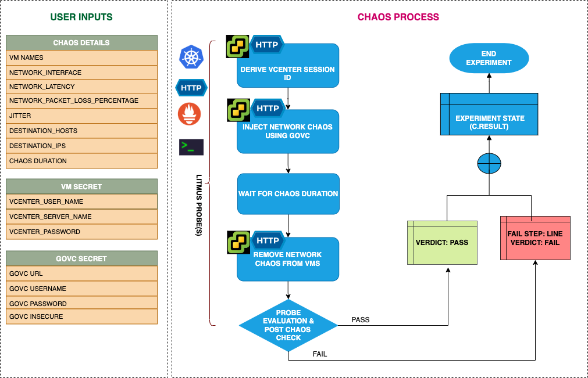

## Introduction
- It causes flaky access to the application/services by injecting network packet loss from VMware vm(s).
- It helps to check the performance of the application/process running on the VMWare VMs.

:::tip Fault execution flow chart

:::

## Uses
<details>
<summary>View the uses of the fault</summary>
<div>
The fault causes network degradation without the VM being marked unhealthy/unworthy of traffic. The idea of this fault is to simulate issues within your vm network OR microservice communication across services in different hosts etc.

Mitigation (in this case keep the timeout i.e., network loss percentage low) could be via some middleware that can switch traffic based on some SLOs/perf parameters. If such an arrangement is not available the next best thing would be to verify if such a degradation is highlighted via notification/alerts etc,. so the admin/SRE has the opportunity to investigate and fix things. Another utility of the test would be to see what the extent of impact caused to the end-user OR the last point in the app stack on account of degradation in access to a downstream/dependent microservice. Whether it is acceptable OR breaks the system to an unacceptable degree. The fault provides DESTINATION_IPS or DESTINATION_HOSTS so that you can control the chaos against specific services within or outside the vm.

The vm may stall or get corrupted while they wait endlessly for a packet. The fault limits the impact (blast radius) to only the traffic you want to test by specifying IP addresses or application information. This fault will help to improve the resilience of your services over time
</div>
</details>

## Prerequisites
:::info
- Ensure that Kubernetes Version > 1.16
- Ensure that you have sufficient Vcenter access to stop and start the VM.
- Ensure to create a Kubernetes secret having the Vcenter credentials in the `CHAOS_NAMESPACE`. A secret file looks like:
```yaml
apiVersion: v1
kind: Secret
metadata:
  name: vcenter-secret
  namespace: litmus
type: Opaque
stringData:
    VCENTERSERVER: XXXXXXXXXXX
    VCENTERUSER: XXXXXXXXXXXXX
    VCENTERPASS: XXXXXXXXXXXXX
```

### NOTE
You can pass the VM credentials as secrets or as an ChaosEngine ENV variable.
:::


## Default Validations
:::info
- VM should be in healthy state before and after chaos.
:::

## Fault Tunables
<details>
    <summary>Check the Fault Tunables</summary>
    <h2>Mandatory Fields</h2>
    <table>
      <tr>
        <th> Variables </th>
        <th> Description </th>
        <th> Notes </th>
      </tr>
      <tr>
        <td> VM_NAMES </td>
        <td> Provide the target vm names</td>
        <td> You can provide multiple vm names using comma separated value eg: vm-1,vm-2 </td>
      </tr>
      <tr>
        <td> VM_USER_NAME </td>
        <td> Provide the username of the target VM(s)</td>
        <td> Multiple usernames can be provided as comma separated (for more than one VM under chaos). It is used to run the govc command.</td>
      </tr>
      <tr>
        <td> VM_PASSWORD </td>
        <td> Provide the password for the target VM(s)</td>
        <td> It is used to run the govc command.</td>
      </tr>
    </table>
    <h2>Optional Fields</h2>
    <table>
      <tr>
        <th> Variables </th>
        <th> Description </th>
        <th> Notes </th>
      </tr>
      <tr>
        <td> TOTAL_CHAOS_DURATION </td>
        <td> The total time duration for chaos insertion (sec) </td>
        <td> Defaults to 30s </td>
      </tr>
      <tr>
        <td> CHAOS_INTERVAL </td>
        <td> The interval (in sec) between successive instance termination </td>
        <td> Defaults to 30s </td>
      </tr>
      <tr>
        <td> NETWORK_PACKET_LOSS_PERCENTAGE </td>
        <td> The packet loss in percentage </td>
        <td> Default to 100 percentage </td>
      </tr>
      <tr>
        <td> DESTINATION_IPS </td>
        <td> IP addresses of the services or the CIDR blocks(range of IPs), the accessibility to which is impacted </td>
        <td> Comma separated IP(S) or CIDR(S) can be provided. if not provided, it will induce network chaos for all ips/destinations </td>
      </tr>
      <tr>
        <td> DESTINATION_HOSTS </td>
        <td> DNS Names of the services, the accessibility to which, is impacted </td>
        <td> if not provided, it will induce network chaos for all ips/destinations or DESTINATION_IPS if already defined </td>
      </tr>
      <tr>
        <td> SEQUENCE </td>
        <td> It defines sequence of chaos execution for multiple instance </td>
        <td> Default value: parallel. Supported: serial, parallel </td>
      </tr>
      <tr>
        <td> RAMP_TIME </td>
        <td> Period to wait before and after injection of chaos in sec </td>
        <td> Eg. 30 </td>
      </tr>
    </table>
    <h2>Secret Fields</h2>
     <table>
      <tr>
        <th> Variables </th>
        <th> Description </th>
        <th> Notes </th>
      </tr>
      <tr>
        <td> GOVC_URL </td>
        <td> Provide the VMCenter Server URL</td>
        <td> It is used to perform the VMware API calls using govc command and is derived from secret.</td>
      </tr>
      <tr>
        <td> GOVC_USERNAME </td>
        <td> Provide the username of VMCenter Server</td>
        <td> It is used for auth purpose and this ENV is setup using secret.</td>
      </tr>
      <tr>
        <td> GOVC_PASSWORD </td>
        <td> Provide the password of VMCenter Server</td>
        <td> It is used for auth purpose and this ENV is setup using secret.</td>
      </tr>
      <tr>
        <td> GOVC_INSECURE </td>
        <td> Provide the value as <code>true</code> </td>
        <td> It is used to run the govc in insecure mode and this ENV is setup using secret.</td>
      </tr>
     </table>
</details>

## Fault Examples

### Common Fault Tunables
Refer the [common attributes](../common-tunables-for-all-faults) to tune the common tunables for all the faults.

### Network Packet Loss

It defines the network packet loss percentage to be injected on the vm. It can be tuned via `NETWORK_PACKET_LOSS_PERCENTAGE` ENV.

Use the following example to tune this:

[embedmd]:# (./static/manifests/vmware-network-loss/network-packet-loss-percentage.yaml yaml)
```yaml
apiVersion: litmuschaos.io/v1alpha1
kind: ChaosEngine
metadata:
  name: vmware-engine
spec:
  engineState: "active"
  chaosServiceAccount: litmus-admin
  experiments:
  - name: vmware-network-loss
    spec:
      components:
        env:
        # network packet loss percentage
        - name: NETWORK_PACKET_LOSS_PERCENTAGE
          value: '100'
        - name: VM_NAME
          value: 'vm-1,vm-2'
        - name: VM_USER_NAME
          value: 'ubuntu,debian'
        - name: VM_PASSWORD
          value: '123,123'
```

### Run With Destination IPs And Destination Hosts

The network faults interrupt traffic for all the IPs/hosts by default. The interruption of specific IPs/Hosts can be tuned via `DESTINATION_IPS` and `DESTINATION_HOSTS` ENV.

`DESTINATION_IPS`: It contains the IP addresses of the services or the CIDR blocks(range of IPs), the accessibility to which is impacted.
`DESTINATION_HOSTS`: It contains the DNS Names of the services, the accessibility to which, is impacted

Use the following example to tune this:

[embedmd]:# (./static/manifests/vmware-network-loss/destination-host-and-ip.yaml yaml)
```yaml
## it injects the chaos for the egress traffic for specific ips/hosts
apiVersion: litmuschaos.io/v1alpha1
kind: ChaosEngine
metadata:
  name: vmware-engine
spec:
  engineState: "active"
  chaosServiceAccount: litmus-admin
  experiments:
  - name: vmware-network-loss
    spec:
      components:
        env:
        # supports comma separated destination ips
        - name: DESTINATION_IPS
          value: '8.8.8.8,192.168.5.6'
        # supports comma separated destination hosts
        - name: DESTINATION_HOSTS
          value: 'google.com'
        - name: VM_NAME
          value: 'vm-1,vm-2'
        - name: VM_USER_NAME
          value: 'ubuntu,debian'
        - name: VM_PASSWORD
          value: '123,123'
```

###  Network Interface

The defined name of the ethernet interface, which is considered for shaping traffic. It can be tuned via `NETWORK_INTERFACE` ENV. Its default value is `eth0`.

Use the following example to tune this:

[embedmd]:# (./static/manifests/vmware-network-loss/network-interface.yaml yaml)
```yaml
## it injects the chaos for the egress traffic for specific ips/hosts
apiVersion: litmuschaos.io/v1alpha1
kind: ChaosEngine
metadata:
  name: vmware-engine
spec:
  engineState: "active"
  chaosServiceAccount: litmus-admin
  experiments:
  - name: vmware-network-loss
    spec:
      components:
        env:
        # name of the network interface
        - name: NETWORK_INTERFACE
          value: 'eth0'
        - name: VM_NAME
          value: 'vm-1,vm-2'
        - name: VM_USER_NAME
          value: 'ubuntu,debian'
        - name: VM_PASSWORD
          value: '123,123'
```
