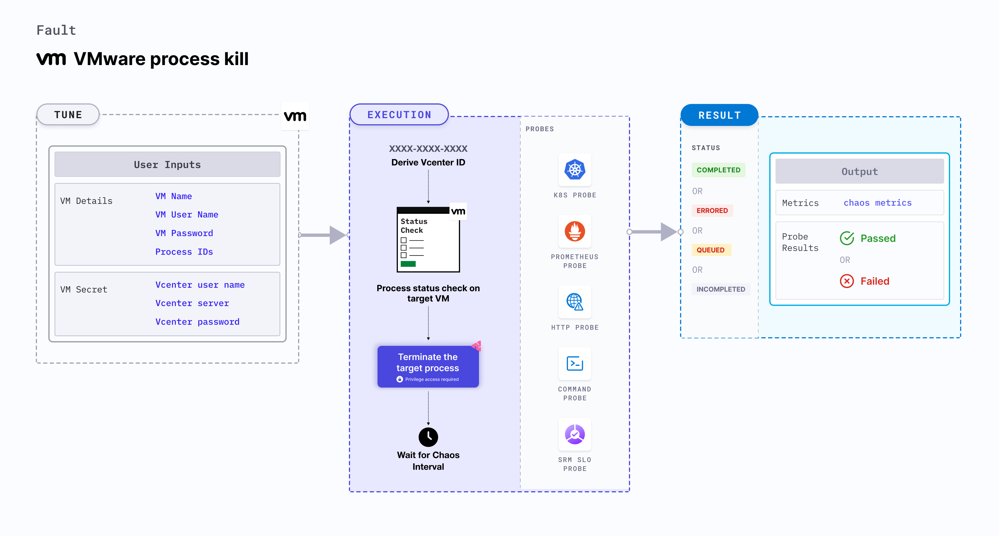

## Introduction
- VMware Process Kill fault kills the target processes running as part of a Linux OS based VMware VM to determine the application/process resilience.
- It helps to check the performance of the application/process running on the VMWare VMs.

:::tip Fault execution flow chart

:::

## Uses
<details>
<summary>View the uses of the fault</summary>
<div>
Disrupt the application critical processes such as databases or message queues running in the VMware VM by killing their underlying processes or threads.
</div>
</details>

## Prerequisites
:::info
- Ensure that Kubernetes Version > 1.16

** vCenter Requirements **
- Ensure the connectivity of execution plane with vCenter and the hosts over 443 port. 
- Ensure that VMware tool is installed on the target VM with remote execution enabled.
- Ensure that you have sufficient vCenter permission to access hosts and VMs.
- Ensure to create a Kubernetes secret having the Vcenter credentials in the `CHAOS_NAMESPACE`. A sample secret file looks like:
```yaml
apiVersion: v1
kind: Secret
metadata:
  name: vcenter-secret
  namespace: litmus
type: Opaque
stringData:
    VCENTERSERVER: XXXXXXXXXXX
    VCENTERUSER: XXXXXXXXXXXXX
    VCENTERPASS: XXXXXXXXXXXXX
```

### NOTE
You can pass the VM credentials as secrets or as an ChaosEngine ENV variable.
:::


## Default Validations
:::info
- VM should be in healthy state.
- The target processes should exist in the VM.
:::

## Fault Tunables
<details>
    <summary>Check the Fault Tunables</summary>
    <h2>Mandatory Fields</h2>
    <table>
      <tr>
        <th> Variables </th>
        <th> Description </th>
        <th> Notes </th>
      </tr>
      <tr>
        <td> VM_NAME </td>
        <td> Name of the VM in which the target processes reside </td>
        <td> ubuntu-vm-1 </td>
      </tr>
      <tr>
        <td> PROCESS_IDS </td>
        <td> Process IDs of the target processes provided as comma separated values </td>
        <td> 183,253,857 </td>
      </tr>
    </table>
    <h2>Optional Fields</h2>
    <table>
      <tr>
        <th> Variables </th>
        <th> Description </th>
        <th> Notes </th>
      </tr>
      <tr>
        <td> TOTAL_CHAOS_DURATION </td>
        <td> The total time duration for chaos insertion (sec) </td>
        <td> Defaults to 30s </td>
      </tr>
      <tr>
        <td> RAMP_TIME </td>
        <td> Period to wait before and after injection of chaos in sec </td>
        <td> Eg. 30 </td>
      </tr>
    </table>
</details>

## Fault Examples

### Common Fault Tunables
Refer the [common attributes](../common-tunables-for-all-faults) to tune the common tunables for all the faults.

### PROCESS_IDS
It contains the target process Ids running on a particular VM


Use the following example to tune this:

[embedmd]:# (./static/manifests/vmware-process-kill/vmware-process-kill.yaml yaml)
```yaml
# Process kill in the VMWare VM
apiVersion: litmuschaos.io/v1alpha1
kind: ChaosEngine
metadata:
  name: engine-nginx
spec:
  engineState: "active"
  chaosServiceAccount: litmus-admin
  experiments:
    - name: vmware-process-kill
      spec:
        components:
          env:
            # Name of the VM
            - name: VM_NAME
              value: 'test-vm-01'
            # List of Process IDs
            - name: PROCESS_IDS
              value: '8688,4678'
```
