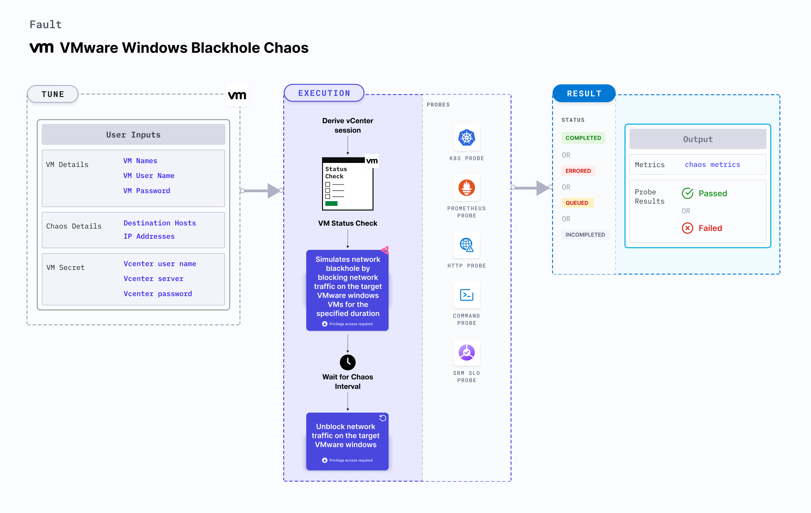

VMware Windows blackhole chaos simulates a network blackhole scenario on Windows OS based VMware VM. It checks the performance of the application running on the VMware Windows VMs under network blackhole conditions.



## Use cases
VMware Windows blackhole chaos
- Determines the resilience of an application when a network blackhole scenario is simulated on a VMware Windows virtual machine.
- Simulates the situation of network isolation for processes running on the application, which degrades their performance.
- Helps verify the application's ability to handle network failures and its failover mechanisms.

### Prerequisites
- Kubernetes > 1.16 is required to execute this fault.
- Execution plane should be connected to vCenter and host vCenter on port 443.
- VMware tool should be installed on the target VM with remote execution enabled.
- Adequate vCenter permissions should be provided to access the hosts and the VMs.
- Ensure the firewall is active and permissions to modify its rules are granted. Consider using the built-in Administrator user. [Learn how to enable it in Windows](https://learn.microsoft.com/en-us/windows-hardware/manufacture/desktop/enable-and-disable-the-built-in-administrator-account?view=windows-11).
- The VM should be in a healthy state before and after injecting chaos.
- Kubernetes secret has to be created that has the Vcenter credentials in the `CHAOS_NAMESPACE`.
- VM credentials can be passed as secrets or as a chaos engine environment variable.

```yaml
apiVersion: v1
kind: Secret
metadata:
  name: vcenter-secret
  namespace: litmus
type: Opaque
stringData:
    VCENTERSERVER: XXXXXXXXXXX
    VCENTERUSER: XXXXXXXXXXXXX
    VCENTERPASS: XXXXXXXXXXXXX
```

### Mandatory tunables

   <table>
      <tr>
        <th> Tunable </th>
        <th> Description </th>
        <th> Notes </th>
      </tr>
      <tr>
        <td> VM_NAME </td>
        <td> Name of the target VM. </td>
        <td> For example, <code>win-vm-1</code> </td>
      </tr>
      <tr>
          <td> VM_USER_NAME </td>
          <td> Username of the target VM.</td>
          <td> For example, <code>vm-user</code>. </td>
      </tr>
      <tr>
          <td> VM_PASSWORD </td>
          <td> User password for the target VM. </td>
          <td> For example, <code>1234</code>. Note: You can take the password from secret as well. </td>
      </tr>
    </table>

### Optional tunables

   <table>
      <tr>
        <th> Tunable </th>
        <th> Description </th>
        <th> Notes </th>
      </tr>
      <tr>
        <td> DESTINATION_HOSTS </td>
        <td> Comma separated list of destination hosts to block. </td>
        <td> For example, <code>github.com,harness.io</code>. For more information, go to <a href="#destination-hosts"> destination hosts. </a> </td>
      </tr>
      <tr>
        <td> IP_ADDRESSES </td>
        <td> Comma separated list of IP addresses to block. </td>
        <td> For example, <code>10.0.0.1,10.0.0.2</code>. For more information, go to <a href="#ip-addresses"> IP addresses. </a> </td>
      </tr>
      <tr>
        <td> TOTAL_CHAOS_DURATION </td>
        <td> Duration that you specify, through which chaos is injected into the target resource (in seconds).</td>
        <td> Default: 60 s. For more information, go to <a href="/docs/chaos-engineering/chaos-faults/common-tunables-for-all-faults#duration-of-the-chaos"> duration of the chaos. </a></td>
      </tr>
      <tr>
        <td> RAMP_TIME </td>
        <td> Period to wait before and after injecting chaos (in seconds). </td>
        <td> Default: 0 s. For more information, go to <a href="/docs/chaos-engineering/chaos-faults/common-tunables-for-all-faults#ramp-time"> ramp time. </a> </td>
      </tr>
      <tr>
        <td> SEQUENCE </td>
        <td> Sequence of chaos execution for multiple instances. </td>
        <td> Default: parallel. Supports parallel and serial sequence. For more information, go to <a href="/docs/chaos-engineering/chaos-faults/common-tunables-for-all-faults#sequence-of-chaos-execution"> sequence of chaos execution.</a></td>
      </tr>
      <tr>
      <td>DEFAULT_HEALTH_CHECK</td>
      <td>Determines if you wish to run the default health check which is present inside the fault. </td>
      <td> Default: 'true'. For more information, go to <a href="/docs/chaos-engineering/chaos-faults/common-tunables-for-all-faults#default-health-check"> default health check.</a></td>
      </tr>
    </table>

### Destination hosts
The `DESTINATION_HOSTS` environment variable specifies the destination hosts to block on the target Windows VM.

Use the following example to specify destination hosts:

[embedmd]:# (./static/manifests/vmware-windows-blackhole-chaos/vm-blackhole-chaos-destination-hosts.yaml yaml)
```yaml
apiVersion: litmuschaos.io/v1alpha1
kind: ChaosEngine
metadata:
  name: engine-nginx
spec:
  engineState: "active"
  chaosServiceAccount: litmus-admin
  experiments:
  - name: vmware-windows-blackhole-chaos
    spec:
      components:
        env:
        # Name of the VM
        - name: VM_NAME
          value: 'test-vm-01'
       # Destination hosts to block
        - name: DESTINATION_HOSTS
          value: 'github.com'
```

### IP addresses
The `IP_ADDRESSES` environment variable specifies the IP addresses to block on the target Windows VM.

Use the following example to specify IP addresses:

[embedmd]:# (./static/manifests/vmware-windows-blackhole-chaos/vm-blackhole-chaos-ip-addresses.yaml yaml)

```yaml
apiVersion: litmuschaos.io/v1alpha1
kind: ChaosEngine
metadata:
  name: engine-nginx
spec:
  engineState: "active"
  chaosServiceAccount: litmus-admin
  experiments:
  - name: vmware-windows-blackhole-chaos
    spec:
      components:
        env:
        # Name of the VM
        - name: VM_NAME
          value: 'test-vm-01'
       # IP addresses to block
        - name: IP_ADDRESSES
          value: '10.0.0.1,10.0.0.2'
```
