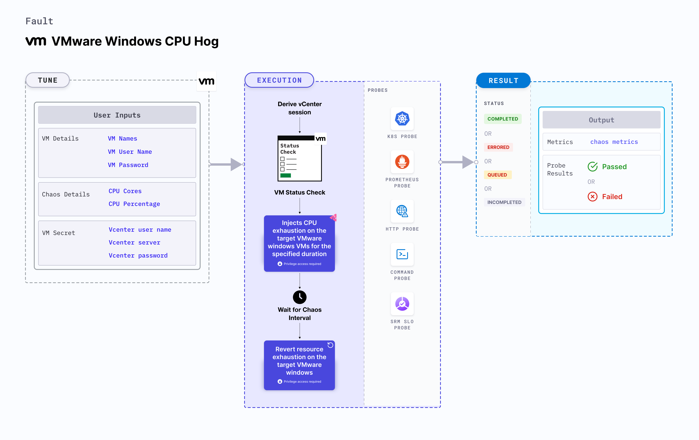

VMware windows CPU hog applies stress on the CPU resources on Windows OS based VMware VM.
- It checks the performance of the application running on the VMware windows VMs.



## Use cases

- VMware windows CPU hog determines the resilience of an application when stress is applied on the CPU resources of a VMware windows virtual machine.
- VMware windows CPU hog simulates the situation of lack of CPU for processes running on the application, which degrades their performance. 
- It also helps verify metrics-based horizontal pod autoscaling as well as vertical autoscale, that is, demand based CPU addition. 
- It verifies the autopilot functionality of cloud managed clusters.

:::note
- Kubernetes > 1.16 is required to execute this fault.
- Execution plane should be connected to vCenter and host vCenter on port 443. 
- VMware tool should be installed on the target VM with remote execution enabled.
- Adequate vCenter permissions should be provided to access the hosts and the VMs.
- The VM should be in a healthy state before and after injecting chaos.
- Kubernetes secret has to be created that has the Vcenter credentials in the `CHAOS_NAMESPACE`. VM credentials can be passed as secrets or as a 
```yaml
apiVersion: v1
kind: Secret
metadata:
  name: vcenter-secret
  namespace: litmus
type: Opaque
stringData:
    VCENTERSERVER: XXXXXXXXXXX
    VCENTERUSER: XXXXXXXXXXXXX
    VCENTERPASS: XXXXXXXXXXXXX
```

### Note
You can pass the VM credentials as secrets or as a `ChaosEngine` environment variable.


## Default validations
The VM should be in a healthy state.

:::

## Fault tunables

   <h3>Mandatory fields</h3>
    <table>
      <tr>
        <th> Variables </th>
        <th> Description </th>
        <th> Notes </th>
      </tr>
      <tr>
        <td> VM_NAME </td>
        <td> Name of the target VM. </td>
        <td> For example, <code>ubuntu-vm-1</code> </td>
      </tr>
    </table>
    <h3>Optional fields</h3>
    <table>
      <tr>
        <th> Variables </th>
        <th> Description </th>
        <th> Notes </th>
      </tr>
      <tr>
        <td> CPU_CORES </td>
        <td> Number of CPU cores subject to CPU stress. </td>
        <td> Default to 0 that means it consume all the avaialble CPU resources. For more information, go to <a href="https://developer.harness.io/docs/chaos-engineering/chaos-faults/vmware/vmware-cpu-hog#cpu_cores"> CPU cores.</a></td>
        </tr>
      <tr>
        <td> TOTAL_CHAOS_DURATION </td>
        <td> Duration that you specify, through which chaos is injected into the target resource (in seconds).</td>
        <td> Defaults to 60s. For more information, go to <a href="https://developer.harness.io/docs/chaos-engineering/chaos-faults/common-tunables-for-all-faults#duration-of-the-chaos"> duration of the chaos. </a></td>
      </tr>
      <tr>
        <td> RAMP_TIME </td>
        <td> Period to wait before and after injecting chaos (in seconds). </td>
        <td> For example, 30s. For more information, go to <a href="https://developer.harness.io/docs/chaos-engineering/chaos-faults/common-tunables-for-all-faults#ramp-time"> ramp time. </a></td>
      </tr>
      <tr>
        <td> SEQUENCE </td>
        <td> Sequence of chaos execution for multiple instances. </td>
        <td> Defaults to parallel. Supports serial sequence as well. For more information, go to <a href="https://developer.harness.io/docs/chaos-engineering/chaos-faults/common-tunables-for-all-faults#sequence-of-chaos-execution"> sequence of chaos execution.</a></td>
      </tr>
    </table>


### CPU_CORES
It stresses the `CPU_CORE` of the target windows VM for the duration defined by the `TOTAL_CHAOS_DURATION` environment variable. If 0 core is provided in input then will consume all the available CPU resources.

Use the following example to tune it:

[embedmd]:# (./static/manifests/vmware-windows-cpu-hog/vm-cpu-hog-core.yaml yaml)
```yaml
# CPU hog in the VMware VM
apiVersion: litmuschaos.io/v1alpha1
kind: ChaosEngine
metadata:
  name: engine-nginx
spec:
  engineState: "active"
  chaosServiceAccount: litmus-admin
  experiments:
  - name: vmware-windows-cpu-hog
    spec:
      components:
        env:
        # Name of the VM
        - name: VM_NAME
          value: 'test-vm-01'
       # CPU cores for stress
        - name: CPU_CORES 
          value: '1'
```
