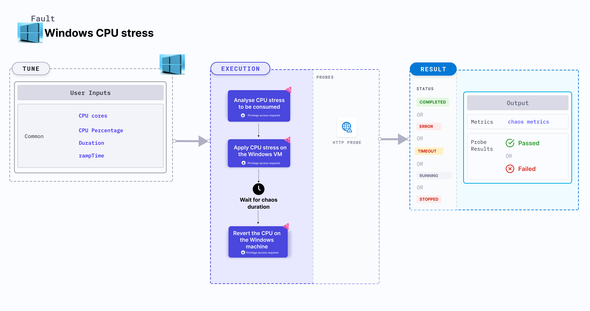

Windows CPU stress applies stress on the CPU resources of Windows OS VM.
- It checks the performance of the application running on the Windows VMs.



## Use cases

- Windows CPU stress determines the resilience of an application when stress is applied on the CPU resources of Windows VM.
- Windows CPU stress simulates the situation of lack of CPU for processes running on the application, which degrades their performance.
- It helps verify metrics-based horizontal pod autoscaling as well as vertical autoscale, that is, demand based CPU addition.
- It verifies the autopilot functionality of cloud managed clusters.

## Prerequisites
- Ensure that the [prerequisites](/docs/chaos-engineering/chaos-faults/windows/prerequisites) are fulfilled before executing the experiment.

### Mandatory tunables

   <table>
      <tr>
        <th> Tunable </th>
        <th> Description </th>
        <th> Notes </th>
      </tr>
      <tr>
        <td> CPU_CORES </td>
        <td> Number of CPU cores subject to CPU stress. </td>
        <td> <code>CPU_CORES</code> and <code>CPU_PERCENTAGE</code> are mututally exclusive, and if values for both there tunables are provided, the latter takes precedence. For example,  if <code>CPU_CORES</code> is 1 and <code>CPU_PERCENTAGE</code> is 0, one of the cores are stressed. For more information, go to <a href="#cpu-cores">CPU cores</a>.</td>
      </tr>
      <tr>
          <td> CPU_PERCENTAGE </td>
          <td> Percentage of CPU core that is consumed.</td>
          <td> <code>CPU_CORES</code> and <code>CPU_PERCENTAGE</code> are mututally exclusive, and if values for both there tunables are provided, the latter takes precedence. For example, if <code>CPU_CORES</code> is 1 and <code>CPU_PERCENTAGE</code> is 50, 50 percent of the resources are stressed. For more information, go to <a href="#cpu-percentage">CPU percentage</a>.</td>
      </tr>
     <tr>
        <td> TOTAL_CHAOS_DURATION </td>
        <td> Duration that you specify, through which chaos is injected into the target resource (in seconds).</td>
        <td> Default: 60s. For more information, go to <a href="/docs/chaos-engineering/chaos-faults/common-tunables-for-all-faults#duration-of-the-chaos">duration of the chaos</a>.</td>
      </tr>
    </table>

### Optional tunables
   <table>
      <tr>
        <th> Tunable </th>
        <th> Description </th>
        <th> Notes </th>
      </tr>
      <tr>
        <td> RAMP_TIME </td>
        <td> Period to wait before and after injecting chaos (in seconds). </td>
        <td> For example, 30s. For more information, go to <a href="/docs/chaos-engineering/chaos-faults/common-tunables-for-all-faults#ramp-time"> ramp time. </a></td>
      </tr>
    </table>


### CPU cores
The `CPU_CORE` environment variable applies stress on the target Windows VM for a specific duration. If the variable is set to `0`, the fault consumes all the available CPU resources.

Following YAML snippet illustrates the use of this input variable.

[embedmd]:# (./static/manifests/windows-cpu-stress/win-cpu-stress-core.yaml yaml)
```yaml
# CPU hog in the Windows VM
apiVersion: litmuschaos.io/v1alpha1
kind: MachineChaosExperiment
metadata:
  infraType: "windows"
spec:
  engineState: "active"
  steps:
    - - name: windows-cpu-stress
  tasks:
    - name: windows-cpu-stress
      infraId: ""
      definition:
        chaos:
          fault: windows-cpu-stress
          env:
           # CPU cores for stress
            - name: CPU_CORES
              value: '1'
```

### CPU percentage
The `CPU_PERCENTAGE` environment variable specifies the percentage of stress applied on the target Windows VM for a specific duration. If the variable is set to `0`, the fault consumes all the available CPU cores.

Following YAML snippet illustrates the use of this input variable.

[embedmd]:# (./static/manifests/windows-cpu-stress/win-cpu-stress-perc.yaml yaml)
```yaml
# CPU hog in the Windows VM
apiVersion: litmuschaos.io/v1alpha1
kind: MachineChaosExperiment
metadata:
  name: windows-cpu-stress
spec:
  infraType: "windows"
  steps:
    - - name: windows-cpu-stress
  tasks:
    - name: windows-cpu-stress
      infraId: ""
      definition:
        chaos:
          fault: windows-cpu-stress
          env:
           # CPU cores for stress
            - name: CPU_PERCENTAGE
              value: '50'
```

:::info note
If both `CPU_CORE` and `CPU_PERCENTAGE` are set to 0, no stress is applied on any of the Windows machine resources.
:::