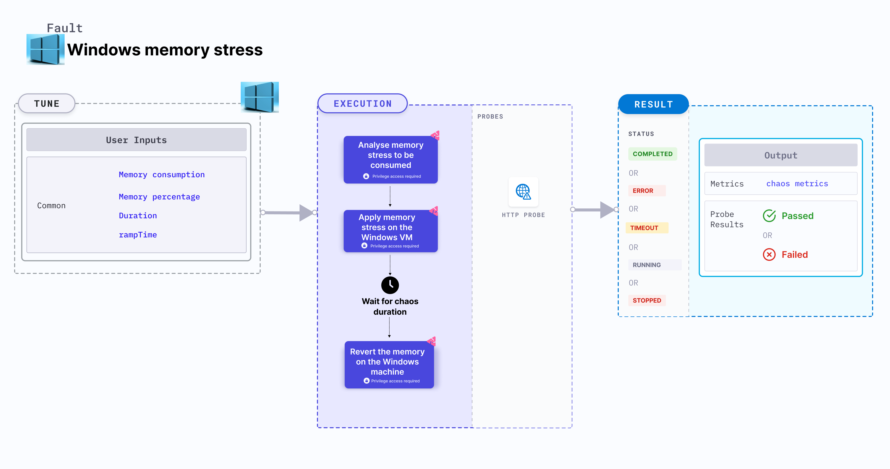

Windows memory stress applies stress on the memory resources of a Windows OS based VM.
- It checks the performance of the application running on the Windows VMs.



## Use cases

- Windows memory stress determines the resilience of an application when stress is applied on the memory resources of a Windows VM.
- It simulates the situation of lack of memory for processes running on the application, which degrades their performance. 
- It verifies the autopilot functionality of services or application on the VM.

### Prerequisites
- Ensure that the [prerequisites](/docs/chaos-engineering/chaos-faults/windows/prerequisites) are fulfilled before executing the experiment.

### External packages
This fault uses [Testlimit](https://learn.microsoft.com/en-us/sysinternals/downloads/testlimit), which is installed as part of the infrastructure installation.

### Mandatory tunables

   <table>
      <tr>
        <th> Tunable </th>
        <th> Description </th>
        <th> Notes </th>
      </tr>
      <tr>
        <td> MEMORY_CONSUMPTION </td>
        <td> Amount of memory to consume in MB. </td>
        <td> Default: 0. For more information, go to <a href="#memory-consumption-and-percentage"> memory consumption.</a></td>
      </tr>
      <tr>
        <td> MEMORY_PERCENTAGE </td>
        <td> Percentage of total memory to consume. </td>
        <td> Default: 50. For more information, go to <a href="#memory-consumption-and-percentage"> memory percentage.</a></td>
      </tr>
      <tr>
        <td> TOTAL_CHAOS_DURATION </td>
        <td> Duration that you specify, through which chaos is injected into the target resource (in seconds).</td>
        <td> Default: 60s. For more information, go to <a href="/docs/chaos-engineering/chaos-faults/common-tunables-for-all-faults#duration-of-the-chaos"> duration of the chaos. </a></td>
      </tr>
    </table>

### Optional tunables
   <table>
      <tr>
        <th> Tunable </th>
        <th> Description </th>
        <th> Notes </th>
      </tr>
      <tr>
        <td> RAMP_TIME </td>
        <td> Period to wait before and after injecting chaos (in seconds). </td>
        <td> For example, 30 s. For more information, go to <a href="/docs/chaos-engineering/chaos-faults/common-tunables-for-all-faults#ramp-time"> ramp time. </a></td>
      </tr>
    </table>

### Memory consumption and percentage
* `MEMORY_CONSUMPTION` environment variable describes the specific amount of stress to be applied on the target Windows VM (in MB) for a specific duration.
* `MEMORY_PERCENTAGE` environment variable describes the percentage of total memory that is to be consumed on the target Windows VM for a specific duration.

Following YAML snippet illustrates the use of this input variable.

[embedmd]:# (./static/manifests/windows-memory-stress/memory-consumption-perc.yaml yaml)
```yaml
apiVersion: litmuschaos.io/v1alpha1
kind: MachineChaosExperiment
metadata:
  name: windows-memory-stress-4ap
  labels:
    context: windows-memory-stress
    name: windows-memory-stress-4ap
spec:
  infraType: "windows"
  steps:
    - - name: windows-memory-stress-4ap
  tasks:
    - name: windows-memory-stress-4ap
      infraId: ""
      definition:
        chaos:
          fault: windows-memory-stress
          env:
            - name: MEMORY_CONSUMPTION
              value: ""
            - name: MEMORY_PERCENTAGE
              value: "50"
            - name: DURATION
              value: "30s"
            - name: RAMP_TIME
              value: ""
```
