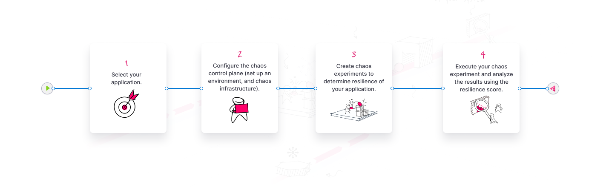

import Tabs from '@theme/Tabs';
import TabItem from '@theme/TabItem';

Welcome to Harness Chaos Engineering (HCE)!

This topic provides you with all the details such as **what**, **why**, and **how** of chaos engineering, such as:

1. [What is chaos engineering?](#what-is-chaos-engineering)
2. [Why is chaos engineering important?](#why-is-chaos-engineering-important)
3. [What are the advantages of HCE](#benefits-of-hce)
4. [Implement Chaos engineering to improve the resilience of your application](#how-to-implement-chaos-engineering)

## Introduction

Cloud-native applications are distributed, elastic, and resilient in nature, but their complexity introduces multiple potential points of failure. To ensure these systems perform reliably under various conditions, it is crucial to test their robustness. This is where chaos engineering comes in.

## What is chaos engineering?

Chaos engineering is a proactive approach that intentionally injects failures into your system to identify weaknesses and improve resilience before the real issues occur. The consensus is that something **will** go wrong in an application, so it would be better to practice what actions to take when something goes wrong and ensure that everything recovers.

A **formal definition** is: _"Chaos engineering is the discipline of performing experiments on software to build confidence in the system's capability to withstand turbulent and unexpected conditions. Failures are intentionally injected into applications to build resilience. By proactively introducing controlled chaos into systems, you can identify weaknesses in your application and prevent catastrophic failures."_

:::tip
Chaos engineering isn't the same as software testing (manual or automated) which verifies that your system is working as expected.
:::

## Why is chaos engineering important?

In the current landscape of fast-paced technology, system failures have a significant impact on businesses, customers, and stakeholders. Chaos engineering is a way to identify potential issues before they become major problems, helping organizations minimize downtime, mitigate risks, and improve reliability.

Chaos engineering targets a steady-state system and simulates conditions that might cause failures in components such as infrastructure, networks, and services. For example, a [chaos experiment](/docs/chaos-engineering/use-harness-ce/experiments/) might terminate a pod in a functional Kubernetes cluster, shut down a working load balancer to validate failover, or induce CPU spikes on a server, and then observe how the system responds.

### Shift left chaos engineering

The initial principles of chaos engineering recommend performing experiments in production, which is relevant and encouraged. This approach validates resilience beforehand, acting as a quality gate for larger deployment environments. The need to build confidence in a highly dynamic environment—where application services and infrastructure undergo frequent and independent upgrades—accelerates this process. The resulting paradigm includes:

- Increased ad-hoc and exploratory chaos testing by application developers and QA teams;
- Automating chaos experiments within continuous delivery (CD) pipelines.

## How to implement chaos engineering?

You can build resilient applications by following the steps below:

1. **Choose** or **build** your application;
2. **Configure** the **chaos control plane**, that is:
    1. Set up an **environment**;
    2. Set up a **chaos infrastructure**;
3. **Create chaos experiments** in your application;
4. **Execute** the chaos experiments;
5. **Analyze** the result.

The practice of chaos engineering involves repeatedly performing experiments by injecting various potential failures, known as [chaos faults](/docs/chaos-engineering/use-harness-ce/experiments/#chaos-fault), to simulate real-world failure conditions against different resources, referred to as **targets**.

Harness Chaos Engineering (HCE) simplifies the chaos engineering practices for your organization. HCE is built on open-source CNCF chaos engineering project [LitmusChaos](https://litmuschaos.io/). It leverages the robustness of LitmusChaos and provides additional capabilities that makes chaos engineering an easy practice for enterprises. The additional capabilities are listed [here](/docs/chaos-engineering/getting-started/#hce-and-litmuschaos).

The diagram below outlines the steps you can take to introduce chaos into an application.

## Chaos engineering flow of control

You can define the steps through which you inject different kinds of failures into your application. The standard flow involves the following steps:
1. Identify the steady state of the system or application under test and specify its service-level objectives (SLOs);
2. Hypothesize around the impact a particular fault or failure would cause;
3. Inject this failure (or chaos fault) in a controlled manner (with a pre-determined and minimal blast radius);
4. Validate whether the hypothesis is proven and if the system meets the SLOs, and take appropriate actions if a weakness is found.

## Benefits of HCE

HCE doesn't just focus on fault injection; it helps you set up a fully operational chaos function that is based on the original [principles of chaos](https://principlesofchaos.org/), and addresses several enterprise needs, including:

- **Cloud-Native Approach**: HCE supports a declarative definition of experiments and [Git-based chaos artifact sources](/docs/chaos-engineering/use-harness-ce/chaoshubs/add-chaos-hub) (chaos-experiments-as-code).

- **Extensive Fault Library**: HCE offers a robust suite of ready-to-use experiments and supports constructing complex custom experiments with [multiple faults](/docs/chaos-engineering/use-harness-ce/experiments/create-experiments#add-serial-and-parallel-faults) executed in the desired order.

- **Centralized Control Plane**: The platform supports a variety of targets, including [Kubernetes-based microservices](/docs/chaos-engineering/use-harness-ce/chaos-faults/kubernetes/), cloud services like [AWS](/docs/chaos-engineering/use-harness-ce/chaos-faults/aws/), [Azure](/docs/chaos-engineering/use-harness-ce/chaos-faults/azure/), [GCP](/docs/chaos-engineering/use-harness-ce/chaos-faults/gcp/), [Cloud Foundry](/docs/chaos-engineering/use-harness-ce/chaos-faults/cloud-foundry/), and [VMware](/docs/chaos-engineering/use-harness-ce/chaos-faults/vmware/) infrastructure.

- **Governance Enforcement**: HCE provides several mechanisms for governance:

    - **Dedicated Workspaces**: Isolate chaos experiments and resources for different teams or projects.
    - [**ChaosGuard**](/docs/chaos-engineering/use-harness-ce/governance/governance-in-execution/): Adds an additional security layer by executing a set of conditions before running chaos experiments.
    - **Chaos Teams**: Allows control over who can access and execute chaos experiments, ensuring that only authorized users interact with chaos resources.
    - **Access Control**: [Fine-grained permissions](/docs/chaos-engineering/use-harness-ce/governance/rbac#user-authorization-and-role-based-access-control) manage access to chaos infrastructure, the types of faults used, and the runtime permissions for executing experiments within target environments.

- **Native Integration with Harness Continuous Delivery (CD) Pipelines**: [Streamline chaos engineering into your CI/CD workflows](/docs/category/integrate-hce-with-harness-cd).

- **Hypothesis Validation and SLO Management**: Validate hypotheses using [probes](/docs/chaos-engineering/concepts/explore-concepts/resilience-probes/) and manage SLOs through integration with Harness Continuous Verification (CV).

- [**Guided GameDay Execution**](/docs/chaos-engineering/concepts/explore-concepts/GameDay): Detailed analytics and reporting based on experiment execution and application resilience.

- **Chaos Events, Metrics, and Logs**: Instrument APM (Application Performance Monitoring) [dashboards](/docs/chaos-engineering/use-harness-ce/dashboards/) with chaos context to monitor the impact of chaos faults on service/application health.

### Steps to Inject Chaos into your Application

1. [Fulfill the resource requirements or facilitate the permissions](/docs/chaos-engineering/getting-started/saas/): You can create resources or get the required permissions to create the necessary resources. For example, to execute a Kubernetes fault, you may need the permissions mentioned [here](/docs/chaos-engineering/use-harness-ce/chaos-faults/kubernetes/permissions/fault-wise-permission).

2. [Add an environment](/docs/chaos-engineering/use-harness-ce/infrastructures/enable-disable#create-environment): A chaos experiment is performed within a chaos environment that houses the necessary infrastructure.

3. [Enabling a chaos infrastructure](/docs/chaos-engineering/use-harness-ce/infrastructures/enable-disable#enable-chaos): The required chaos infrastructure is enabled within a chaos environment.

4. [Create and run a chaos experiment](/docs/chaos-engineering/use-harness-ce/experiments/create-experiments): You can decide which resources to target and execute the chaos experiments on.

#### Workflow Custom Resource (CR)

    It is used to define the number of operations that are coupled together in a specific sequence to achieve a desired chaos impact. These operations are chaos faults or any custom action associated with the experiment, such as load generation.

#### Chaos Manager

    A GraphQL-based Golang microservice that serves the requests received from the chaos infrastructure either by querying MongoDB for relevant information.

:::tip
A NoSQL MongoDB **database** microservice accountable for storing users' information, past chaos experiments, saved chaos experiment templates, user projects, ChaosHubs, and GitOps details, among other information.
:::

#### Chaos Exporter

    An optional constituent that exposes monitoring metrics such as QPS and others present on the cluster to the frontend.
    It facilitates external observability in HCE. You can achieve this by exporting the chaos metrics generated (during the chaos injection as time-series data) to the Prometheus database for processing and analysis.

### Components common to all Chaos Infrastructure

Some of the components common to all chaos infrastructures include:

- **Workflow controller**: Helps execute chaos experiments by:
    - Searching for the experiment on the cluster.
    - Identifying the experiment.
    - Triggering the experiment.

- **Subscriber**: Serves as a bridge between the execution plane and control plane. It also performs other tasks required to orchestrate the chaos experiment executions, such as:
    - Installing a new chaos experiment on the cluster.
    - Sending the experiment metadata (after completing the execution) to the control plane.
    - Performing health checks on all the components in the chaos execution plane.
    - Creating a chaos experiment CR from a chaos experiment template.
    - Monitoring the events associated with the chaos experiment during its execution.

#### Chaos Operator
Leverages the Kubernetes operator pattern to interpret the fault configuration, execute the individual faults in an experiment, execute the fault and its probes (if they have been defined), and populate the result after the execution.

#### Chaos Exporter
Optional component that facilitates external observability in HCE. This is achieved by exporting the chaos metrics generated during the chaos injection as time-series data to the Prometheus database for processing and analysis.

## Conclusion

Chaos engineering is a technique you can implement with all types of systems, including legacy applications and infrastructure. It is especially significant for cloud-native applications, which often have multiple points of failure due to their distributed and elastic nature.
By introducing constant chaos during the engineering phase and the production phase, you may come across issues and potential failure points that you never thought of.
By embracing chaos engineering, you can better prepare your applications to withstand unexpected disruptions and maintain seamless performance.

## Try Chaos Engineering today

* [Run your first chaos experiment](/docs/chaos-engineering/getting-started/saas/first-experiment)
* [Executing experiments in a sandbox](/docs/chaos-engineering/training/sandbox)
* [Create chaos experiments from scratch](/docs/chaos-engineering/getting-started/saas/chaos-experiment-from-blank-canvas)
