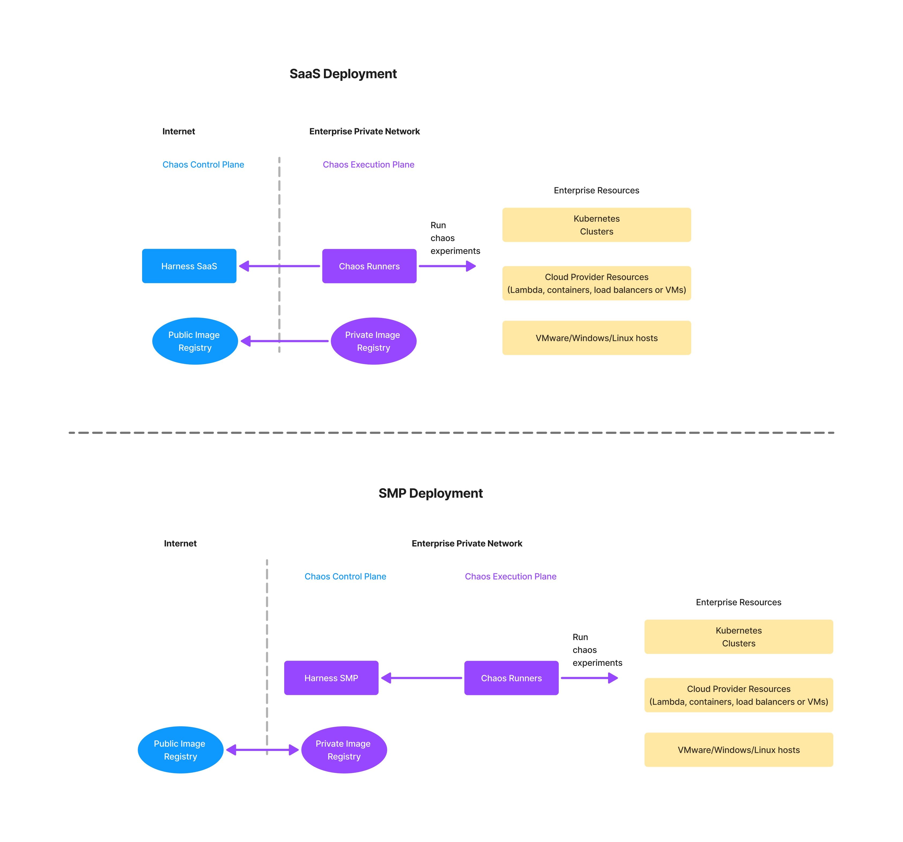
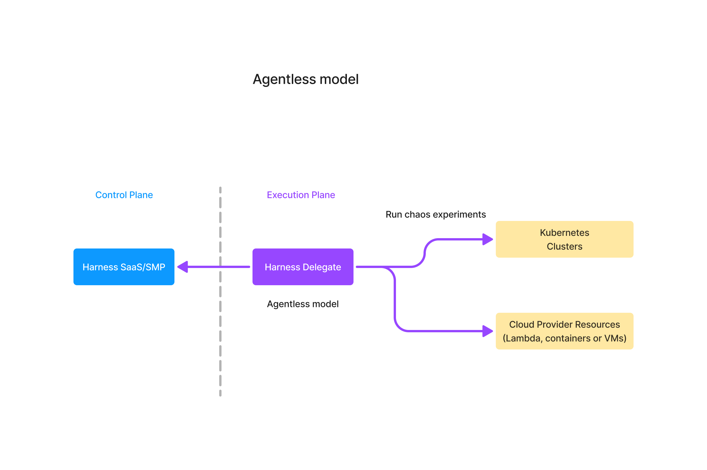
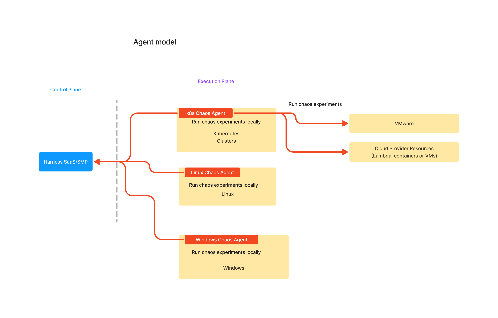

import Tabs from '@theme/Tabs';
import TabItem from '@theme/TabItem';

## Deployment models

Harness Chaos Engineering is a module on the Harness platfrom. Harness is offered as a SaaS or can be deployed on-premise that can be managed by the enterprise customers. The capabilities of Harness Chaos Engineering are same in either of the models - SaaS or On-Premise. The On-Premise version of Harness is called as Self-Managed-Platform or SMP.

In both the deployment models, the architecture is broadly classified into two parts:

1. **The Control Plane** that is part of the Harness Platform
2. **The Execution Plane** that resides in the enterprise's private or public network

In SaaS model, the chaos control plane of the customer is managed by Harness and the execution plane and the image artifact registry have to have connectivity to SaaS (app.harness.io). In the On-Premise model, the chaos control plane and the execution plane are inside the customer network, only the image artifact registry need to be updated from the public domain. 

## The execution plane

The execution plane is a logical group of components that reside in the customer's network which are responsible for running chaos experiments. Some of these components are long running and others are spawned dynamically at run time of the chaos experiment. The chaos experiments can be run on the target resources by a chaos agent residing on the target or by the Harness delegate residing somewhere in the customer network. 

### Agentless model
In the agentless model, the chaos experiments are run by the Harness Delegate. One Harness Delegate can run chaos experiments on multiple targets like other Kubernetes clusters, cloud platform resources, VMware resources as long as the network connectivity is available between the Delegate and the target.

Harness Delegate can run chaos experiments on the following target types:
- Kubernetes clusters and the applications running on the Kubernetes. This includes the managed Kubernetes services like EKS, GKE and AKS.
- Cloud Platform resources like AWS ECS, AWS Lambda, GCP Cloud Run, Google Cloud Functions, Azure ACS and Azure functions. This includes cloud platform resources like load balancers too.
- VMware resources

### Agent model 
In the agent model, a chaos agent needs to be deployed on the target resource and then the chaos agent runs the chaos experiments on the local resources.

Agent model is usually preferred for running chaos experiments on the Linux or Windows hosts. However, they can be used to run chaos experiments on all types of resources. The following table provides different agent types and corresponding target resources.

**Agent and Agentless models**

|  Model | Agent  |  Supported Target Types |
|---|---|---|
| Agentless  | Harness Deleage  | Kubernetes, AWS/GCP/Azure resources, VMware  |
|  Agent |  Kubernetes Chaos Agent | Kubernetes, AWS/GCP/Azure resources, VMware  |
|  Agent |  Linux Chaos Agent | Linux hosts and applications running on them |
|  Agent |  Windows Chaos Agent | Windows hosts, E and applications running on them  |

## The control plane features
The control plane in the chaos engineering module consists of various components that helps in connecting the targets to Harness, creating the chaos experiments, setting up the RBACs, setting up governance and orchestrating the chaos experiments. Some of the key features of the control plane are described below.

### Chaos Services
Chaos control plane has a concept of services which are used for license tracking as well as for service oriented chaos experimentation. The definition of a service on the control plane is defined differently for different types of targets. More details about the chaos services description can be found on the license consumption page [here](https://developer.harness.io/docs/chaos-engineering/use-harness-ce/license-consumption/).

The other use of services in the chaos module is to achieve the service oriented chaos. This feature is supported ONLY for Kubernetes targets using the agent less model of deployment. The Kubernetes services on the target clusters or the execution plane are discovered by the discovery service of the Harness platform and Application Maps are created around them. Chaos experiments can then be created to to target the resouces of these services by the control plane itself that significantly reduces the initial learining required for getting started with chaos engineering practices. One another use of the services and application maps in this modules is the derivation of the resilience coverage metric. Because the potential chaos experiments are already created by the control plane, a ratio of the experiments that are run vs total number of chaos experiments present can be calculated at a service level or at an application map level. This results in a useful metric of Resilience Coverage for each service and for application map.

### Governance
Chaos governance is a prominent feature of the Harness Chaos Engineering module. This prominance stems from the fact that a bad chaos experiment that is run without a plan can cause more blast radius and unexpected disruption resulting in the loss of developer productivity or in the reduced customer satisfaction. The governance around chaos engineering practice can be largely divided into two parts.
1. Guard rails around creation of chaos agents, chaos experiments, chaos execution policies. This is achieved through the Harness platform RBAC policies
2. Guaud rails around running of created chaos experiments. This is achieved throught the ChaosGuard feature of Chaos Engineering module

### Constructing Chaos Experiments
Chaos experiments are initially constructed using an easy-to-use UI based builder called **Chaos Studio**. Chaos Studio helps in building complex chaos experiments with ease and also provides a great execution view. Chaos experiments will have chaos faults and resilience probes. Chaos fault templates are taken from the Enterprise ChaosHub and then tuned to the needs of the experiment. Resilience probes are constructed either from scratch or using the templates, tuned and then attached to a fault or an experiment. 

In summary, creation of chaos experiments is made easier by the UI based tooling and the end result of such creation is an YAML file. This YAML file can then be used to achieve further automation using infrastructure management tools such a Terraform or Harness IaC. 

### ChaosHubs
A ChaosHub stores various resources of Chaos Engineering module. Currently, the supported resource are 
- Chaos Faults
- Chaos Experiment Templates
- Resilience Probe Teamplates

Harness provides a default ChaosHub called **Enterprise ChaosHub** which contains 200+ different types of faults across different types of targets. Custom ChaosHubs are created by customers to store their own chaos experiment templates and resilience probe templates. The common practice is to take the chaos faults from the Enterprise ChaosHub, construction chaos experiments in the project workspace, test them and push them to your own custom ChaosHub as a template for use by other users or projects in the organisation. 

### Orchestrating of Chaos Experiments
Once the chaos experiments are created using a chaos studio, they are available in the project workspace. They can be orchestracted or run in many ways. 

#### Via Pipelines
Harness chaos module provides pipelines capability that has a builtin step called Chaos-Step using which the target experiment is executed and resulting Resilience Score is returned to the pipeline. This is the most simplified and powerful way of invoking chaos as the pipeline capabilities such as approvals, notifications and parallel experiment executions can be added to achieve a wholesome experience of chaos experiment orchestration.

You can also orchestrate the created chaos experiments from the other pipelines such as Jenkins, Google CloudBuild, GitHub Actions using the API or a command line tool called HCE-CLI.

#### Via API
Harness provides API end points to invoke a created chaos experiment and to query the result of a chaos experiment that is already run. Find more details here. 
#### Via Scheduler
Harness chaos control plane has the capability to schedule a chaos experiment using CRON. 

#### Via Portal
Harness chaos portal or the chaos control plane also offers direct running of chaos experiments using a button-click. A running chaos experiment can also be stopped using a button click on the portal. 
Bulk-running of chaos experiments is also supported, where you choose multiple chaos experiments and add them to the pipeline for sequential execution, which can then be run.

#### Via CLI
A command line interface (CLI) called HCE-CLI is provided for seamline execution of created chaos experiments from automation scripts or from pipeline code.

#### Via GameDays 
The chaos control plance provides a native Gameday feature using which Chaos Gamedays can be planned and executed. 

## Scaling of  Harness Chaos Engineering
Chaos capabilies can be onboarded onto new applications using the agentless model. Once the Harness delegate is deployed and configured, you can onboard chaos onto a new Kubernetes cluster by simply adding a connector and by running an automated chaos onboarding wizard that discovers the resources and creates initial set of chaos experiments.

## How Stuff Works 
This [page](how-stuff-works-ce) provides the details of how various components of chaos control plane and chaos execution plane work and interact with each other.
