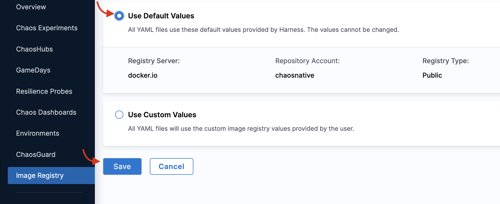

This topic describes using an image registry within a chaos experiment.

### What is an image registry?

An image registry is a repository that hosts container images that are used by chaos experiments. Registries can be **public** or **private**. HCE allows you to use custom image registries for chaos experiments.

:::tip
- You can configure the image registry to be used with the default probes. If you haven't configured a probe yet, the experiment will use the default image registry.
- HCE doesn't provide image registry support at the moment for default probes.
:::

Follow the steps below to use [custom values](#custom-values-for-image-registry) or [default values](#default-values-for-image-registry) of the image registry in your chaos experiment.

## Custom values for image registry
### Step 1: Navigate to Image Registry

* To use a custom image, go to **Image Registry** on the left-hand side, and select **Use custom values**.

  

### Step 2: Specify parameters
* Specify parameters for the custom values, such as **Custom image registry server**, **Custom image registry account**, and **Registry type**.

  

* You can choose between **Public** or **Private** in the **Registry type**. When you select **Private** registry type, add the **secret name**.

  

### Step 3: Save the custom values
* Select **Save** to save your changes.

In your chaos experiment manifest, the above custom setting will be reflected below.

```yaml
container:
  name: ""
  image: docker.io/chaosnative/k8s:1.30.0
  imagePullSecrets:
   - name: defreg
  command:
    - sh
    - "-c"
  args:
    - kubectl apply -f /tmp/ -n {{workflow.parameters.adminModeNamespace}} && sleep 30
```

:::info note
* If you use a public image or provide the `imagePullSecret` while using a private registry, the Argo workflow controller (v3.4.x) finds the entry point for litmus-checker.
* If you use an image from an internal registry without providing `imagePullSecret`, the workflow facilitates a default command that you can use to determine the entry point of litmus-checker.
:::

## Default values for image registry

* To use a default image, navigate to image registry, select **Use default values**, and then select **Save**.

  

In your chaos experiment manifest, the above default setting will be reflected below.

```yaml
container:
  name: ""
  image: docker.io/chaosnative/k8s:1.30.0
  command:
    - sh
    - "-c"
  args:
    - kubectl apply -f /tmp/ -n {{workflow.parameters.adminModeNamespace}} && sleep 30
```
