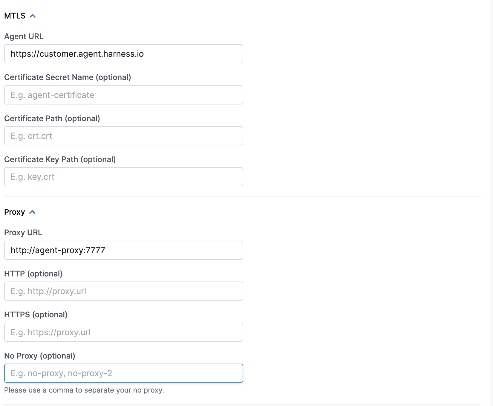

This topic describes how you can configure mTLS with DDCR and Discovery Agent.

Chaos runner supports token-based authentication with the Harness Platform. If you want to add another authentication on top of Harness authentication, you can [enable mTLS](https://developer.harness.io/docs/platform/delegates/secure-delegates/delegate-mtls-support/) for the account.

## DDCR

To configure mTLS in the DDCR, create a Kubernetes secret with the certificate and key in the target cluster and provide the following details.

    

If you don't want to create Kubernetes secrets in multiple clusters, you can [install the agent proxy](/docs/chaos-engineering/concepts/explore-concepts/infrastructures/delegate/proxy-support#installation) (aka Chaos Runner agent proxy) with mTLS key and certificate and provide the proxy URL in proxy setting.

    

## Discovery Agent

To configure mTLS in the Discovery Agent, create a Kubernetes secret with the certificate and key in the target cluster and provide the following details.

    

If you don't want to create Kubernetes secrets in multiple clusters, you can install the Chaos Runner agent proxy with mTLS key and certificate and provide the proxy URL in proxy setting.

    

