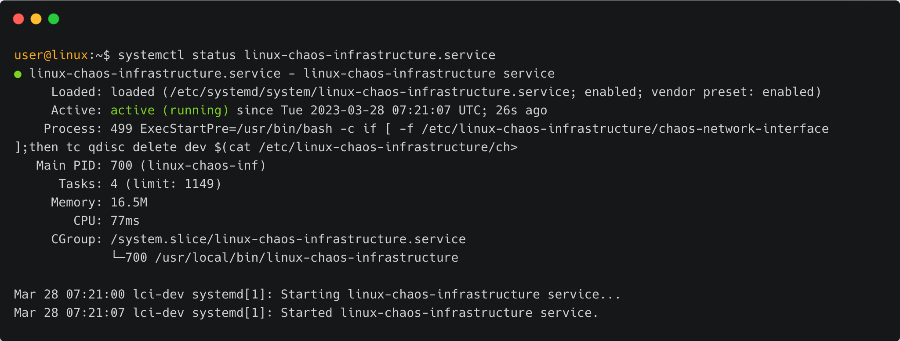
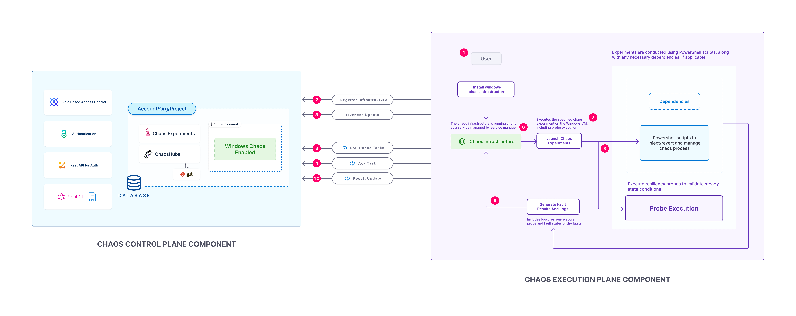
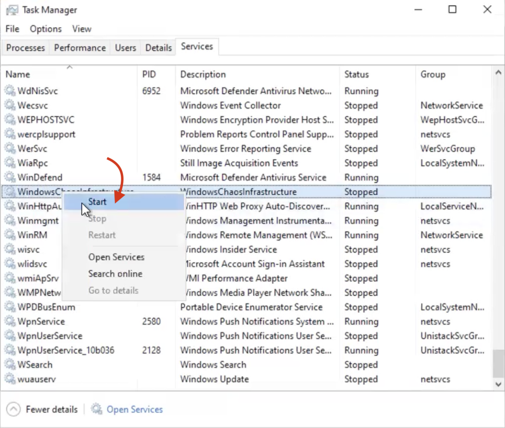

import Tabs from '@theme/Tabs';
import TabItem from '@theme/TabItem';

This topic introduces you to chaos infrastructure, its types, why it is important, and you can use it.

## What is a chaos infrastructure?

**Chaos infrastructure** represents the individual components of a deployment environment. It is a service that runs in your target environment to help HCE access the target resources and inject chaos at a cloud-native scale.

## Why is a chaos infrastructure required?

Chaos infrastructure helps facilitate the chaos fault injection and hypothesis validation thereby enabling chaos automation for target resources.

## How to use a chaos infrastructure?

All the chaos infrastructure services adhere to the **principle of least privilege**, where the services execute with the minimum number of permissions.

Go to [enable or disable an infrastructure](/docs/chaos-engineering/use-harness-ce/infrastructures/enable-disable) and [upgrade it](/docs/chaos-engineering/use-harness-ce/infrastructures/upgrade-infra) to get a hands-on experience.

You can install an infrastructure as a part of creating an experiment. This infrastructure is installed on the target Kubernetes cluster and helps inject chaos into applications, thereby executing the chaos experiments.

Go to [flow of control](/docs/chaos-engineering/use-harness-ce/chaos-faults/kubernetes/classification#flow-of-control-in-kubernetes-based-faults) to understand the flow of control of Kubernetes faults.

:::tip
- You can add multiple chaos infrastructures as part of an environment.
- You can set up a chaos infrastructure in **cluster-wide** access scope or in a **namespace** scope.
:::

### Chaos infrastructure requirements

The table below lists the chaos infrastructure execution plane components and the required resources. You can install these components in your target cluster, allowing the chaos infrastructure to run experiments here. Chaos infrastructure runs within your target environment to aid HCE in accessing the target resources and injecting chaos at a cloud-native scale.

| Deployment | Container | CPU<br />required | Memory<br />required | Image |
|------------|-----------|-------------------|----------------------|-------|
| chaos-operator-ce  | chaos-operator-ce     | 125m | 300M | chaosnative/chaos-operator          |
| chaos-exporter     | chaos-exporter        | 125m | 300M | chaosnative/chaos-exporter          |
| subscriber         | subscriber            | 125m | 300M | chaosnative/harness-chaos-subscriber|
| workflow-controller| workflow-controller   | 125m | 300M | chaosnative/workflow-controller     |

### Types of infrastructure

There are different types of chaos infrastructure such as Kubernetes, Linux, and Windows. You can choose to execute experiments on these infrastructures based on different environments, such as Kubernetes, Linux VMs, AWS cloud, VMware, and so on.

Based on the target environments, you can install chaos infrastructure as a Kubernetes service, a Linux daemon or a Windows agent.

:::tip
Chaos experiments associated with Cloud Foundry are executed using Linux chaos infrastructure, and experiments with AWS, GCP, Azure, VMware, and Bare metal are executed on Kubernetes infrastructure.
:::

<Tabs>
<TabItem value="Linux">

A set of mandatory input flags is required to install chaos infrastructure, including the `infra-id`, `access-key` and the `server-url`. However, certain aspects of the infrastructure can be tuned via the following flags:
1. **log-directory**: Custom log directory to store the log files. By default, the logs are stored at `/var/log/linux-chaos-infrastructure`.
2. **task-poll-interval-seconds**: Interval between subsequent poll queries to the server for a new experiment. The default value is **5 seconds**.
3. **task-update-interval-seconds**: Duration between subsequent status updates of an active fault to the server. The default value is **5 seconds**.
4. **update-retries**: Maximum number of retries in case of a failure while sending a fault status or result.

    * If the retry count is breached while sending the status, the active fault is aborted after logging the error during each attempts and the result is then attempted to be sent.

    * If the retry count is breached while sending the result, no result is sent by the infrastructure but the error during the attempts are logged.

    The default value is **5**.

5. **update-retry-interval-seconds**: Interval between the subsequent attempts to send a fault status or result, in case of a failure. The default value for it is **5 seconds**.
6. **chaos-infra-liveness-update-interval-seconds**: Interval between the chaos infrastructure liveness heartbeats. The default value is **5 seconds**.
7. **chaos-infra-log-file-max-size-mb**: Maximum size limit for the chaos infrastructure log file rotation. Upon breaching the size limit, a new log file is created to store the logs and the old log file is retired as a backup archive. The default value is **5 MB**.
8. **chaos-infra-log-file-max-backups**: Maximum number of backup archives to be retained at any given time. The oldest archive is deleted when a new log file is created. The default value is **2**.
9. **experiment-log-file-max-age-days**: Number of days after which the experiment log files will be deleted. The default value is **30**.
10. **custom-tls-certificate**: TLS certificate used to communicate with the control plane.
11. **http-proxy**: HTTP proxy URL used to communicate with the control plane.
12. **http-client-timeout**: HTTP client timeout for communicating with the control plane. The default value is **30s**.

:::info note
LCI does not currently support:
1. Cron schedules
2. [GameDays](/docs/chaos-engineering/concepts/explore-concepts/GameDay)
3. Executing [parallel faults](/docs/chaos-engineering/use-harness-ce/experiments/create-experiments) in SaaS (the self-managed platform (SMP) supports executing parallel faults on LCI)
:::

#### Infrastructure service
The Linux chaos infrastructure is installed as an executable binary on your Linux machine. This infrastructure is managed as a `Systemd` service.
- The service starts automatically when the system starts.
- If the service stops unexpectedly, it automatically attempts to restart after a cool down period of 5 seconds.
- By default, the service ensures that the chaos infrastructure process is owned by the root user.

To check if the infrastructure service is active and running, use the following command:
```
systemctl status linux-chaos-infrastructure.service
```


Any status other than the `active` status would indicate an issue with the infrastructure.

#### Logs
Logs that are generated are stored in the `/var/log/linux-chaos-infrastructure` directory by default. There are two types of logs:
1. **Infrastructure logs:** Infrastructure logs are generated as a result of any infrastructure operation that is not directly related to the execution of an experiment. For example:
    - Start of execution of an experiment
    - End of execution of an experiment
    - Error during the creation of an experiment log file
    - Error while querying for an experiment
    - Error while sending the experiment status or result, etc.

    By default, this log file is located at `/var/log/linux-chaos-infrastructure/linux-chaos-infrastructure.log` and can be used for troubleshooting the infrastructure.

:::info
- The file is rotated based on its size; when the file size is a specified size, it is archived in a separate file with the timestamp of rotation suffixed to the file name. By default, this value is **5 MB**.
- Eventually, the old archives will be deleted. The maximum number of most recent archives that are retained at any given time can be specified. By default, this value is **2**.
:::

2. **Experiment logs:** Experiment logs are stored in separate files, which are scoped to the faults of the experiment. It contains information about the various steps of the execution of that fault, including any errors caused during the execution of the fault. The files use the unique fault name mentioned in the experiment as their filename.

:::info
- These files are rotated based on their age; where files older than a specific number of days are removed. By default, this value is **30 days**.
:::

</TabItem>

<TabItem value="OpenShift">

**Step 1. Create or identify the target namespace and install the service accounts**

Create or identify the target chaos namespace in which you will deploy the chaos infrastructure.
You will use the `hce` namespace in this case.

```bash
kubectl create ns hce
```

You can create the service account in the cluster mode or the namespace mode.

To install in the **cluster mode**, create the service accounts using the [cluster-mode-sa.yaml](./static/openshift/cluster-sa.yaml) file. You can download the file and apply it.

To install in the **namespace mode**, create the service accounts using the [namespace-mode-sa.yaml](./static/openshift/namespace-sa.yaml) file. You can download the file and apply it.

If you have a different namespace, replace the namespace with `<your-namespace>` in the manifest.

```bash
kubectl create cluster-mode-sa.yaml -n  hce
```

__Output__

```bash
$> kubectl apply -f cluster-mdoe-sa.yaml -n hce
serviceaccount/litmus-admin created
serviceaccount/hce created
serviceaccount/argo-chaos created
serviceaccount/argo created
serviceaccount/litmus-cluster-scope created
```

**Step 2. Create Litmus Security Context Constraint (SCC) and authenticate it with the service account**

To create the litmus SCC,
- Copy the contents of the [litmus SCC manifest](./static/openshift/litmus-scc.yaml) to `litmus-scc.yaml` file.
- Apply this manifest to your chaos infrastructure.

  ```bash
  kubectl apply -f litmus-scc.yaml
  ```

__Output__

```bash
$> kubectl apply -f litmus-scc.yaml
securitycontextconstraints.security.openshift.io/litmus-scc created
```
- Authenticate all `hce` service accounts with `litmus-scc`:

  ```bash
  oc adm policy add-scc-to-user litmus-scc -z <SERVICE-ACCOUNT-NAME> --as system:admin -n <CHAOS-NAMESPACE>
  ```

:::note
- Replace `<CHAOS-NAMESPACE>` with the namespace where litmus is installed. (Here litmus)
- Replace `<SERVICE-ACCOUNT-NAME>` with the name of hce service accounts.
:::


In this case, the exact command is:
```bash
oc adm policy add-scc-to-user litmus-scc -z litmus-admin,argo-chaos,argo,litmus-cluster-scope,default,hce --as system:admin -n hce
```

__Output__

```bash
clusterrole.rbac.authorization.k8s.io/system:openshift:scc:litmus-scc added: ["litmus-admin" "argo-chaos" "argo" "litmus-cluster-scope" "default" "hce"]
```

:::tip
To learn more about SCC, go to [SCC documentation](/docs/chaos-engineering/security/security-templates/openshift-scc).
:::

**Step 3. Get the manifest to install chaos infrastructure**

After [connecting to a chaos infrastructure](/docs/chaos-engineering/use-harness-ce/infrastructures/enable-disable), select the installation mode (cluster scope or namespace scope).


:::note
Provide the namespace and the service account name. To use a service account other than `hce`, create a new service account and authenticate it with litmus-scc by following steps 1 and 2.
:::

**Step 4. Verify the installation**

Verify if all the pods are in `Running` state (optional).

```bash
$> kubectl get pods -n hce


NAME                                   READY   STATUS    RESTARTS   AGE
chaos-exporter-6c4b6d6c48-cht2d        1/1     Running   0          23s
chaos-operator-ce-57f5f7ccdb-m7g7f     1/1     Running   0          24s
subscriber-57798b696b-69vtr            1/1     Running   0          14s
workflow-controller-67b87685fb-h6k5b   1/1     Running   0          29s
```

Ensure that the state of the chaos infrastructure is `CONNECTED`.


**Step 5. Run chaos experiments**

To run Kubernetes experiments, you need to tune the parameters associated with the fault. You can update or add the below mentioned environment variables while tuning the faults.

```yaml
- name: CONTAINER_RUNTIME
  value: crio
- name: SOCKET_PATH
  value: /run/crio/crio.sock
- name: SET_HELPER_DATA
  value: false
```


</TabItem>

<TabItem value="Windows">

The diagram represents a high-level architecture of the interaction between the Windows execution plane and control plane components.



#### Advanced setup

The mandatory input required for the installation of the chaos infrastructure is the `name`.
You can tune the other flags of the infrastructure with the following flags:

1. **admin user**: Administrator used to execute commands on the terminal to install and manage the Windows chaos infrastructure. By default, the logs are stored at `C:\\HCE\logs`.

2. **task poll interval**: Interval between subsequent poll queries to the server for a new experiment. The default value is **5 seconds**.

3. **task update interval**: Duration between subsequent status updates of an active fault to the server. The default value is **5 seconds**.

4. **infrastructure liveness update interval**: Interval between the chaos infrastructure liveness heartbeats. The default value is **5**.

5. **update retries**: Number of retries before the service fails.

6. **update retries interval seconds**: Interval between the subsequent attempts to send a fault status or result, in case of a failure. The default value for it is **5 seconds**.

7. **log file max size**: Maximum size limit for the chaos infrastructure log file rotation. Upon breaching the size limit, a new log file is created to store the logs and the old log file is retired as a backup archive. The default value is **5 MB**.

8. **log file max backups**: Maximum number of backup archives to be retained at any given time. The oldest archive is deleted when a new log file is created. The default value is **2**.

9. **experiment log file max age**: Number of days after which the experiment log files will be deleted. The default value is **30**.

10. **http proxy**: HTTP proxy URL used to communicate with the control plane.

11. **http client timeout**: HTTP client timeout for communicating with the control plane. The default value is **30s**.

#### Infrastructure service
The Windows chaos infrastructure is installed as an executable binary on your Windows VM. The service binary is present in `C:\\HCE\windows-chaos-infrastructure.exe` path. The config file is present in `C:\\HCE\config.yaml` path.

#### Logs
Logs that are generated are stored in the `C:\\HCE\logs` directory by default.

There are two types of logs:
1. **Infrastructure logs:** Infrastructure logs are generated as a result of any infrastructure operation that is not directly related to the execution of an experiment. Every experiment run has a new log folder with all connectivity logs.

:::info
- The file is rotated based on its size; when the file size is a specified size, it is archived in a separate file with the timestamp of rotation suffixed to the file name. By default, this value is **5 MB**.
- Eventually, the old archives will be deleted. The maximum number of most recent archives that are retained at any given time can be specified. By default, this value is **2**.
:::

2. **Experiment logs:** Experiment logs are stored in separate files, which are scoped to the faults of the experiment. It contains information about the various steps of the execution of that fault, including any errors caused during the execution of the fault. The files use the unique fault name mentioned in the experiment as their filename.

:::info
- These files are rotated based on their age; where files older than a specific number of days are removed. By default, this value is **30 days**.
:::

#### Verify Windows infrastructure service status

To verify the status of the service, navigate to the command prompt on your Windows. Search for **Task Manager**, select **More details** and check the status of **WindowsChaosInfrastructure**.

1. If the status reads **Running**, it means the windows infrastructure is up and running.


2. If it reads **Stopped**, right click and select **Start**.



3. Any other status will be associated with logs which you can troubleshoot using our [troubleshooting guide](/docs/chaos-engineering/troubleshooting/troubleshooting.md)

#### Resilience probes for Windows

HCE allows you to create the below probes for Windows:

1. [HTTP](/docs/chaos-engineering/concepts/explore-concepts/resilience-probes/http-probe)

</TabItem>
</Tabs>