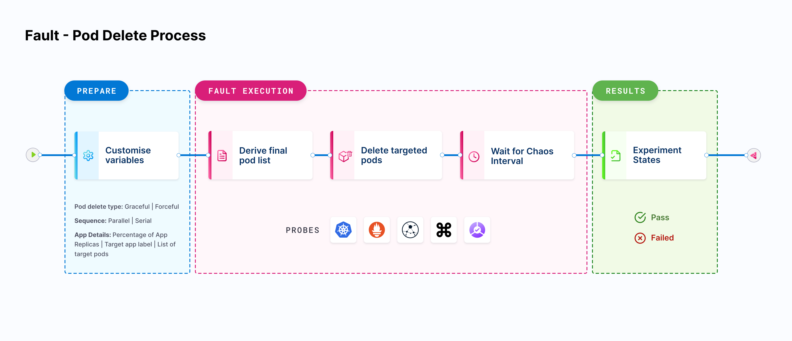

This topic introduces you to resilience probes, their importance, types, and generic properties.

:::tip
- For existing users, resilience probes are behind the feature flag `CHAOS_PROBE_ENABLED`. You also have the choice to upgrade to the new flow. Contact [Harness support](mailto:support@harness.io) to enable it or to upgrade to the new flow.
- If you are a new customer, the feature flag is turned on by default and you will see the new flow of control in the resilience probes.
:::

## What is a resilience probe?

Resilience probes (or probes) are pluggable health checkers defined within the chaos engine for any chaos experiment. They are declarative checks that determine the outcome of a fault.

Probes are scoped to specific [faults](/docs/chaos-engineering/use-harness-ce/chaos-faults/), and you can define as many probes as needed for each fault. The probe is triggered by a chaos runner when the chaos engine begins execution. They can be used to perform tasks such as, but not limited to, the following:
- Monitors your application's health **before**, **during** and **after** a chaos experiment.
- Explore the behavior of a system in a chaotic or unpredictable manner.
- Help understand the underlying patterns and laws that govern the behavior of these systems, and to use that understanding to predict or control their behavior.
- Validate the [declarative hypothesis](#declarative-hypothesis) set by the user.

Depending on the type of probe, probes can:
- Run `cmd` commands for innumerable validations,
- Run the Kubernetes commands, send HTTP requests, check for a label or field selector missing, and assert if the resource is absent or not,
- Execute PromQL queries, perform conditional validation on QPS or probe success percentages (percentage of probes that have been successfully evaluated out of the total number of probes),
- Validate your error budget (SLO probe),
- Connect with the APM tool and assert metrics (Datadog probe).

### Declarative hypothesis

Declarative hypothesis in a cloud-native chaos engineering environment is a way of specifying the expected outcome of a chaos experiment before it is run. It is a statement that defines the expected result of the experiment and is used to guide the experiment's design and implementation. This can be done as a part of defining the fault specifications in the respective chaos engine which is validated by the chaos operator.

This hypothesis is a way to ensure that the experiment is well-defined and that the results are easily understood. It helps to ensure that the experiment is repeatable and the results can be compared across different runs.

Declarative hypotheses in HCE are written in a simple, clear, and concise manner, that is, they should be **specific, measurable, achievable, relevant, and time-bound (SMART)**. The steady-state and declarative hypothesis set by the user should directly map with the SLOs.

## Who should use probes?

Chaos probes are used by **developers**, **quality assurance engineers**, and **system administrators** to monitor the health, test the resilience, execute custom user-desired checks/functions, perform CRUD operations, etc depending on the type of probe, usually against the applications under chaos running on a Kubernetes cluster.

In general, anyone responsible for maintaining and deploying applications in a Kubernetes cluster, especially in a production environment, should consider using chaos probes to proactively identify and fix issues in their applications.

## Why should you use probes?

In a production environment, it is hard to predict when and how failures will occur, and it can be difficult to test for all possible scenarios.

By injecting known failures into the system, probes help identify and fix issues before they occur in production, and ensure that the application remains available and responsive to user requests even in the event of unexpected failures.

You can use probes to simulate different types of failures and test how the application behaves under different conditions.

- Probes are **shareable**, that is, they create a global instance of probes. It is a shared entity that can be used across multiple faults.
- Probes are **reusable**, that is, you can create the validation instance first and use it across different experiments. This enables you to avoid the repeated creation of the same probes for similar requirements.

This is also in accordance with how HCE pans out:
1. Plan the hypothesis.
2. Measure the validation criteria to check against the SLA.

### Types of resilience probes

HCE facilitates 7 types of resilience probes listed below. Click each probe to navigate to details such as probe property, definition, schema, authentication, methods, and so on.

- [**HTTP probe**](/docs/chaos-engineering/concepts/explore-concepts/resilience-probes/http-probe): To query health/downstream URIs.
- [**Command probe**](/docs/chaos-engineering/concepts/explore-concepts/resilience-probes/cmd-probe): To execute any user-desired health-check function implemented as a shell command.
- [**Kubernetes probe**](/docs/chaos-engineering/concepts/explore-concepts/resilience-probes/k8s-probe): To perform CRUD operations against native and custom Kubernetes resources.
- [**Prometheus probe**](/docs/chaos-engineering/concepts/explore-concepts/resilience-probes/prom-probe): To execute PromQL queries and match Prometheus metrics for specific criteria.
- [**Datadog probe**](/docs/chaos-engineering/concepts/explore-concepts/resilience-probes/datadog-probe): To query a [Datadog Synthetic](https://docs.datadoghq.com/synthetics/) test and use its results to evaluate the probe outcome.
- [**SLO probe**](/docs/chaos-engineering/concepts/explore-concepts/resilience-probes/slo-probe): To allow you to validate the error budget for a given SLO when the corresponding application is subject to chaos and determine the verdict based on the percentage change in the error budget.
- [**Dynatrace probe**](/docs/chaos-engineering/concepts/explore-concepts/resilience-probes/dynatrace-probe): Determines the health of your application by examining the entry or exit criteria.

:::info note
- Each type of probe has its advantages and disadvantages, and the choice of probe depends on the specific requirements of the experiment and the system being tested.
- The probes can be used in isolation or in several combinations to achieve the desired checks.
:::

HCE allows you to create probes for multiple infrastructures, namely, Kubernetes, Linux, and Windows. The type of probes allowed on each of these infrastructures is listed below.

	| Kubernetes | Linux     | Windows |
	|------------|-----------|---------|
	| HTTP       | HTTP      | HTTP    |
	| Command    | Command   |         |
	| Datadog    | Datadog   |         |
	| Dynatrace  | Dynatrace |         |
	| SLO        |           |         |
	| Prometheus |           |         |
	| Kubernetes |           |         |

:::tip
- When you try to enable or disable a Linux probe, two mandatory fields `type` and `attempt` (with empty values) are added to the probe. Even if you edit these values, they will not reflect in the updated experiment manifest. This is because the final values for the earlier-mentioned mandatory fields are picked from the database associated with the specific probe.
- Go to [known issues](/docs/chaos-engineering/troubleshooting/known-issues) for more information.
:::

## Resilience probes status

Probe status is the single source of truth when executing a chaos experiment. The probe status in a chaos experiment can be in 4 different states.

- **AWAITED**: A probe status is in 'awaited' state until the fault is being executed, that is, the fault is still running. Once it has completed execution, it can be in the 'passed', 'failed' or 'N/A' state.
- **PASSED**: A probe status is considered 'passed' when the success criteria is met.
- **FAILED**: A probe status is considered 'failed' when the success criteria is not met.
- **RUNNING**: A probe status is considered 'running' when the probe is currently in execution.
- **N/A**: A probe status is in the 'N/A' state when the result of the fault could not be determined.

### Delete resilience probes

You can delete a probe only after disabling it. Go to [Disable Probes](/docs/chaos-engineering/use-harness-ce/probes/use-probe#disable-a-probe) for more information.

- When you select **Disable only**, the probe won't be available for further scheduling when selecting the probe from the UI. If the older runs (or experiment) manifest used that probe, successive runs of the experiment will be blocked with the message that the probe is disabled. This is because the probe is not removed since it is not a **Bulk Disable** operation. You will need to manually remove the probe references from the manifest.
- When you select **Disable Only**, the history of the probe would be intact and you can see older probe executions associated with it.
- Once you **Bulk disable** a probe, information about the probe reference is also deleted from all the manifest references, that is, the probe is removed from the `probeRef` annotation. This ensures that the next possible run will not schedule the probe.
- Only when you **hard delete** a probe, you can reuse the name of that probe.

### Default/System resilience probes

- You can create system (default probes) at the project level **only once**.
- Once you create a default probe, you can't delete, disable, or update it.
- If you have more than one resilience probe in your chaos experiment, you can disable, delete, or update the system probe.
- Default probes are a part of resilience probes and are entered as annotations in the experiment manifest.

### Image registry support
- You can configure the image registry to be used with the default probes. If you haven't configured a probe yet, the experiment will use the default image registry.
- HCE doesn't currently provide image registry support for default probes.

:::info notes
- **Legacy probes support (Backward compatibility)***: Users can still use legacy probes.
- **Audit integration**: Audit events are available for resilience probes.
- **Access control permissions division**: ACL is mapped to the experiment ACL.
- Resilience probes are not a part of any subscription, and hence you don't have any limit on the number of probes you can create.
- You can execute 1,000 probes in a month.
:::

## Next steps

- [Use case of resilience probes](/docs/chaos-engineering/concepts/explore-concepts/resilience-probes/types#common-use-cases)
- [Use resilience probes](/docs/chaos-engineering/use-harness-ce/probes/use-probe)