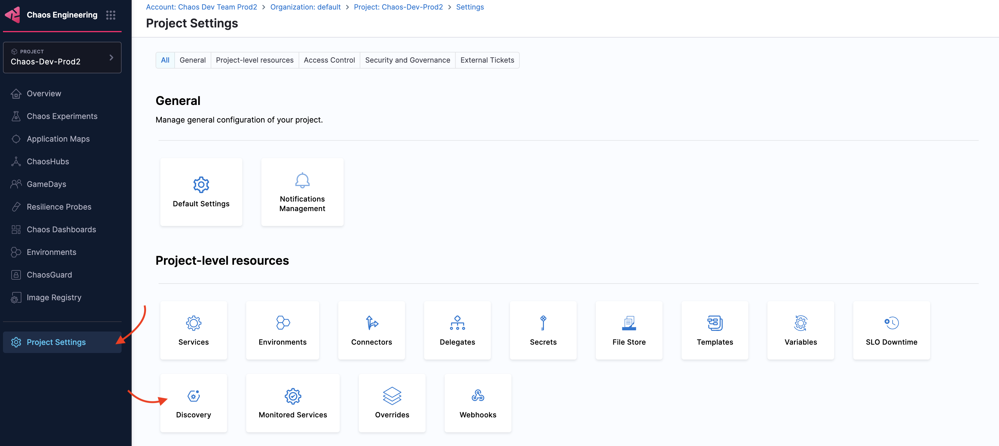
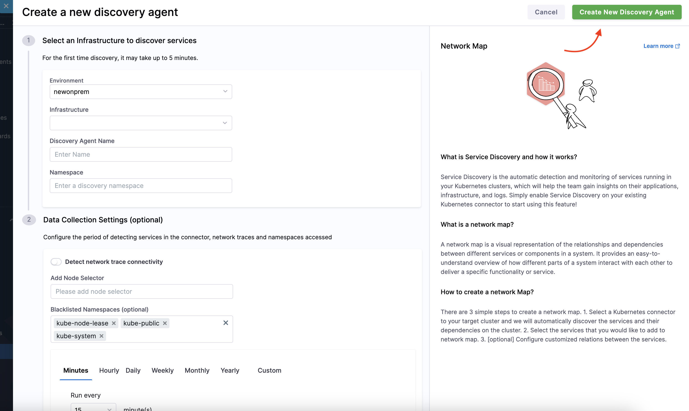
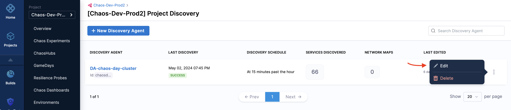

This topic introduces you to **service discovery** for **Kubernetes infrastructure**, its significance, and its purpose.

### What is a discovered service?
Discovered service is an entity on the Harness platform (also known as the control plane) that corresponds to a Kubernetes service on your (user) cluster. It includes details about the connections made from and to it.

Below is the control flow to a discovered service.

  

### Why is a discovered service required?

Large enterprises deal with hundreds of deployed services. Monitoring these services or incorporating chaos engineering on these services would require building a database of these services and the relationship between these services, which is time-consuming. Service discovery comes into the picture: Instead of creating a database with the services, **automatically discover services** and the relationship between them.

### How does HCE discover services?

HCE performs the following steps to discover services in your cluster:
1. Scan your Kubernetes cluster periodically (you can define the interval or ad-hoc).
2. Build a database of services that describes the relationship between the services.
3. Provide APIs to group the discovered services into a map, wherein the map represents a topological view of an application.

### How does HCE leverage discovered services?

HCE tests the resilience of the application, and HCE uses the discovered services to:

- Identify the various available services in the chaos module, that is, the chaos targets in the Kubernetes cluster that you can deploy using Harness or other means.
- Record the resources backing the above services (logical resources such as deployment, pods, containers, processes, FQDNs, ports, physical resources such as nodes, storage, and so on).
- Highlight the given service's position and the lineage within the topology view.

As an HCE user, service discovery simplifies your decision-making around:

- Which service to target?
- Which chaos faults to inject into a target service?
- What validations and health checks to perform while executing chaos faults?

Consequently, you will be able to find the resilience of your service (with the help of resilience coverage reports, service-level resilience scores, and other such metrics).

:::tip
You can leverage all the [permissions mentioned](/docs/chaos-engineering/security/security-templates/openshift-scc#run-service-account-as-a-cluster-admin) for fault execution as well as service discovery.
:::

### Advantages

- Reduces overhead of creating a database with services
- User-friendly
- Increased adoption of HCE

When you are onboarding, one of the steps involves discovering services. HCE creates the discovery agent that automatically discovers services for your application.

If you want to customize the discovery agent, follow the steps below.

### Customize discovery agent

1. To customize the discovery agent, navigate to **Chaos**, select **Project Settings** and select **Discovery**.

    

2. Click **New Discovery Agent**.

    

3. Select an **environment**, **infrastructure**, **Discovery Agent Name** and **namespace**. The next step (optional) requires information such as node selector, blacklisted namespaces, and period of detecting the services. Select **Create New Discovery Agent**.

    

### Edit discovery agent

1. To edit a discovery agent, navigate to the agent and click **Edit**. Make the necessary changes to the required fields.

    

2. Select **Update Discovery Agent**.

    

### Delete discovery agent

1. To delete a discovery agent, navigate to the agent you want to delete and select **Delete**.

    

2. Select **Delete**.

    