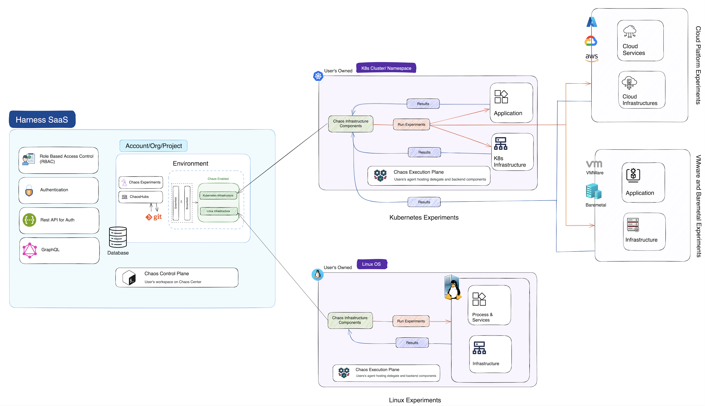
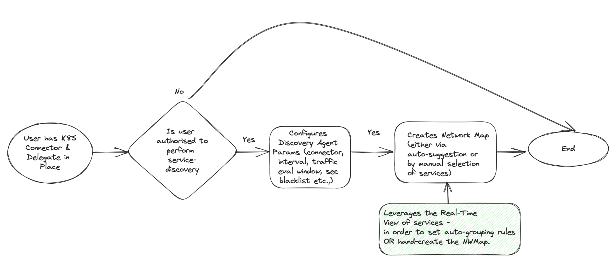
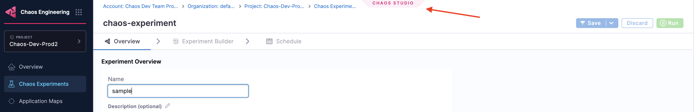

Listed below are HCE features with links for easy navigation.

## Deployment Options

### On-prem Deployment
Harness CE is available in the SMP (self-managed platform) version, where you will need to create, manage and maintain your clusters. You will be responsible for providing permissions to projects and handling the issues associated with them.
Feature availability on HCE SaaS and SMP are on par, with minor timeline changes in the SMP feature releases.
For more information, go to [HCE SMP](/docs/chaos-engineering/getting-started/smp/).

### SaaS Deployment
Harness CE is available as the SaaS version, that you can use by either signing up or getting invited to a specific project. HCE provides the assistance to manage the cluster.For more information, go to [HCE SaaS](/docs/chaos-engineering/getting-started/saas/).

## Chaos Platform Features

### Powered by LitmusChaos

HCE is built on open-source CNCF chaos engineering project [LitmusChaos](https://litmuschaos.io/). It leverages the robustness of LitmusChaos and provides additional capabilities that makes chaos engineering an easy practice for enterprises. The additional capabilities are listed [here](/docs/chaos-engineering/getting-started/#hce-and-litmuschaos).

### Centralized Chaos Control Plane

The control plane comprises of microservices that enable the [web-based portal](https://app.harness.io) to perform its functions.
The control plane helps **create**, **schedule**, and **monitor** chaos experiments.

For more information, go to [Control Plane](/docs/chaos-engineering/concepts/deployment-architecture#control-plane).

### Centralized Chaos Execution Plane

Depending on the type of chaos infrastructure (Kubernetes or Linux), the execution plane comprises of components that orchestrate the chaos injection into target resources. The execution plane sets up the resources (clusters) where chaos experiments are run.

The diagram below briefly describes how the control plane interacts with the execution plane.

For more information, go to [Execution Plane](/docs/chaos-engineering/concepts/deployment-architecture#execution-plane), that also describes how the control plane and the execution plane interact with each other to execute and give results of chaos experiments.

### Service Discovery
It is an entity on the Harness platform (also known as the control plane) that corresponds to a Kubernetes service on your (user) cluster. It includes details about the connections made from and to it.
Instead of creating a database with the services, you can automatically discover services and the relationship between them, that reduces the time consumed to build a database with the services and their relationship.

Below is the control flow to a discovered service.

For more information on how to create a  discovery agent, go to [Service Discovery](/docs/chaos-engineering/concepts/explore-concepts/service-discovery).

### Resilience Probes

Resilience probes are pluggable health checkers defined within the chaos engine for any chaos experiment. They are declarative checks that determine the outcome of a fault. Probes are scoped to the faults, and you can define as many probes as required as part of each fault. They (not limited to) perform the following:
- Monitors your application's health **before**, **during** and **after** a chaos experiment.
- Explore the behavior of a system in a chaotic or unpredictable manner.
- Help understand the underlying patterns and laws that govern the behavior of these systems, and to use that understanding to predict or control their behavior.
- Validate the declarative hypothesis set by the user.

For more information on importance and types of probes, go to [Resilience Probes](/docs/chaos-engineering/concepts/explore-concepts/resilience-probes/).

### Experiment Logs

Experiment log refers to metadata generated when a chaos experiment is in progress. These logs are stored in separate files, which are bound to the faults of the experiment. They contain information such as the steps of execution of the fault, errors caused during the execution of the fault, and so on. The log files are named based on the unique fault name mentioned in the experiment.

For more information on infrastructure logs, go to [Infrastructure Logs](/docs/chaos-engineering/use-harness-ce/infrastructures/#logs).

### Application Map

It is a resource on the Harness Platform (also known as the control plane) that binds multiple interacting [discovered services](/docs/chaos-engineering/concepts/explore-concepts/service-discovery) into a single object, thereby allowing the users to act (test, monitor, and so on) on a group of services.

Application maps help:
- Test and monitor a group of services.
- Determine the resilience coverage and resilience score for the overall application map and its constituent services.
- Manage experiments associated with them.
- Perform trend analysis.

For more information on how to create an application map, go to [Application Map](/docs/chaos-engineering/concepts/explore-concepts/app-maps).

### Audit Logs

It refers to the detailed records that tracks all activities, changes, and events within the HCE platform. They help maintain a secure environment by providing transparency and accountability for all actions. They are critical for troubleshooting, compliance, and security auditing, thereby enabling teams to monitor and analyze the history of changes and operations within the HCE platform. These logs provide a chronological record of actions performed by users or systems, such as:

- **Experiment Creation and Execution**: Logging details about when the chaos experiments are created, modified, or executed, including who initiated the action.
- **Configuration Changes**: Recording changes made to chaos experiments, environments, or other configurations, specifying what was altered and by whom.
- **User Access and Permissions**: Tracking user login attempts, access grants, and any changes to user roles or permissions.
- **System Events**: System-generated events, errors, or alerts that may occur during chaos experiments.

For more information, go to [logs](/docs/chaos-engineering/use-harness-ce/infrastructures/#logs).

### Custom Image Registry
It is a repository that hosts container images that are used by chaos experiments. HCE allows you to use custom image registries for chaos experiments.

For more information on types of image registry and how to create one, go to [Image Registry](/docs/chaos-engineering/use-harness-ce/image-registry).

## Chaos Orchestration

### ChaosHubs

It is a collection of experiment templates and faults used to create and launch chaos experiments. Both experiments and faults are stored as manifests in an appropriate directory structure. This way, you can add new experiment templates and faults directly to the repository as files. In addition, you can derive the experiment templates from the existing experiments and save them to the ChaosHub from the UI.

For more information on Enterprise ChaosHub, and their use cases, go to [ChaosHubs](/docs/chaos-engineering/use-harness-ce/chaoshubs/). To get hands-on experience, [Connect to a ChaosHub](/docs/chaos-engineering/use-harness-ce/chaoshubs/add-chaos-hub) or [Manage a ChaosHub](/docs/chaos-engineering/use-harness-ce/chaoshubs/manage-hub).

For a more detailed demonstration, go to [the ChaosHub overview video](https://youtu.be/b4ggnJcZrcM?si=odEyBeAtWiqAF6zg).

### GameDays

It is a template/methodology used by teams to practice chaos engineering. These teams execute chaos experiments on the application during a specific period.

For more information, go to [GameDays](/docs/chaos-engineering/concepts/explore-concepts/GameDay).  To get hands-on experience, [Create a GameDay run](/docs/chaos-engineering/concepts/explore-concepts/GameDay#create-a-gameday).

### Auto Create Chaos Experiments

To get hands-on experience without any prerequisites or permissions, you can onboard HCE automatically or in a guided manner. In both these cases, chaos experiments are automatically created based on the choice you selected during onboarding.

For more information, go to [Onboarding](/docs/chaos-engineering/getting-started/onboarding/).

### Create Experiments

A chaos experiment is a series of steps executed on an application. It comprises of chaos faults that are arranged in a certain order.

For more information, go to [Chaos Experiments](/docs/chaos-engineering/use-harness-ce/experiments/). To get hands-on experience, [Create Chaos Experiments](/docs/chaos-engineering/use-harness-ce/experiments/create-experiments).

### Run or Schedule Experiments

Once you provide parameters and tune the chaos faults for an experiment, you can execute them immediately or execute it periodically on a schedule.

For more information, go to [Execute Chaos Experiments Once](/docs/chaos-engineering/use-harness-ce/experiments/create-experiments#run-or-schedule-the-experiment) or [Schedule Experiments](/docs/chaos-engineering/use-harness-ce/experiments/create-experiments#execute-experiment-on-a-schedule).

### Chaos Studio

The page where you land when you want to create a new experiment is Chaos Studio. You can define a chaos experiment using the guided UI or by uploading the workflow CR (custom resource) manifest in the Chaos Studio.

## Chaos Faults

### Out-of-the-box Faults

HCE provides you with out-of-the-box chaos faults that you can execute on your infrastructure. Some of the faults include Kubernetes, AWS, and VMware. For the full list of chaos faults, go to [Out-of-the-Box Faults](/docs/chaos-engineering/use-harness-ce/chaos-faults/).

### Create Custom Faults

You can create custom faults that can be injected into your application to test its resilience. These custom faults go beyond the pre-defined fault types provided by Harness. You can [Bring Your Own Chaos](/docs/chaos-engineering/use-harness-ce/chaos-faults/byoc/) to tailor the chaos experiments to meet specific needs, configurations, or scenarios unique to your environment.

## Security and Governance

### Chaos RBACs

Harness CE provides several controls to ensure the safe execution of chaos experiments on your infrastructure. The foundational elements of the chaos engineering process, such as chaos infrastructure, ChaosHubs, chaos experiments, and GameDays are registered as the module resources, with permissions granted to use them. These resources are scoped at the project level.
For more information, go to [RBAC and User Authorization](/docs/chaos-engineering/use-harness-ce/governance/rbac#user-authorization-and-role-based-access-control).

### ChaosGuard

ChaosGuard provides an additional level of security to guard chaos experiments from chaos-enabled users. It aims to minimize the blast radius  and mitigate potential threats. For more information, go to [ChaosGuard](/docs/chaos-engineering/use-harness-ce/governance/governance-in-execution/). For hands-on experience, [Configure and Use ChaosGuard](/docs/chaos-engineering/use-harness-ce/governance/governance-in-execution/govern-run).

## Integrations

### Run from CI/CD pipelines

You can execute chaos experiments as CI/CD pipelines to validate the resilience of an application. For more information, go to [HCE CI/CD Integration](/docs/chaos-engineering/integrations/hce-and-cd/experiment-as-cd-pipeline).

### Monitoring Platforms

You can integrate HCE with monitoring platforms such as SRM. For more information, go to [HCE SRM Integration](/docs/chaos-engineering/integrations/use-chaos-with-srm).

### JIRA

You can execute chaos experiments in pipelines, wherein you can integrate the pipeline execution with various steps, such as JIRA, CD, and so on.
For more information, go to [Integrate with JIRA](/docs/chaos-engineering/integrations/pipeline-exec).

## Chaos Metrics

### Resilience Score

It measures how resilient the target application is to a chaos experiment. You can [calculate](/docs/chaos-engineering/use-harness-ce/experiments/#determine-the-resilience-of-target-environment-using-resilience-score) this value based on the priority set for every fault in the experiment and the probe success percentage of the faults (if the probes are defined).

For more information, go to [Resilience Score](/docs/chaos-engineering/use-harness-ce/experiments/#determine-the-resilience-of-target-environment-using-resilience-score).

### Resilience Coverage

It describes how resilient an application is to different kinds of failures. For example, your application may be able to function smoothly in case of resource failures but causes glitches in case of network issues. This tells what kinds of failures your application is able to handle. For more information, go to [Application Maps](/docs/chaos-engineering/concepts/explore-concepts/app-maps).

### Prometheus Chaos Metrics

It provides comprehensive visibility into the effects of chaos experiments, enabling real-time monitoring and analysis about how the system behaved prior to, during, and after the chaos experiment was run.
For more information, go to [Prometheus Metrics in your first experiment](/docs/chaos-engineering/getting-started/saas/first-experiment#step-7-evaluate-the-experiment-run).

## Resilience Insights

### Out-of-the-box Chaos Dashboards

HCE allows creation of chaos dashboards that simplifies the process of understanding the effects of chaos experiments and provides a comprehensive view of chaos experiments and their impact on system performance. These dashboards are designed to help you easily monitor, analyze, and visualize the results of chaos experiments.

For more information, go to [Chaos Dashboards](/docs/chaos-engineering/use-harness-ce/dashboards/).

### Creating Custom Dashboards
You can create chaos dashboards that help visualize key metrics and data from your experiment runs and historical data. Chaos Dashboard is an interactive interface designed to manage, visualize, and monitor chaos experiments. It offers visual representations of various experiment features, including bar graphs and a tabular display of the data for easy analysis.

For more information, go to [Chaos Dashboards](/docs/chaos-engineering/use-harness-ce/dashboards/). For a hands-on experience, [Create a Chaos Dashboard](/docs/chaos-engineering/use-harness-ce/dashboards/create-new).

### Reporting

After executing a chaos experiment, you can view the run report of the experiment if you configure your account to send alerts about updates on your experiment executions.

For more information, go to [Alert Integration](/docs/chaos-engineering/use-harness-ce/experiments/alert-integration#sample-run-report).

