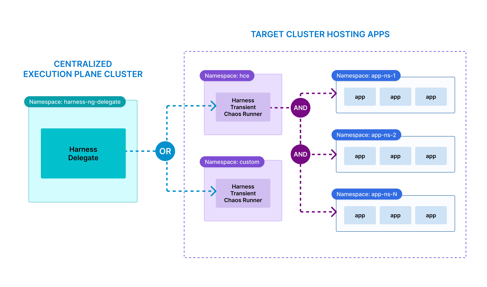
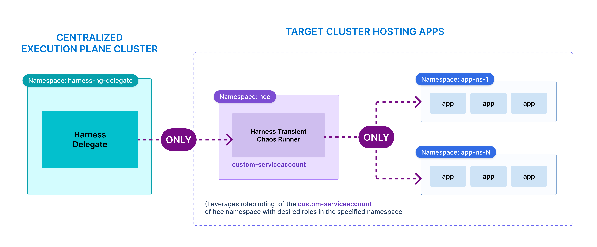

This topic describes the characteristics of the agentless model, deployment scope of centralized execution plane components, and how you can restrict Delegate permissions.

## Characteristics of agentless model

The agentless model introduces the concept of CEP (Centralized Execution Plane). It has the following characteristics:

   - **Harness Kubernetes Delegate**: Instead of deploying persistent agents on target clusters, a **Harness Delegate** or **Jump Cluster** is configured as a central orchestrator.Harness Delegate orchestrates the launch of transient Chaos Runners in the target systems based on the Kubernetes Connector reference. The Delegate is an exisiting component in most Harness environments, and can be reused to set up the Centralized Execution Plane
   - The Delegate has access to multiple target clusters and is capable of launching just-in-time, transient **Chaos Runners** in the desired clusters, only for the duration of the chaos experiment.
   - **Chaos Runners**:  These are transient pods launched on the target clusters by the Delegate. They are mapped to pre-defined service accounts that consist of relevant privileges to inject the desired faults. They are configured to communicate with the local HNP endpoint. These runners carry out the business logic of fault injection, hypothesis validation (probing), and push logs, status, and result information to the HNP.
   - **Harness Network Proxy (HNP)**: Optional component that aggregates network traffic from multiple runners and relays it to the control plane and vice-versa. HNP resides with the Delegate and HNP also is a part of the allowlist configuration used for communicating with external endpoints. 

:::info note
You can use an existing network proxy that is maintained by your organization’s DevOps/Network teams instead of using a custom, vendor-deployed entity. You can configure these runners with your exisitng proxy instead of HNP in such cases. 
:::

The diagram below describes how the Harness environment (SaaS) and user environment (Centralized Execution Plane) interact with each other.

    

---

## Deployment Scope of Execution Plane Components

| **Component**             | **Scope**                        | **Description**                                                          |
| ------------------------- | -------------------------------- | ------------------------------------------------------------------------ |
| **Delegate**              | Cluster-Wide or Namespace-Scoped | Launches Chaos Runners on demand                                         |
| **Chaos Runner**          | Cluster-Wide or Namespace-Scoped | Injects faults within its target namespace or across multiple namespaces |
| **Harness Network Proxy** | Centralized on Delegate          | Relays traffic from Runners to Control Plane                             |

The diagram below describes how Harness Delegate (Centralized Execution Plane) interacts with the transient chaos runner in the target cluster.

    

---

## Restrict Permissions for Entities

**Namespace-Scoped Permissions**
- You can restrict Delegate and Chaos Runner permissions to specific namespaces by creating custom service accounts in the Delegate manifest (downloaded from the Harness UI) .

- Use the custom serviceaccount’s token while creating the K8s connector for the target cluster into which the runners would be deployed. Reference the namespace when you create the Harness infrastructure.

    

- **Role Binding**: You can bind service accounts to specific roles in the namespace to control the blast radius of chaos execution. The diagram below describes how you can achieve it.

    

