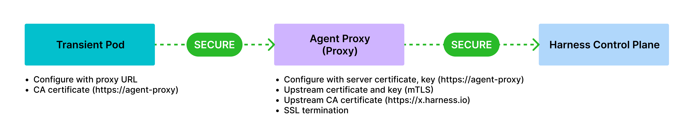
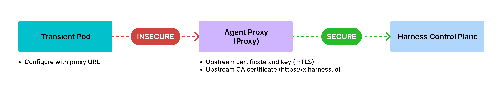
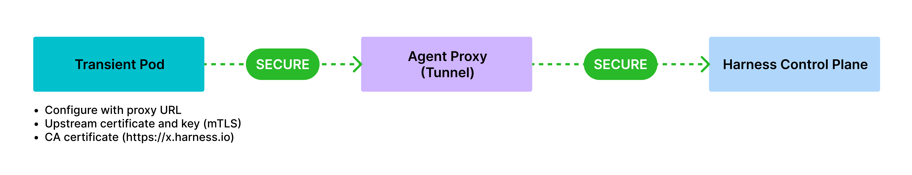

This topic describes why mTLS is required, and introduces Harness Network Proxy (HNP) and its configuration modes.

## Why is mTLS required?

In Harness, agents (execution plane) communicate with the manager (control plane) using a token-based mechanism. While Harness manages token generation and security, some users may require additional authentication mechanisms they can control. Mutual TLS (mTLS) provides a solution by enforcing client and server authentication.

### Traditional TLS versus Mutual TLS (mTLS)

<table>
<thead>
    <tr>
        <th>Traditional TLS</th>
        <th>Mutual TLS</th>
    </tr>
</thead>
<tbody>
    <td>The server holds the certificate and key, while the client uses a CA to validate the server's identity.</td>
    <td>Users upload a public CA certificate to the server and configure agents with certificates and keys. This ensures authentication happens under user's control.</td>
</tbody>
</table>

## Harness Network Proxy (HNP)
To enhance execution plane security, Harness introduces an optional component: Harness Network Proxy or HNP that operates in the execution plane. It is a long running component on which you can enable mTLS support. 
The transient runner (DDCR) communicates the results (or status) of the chaos experiment through HNP.

### Install HNP

You (as the user) can install and manage HNP using Helm. This ensures that sensitive data like mTLS secrets and keys remain entirely under the user's control. For detailed steps on the installation, go to [installation](/docs/chaos-engineering/use-harness-ce/infrastructures/types/ddcr/proxy-support#installation).

### Deploy HNP

HNP can be deployed in multiple modes, providing flexibility based on the user’s security and operational requirements. They are described below.

1. **End-to-End mTLS Communication**

    

    Both the transient pod and HNP use mTLS certificates and keys, which ensures full end-to-end encryption between the transient pod, HNP, and the manager.

    This is recommended for users requiring strict security controls across all communication layers.

2. **mTLS Enabled on HNP (Reverse Proxy Mode)**

    

    HNP holds the mTLS certificate and key, which centralizes mTLS secret management, eliminating the need to create and manage mTLS secrets in multiple locations.

    **Communication**

    - Transient pod ↔ HNP: Can be configured for insecure communication (for example, within a user-controlled environment).
    - HNP ↔ Upstream (DDCR/Manager): Secure mTLS communication. It is ideal for you if you prioritize ease of management without compromising upstream security.

3. **HNP as an HTTP Tunnel**

    

    HNP acts as an HTTP tunnel to establish an end-to-end encrypted TLS session with the upstream.
    
    **Requirements**: The user needs to create a Kubernetes TLS secret containing the mTLS certificate and key. The transient pod can leverage the standard `https_proxy` environment variable to route communication via the HNP.
    This is best suited for setups requiring HTTPS tunneling through a proxy layer with full encryption.