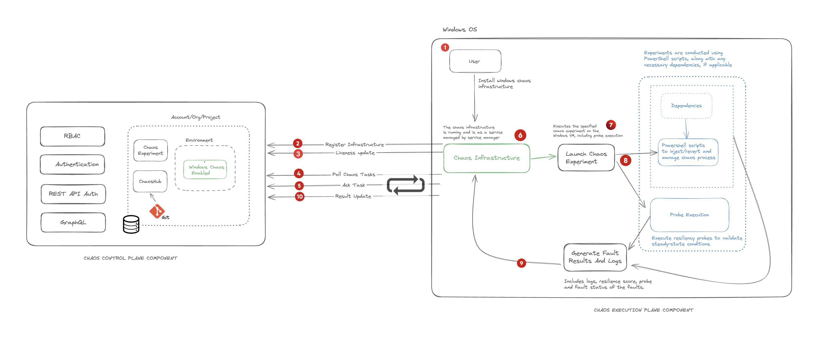

This topic describes the flow of control when you execute a Windows experiment in Harness Chaos Engineering.

The diagram below describes the interaction between the chaos control plane component and the execution plane component for a Windows experiment. 

The **Control Plane** creates and manages chaos experiments and the **Execution Plane** runs these chaos experiments on Windows infrastructure and sends back the results.

## Step 1: Install Infrastructure
The Windows infrastructure runs as a service (managed by the service manager). After [installing the Windows infrastructure](https://developer.harness.io/docs/chaos-engineering/use-harness-ce/infrastructures/types/legacy-infra/windows#prerequisites-to-install-infrastructure) in the execution plane (required to poll tasks), it is registered in the control plane. The next steps are described below:

## Step 2. Poll Chaos Tasks

The execution plane (chaos infrastructure) polls the control plane to fetch chaos tasks. Once a chaos task is assigned to the infrastructure by the control plane, the infrastructure acknowledges receipt of the task back to the control plane. 

## Step 3: Execute Experiment

An experiment is created (along with the resilience probes) in the environment (specific to an account or a project), and launched in the execution plane. Windows experiments use Powershell scripts to inject (or revert) chaos processes. The experiment metadata is stored in a database (MongoDB).

## Step 4: Generate Fault Results

The logs of the experiment, including the resilience score, and fault statuses are generated and sent to the control plane.