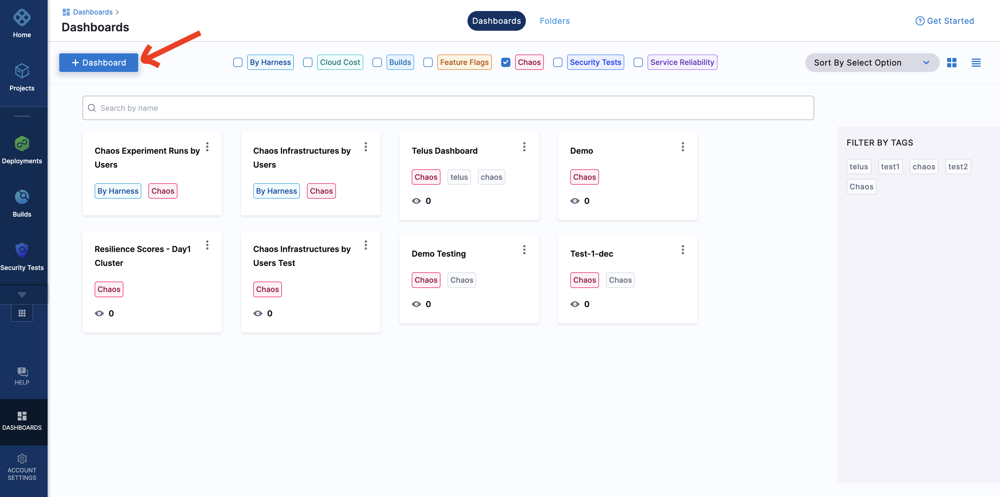
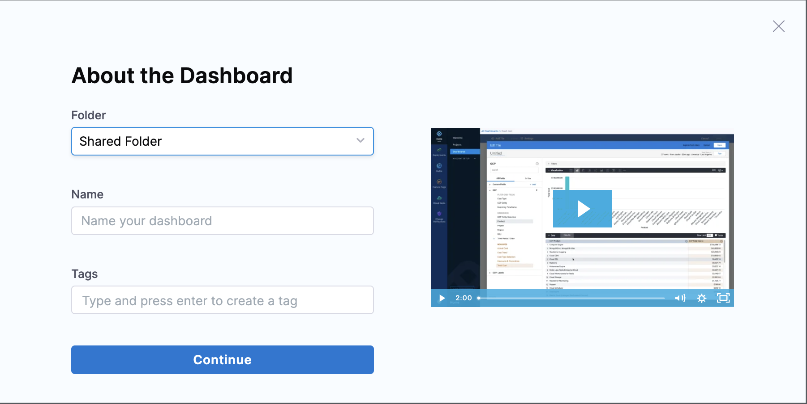
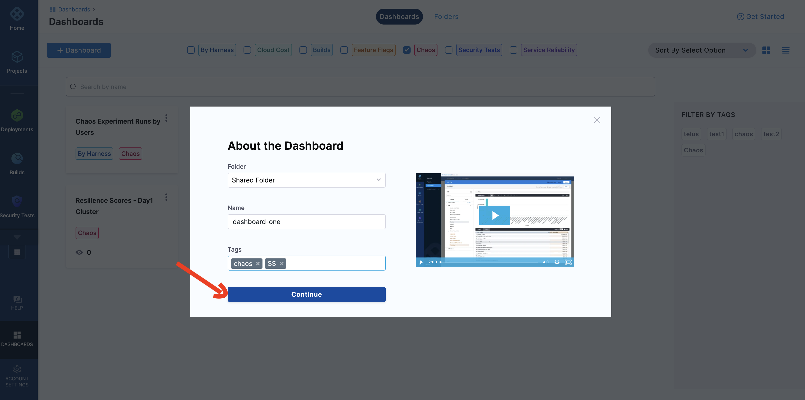
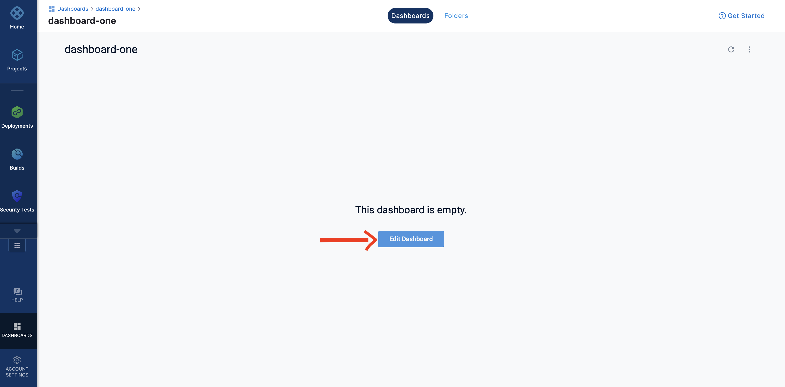
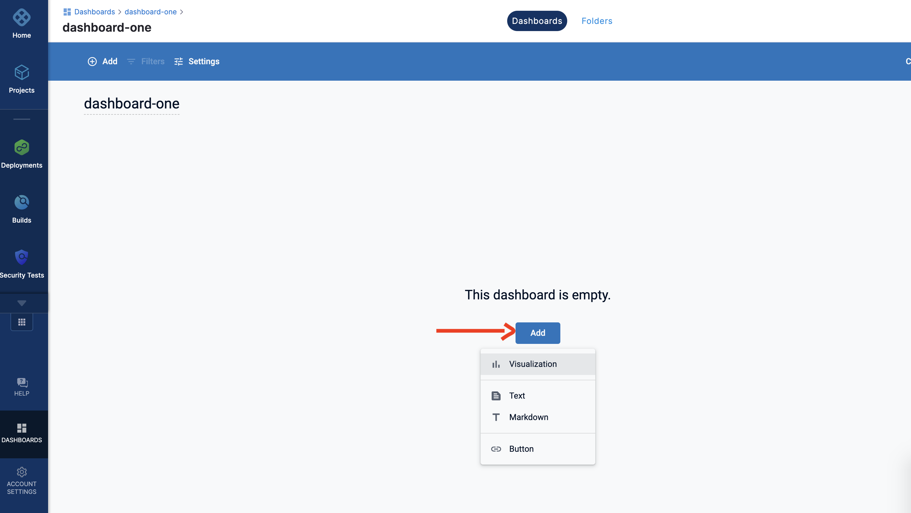
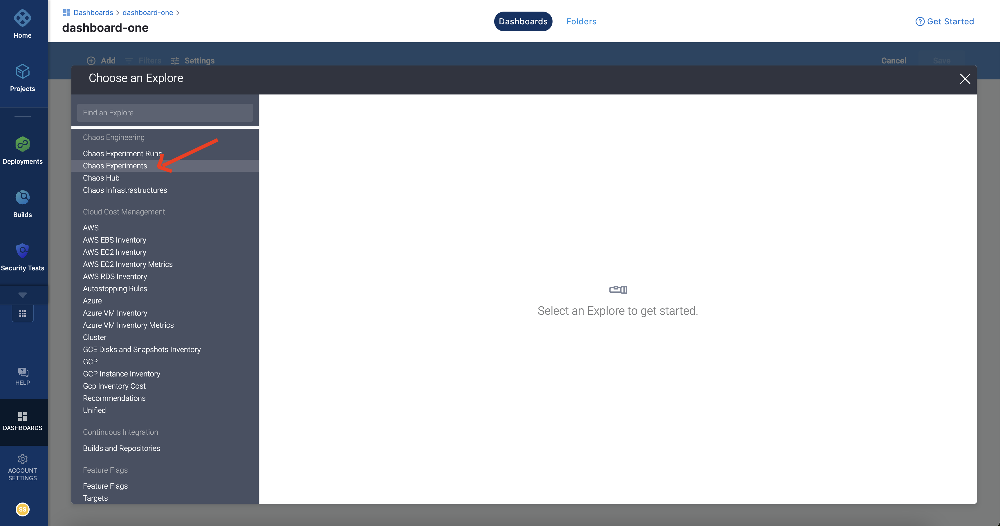
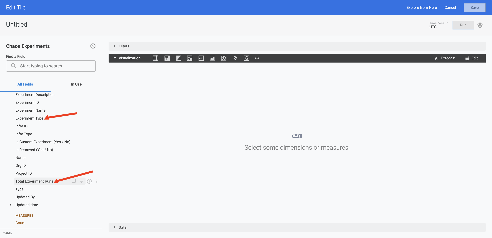
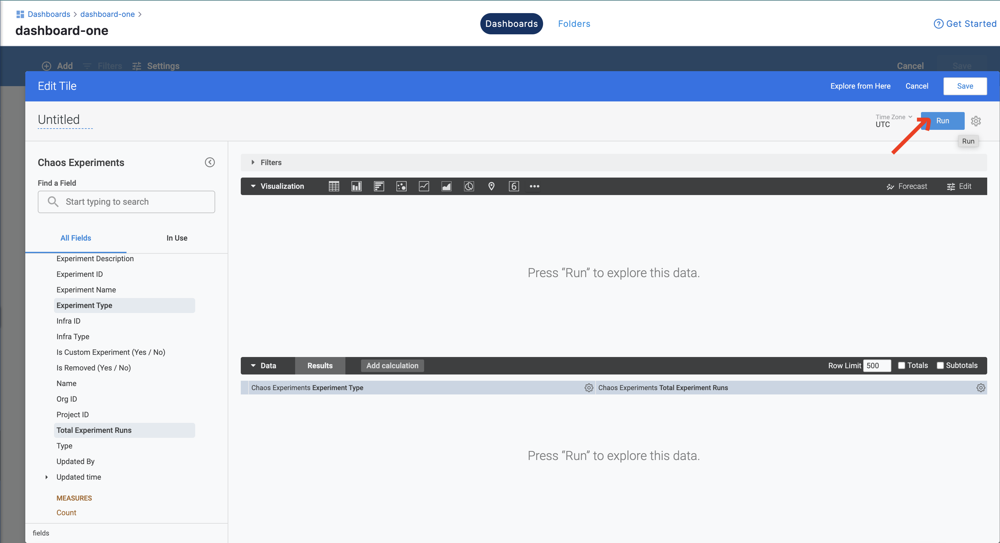
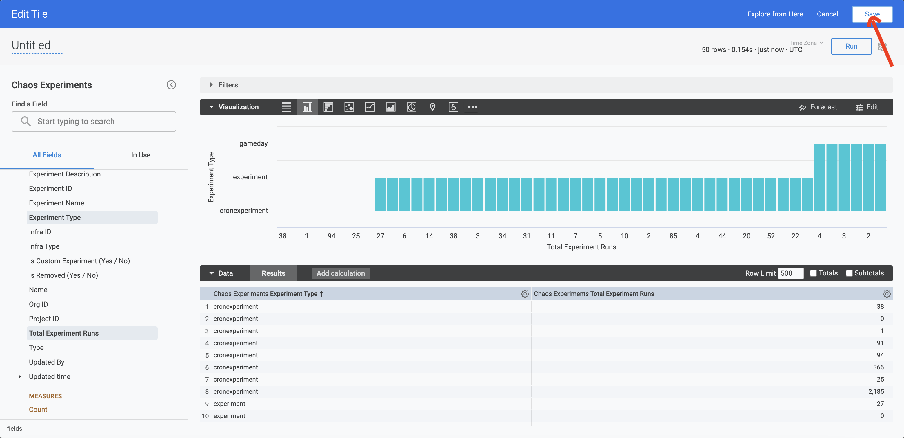

This section will guide you through creating a new chaos dashboard, and creating custom visualizations for various entities of a chaos experiment.

## Before you begin

Refer to [overview of chaos dashboards](./overview) to understand what a chaos dashboard is, and how you can view a predefined chaos dashboard.

## Create a new visualization 
To create a new visualization in a dashboard, follow the steps mentioned below.

### Step 1: Click Dashboard
To create a new dashboard, click **Dashboard**.

### Step 2: Specify parameters
Add values for **Folder**, **Name**, and **Tags** (compulsory). 

Click **Continue**. This creates an empty dashboard. You can add visualizations (also known as **panels**) by editing this dashboard.

### Step 3: Edit previously created dashboard
Click **Edit Dashboard** to edit the dashboard that you created in the previous step.

:::tip
Don't forget to add the **Tag** values because this is the field based on which the dashboards are filtered by modules. 
:::

### Step 6: Add a visualization dashboard
Click **Add** and select **Visualization**.

### Step 5: Select a table
Select a table whose fields you wish to visualize. HCE currently supports **Chaos experiment runs**, **Chaos experiments**, **Chaos hub**, and **Chaos infrastructures**. In this example, select **Chaos experiments**.

### Step 6: Select fields
Select the 2 or more fields which you wish to visualize. In this example, select **Experiment Type** and **Total experiment runs**.

### Step 7: Click Run to view the graph
When you click **Run**, chaos dashboard displays the graph of **Total experiment runs** (x-axis) versus **Experiment Type** (y-axis).

### Step 8: Click Save (Optional)
If you wish to save your visualization, click **Save**. Otherwise, you can **Cancel** and add visualizations again. 

:::info note
You can find the definitions for many of the fields [here](../../get-started/key-concepts).
:::

## Next steps

[Best practices to build effective dashboards](../../../platform/dashboards/dashboard-best-practices) 