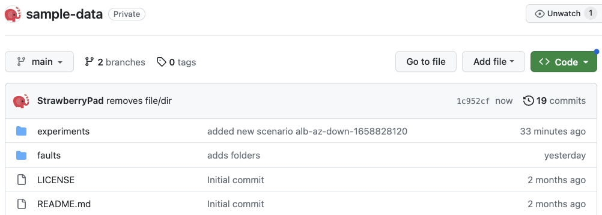

## Chaos hub

This section introduces you to chaos hub, and how you can add a chaos hub to your project.

A chaos hub is a collection of experiment templates and faults that you can use to create and launch chaos experiments. 
Experiments are templates to create new chaos experiments, which contain a collection of chaos faults and certain custom actions ordered in a specific sequence. Faults refer to the failures injected as part of an experiment. Both experiments and faults are stored as manifests in an appropriate directory structure. Hence, you can add new experiment templates and faults directly to the repository as files. In addition, you can derive the experiment templates from the existing experiments and save them to the Chaos Hub from the UI.

Chaos hub is a collection of manifests and charts that represents the experiments and faults which exist as a part of the hub.
You can add Chaos Hub using a Git service provider such as GitHub, where Chaos Hub exists as a repository. This allows native version control and management of the faults and experiment artifacts.

HCE provides a default **Enterprise Chaos Hub** that includes a wide array of templates and faults out of the box. You can also add your own custom chaos hubs to maintain and share private experiments and faults within your organization.

There are several reasons for adding a custom chaos hub. A custom hub lets you:

* Add custom experiments suited to specific needs in your organization.

* Share your experiments with others in your Harness project or in other Harness projects—you can add the same custom hub(s) to many projects.

* Maintain and upgrade experiments in one place so those you share your hubs with always have the latest version.

* Provide secure access to your custom experiments.

This topic shows how to add and connect a custom chaos hub. 

## Prerequisites to adding a custom chaos hub

1. Be sure you have a Git repository for your custom chaos hub, where you will store experiments and faults. The repository must include two folders: `experiments` and `faults`. Here's an example repo:

	

1. Generate a personal access token [from GitHub](https://github.com/settings/tokens) to access and sync your repository with Harness. The token must have at least the **repo** scope.

	

## Add a custom chaos hub

To add a custom chaos hub:

1. In your Harness project, navigate to the **Chaos > ChaosHubs**, and then select **+ New ChaosHub**.

1. Enter a **Name** for the hub and, optionally, add a **Description** and **Tags**.

1. Select **Continue**.

1. On the Git Connection screen, add a new Git connector to access and sync your repository with Harness. 

	

	1. Select the field **ChaosHub Connector**. This displays existing Git connectors listed under separate tabs for Project, Organization, and Account scopes. 

		

	1. Select **New Connector**, and then choose **GitHub Connector**.

	1. In the Overview screen, enter a **Name** and optional description and tags, and then select **Continue**.

		The Details screen is displayed.

		

	1. In the Details screen, for **URL Type**, select **Repository**. 

		You can select **Account** instead if you want to create an account-scoped GitHub connector. This may be used for connecting multiple Chaos Hubs from a single GitHub account. 

	1. For **Connection Type**, select **HTTP**. 

	1. In **GitHub Repository URL**, enter the URL of your custom chaos hub repository.

		If you selected **Account** for **URL Type**, fill out these fields instead:

		* In **GitHub Account URL**, enter the account URL for your custom chaos hub repository.  

		* In **Test Repository**, enter any repository name from your GitHub account to validate the connection.

	1. Select **Continue**.

		The Credentials screen is displayed.

		

1. On the Credentials screen, enter the **Username** (in plain text) for authenticating with your GitHub repo.

1. In **Personal Access Token**, select **Create or Select a Secret**.

	This displays all the secrets in separate tabs for Project, Organization, and Account scopes. 

	

1. Select **New Secret Text**.

	

1. In the Add new Encrypted Text screen, fill out the fields as follows:

	1. In **Secret Name**, enter a name for this secret.
	1. In **Secret Value**, enter a personal access token (PAT) generated from [GitHub](https://github.com/settings/tokens).

		Ensure that the token has at least a [**repo**](#prerequisites) scope. 

1. Select **Save**, and then on the Credentials screen, select **Continue**.

	

	This adds your GitHub repo connector and initializes the PAT for authentication. 

1. In the Connect to provider screen, select **Connect through Harness Platform**, and then select **Save and Continue**.

	This starts a connection test, which validates that Harness is able to access the Git repository with the given configuration. 

	

1. When the test is successful, select **Finish**.	

	The Git Connection screen is displayed. 

	

1. In **Hub Repository Branch**, enter the repository branch in which the Chaos Hub files exist. 
1. Select **Connect Hub**, and then select **Finish**.

	Your new custom chaos hub appears in the **ChaosHubs** page.

:::info note
To share your custom chaos hub with another Harness project, add the hub to the other project, using the same procedure above.
:::

## Next steps

Now you can add and launch experiments in your custom chaos hub, or add YAML fault and experiment definitions directly in your chaos hub GitHub repo, and then sync it with Harness. Head to [Manage custom chaos hubs](/docs/chaos-engineering/configure-chaos-experiments/chaos-hubs/manage-hub) for details.
