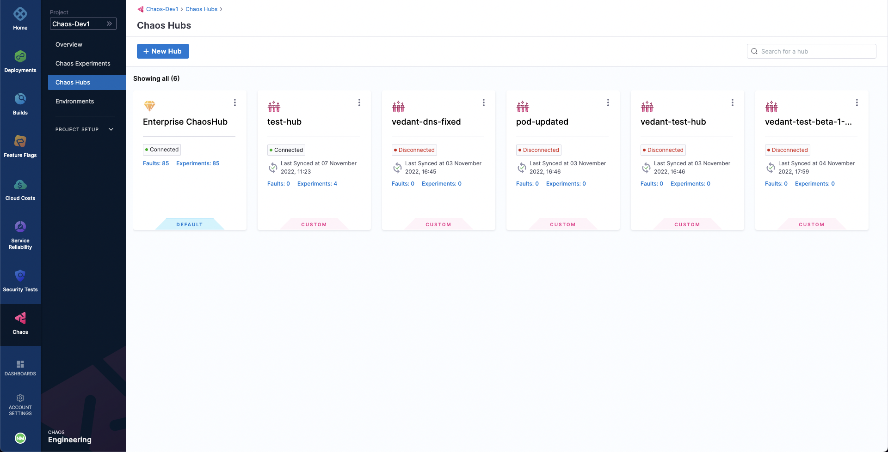
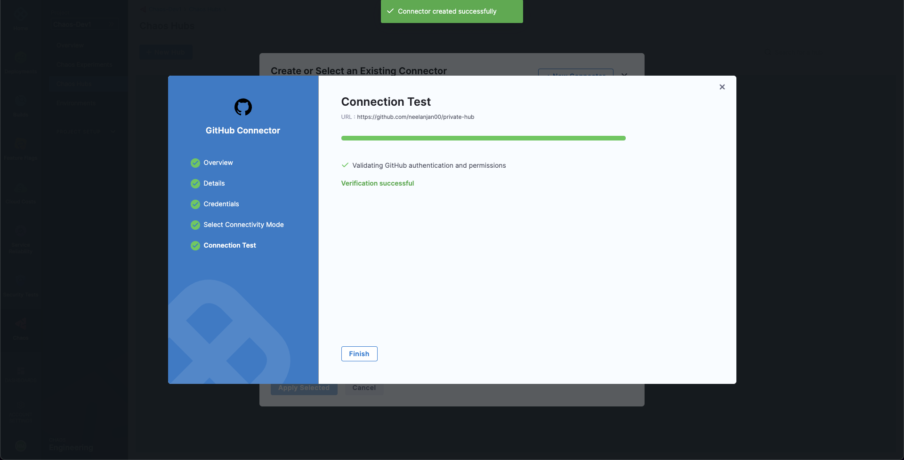
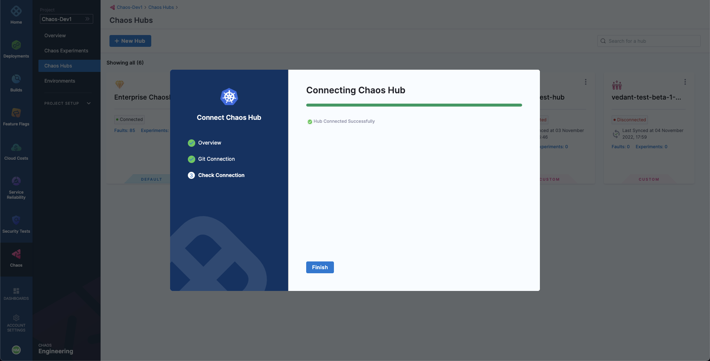
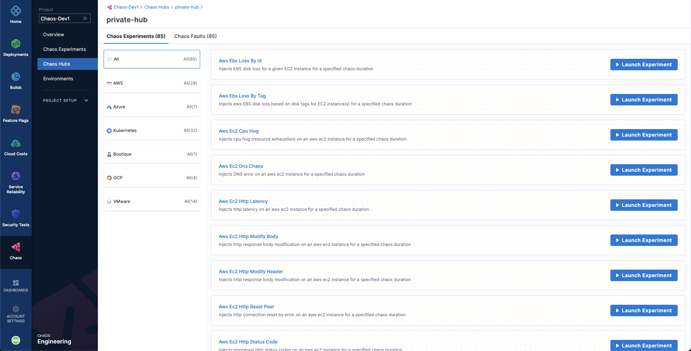

Chaos Hub is a collection experiment templates and faults using which new chaos experiments are created. While you get a default Enterprise Chaos Hub, which offers a wide array of templates and faults out of the box, you can also add a custom Chaos Hub to maintain and distribute private faults and experiments within your organization.

To get started, ensure that you have your custom Chaos Hub in a Git repository, such as GitHub, as follows:

Next, head to the **Chaos Hubs** page. This page lists all the chaos hubs that are presently available. To add the private hub, select **New Hub**.

Provide a name for the hub. Optionally, a description and tags can also be added. Select **Next**. 

Now, we need to add a Chaos Hub connector i.e. a Git connector for syncing the custom Chaos Hub repository. Under **Chaos Hub Connector** you'll find the existing Git connectors listed under the Project, Organization, and Account scope. Select **New Connector**.

Choose **GitHub Connector**. Add a name for the connector. Optionally, a description and tags can also be added. Select **Next**.

For URL type, select **Repository**. You can also select **Account** in case you want to create a Account scoped GitHub connector, which may be used for connecting multiple Chaos Hubs from a single GitHub account. 

The connection type can be **HTTP**. Lastly, provide the custom Chaos Hub repository URL. Alternatively, if you need to provide an account URL, in case URL Type was selected as **Account**. Also, provide any Test Repository name from your GitHub account to validate the credentials.

Then, select **Next**.

For Credentials, Username and Token can be used for authenticating with GitHub. Under **Username**, provide your GitHub username as plain text. Next, a GitHub Personal Access Token needs to be provided as a Secret. Select **Create or Select a Secret**.

You'll be able to view all the Secrets in the Project, Organization, and Account scope. Select **New Secret Text**.

To add the secret, provide the secret name. Optionally, a description and tags can also be added. Then, provide the PAT under **Secret Value**. In case you haven't already created a GitHub PAT, provided that you're logged in to GitHub, head over to [GitHub Tokens](https://github.com/settings/tokens) and generate a new token (classic). Please ensure that the token at least has a **repo** scope. Finally, select **Save**.

This would add your GitHub repo connector and initialize the PAT for authentication. Select **Continue**.

Select **Connect through Harness Platform** for the connectivity mode. Finally, select **Save and Continue**.

This should prompt a connection test, which validates that Harness is able to access the Git repository with the given configuration. Select **Finish**.

This concludes the process of adding the Chaos Hub connector. For the **Hub Repository Branch**, provide the repository branch in which the Chaos Hub files exist. Lastly, select **Connect Hub**.

This should prompt a connection test, which validates that the custom Chaos Hub is properly setup. Select **Finish**.

You've now added your custom Chaos Hub. You can browse the Experiments and Faults available as part of it by selecting it. 

