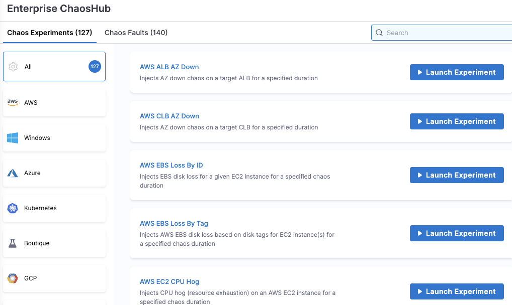
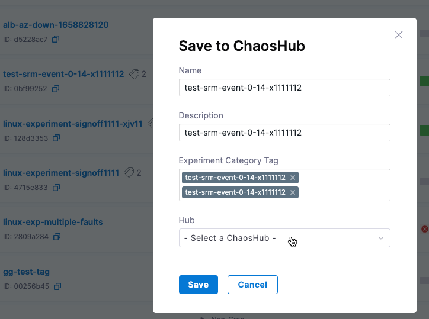

import Launch from '../shared/launch-experiment-from-hub.md'

This topic shows how to save and manage experiments in your custom chaos hub(s), and how to sync your chaos hub GitHub repo with Harness. Go to [Add a custom chaos hub](/docs/chaos-engineering/configure-chaos-experiments/chaos-hubs/add-chaos-hub) for setup instructions.

## View chaos hubs

The experiments you see in various chaos hubs are actually templates from which you can launch the experiments after specifying some details. 

To view the default and custom chaos hubs:

1. In Harness, navigate to **Chaos > ChaosHubs**.

	This page lists the default Enterprise Chaos Hub, and any custom chaos hubs.

	

1. Select the chaos hub you want to view.
	
	The experiments below are in a custom hub. All experiments are displayed by default. You can select a tag (circled below) to see experiments with that tag applied.

	

	The experiments below are in the default Enterprise Chaos Hub. They are organized by platform/technology.

	

## Add experiments to a custom chaos hub

When you add an experiment to a custom chaos hub, it's saved as a template from which you can [launch](#launch-an-experiment-from-a-custom-chaos-hub) the experiment after specifying some details.

To add an experiment to a custom chaos hub:

1. [Create an experiment](/docs/chaos-engineering/configure-chaos-experiments/experiments/construct-and-run-custom-chaos-experiments) as usual.

1. In the Chaos Experiments page, find the experiment you want to add to a custom chaos hub, select the **More options** icon (**⋮**), and then select **Add to ChaosHub**.

	

1. In the Save to ChaosHub screen, verify the **Name**, **Description** and **Experiment Category Tag**. 

	To add a new tag, type its name and then press the Enter/Return key.

	

	:::tip
	Including **Experiment Category Tag(s)** helps organize your experiments. When you [view](#view-chaos-hubs) the custom chaos hub, you can see all experiments as well as experiments grouped by tag.
	::: 

1. Select the **Hub** field, choose the custom chaos hub you want to add the experiment to, and then select **Apply**.

1. Select **Save**.

	This saves your experiment as a template in a custom chaos hub.

:::info note
You can also save an experiment as a template to a custom chaos hub when [creating the experiment](/docs/chaos-engineering/configure-chaos-experiments/experiments/construct-and-run-custom-chaos-experiments) in Chaos Studio. The **Save** button saves the experiment itself so that it appears on the Chaos Experiments page. Selecting the **down-arrow** next to **Save** lets you add the experiment as a template to a custom chaos hub.

:::

## Sync Harness with a chaos hub Git repository

When you [connect a custom chaos hub](/docs/chaos-engineering/configure-chaos-experiments/chaos-hubs/add-chaos-hub), you can add and edit experiments in that hub in either Harness or the custom hub's GitHub repository. When you make changes in Harness, your repository is synced automatically. When you make changes in your repository, you must sync it with Harness using the UI.

To sync your custom chaos hub's git repo with Harness:

1. In Harness, navigate to **Chaos > ChaosHubs**.
1. Select the **More options** icon (**⋮**) for the hub you want to sync, and then select **Sync Hub**.

	

## Launch an experiment from a chaos hub

<Launch />

