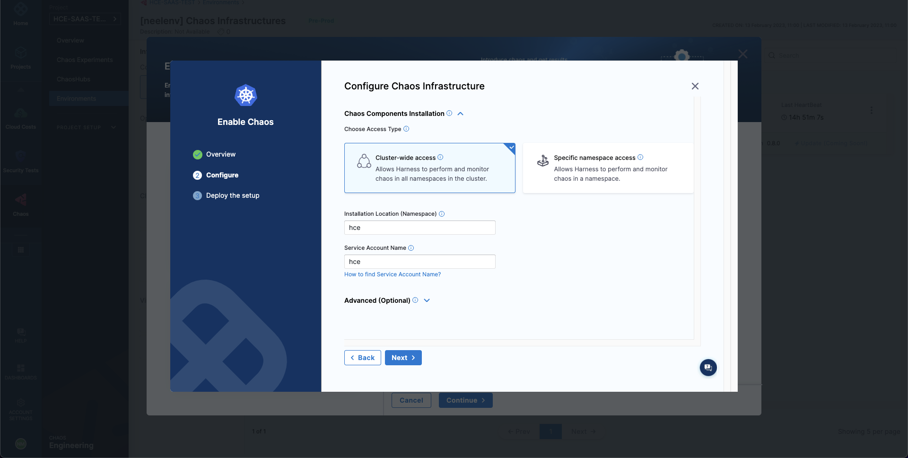

```mdx-code-block
import Tabs from '@theme/Tabs';
import TabItem from '@theme/TabItem';
```

Chaos infrastructure is a service that runs in your target environment and aids Harness Chaos Engineering (CE) in accessing and injecting chaos at cloud-native scale. There are different types of chaos infrastructure based on the target environments, such as Kubernetes, Linux VMs, etc. These chaos infrastructures can be installed as a Kubernetes service, as a Linux daemon, and so on, based on their type.

All the chaos infrastructure services adhere to the principle of least privilege, where the services execute with the minimum number of required permissions.

Let us jump into the steps involved in connecting chaos infrastructures.

## Create an environment
- To add a chaos infrastructure to your target environment, create a new environment where you want the chaos infrastructure to exist.
- Navigate to the **Environments** page, which lists all the environments added as part of your project.
- Choose **New Environment**.


- In the **Create a new environment** screen, specify a name for the environment.
- You can optionally add a description and a tag. Select an **environment type**, that is, **Production** or **Non-Production**. Click **Create**.

This creates a new environment.


## Add a chaos infrastructure

```mdx-code-block
<Tabs>
  <TabItem value="Kubernetes">
```

To add a chaos infrastructure to your environment, select **New Chaos Infrastructure**.

:::tip
You can either setup a chaos infrastructure on existing infrastructures that uses a Harness cluster connector, that is, Harness Kubernetes connector or install the chaos infrastructure on a new infrastructure.
:::

### On existing infrastructures
To install the chaos infrastructure on an existing Harness Kubernetes connector,
- Select **On Existing Infrastructures** on the screen.
- Use any connector under the **Project**, **Organization**, and **Account** scope.


:::info
1. A Harness Kubernetes connector with cluster-wide read/write access can be used to set up chaos infrastructure in cluster scope and namespace scope.
2. A Harness Kubernetes connector with cluster-wide read access **can't** be used to set up a chaos infrastructure.
3. A Harness Kubernetes connector with specific namespace access can be used to set up a chaos infrastructure in that specific Kubernetes namespace scope only.
:::

### On a new infrastructure
To install the chaos infrastructure on a new infrastructure,
- Select **On New Infrastructures**. Select **Continue**.
- Provide a name for the infrastructure. Optionally, you can also provide a description and tags. Select **Next**.
- Under the installation mode, choose **Cluster Wide** or **Namespace Mode** to install the chaos infrastructure.

:::note
**Cluster-wide mode:** This mode of infrastructure installation allows targeting resources across the entire cluster, that is, all the namespaces, as part of an experiment.

**Namespace mode:** This mode of infrastructure installation allows targeting resources only in the namespace where the chaos infrastructure is deployed.
:::

- By default the installation will take place in the `hce` namespace and uses `hce` service account, which can be configured under the K8s cluster details.
- Optionally, you can also specify the node selectors and Kubernetes tolerations for chaos infrastructure deployment.


:::tip
- There can only be one cluster-wide chaos infrastructure per cluster.
- There may be multiple namespace-scoped chaos infrastructures per cluster.
:::



- Click **Next**. In the final step, if you are deploying to an existing infrastructure with Harness Kubernetes Delegate, Harness installs the chaos infrastructure on your behalf.
- If you are setting up the chaos infrastructure on a new infrastructure, you will need to execute the given commands and/or download and apply the installation manifest (YAML file).

For the cluster-wide setup, you will see a single command that you can apply.


For the namespace mode setup, you will see **three** commands which you need to apply. These commands perform the below actions, respectively.
1. Create the target namespace,
2. Apply the chaos CRDs,
3. Install the chaos infrastructure.


- Select **Done**.

```mdx-code-block
  </TabItem>
  <TabItem value="Linux">
```

:::info
If you're installing the chaos infrastructure alongside selinux, which is enabled by default in distributions such as **CentOS**, **SUSE Linux**, **RHEL**, and **Fedora** among others, you'll need a module to enable `timedatectl`.

<details>

If you have enabled SELinux for your OS, a policy module needs to be added prior to the installation of the infrastructure to access `timedatectl`, which is being used in the **linux-time-chaos** fault.

Firstly create the following file `timedatectlAllow.te` in your Linux machine:
```te

module timedatectlAllow 1.0;

require {
        type systemd_timedated_t;
        type initrc_t;
        class dbus send_msg;
}

#============= systemd_timedated_t ==============
allow systemd_timedated_t initrc_t:dbus send_msg;

```

Next, install the utilities that will help in compiling and packaging the policy module for your system. Here, we're using the yum package manager to install them:
```bash
sudo yum install -y policycoreutils-python checkpolicy
```

After the installation of these packages, compile the policy module with the following command:
```bash
sudo checkmodule -M -m -o timedatectlAllow.mod timedatectlAllow.te
```

This results in the creation of the binary policy module file `timedatectlAllow.mod`. We can use it to create a policy module package:
```bash
sudo semodule_package -o timedatectlAllow.pp -m timedatectlAllow.mod
```

This creates the policy module package file `timedatectlAllow.pp` which can be now added alongside the other SELinux modules in your system:
```bash
sudo semodule -i timedatectlAllow.pp
```

With that, the SELinux policy module has been added, you can proceed to install the infrastructure.

</details>
:::

* Select **Linux** as the **Infrastructure type**, and select **Enable chaos**.


* Specify details to enable chaos on LCI, including the name of the infrastructure and optionally a description and tags. Additionally, you can also specify the [advanced setup](./linux-chaos-infrastructure-advanced-management.md#advanced-setup) options for the infrastructure. Then, select **Next**.


* Copy the command, select **Done**, and execute the copied command in your Linux machine.


```mdx-code-block
  </TabItem>
</Tabs>
```

## Validate the chaos infrastructure installation
- After applying the manifest, Harness will take some time to set up all the chaos infrastructure resources. Once everything is set up, the chaos infrastructure's connection state reflects `CONNECTED`.


That's it! Now you are all set to inject chaos into your infrastructure.