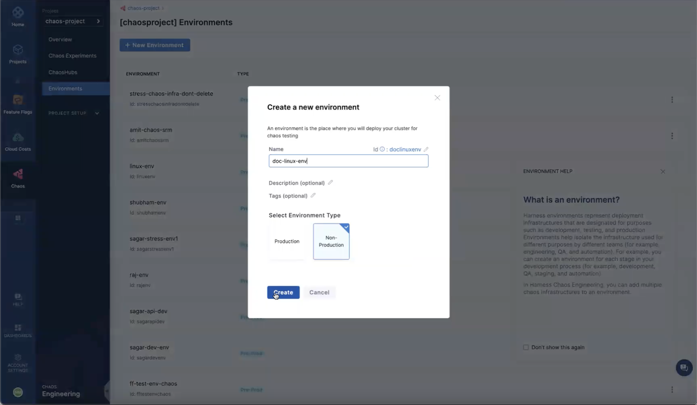
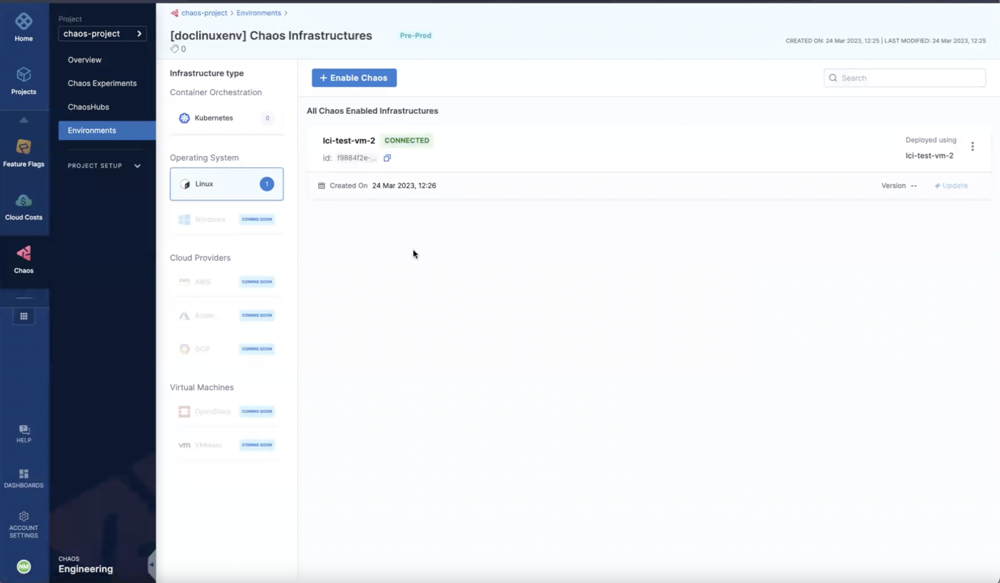
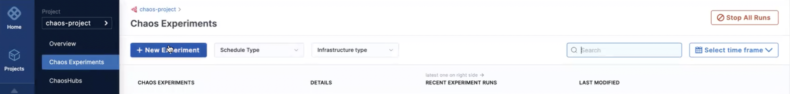
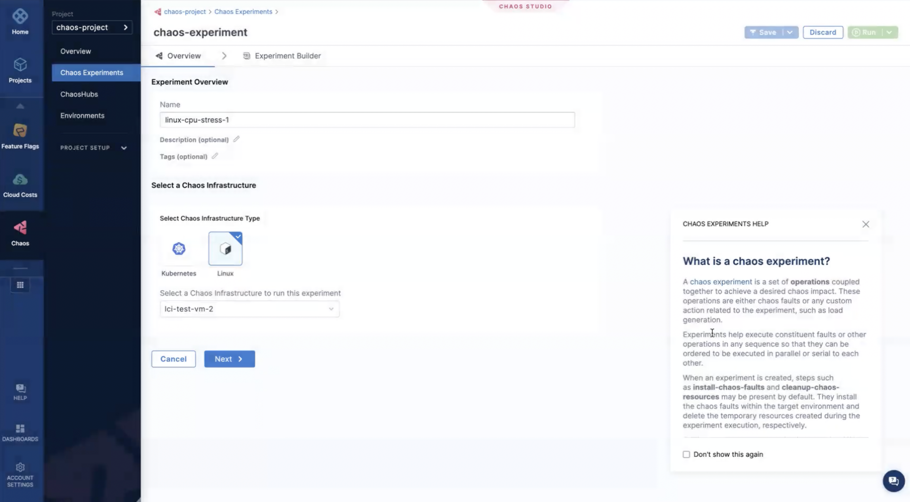
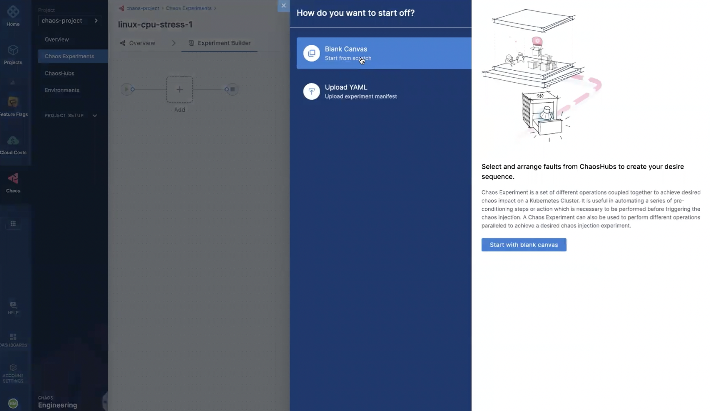
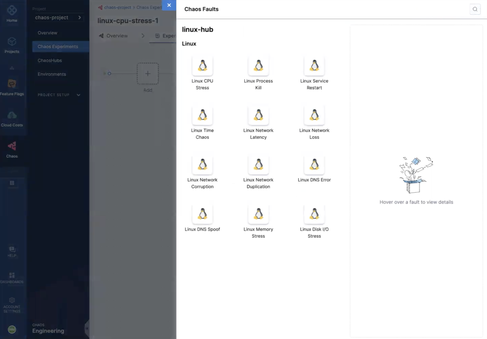
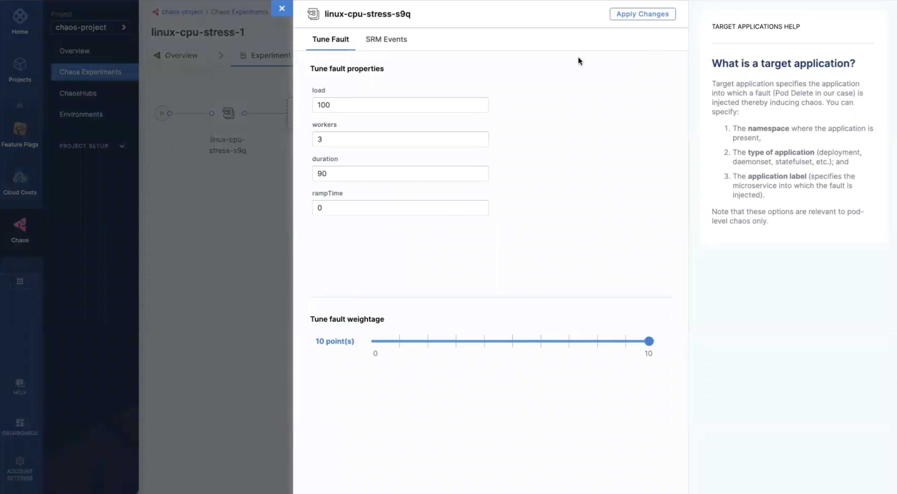
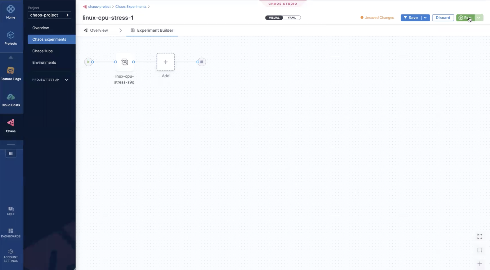
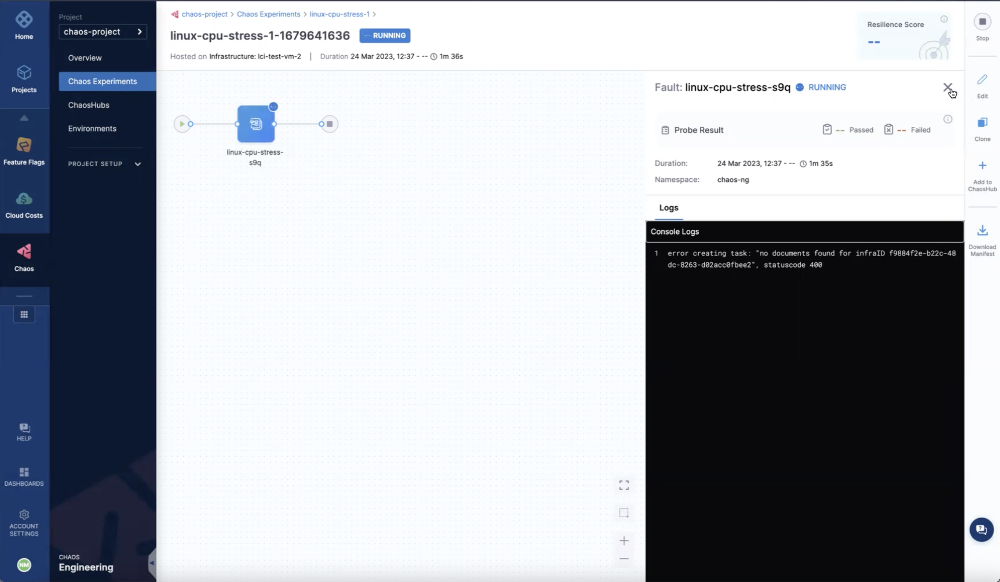

## Introduction
This section describes how HCE can be used to inject chaos into Linux machines on the Linux Chaos Infrastructure (LCI). Connecting to LCI, creating experiments, running them, and then disconnecting from LCI is similar to performing the same steps on [Kubernetes infrastructure](./connect-chaos-infrastructures).

## Steps to inject chaos into LCI
1. Connect to LCI,
2. Configure chaos on LCI and deploy it,
3. Add faults to the deployed LCI,
4. Run the experiment.

Described below are the detailed steps to inject chaos and run experiments on LCI.
### 1. Connect to LCI
* To connect to LCI, create a new environment, and specify the details of the environment. Select **Create**.

* Select **Linux** as the **Infrastructure type**, and select **Enable chaos**.

### 2. Configure chaos on LCI and deploy it
* Specify details to enable chaos on LCI, and select **Next**.

* Copy the command, select **Done**, and execute the copied command in your Linux machine.

	
 Verify LCI installation 

To verify that the infrastructure has been created, click **Environments**.

### 3. Add faults to the deployed LCI
* Select **Chaos Experiments** and **New Experiment**.

* Specify details of the experiment, and select **Linux** as the chaos infrastructure (on which the experiments would be executed). Select **Next**.

* Select **Blank canvas** and **Start with blank canvas**.

* Select the experiments you wish to execute, from the available experiments in the chaos hub.

* For the faults you selected, specify the values for the tunables, add fault weights, and select **Apply changes**.  

### 4. Run the experiment
* Once you have created the experiment by adding faults, select **Run** to run the experiment.

* You can view the experiment's execution by selecting it.

## Steps to delete LCI
Deleting a Linux infrastructure involves two steps:
1. Select the infrastructure to delete,
2. Execute the command to delete the infrastructure.

### 1. Select the infrastructure to delete
* Select **Environment** and choose the infrastructure you wish to delete. Select **Disable**.

### 2. Execute the command to delete the infrastructure
* It displays a command on the screen. Copy this command, and select **Confirm**. Execute the command in your Linux machine. 

## Conclusion
In this section, you learned how to connect to LCI, perform experiments on it, and delete LCI. Go to [advanced setup](./linux-chaos-infrastructure-advanced-management) to learn more about Linux chaos infrastructure.
