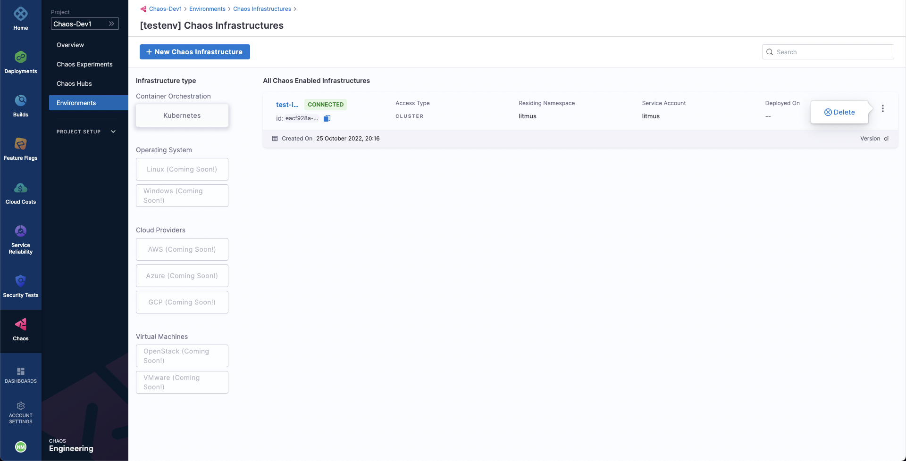

```mdx-code-block
import Tabs from '@theme/Tabs';
import TabItem from '@theme/TabItem';
```

Disconnecting and deleting a chaos infrastructure removes it from the environment in which it resides. It also removes the infrastructure services from the Kubernetes cluster.

To remove the chaos infrastructure, first go to the **Environments** sidebar option under the **Chaos** tab, where all the environments created under the current project are listed. Select the environment in which the chaos infrastructure to be deleted resides.

```mdx-code-block
<Tabs>
  <TabItem value="Kubernetes">
```
To disconnect a Kubernetes infra, select the `⋮` icon against the chaos infrastructure name and select **Disable**.



Next, execute the commands displayed in the modal from your terminal to remove the chaos infrastructure components. Finally, select **Confirm**.


```mdx-code-block
  </TabItem>
  <TabItem value="Linux">
```
To disconnect a Linux infra, select the `⋮` icon against the chaos infrastructure name and select **Disable**.


Next, copy the command displayed in the modal, and execute it in your Linux machine to uninstall the chaos infrastructure components. Finally, select **Confirm**.


```mdx-code-block
  </TabItem>
</Tabs>
```

With that, the chaos infrastructure will be disconnected.