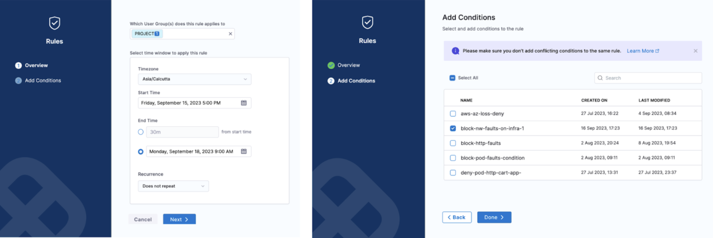

This section walks you through the concepts of ChaosGuard and how they enforce advanced security policies on a chaos-enabled platform.

## Before you begin

[Harness RBAC functionality](../../technical-reference/security/introduction) acts as a first-level security check (or deterrent) that can be leveraged to prevent config-time security issues. It is a platform-wide, generic framework that counts resources from other Harness modules (such as CI/CD/Cloud Cost/Service Reliability, etc.) under its purview. However, chaos has additional requirements to enforce [execution-time security restrictions](./introduction-to-chaosguard). 

## ChaosGuard concepts

ChaosGuard consists of two elements: **Conditon** and **Rule**. 

### 1. Condition
It is an execution plane construct, and is static in nature, i.e. it is often pre-defined (typically configured by the admin personas) and can be stored offline (such as in a conditions library or repository).

The default structure of a condition is to block or deny a fault or set of faults on a given **execution context** associated with a cluster (or namespace), the service(s), and the service account used for the injection process.  

The example below describes the condition as **usergroups doctest and appqa to be blocked from executing network faults**. 

:::tip 
The service account refers to the Kubernetes or Openshift service account. This account is backed by a role (or ClusterRole) and is associated with a native or third-party security policy or admission controller within the cluster, such as PodSecurityPolicy (PSP), SecurityContextConstraint (SCC), Kyverno, OPA Gatekeeper, etc.
With ChaosGuard, by limiting the service account you (as a user) can use within your experiment definitions, HCE limits the privileges you can have within the cluster.
:::

### 2. Rule
It is a high-level construct that controls which users a given condition is applied to and for what period. It can be in an active (enabled) or passive (disabled) state. A rule can contain multiple conditions, and to ensure a successful evaluation, all constituent conditions must be met.

The example below describes the rule as **applicable on the cluster chaosday-k8s-cluster between [5 PM, Friday, Sept 15th] to [9 AM, Monday, Sept 18th] for the specific condition**.

:::tip
Creating the ChaosGuard rules is subject to Harness RBAC policies. By default, these rules are enabled only for the project admin. However, the admin can delegate this to trusted users (typically in multi- or secondary admin scenarios).

:::

## Flow of control
The security evaluation step iterates over every active (or enabled) rule for every experiment run in the project. If the evaluation is successful, you (the user) can proceed with the experiment. Upon failure, you will be blocked from iterating further in the experiment. Below is a flowchart that summarizes the flow of control when a ChaosGuard rule is enabled for a fault or set of faults.

