This section walks you through the configuration of ChaosGuard and how to enable it to mitigate potential security threats from chaos-enabled users with malicious intent.

## Before you begin

[Harness RBAC](./introduction-to-chaosguard) (role-based access control) serves as a prerequisite to understanding [Chaosguard](./chaosguard-concepts), which serves as an execution-time security evaluation. 

## Configuring conditions
Conditions describe a set of constraints that are applied to an execution context. To configure a condition,

1. Click **ChaosGuard** on the left-hand side of the **Chaos** homepage.

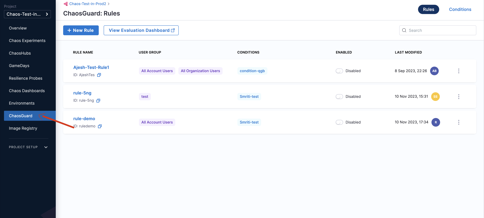

2. Click **Conditions** on the top right corner of the ChaosGuard page. 

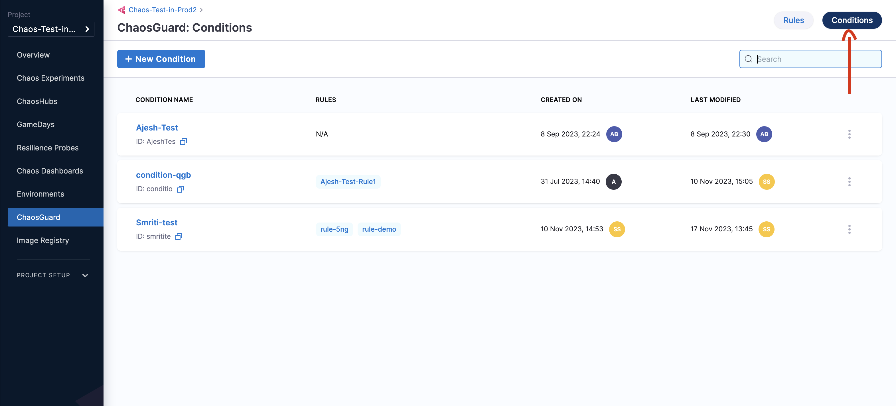

3. Click **New condition**.

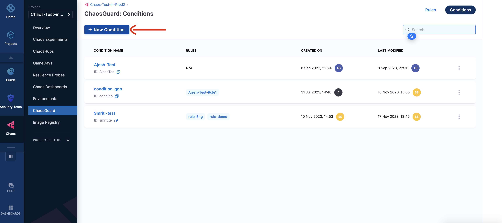

4. Provide a name, a description (optional), and tags (optional).

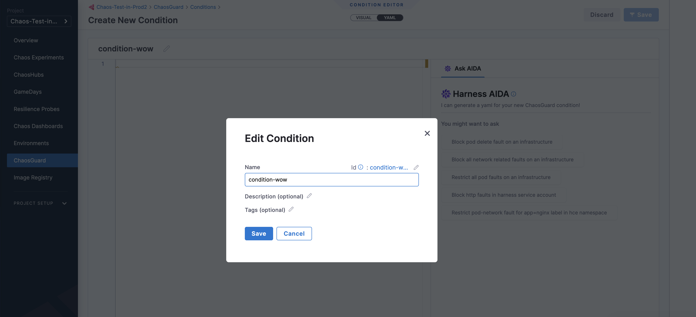

5. Click Save.

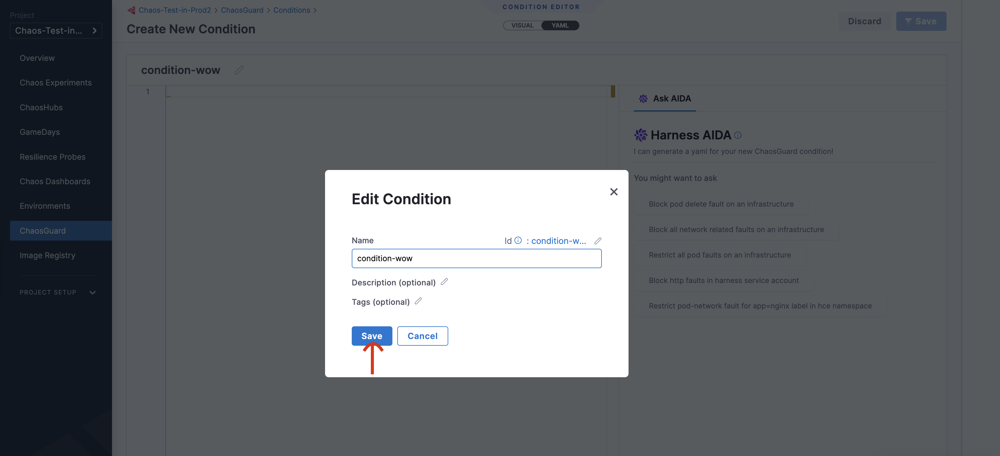

This creates a blank canvas, and you can define the constraints for the condition using a YAML manifest or using the visual editor. 

## Configuring rules

Rules consist of one or more **conditions** that are evaluated as a first step in the experiment run. To configure a rule,

1. On the top right corner of the ChaosGuard page, click **Rules**.

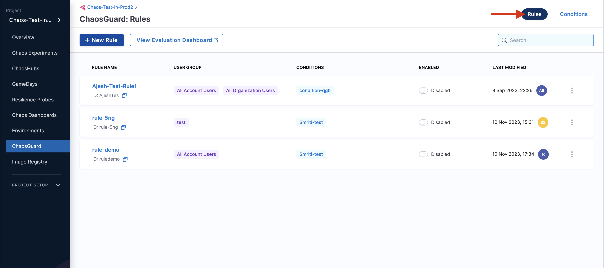

2. Click **New rule**.

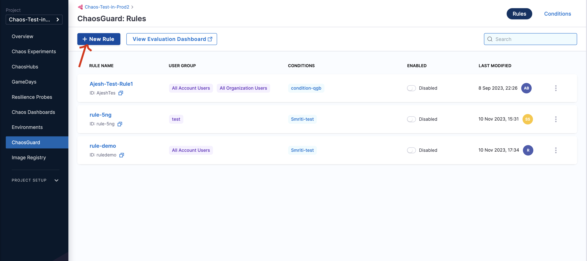

3. Specify parameters such as name, description (optional), tags (optional), user group to apply the rule (you can apply the rule to multiple user groups), and time window to apply the rule.

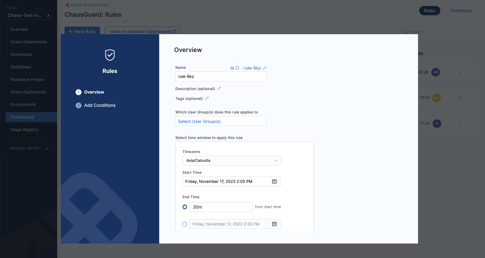

4. Click Next.

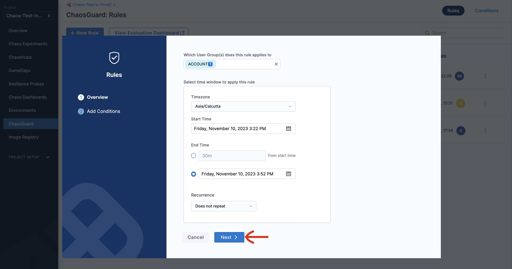

5. Select a condition (or multiple conditions) that you wish to apply. Click Done.

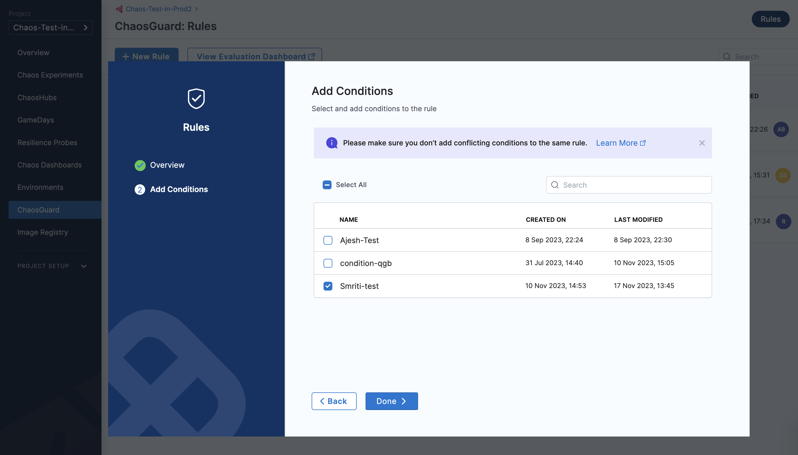

:::note
You can apply the rule to multiple user groups for a project, organization or account, or create a new user group if you have the necessary permissions.
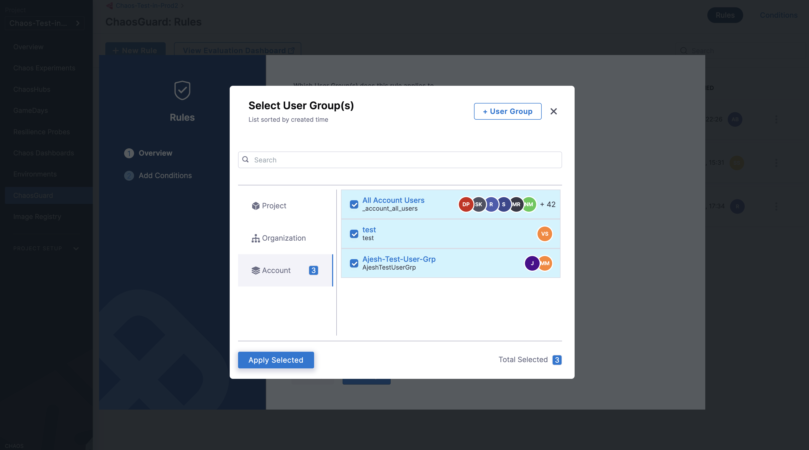
:::

## Enable and disable rules

The image below shows the two different states of a rule (enable and disable).

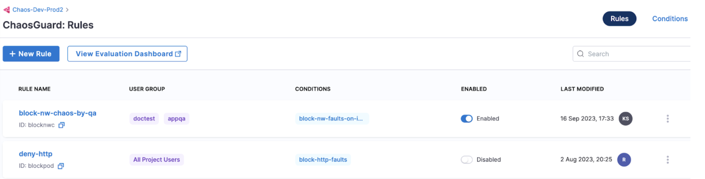
