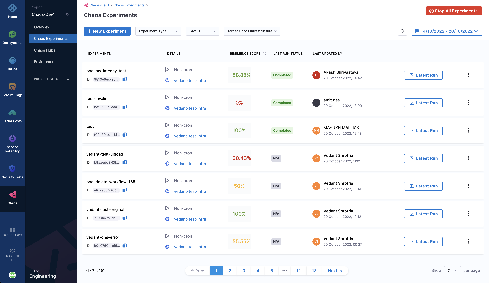
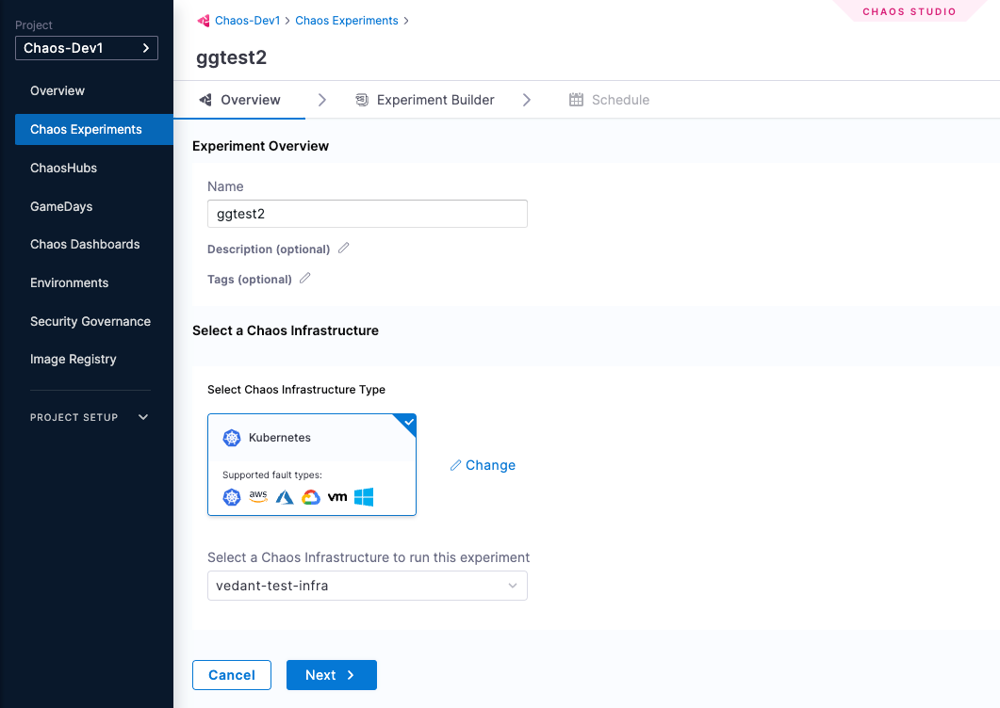
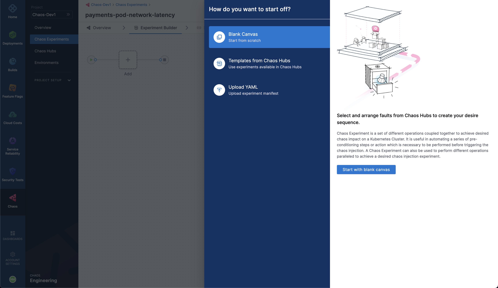
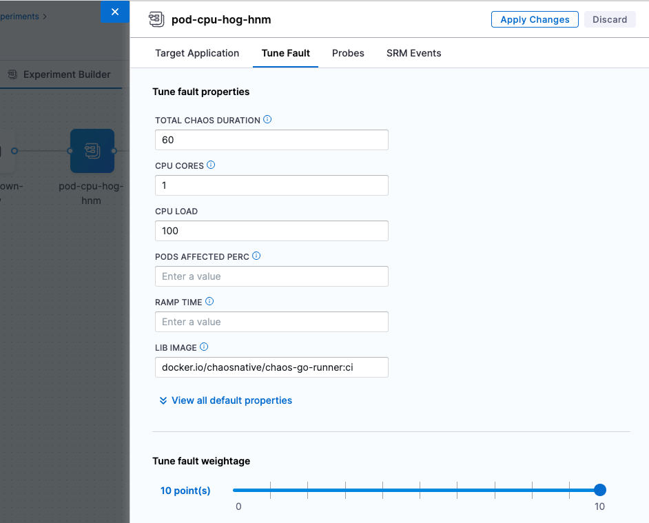
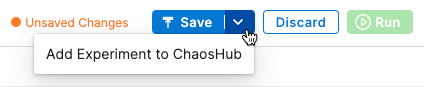

import Launch from '../shared/launch-experiment-from-hub.md'

import Analyze from '/docs/chaos-engineering/configure-chaos-experiments/experiments/shared/analyze-chaos-experiment.md'

Harness Chaos Engineering (CE) gives you the flexibility to create elaborate chaos experiments that help create complex, real-life failure scenarios against which you can validate your applications. At the same time, the chaos experiments are declarative and can be constructed using the Chaos Studio user interface with no programmatic intervention.

A chaos experiment is composed of chaos faults that are arranged in a specific order to create a failure scenario. The chaos faults target various aspects of an application, including the constituent microservices and underlying infrastructure. The parameters associated with these faults can be tuned to impart the desired chaos behavior.

For more information, go to [Flow of control in a chaos experiment](/docs/chaos-engineering/configure-chaos-experiments/experiments/experiment-execution).

## Construct a chaos experiment

To add a chaos experiment:

1. In Harness, navigate to **Chaos > Chaos Experiments**. 

	

1. Select **+ New Experiment**.

	Chaos Studio is displayed.

	

1. In the **Experiment Overview**, enter the experiment **Name** and optional **Description** and **Tags**. 

1. In **Select a Chaos Infrastructure**, select the infrastructure where the target resources reside, and then click **Next**.

	This takes you to the Experiment Builder tab, where you can choose how to start building your experiment.

	

	For more information on infrastructure, go to [Connect chaos infrastructures](../chaos-infrastructure/connect-chaos-infrastructures).
	
1. Select how you want to build the experiment. The options, explained later, are:

	* [**Blank Canvas**](#if-you-select-blank-canvas) - Lets you build the experiment from scratch, adding the specific faults you want.
	* [**Templates from Chaos Hubs**](#if-you-select-templates-from-chaos-hubs) - Lets you preview and select and experiment from pre-curated experiment templates available in [Chaos Hubs](/docs/category/chaos-hubs).
	* [**Upload YAML**](#if-you-select-upload-yaml) - Lets you upload an experiment manifest YAML file.

	These options are explained below.

	#### If you select Blank Canvas:

	The Experiment Builder tab is displayed.

	

	1. Select **Add**, then select each fault you want to add to the experiment individually. 

		

		For each fault you select, you'll tune the fault's properties next. 

		

	1. To tune each fault:

		* **Specify the target application (only for pod-level Kubernetes faults):** This lets the application's corresponding pods be targeted.

		* **Tune fault parameters:** Every fault has a set of common parameters, such as the chaos duration, ramp time, etc., and a set of unique parameters that may be customised as needed.

		* **Add chaos probes:** (Optional) On the **Probes** tab, you can add chaos [probes](/docs/category/probes-1) to automate the chaos hypothesis checks for a fault during the experiment execution. Probes are declarative checks that aid in the validation of certain criteria that are deemed necessary to declare an experiment as **passed**.

		* **Tune fault weightage:** Set the weight for the fault, which sets the importance of the fault relative to the other faults in the experiments. This is used to calculate the [resilience score](/docs/chaos-engineering/configure-chaos-experiments/experiments/resilience-score) of the experiment.

	1. To add a fault that runs in parallel to another fault, point your mouse below an existing fault, and then select **Add**.

		

		In Experiment Builder, faults that are stacked vertically run in parallel, and faults or groups of parallel faults run in sequence from left to right.

	#### If you select Templates from Chaos Hubs:

	1. Select an experiment template from a [chaos hub](/docs/category/chaos-hubs).

		* Select **Experiment Type** to see available chaos hubs to select templates from. 
		* Select a template to see a preview of the faults included.

		

		You can edit the template to add more faults or update the existing faults.

	#### If you select Upload YAML:

	1. Upload an experiment manifest YAML file to create the experiment. 

		You can edit the experiment to update the existing faults or add more of them.

1. Save the experiment.

	

	* Select **Save** to save the experiment to the Chaos Experiments page. You can add it to a [chaos hub](/docs/category/chaos-hubs) later.
	* Select **Add Experiment to ChaosHub** to save this experiment as a template in a selected [chaos hub](/docs/category/chaos-hubs).

Now, you can choose to either run the experiment right away by selecting the **Run** button on the top, or create a recurring schedule to run the experiment by selecting the Schedule tab.

## Launch an experiment from a chaos hub

<Launch />

## Analyze chaos experiments

<Analyze />