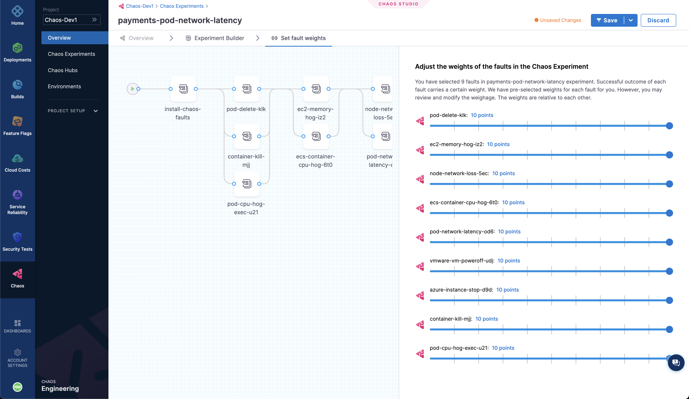
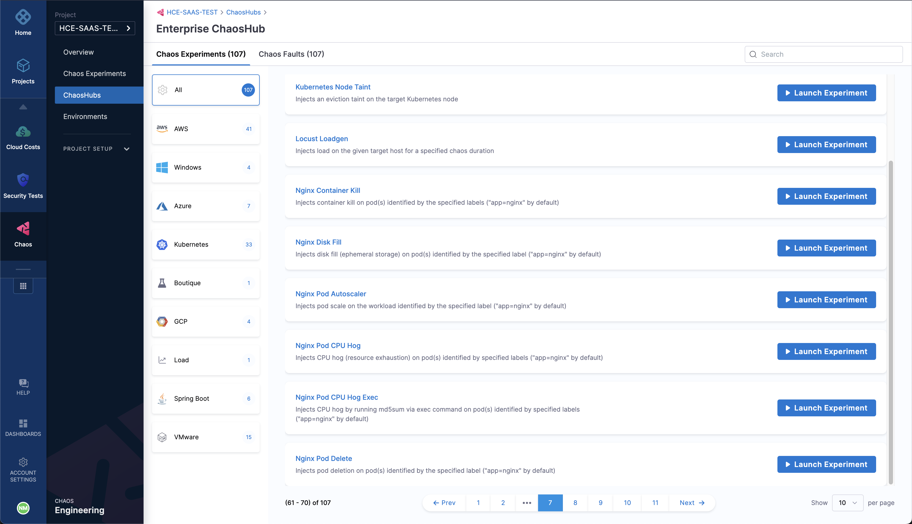
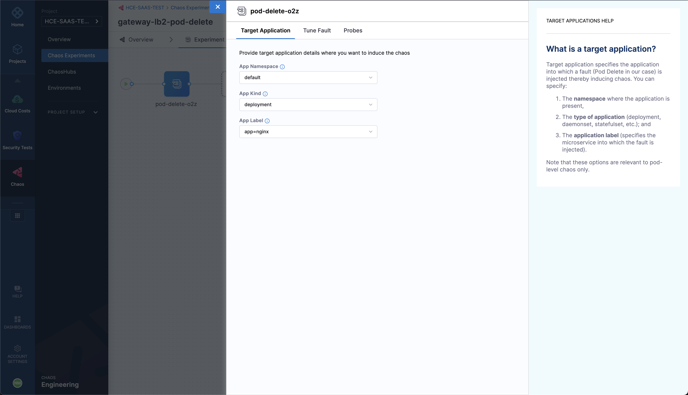

import Analyze from '/docs/chaos-engineering/configure-chaos-experiments/experiments/shared/analyze-chaos-experiment.md'

Harness Chaos Engineering (CE) gives you the flexibility to create elaborate chaos experiments that help create complex, real-life failure scenarios for your applications that can be validated against. At the same time, the chaos experiments are declarative and can be constructed using the Chaos Studio user interface with no programmatic intervention.

A chaos experiment is composed of chaos faults that are arranged in a specific order to create a failure scenario. The chaos faults target various aspects of an application, including the constituent microservices and underlying infrastructure. The parameters associated with these faults can be tuned to impart the desired chaos behaviour.

## 1. Add an overview

To construct a chaos experiment, select the **Chaos Experiments** sidebar option under the **Chaos** tab, and select **New Experiment**. This will take you to the Chaos Studio.

The first step is to add the experiment overview, that includes the experiment name and optionally any description or tags. Select a **Chaos Infrastructure** to specify the infrastructure where the target resources reside. Click **Next**.

:::info
Go to [add a chaos infrastructure](../chaos-infrastructure/connect-chaos-infrastructures) to connect to a chaos infrastructure.
:::

## 2. Construct the experiment

Under the Experiment Builder tab, specify the source of the experiment. Options include:
1. Creating an experiment from the scratch (Blank Canvas)
2. Using pre-curated experiment templates available in Chaos Hub (Templates from Chaos Hubs)
3. Using a downloaded experiment manifest file (Upload YAML)

### Blank canvas
When you wish to build an experiment from scratch, you can add individual faults that are available in the Chaos Hubs and tune their parameters. This allows you to have access not only to the Enterprise Chaos Hub experiments provided by Harness but also to any private Chaos Hub faults that you have access to.

Tuning a fault involves three steps:

1. **Specify the target application (Only for pod-level Kubernetes faults):** The target application resource is specified in this step so that the corresponding pods can be targeted. This includes specifying the resource namespace, type, and a label to uniquely identify the resource.

2. **Customize the fault parameters:** Every fault has a set of common parameters, such as the chaos duration, ramp time, etc., and a set of unique parameters that may be customised as needed. It should be noted that default parameters are present wherever applicable, however, the mandatory parameters are strictly required to be input for experiment execution.

3. **Define the chaos probes:** Optionally, you can add chaos probes to automate the chaos hypothesis checks for a fault during the experiment execution. Probes are declarative checks that aid in the validation of certain criteria that are deemed necessary to declare an experiment as **passed**. Various probes, such as **HTTP**, **Command**, **Kubernetes**, and **Prometheus** (with more of them coming in the future), exist that allow you to define the source of information to be checked. Various parameters can be configured as part of these probes to define the exact condition you need to validate.

You can configure the sequence in which each of the faults executes. Also, complemented by the varied faults provided by default in the Enterprise Chaos Hub, you can create entire experiments that validate the resiliency of every aspect of your application.

### Templates from Chaos Hubs
You can also use the pre-curated experiment templates provided in the Enterprise Chaos Hub while trying to create new chaos experiments. While these templates may be used as is for the experiment execution, you can very well edit them to add more faults or update the existing faults.

### Upload YAML
You can also upload an experiment manifest file to create the experiment. In this case as well, you can edit the experiment to update the existing faults or add more of them.

## 3. Set the fault weights

As a final step before running the experiment, switch to the tab **Set fault weights** to set the weight for each fault in the experiment, which will be used for the calculation of the resilience score and the outcome of the experiment.

Now, you can choose to either run the experiment right away by selecting the **Run** button on the top, or create a recurring schedule for the experiment execution by selecting the arrow to the right of the Run button, selecting **Create recurring schedule** and then specifying the execution schedule. You can also save the experiment to simply save it but not run it just yet, as well as save the experiment as a template using the **Save** button.

## Launch an experiment from the chaos hub
Alternatively, you can directly launch a pre-curated experiment from the chaos hub.

### 1. Access the chaos hub
Select **Chaos Hubs** sidebar option and choose the hub where the experiment is present. You will be able to browse the list of available experiments now. After locating the experiment you wish to execute, select the **Launch Experiment** button corresponding to it.

### 2. Customize and execute the experiment
You will be presented with the experiment overview page, where you can update the experiment name and select the chaos infrastructure that will be used to run the experiment.

Select **Next**. In the experiment builder page, select the fault(s) present in the experiment to configure them, as you did while building an experiment [from a blank canvas](#blank-canvas):

- Provide the target application details (if applicable), such as the namespace, kind, and label.
- Configure the fault tunables, if necessary.
- Add custom chaos probe checks, if necessary.

You can add other faults to the experiment in addition to the existing set of faults or update the sequence of execution of the faults.

Next, select the **Run** button to execute your chaos experiment. Alternatively, you can only save the experiment or add the experiment to a Chaos Hub using the **Save** button.

<Analyze />