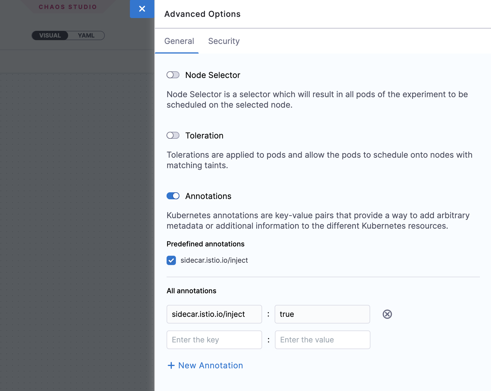

import Tabs from '@theme/Tabs';
import TabItem from '@theme/TabItem';

Harness Chaos Engineering (HCE) gives you the flexibility to create elaborate chaos experiments that help create complex, real-life failure scenarios against which you can validate your applications. At the same time, the chaos experiments are declarative and you can construct them using the Chaos Studio user interface with no programmatic intervention.

A chaos experiment is composed of chaos faults that are arranged in a specific order to create a failure scenario. The chaos faults target various aspects of an application, including the constituent microservices and underlying infrastructure. You can tune the parameters associated with these faults to impart the desired chaos behavior.

For more information, go to [flow of control in a chaos experiment](/docs/chaos-engineering/configure-chaos-experiments/experiments/experiment-execution).

## Construct a chaos experiment

To add a chaos experiment:

1. In Harness, navigate to **Chaos > Chaos Experiments**. Select **+ New Experiment**.

	

2. 	In the **Experiment Overview**, enter the experiment **Name** and optional **Description** and **Tags**. In **Select a Chaos Infrastructure**, select the infrastructure where the target resources reside, and then click **Next**.

	

:::tip
For more information on infrastructure, go to [Connect chaos infrastructures](/docs/chaos-engineering/chaos-infrastructure/connect-chaos-infrastructures).
:::

3. This takes you to the **Experiment Builder** tab, where you can choose how to start building your experiment.

	

4. Select how you want to build the experiment. The options, explained later, are:

	* **Blank Canvas** - Lets you build the experiment from scratch, adding the specific faults you want.
	* **Templates from ChaosHubs** - Lets you preview and select and experiment from pre-curated experiment templates available in [ChaosHubs](/docs/chaos-engineering/configure-chaos-experiments/chaos-hubs/introduction.md).
	* **Upload YAML** - Lets you upload an experiment manifest YAML file.

	These options are explained below.

<Tabs>
  <TabItem value="Blank Canvas">

1. The **Experiment Builder** tab is displayed. Click **Add** to add a fault to the experiment


2. Select the fault you want to add to the experiment individually.


3. For each fault you select, tune the fault's properties. Properties will be different for different faults. 

	* To tune each fault:

		* **Specify the target application (only for pod-level Kubernetes faults):** This lets the application's corresponding pods be targeted.

		

		* **Tune fault parameters:** Every fault has a set of common parameters, such as the chaos duration, ramp time, etc., and a set of unique parameters that may be customised as needed.

		* **Add chaos probes:** (Optional) On the **Probes** tab, you can add chaos [probes](/docs/chaos-engineering/configure-chaos-experiments/probes/overview) to automate the chaos hypothesis checks for a fault during the experiment execution. Probes are declarative checks that aid in the validation of certain criteria that are deemed necessary to declare an experiment as **passed**.

		* **Tune fault weightage:** Set the weight for the fault, which sets the importance of the fault relative to the other faults in the experiments. This is used to calculate the [resilience score](/docs/chaos-engineering/configure-chaos-experiments/experiments/resilience-score) of the experiment.

		

</TabItem>
  <TabItem value="Templates from Chaos Hubs">

1. Select an experiment template from a [ChaosHub](/docs/chaos-engineering/configure-chaos-experiments/chaos-hubs/add-chaos-hub).

	* Select **Experiment Type** to see available ChaosHubs to select templates from.
	* Select a template to see a preview of the faults included.

	

:::info note		
You can edit the template to add more faults or update the existing faults.
:::

</TabItem>
  <TabItem value="Upload YAML">

1. Upload an experiment manifest YAML file to create the experiment.

:::info note
You can edit the experiment to update the existing faults or add more of them.
:::

</TabItem>
</Tabs>

Construct the chaos fault using one of the three options mentioned earlier and save the experiment. 

	

	* Select **Save** to save the experiment to the Chaos Experiments page. You can add it to a [ChaosHub](/docs/chaos-engineering/configure-chaos-experiments/chaos-hubs/add-chaos-hub) later.
	* Select **Add Experiment to ChaosHub** to save this experiment as a template in a selected [ChaosHub](/docs/chaos-engineering/configure-chaos-experiments/chaos-hubs/add-chaos-hub).

### Run the experiment

Now, you can choose to either run the experiment right away by selecting the **Run** button on the top, or create a recurring schedule to run the experiment by selecting the **Schedule** tab.

## Advanced experiment setup options

You can select **Advanced Options** on the Experiment Builder tab to configure the advanced options (described below) while creating an experiment for a Kubernetes chaos infrastructure:


### General options

**Node Selector** 

Specifies the node on which the experiment pods will be scheduled. Provide the node label as a key-value pair.

- Can be used with node-level faults to avoid the scheduling of the experiment pod on the target node(s).
- Can be used to limit the scheduling of the experiment pods on nodes that have an unsupported OS.

	

**Toleration** 

Specifies the tolerations that must be satisfied by a tainted node to be able to schedule the experiment pods. For more information on taints and tolerations, go to the [Kubernetes documentation](https://kubernetes.io/docs/concepts/scheduling-eviction/taint-and-toleration/).

- Can be used with node-level faults to avoid the scheduling of the experiment pod on the target node(s).
- Can be used to limit the scheduling of the experiment pods on nodes that have an unsupported OS.

	

**Annotations** 

Specifies the annotations to be added to the experiment pods. Provide the annotations as key-value pairs. For more information on annotations, go to the [Kubernetes documentation](https://kubernetes.io/docs/concepts/overview/working-with-objects/annotations/).

- Can be used for bypassing network proxies enforced by service mesh tools like Istio.

	

### Security options

**Enable runAsUser** 

Specifies the user ID to be used for starting all the processes in the experiment pod containers. By default `1000` user ID is used.

- Allows privileged access or restricted access for experiment pods

	

**Enable runAsGroup** 

Specifies the group ID to be used for starting all the processes in the experiment pod containers instead of a user ID.

- Allows privileged access or restricted access for experiment pods

	

## Run chaos experiments with APIs

This tutorial explains how to run chaos experiments on Kubernetes using APIs. You can access the Harness API documentation [here](https://apidocs.harness.io/). This tutorial uses the publicly available [Harness CE Postman collection](https://elements.getpostman.com/redirect?entityId=25469526-59b35825-6240-4b45-9974-6bb869741318&entityType=collection) to describe the chaos APIs.

<details>
<summary>Typical chaos experimentation workflow</summary>

Chaos experiments target a steady-state system and simulate conditions that might induce failure in components such as infrastructure, networks, and services. For example, a Chaos experiment might terminate a pod in a functional Kubernetes cluster, shut down a working load balancer to validate failover, or induce CPU spikes on a server, and then observe how the system responds.

In a chaos experiment, you typically perform the following tasks:
1. Define and apply a steady state to the test system and specify its service-level objectives (SLOs). 
2. Develop a hypothesis on how the system will behave if you inject a specific fault.
3. Inject the fault.
4. Observe whether the system continues to meet the SLOs.


Harness Chaos Engineering (HCE) simplifies the chaos engineering practices for your organization. To get started, create a new project or ask your administrator to add you to an existing project. Once you have access, navigate to the **Chaos** tab that shows an overview of all the experiment runs.


</details>

### Get variable inputs

You need the following inputs for variables in the API requests in this tutorial:
* `url`: This is the Harness CE server URL that serves the chaos API requests. You can find this URL in the chaos API documentation. For instance, `https://app.harness.io/gateway/chaos/manager/api/query` is the Harness CE server URL for production environment.

   If you are using [chaos Postman collection](https://elements.getpostman.com/redirect?entityId=25469526-59b35825-6240-4b45-9974-6bb869741318&entityType=collection), this value will be pre-filled in 2 Postman variables as shown below:

   ```
   base_url - https://app.harness.io
   chaos_url - {{base_url}}/gateway/chaos/manager/api/query
   ```

* `account_id`: This is the ID of your Harness account or a specific Harness account where you want to run chaos experiments. You can get your account ID from any Harness app URL or the **Account Overview** page in Harness.

* `project_id`: This is the ID of the Harness project where you want to run chaos experiments. To get a project's ID:
   1. Go to `Projects` in [Harness](https://app.harness.io/).
   2. Select the project where you wish to run the chaos experiments or create a new project.
   3. Click on `Overview`.
   4. Copy the value of `ID`.
   5. Ensure that you copy the value of `Organization` since this is required for variable `org_id`.

* `org_id`: This is the IDof the Harness organization where you want to run chaos experiments. To get your organization ID, follow the same steps you used to get the Project ID.

* `API-KEY-TOKEN`: You can use an existing Harness API key token from the same Harness account that you used in the previous steps or create a new API key token from the below steps:
   1. Click on `MY PROFILE` in [Harness](https://app.harness.io/).
   2. Go to `My API Keys` and click on `+ API Key` to create a new API Key.
   3. Enter a `Name` for the API Key (optional description/tags) and click on `Save`.
   4. Under the newly created API Key, click on `+ Token` to generate a new token for this API Key.
   5. Enter the `Name` and select the `Expiration` (time for which this token is valid) and click on `Generate Token`.
   6. Ensure that you copy the value of the token generated and store it safe, because you won't be able to access this later.

   Use this token to create an authorization header with the `API-KEY-TOKEN` value is required to work with chaos APIs.

   ```
   x-api-key: $API-KEY-TOKEN
   ```

   

:::tip

In order to work with Harness CE Postman collection, fork it under your Postman account and update the required variables.


:::

### Add a chaos infrastructure using APIs

<details>
<summary>Step 1: Create and register chaos infrastructure using APIs</summary>

Create (or register) a chaos infrastructure (Kubernetes infrastructure) that injects faults into the application (or service).


1. Specify a name for the chaos infrastructure and provide description and tags (description and tags are optional).
2. Choose the mode of installation for the Harness delegate. Harness delegate is a remote agent to access your Kubernetes cluster resources and inject faults into them as a part of a chaos experiment.
3. **Cluster Wide** installation mode allows you to target resources across all the namespaces in your cluster whereas **Namespace Mode** installation restricts injecting chaos to a certain namespace in which the delegate will be installed.

In this tutorial, the delegate will be installed in the **hce** namespace in **Cluster Wide** mode.

Sample GraphQL query and variable to register/create chaos infrastructure:

GraphQL query: `registerInfra`

```
mutation($identifiers: IdentifiersRequest!, $request: RegisterInfraRequest!) {
  registerInfra(identifiers: $identifiers, request: $request) {
    token
    infraID
    name
    manifest
  }
}
```

GraphQL variables: `registerInfra`

```json
{
  "identifiers": {
    "orgIdentifier": "{{org_id}}",
    "accountIdentifier": "{{account_id}}",
    "projectIdentifier": "{{project_id}}"
  },
  "request": {
    "name": "my-test-chaos-infra",
    "environmentID": "my-test-chaos-env",
    "description": "Test Chaos Environment",
    "platformName": "my-test-platform",
    "infraNamespace": "hce",
    "serviceAccount": "hce",
    "infraScope": "cluster",
    "infraNsExists": false,
    "infraSaExists": false,
    "installationType": "MANIFEST",
    "skipSsl": false
  }
}
```

The above mentioned values are pre-filled in Harness CE Postman collection as shown in the below screenshot:


A successful response to infrastructure registration contains details about the registered infra:

```json
{
  "data": {
    "registerInfra": {
      "token": "abc123",
      "infraID": "abc123",
      "name": "abc123",
      "manifest": "abc123"
    }
  }
}
```

You need the `token` and `infraID` values from the response for subsequent API calls.

To retrieve the infrastructure manifest, form the following URL:

```
$chaos_server_url/file/$token.yaml
```

* `$chaos_server_url` corresponds to `https://app.harness.io/gateway/chaos/manager/api/`
* `$token` corresponds to the token value retrieved in response to the `registerInfra` API call as shown in the sample response above.

An example URL to retrieve infrastructure manifest is shown below:

```
https://app.harness.io/gateway/chaos/manager/api/file/token-abc.yaml
```

Copy and save the YAML file in a file named `infra.yaml`. Save the file on a machine that has `kubectl` installed and has access to your K8s cluster.

You can deploy your chaos infrastructure by executing the below commands if you have access to your Kubernetes cluster via [kubectl](https://kubernetes.io/docs/reference/kubectl/):

```
kubectl apply -f infra.yaml
```

The delegate will be set up in the K8s cluster.

</details>

<details>
<summary>Step 2: Check the status of chaos infrastructure using APIs</summary>


Use the `getInfraDetails` query to retrieve the details of your newly registered infrastructure.

Sample GraphQL query and variables to retrieve infrastructure details:

GraphQL query for `getInfraDetails`:

```
query GetInfraDetails(
  $infraID: String!,
  $identifiers: IdentifiersRequest!
) {
  getInfraDetails(
    infraID: $infraID,
    identifiers: $identifiers
  ) {
    infraID
    name
    description
    tags
    environmentID
    platformName
    isActive
    isInfraConfirmed
    isRemoved
    updatedAt
    createdAt
    noOfSchedules
    noOfWorkflows
    token
    infraNamespace
    serviceAccount
    infraScope
    infraNsExists
    infraSaExists
    installationType
    k8sConnectorID
    lastWorkflowTimestamp
    startTime
    version
    createdBy {
      userID
      username
      email
    }
    updatedBy {
      userID
      username
      email
    }
  }
}
```

GraphQL variables for `getInfraDetails`:

```
{
  "identifiers": {
    "orgIdentifier": "{{org_id}}",
    "accountIdentifier": "{{account_id}}",
    "projectIdentifier": "{{project_id}}"
  },
  "infraID": "{{your-infra-ID}}"
}
```

Ensure that you update the value of the `infraID` field retrieved during the `registerInfra` API call.

A sample response for `getInfraDetails`:

```
{
  "data": {
    "getInfraDetails": {
      "infraID": "4",
      "name": "xyz789",
      "description": "xyz789",
      "tags": ["xyz789"],
      "environmentID": "xyz789",
      "platformName": "xyz789",
      "isActive": true,
      "isInfraConfirmed": true,
      "isRemoved": true,
      "updatedAt": "xyz789",
      "createdAt": "xyz789",
      "noOfSchedules": 123,
      "noOfWorkflows": 123,
      "token": "abc123",
      "infraNamespace": "xyz789",
      "serviceAccount": "abc123",
      "infraScope": "xyz789",
      "infraNsExists": false,
      "infraSaExists": false,
      "installationType": "CONNECTOR",
      "k8sConnectorID": "xyz789",
      "lastWorkflowTimestamp": "xyz789",
      "startTime": "abc123",
      "version": "abc123",
      "createdBy": UserDetails,
      "updatedBy": UserDetails
    }
  }
}
```

:::info

Check the value of `isActive` field and ensure it is set to `true`. This means the infrastructure is in `active` state.

:::

Above values are pre-filled in Harness CE Postman Collection as shown below:


To run this API using Harness CE Postman collection, update the value of the `infraID` variable retrieved during `registerInfra` API call.

</details>

### Create a demo application and an observability infrastructure

<details>
<summary>Install demo app and observability infrastructure using APIs</summary>

You are all set to inject chaos into your Kubernetes resources. You will execute one of the most popular faults, **Pod Delete**. This fault deletes the pods of a deployment (or a statefulset or a daemonset) to determine the resilience of a microservice.

You can use your own application as a target, or use the [online boutique microservices demo application](https://github.com/GoogleCloudPlatform/microservices-demo) as the target. This tutorial uses the demo application.

You can install the boutique application (also known as target application) and observability infrastructure (optional) which includes Grafana, Prometheus and a BlackBox exporter, using the below commands. The observability infrastructure provides a dashboard to validate the health of the application microservices in real time.

```bash
❯ kubectl apply -f https://raw.githubusercontent.com/chaosnative/harness-chaos-demo/main/boutique-app-manifests/manifest/app.yaml -n hce

❯ kubectl apply -f https://raw.githubusercontent.com/chaosnative/harness-chaos-demo/main/boutique-app-manifests/manifest/monitoring.yaml -n hce
```

These resources will be deployed in the existing `hce` namespace.

The target application and the observability infrastructure pods will be available in the `hce` namespace eventually. Below is a command that fetches all the pods in the `hce` namespace.

```
❯ kubectl get pods -n hce

NAME                                           READY   STATUS    RESTARTS        AGE
adservice-68db567bb5-hd47j                     1/1     Running   0               5m39s
cartservice-6b8f46f64f-6mrkv                   1/1     Running   0               5m39s
chaos-exporter-765d6b6674-tkrpm                1/1     Running   0               11m
chaos-operator-ce-678b67c75-l68m5              1/1     Running   0               11m
checkoutservice-7545ff6849-rdl9f               1/1     Running   0               5m40s
currencyservice-5769b647d5-trx69               1/1     Running   0               5m39s
emailservice-55c84dcfdc-c9x9q                  1/1     Running   0               5m40s
frontend-74b7898dd9-x4bzr                      1/1     Running   0               5m40s
grafana-6f6fb469b7-bm9vh                       1/1     Running   0               5m34s
loadgenerator-5b875b84dd-pcjdr                 1/1     Running   0               5m39s
paymentservice-59d87f77bc-fkwjq                1/1     Running   0               5m40s
productcatalogservice-676d7d7dbc-nx75x         1/1     Running   0               5m40s
prometheus-blackbox-exporter-6d955c876-l7fdv   2/2     Running   0               5m34s
prometheus-deployment-779b88bf5d-zf8f9         1/1     Running   0               5m34s
recommendationservice-6fc8b4d9cf-4s96t         1/1     Running   0               5m40s
redis-cart-7cd9d8966d-mgbhx                    1/1     Running   0               5m39s
shippingservice-7b4945b5fc-cbmc9               1/1     Running   0               5m39s
subscriber-7774bd95d4-4rnwp                    1/1     Running   0               11m
workflow-controller-6d5d75dc7c-v9vqc           1/1     Running   0               11m
```

Below is a command that lists the services available in the `hce` namespace.

```
❯ kubectl get services -n hce

NAME                           TYPE           CLUSTER-IP       EXTERNAL-IP   PORT(S)          AGE
adservice                      ClusterIP      10.110.145.128   <none>        9555/TCP         9m48s
cartservice                    ClusterIP      10.103.73.107    <none>        7070/TCP         9m49s
chaos-exporter                 ClusterIP      10.103.163.182   <none>        8080/TCP         15m
checkoutservice                ClusterIP      10.105.52.42     <none>        5050/TCP         9m49s
currencyservice                ClusterIP      10.108.12.130    <none>        7000/TCP         9m49s
emailservice                   ClusterIP      10.106.79.95     <none>        5000/TCP         9m49s
frontend                       ClusterIP      10.98.222.239    <none>        80/TCP           9m49s
frontend-external              LoadBalancer   10.101.239.201   localhost     80:30963/TCP     9m49s
grafana                        LoadBalancer   10.96.206.174    localhost     3000:32659/TCP   9m43s
paymentservice                 ClusterIP      10.106.36.71     <none>        50051/TCP        9m49s
productcatalogservice          ClusterIP      10.97.78.9       <none>        3550/TCP         9m49s
prometheus-blackbox-exporter   ClusterIP      10.103.118.20    <none>        9115/TCP         9m43s
prometheus-k8s                 LoadBalancer   10.106.153.10    localhost     9090:32101/TCP   9m43s
recommendationservice          ClusterIP      10.106.227.47    <none>        8080/TCP         9m49s
redis-cart                     ClusterIP      10.103.184.94    <none>        6379/TCP         9m48s
shippingservice                ClusterIP      10.109.150.169   <none>        50051/TCP        9m48s
workflow-controller-metrics    ClusterIP      10.106.97.173    <none>        9090/TCP         15m
```

To access the target application frontend in your browser, use the `CLUSTER-IP` of the `frontend-external` LoadBalancer service.


To access the Grafana dashboard:

1. Login using the default credentials: username `admin` and password `admin`.
2. Browse the online boutique application dashboard.

Before fault execution, all the metrics indicate normal application behavior.


</details>

### Construct a chaos experiment using APIs

You have successfully created and deployed the target application. You can now target the pods of the cart microservice using the pod delete fault.

Before injecting chaos, the cart page will be accessible from the frontend, as seen at the `/cart` route.


<details>
<summary>Create the chaos experiment and workflow using APIs</summary>

1. Specify the experiment name and optionally a description and tags.
2. Add the target infrastructure ID that you previously created.

This allows you to create your chaos experiment with a pod delete fault that is configured to target the online boutique application.

You can use the `createChaosWorkFlow` API to create the above chaos experiment.

GraphQL query: `createChaosWorkFlow`

```
mutation CreateChaosWorkFlow(
  $request: ChaosWorkFlowRequest!
  $identifiers: IdentifiersRequest!
) {
  createChaosWorkFlow(request: $request, identifiers: $identifiers) {
    workflowID
    cronSyntax
    workflowName
    workflowDescription
    isCustomWorkflow
    tags
  }
}
```

GraphQL variables: `createChaosWorkFlow`

```
{
   "identifiers": {
    "orgIdentifier": "{{org_id}}",	
    "accountIdentifier": "{{account_id}}",
    "projectIdentifier": "{{project_id}}"
  },
  "request": {
    "workflowManifest": "$your-new-workflow-manifest",
    "cronSyntax": "",
    "workflowName": "my-pod-delete-experiment",
    "workflowDescription": "This is a cartservice pod delete experiment",
    "weightages": [
      {
        "experimentName": "pod-delete-ji5",
        "weightage": 10
      }
    ],
    "isCustomWorkflow": true,
    "infraID": "{{your-infra-id-from-registerInfra-call}}",
    "tags":["test", "workflow", "gke"]
  }
}
```

:::info

To run this API using Harness CE Postman collection, update the value of the `infraID` variable retrieved using the `registerInfra` API call.

:::

The value for `workflowManifest` field is pre-filled in the Harness CE Postman collection. You will need to update this if you are using a different application, other than boutique.

A sample workflow manifest is shown below:

```
{
    "kind": "Workflow",
    "apiVersion": "argoproj.io/v1alpha1",
    "metadata": {
        "name": "my-pod-delete-experiment",
        "namespace": "hce",
        "creationTimestamp": null,
        "labels": {
            "infra_id": "e640346b-bff5-40db-a828-68b44e06e2d1",
            "revision_id": "f82e8c99-8efd-4289-a324-eadfd9667574",
            "workflow_id": "80557c8b-531c-49d2-a39e-9f72c4674c2c",
            "workflows.argoproj.io/controller-instanceid": "e640346b-bff5-40db-a828-68b44e06e2d1"
        }
    },
    "spec": {
        "templates": [
            {
                "name": "test-0-7-x-exp",
                "inputs": {},
                "outputs": {},
                "metadata": {},
                "steps": [
                    [
                        {
                            "name": "install-chaos-faults",
                            "template": "install-chaos-faults",
                            "arguments": {}
                        }
                    ],
                    [
                        {
                            "name": "pod-delete-ji5",
                            "template": "pod-delete-ji5",
                            "arguments": {}
                        }
                    ],
                    [
                        {
                            "name": "cleanup-chaos-resources",
                            "template": "cleanup-chaos-resources",
                            "arguments": {}
                        }
                    ]
                ]
            },
            {
                "name": "install-chaos-faults",
                "inputs": {
                    "artifacts": [
                        {
                            "name": "pod-delete-ji5",
                            "path": "/tmp/pod-delete-ji5.yaml",
                            "raw": {
                                "data": "apiVersion: litmuschaos.io/v1alpha1\ndescription:\n  message: |\n    Deletes a pod belonging to a deployment/statefulset/daemonset\nkind: ChaosExperiment\nmetadata:\n  name: pod-delete\n  labels:\n    name: pod-delete\n    app.kubernetes.io/part-of: litmus\n    app.kubernetes.io/component: chaosexperiment\n    app.kubernetes.io/version: ci\nspec:\n  definition:\n    scope: Namespaced\n    permissions:\n      - apiGroups:\n          - \"\"\n        resources:\n          - pods\n        verbs:\n          - create\n          - delete\n          - get\n          - list\n          - patch\n          - update\n          - deletecollection\n      - apiGroups:\n          - \"\"\n        resources:\n          - events\n        verbs:\n          - create\n          - get\n          - list\n          - patch\n          - update\n      - apiGroups:\n          - \"\"\n        resources:\n          - configmaps\n        verbs:\n          - get\n          - list\n      - apiGroups:\n          - \"\"\n        resources:\n          - pods/log\n        verbs:\n          - get\n          - list\n          - watch\n      - apiGroups:\n          - \"\"\n        resources:\n          - pods/exec\n        verbs:\n          - get\n          - list\n          - create\n      - apiGroups:\n          - apps\n        resources:\n          - deployments\n          - statefulsets\n          - replicasets\n          - daemonsets\n        verbs:\n          - list\n          - get\n      - apiGroups:\n          - apps.openshift.io\n        resources:\n          - deploymentconfigs\n        verbs:\n          - list\n          - get\n      - apiGroups:\n          - \"\"\n        resources:\n          - replicationcontrollers\n        verbs:\n          - get\n          - list\n      - apiGroups:\n          - argoproj.io\n        resources:\n          - rollouts\n        verbs:\n          - list\n          - get\n      - apiGroups:\n          - batch\n        resources:\n          - jobs\n        verbs:\n          - create\n          - list\n          - get\n          - delete\n          - deletecollection\n      - apiGroups:\n          - litmuschaos.io\n        resources:\n          - chaosengines\n          - chaosexperiments\n          - chaosresults\n        verbs:\n          - create\n          - list\n          - get\n          - patch\n          - update\n          - delete\n    image: chaosnative/go-runner:3.0.0-saas\n    imagePullPolicy: Always\n    args:\n      - -c\n      - ./experiments -name pod-delete\n    command:\n      - /bin/bash\n    env:\n      - name: TOTAL_CHAOS_DURATION\n        value: \"15\"\n      - name: RAMP_TIME\n        value: \"\"\n      - name: FORCE\n        value: \"true\"\n      - name: CHAOS_INTERVAL\n        value: \"5\"\n      - name: PODS_AFFECTED_PERC\n        value: \"\"\n      - name: TARGET_CONTAINER\n        value: \"\"\n      - name: TARGET_PODS\n        value: \"\"\n      - name: DEFAULT_HEALTH_CHECK\n        value: \"false\"\n      - name: NODE_LABEL\n        value: \"\"\n      - name: SEQUENCE\n        value: parallel\n    labels:\n      name: pod-delete\n      app.kubernetes.io/part-of: litmus\n      app.kubernetes.io/component: experiment-job\n      app.kubernetes.io/version: ci\n"
                            }
                        }
                    ]
                },
                "outputs": {},
                "metadata": {},
                "container": {
                    "name": "",
                    "image": "chaosnative/k8s:2.11.0",
                    "command": [
                        "sh",
                        "-c"
                    ],
                    "args": [
                        "kubectl apply -f /tmp/ -n {{workflow.parameters.adminModeNamespace}} && sleep 30"
                    ],
                    "resources": {}
                }
            },
            {
                "name": "cleanup-chaos-resources",
                "inputs": {},
                "outputs": {},
                "metadata": {},
                "container": {
                    "name": "",
                    "image": "chaosnative/k8s:2.11.0",
                    "command": [
                        "sh",
                        "-c"
                    ],
                    "args": [
                        "kubectl delete chaosengine -l workflow_run_id={{workflow.uid}} -n {{workflow.parameters.adminModeNamespace}}"
                    ],
                    "resources": {}
                }
            },
            {
                "name": "pod-delete-ji5",
                "inputs": {
                    "artifacts": [
                        {
                            "name": "pod-delete-ji5",
                            "path": "/tmp/chaosengine-pod-delete-ji5.yaml",
                            "raw": {
                                "data": "apiVersion: litmuschaos.io\/v1alpha1\r\nkind: ChaosEngine\r\nmetadata:\r\n  namespace: \"{{workflow.parameters.adminModeNamespace}}\"\r\n  generateName: pod-delete-ji5\r\n  labels:\r\n    workflow_run_id: \"{{ workflow.uid }}\"\r\n    workflow_name: my-cart-pod-delete-experiment\r\nspec:\r\n  appinfo:\r\n    appns: hce\r\n    applabel: app=cartservice\r\n    appkind: deployment\r\n  engineState: active\r\n  chaosServiceAccount: litmus-admin\r\n  experiments:\r\n    - name: pod-delete\r\n      spec:\r\n        components:\r\n          env:\r\n            - name: TOTAL_CHAOS_DURATION\r\n              value: \"30\"\r\n            - name: CHAOS_INTERVAL\r\n              value: \"10\"\r\n            - name: FORCE\r\n              value: \"false\"\r\n            - name: PODS_AFFECTED_PERC\r\n              value: \"\"\r\n        probe:\r\n          - name: http-cartservice-probe\r\n            type: httpProbe\r\n            mode: Continuous\r\n            runProperties:\r\n              probeTimeout: 10\r\n              retry: 1\r\n              interval: 1\r\n              stopOnFailure: false\r\n            httpProbe\/inputs:\r\n              url: http:\/\/frontend\/cart\r\n              method:\r\n                get:\r\n                  criteria: ==\r\n                  responseCode: \"200\"\r\n                  responseTimeout: 15\r\n"
                            }
                        }
                    ]
                },
                "outputs": {},
                "metadata": {
                    "labels": {
                        "weight": "10"
                    }
                },
                "container": {
                    "name": "",
                    "image": "chaosnative/litmus-checker:2.11.0",
                    "args": [
                        "-file=/tmp/chaosengine-pod-delete-ji5.yaml",
                        "-saveName=/tmp/engine-name"
                    ],
                    "resources": {}
                }
            }
        ],
        "entrypoint": "test-0-7-x-exp",
        "arguments": {
            "parameters": [
                {
                    "name": "adminModeNamespace",
                    "value": "hce"
                }
            ]
        },
        "serviceAccountName": "argo-chaos",
        "podGC": {
            "strategy": "OnWorkflowCompletion"
        },
        "securityContext": {
            "runAsUser": 1000,
            "runAsNonRoot": true
        }
    },
    "status": {
        "startedAt": null,
        "finishedAt": null
    }
}
```

:::info

To use your own workflow manifest instead of the default manifest from the Postman collection, escape the JSON manifest before providing it as a value to the `workflowManifest` variable.

:::


A sample response: `createChaosWorkFlow`

```
{
  "data": {
    "createChaosWorkFlow": {
      "workflowID": "xyz789",
      "identifiers": Identifiers,
      "cronSyntax": "abc123",
      "workflowName": "abc123",
      "workflowDescription": "xyz789",
      "isCustomWorkflow": false,
      "tags": ["abc123"]
    }
  }
}
```

:::info

Make note of the value of the `workflowID`, which will be required for subsequent API calls.

:::

Now, you can inspect the configuration used to create a chaos workflow.

You will target the cart microservice of the boutique application. The application is housed in the `hce` namespace with the `app=cartservice` application label (corresponds to cart microservice). Specify the application kind as `deployment`

```
spec:
  appinfo:
    appns: hce
    applabel: app=cartservice
    appkind: deployment
```

Take a look at the **fault parameters**:

* The fault execution duration is defined as `30` seconds with an interval of `10` seconds. This means that, in every `10` seconds, the cart microservice pod(s) are deleted for a total of `30` seconds. 
* The ramp time is set to `empty` and is `0` by default. This ramp time refers to the period that the fault waits before and after injecting chaos into the application. 
* The pod affected percentage is set to `empty`, and is `1` by default. This parameter specifies the number of pods in the cart deployment that will be targeted.

```
  experiments:
    - name: pod-delete
      spec:
        components:
          env:
            - name: TOTAL_CHAOS_DURATION
              value: "30"
            - name: CHAOS_INTERVAL
              value: "10"
            - name: FORCE
              value: "false"
            - name: PODS_AFFECTED_PERC
              value: ""
```

Now take a look at the **Probes** config:

* A probe named **http-cartservice-probe** is defined which is used to validate the availability of the `/cart` URL endpoint when the pod delete fault is executed. 
* You can see that the probe type is `HTTP` and it is executed in a `Continuous` mode throughout the fault execution. 
* In probe details section, you can see that the URL is `http://frontend/cart` and the response timeout is set to `15` milliseconds. 
* Probe execution makes GET requests to the specified URL. If no HTTP response is obtained within `15` milliseconds, it indicates probe failure. 
* If all the probe executions pass, this indicates that the probe passed.

```
probe:
  - name: http-cartservice-probe
    type: httpProbe
    mode: Continuous
    runProperties:
      probeTimeout: 10
      retry: 1
      interval: 1
      stopOnFailure: false
    httpProbe/inputs:
      url: http://frontend/cart
      method:
        get:
          criteria: ==
          responseCode: "200"
      responseTimeout: 15
```

Now, take a look at **Fault Weights**:

* In the above sample workflow manifest, you will see that the default weight for the fault is set to `10`, which is used to determine the resilience score for the experiment run. 

</details>

### Run the chaos experiment and observe the outcomes

You can use the `RunChaosExperiment` API to run a chaos experiment that is created using the `CreateChaosWorkFlow` API.

<details>
<summary>Step 1: Run the experiment with APIs</summary>

GraphQL query: `RunChaosExperiment`

```
mutation RunChaosExperiment(
  $workflowID: String!,
  $identifiers: IdentifiersRequest!
) {
  runChaosExperiment(
    workflowID: $workflowID,
    identifiers: $identifiers
  ) {
    notifyID
  }
}
```

GraphQL variables: `RunChaosExperiment`

```
{
  "workflowID": "{{workflow-id-from-createChaosWorkflow-call}}",
  "identifiers": {
    "orgIdentifier": "{{org_id}}", 
    "accountIdentifier": "{{account_id}}",
    "projectIdentifier": "{{project_id}}"
  }
}
```

:::info

The value of `workflowID` should be updated with the value retrieved using the `CreateChaosWorkFlow` API call.

:::

A sample response: `RunChaosExperiment`
```
{
  "data": {
    "runChaosExperiment": {
      "notifyID": "abc123"
    }
  }
}
```

:::info

Copy the value of the `notifyID` field.

:::

</details>

<details>
<summary>Step 2: Observe chaos execution on the user interface</summary>


You can observe the experiment added to the list of chaos experiments. It would show `Running` status. Choose **Current Execution** to view the detailed execution.


When the fault is being executed, you can observe the detailed view and the logs of the experiment.


You can also see the status of the cart deployment pod. When you execute the below command, it displays all the pods in running state. It indicates that pod delete has deleted the cart pod, and replaced it with a new one, whose container is being created.

```
❯ kubectl get pods -n hce

NAME                                           READY   STATUS    RESTARTS       AGE
adservice-68db567bb5-hd47j                     1/1     Running   0              5h41m
cartservice-6b8f46f64f-lkgs8                   0/1     Running   0              29s
chaos-exporter-765d6b6674-tkrpm                1/1     Running   0              5h41m
chaos-operator-ce-678b67c75-l68m5              1/1     Running   0              5h41m
checkoutservice-7545ff6849-rdl9f               1/1     Running   0              5h41m
currencyservice-5769b647d5-trx69               1/1     Running   0              5h41m
emailservice-55c84dcfdc-c9x9q                  1/1     Running   0              5h41m
frontend-74b7898dd9-x4bzr                      1/1     Running   0              5h41m
grafana-6f6fb469b7-bm9vh                       1/1     Running   0              5h41m
loadgenerator-5b875b84dd-pcjdr                 1/1     Running   0              5h41m
paymentservice-59d87f77bc-fkwjq                1/1     Running   0              5h41m
productcatalogservice-676d7d7dbc-nx75x         1/1     Running   0              5h41m
prometheus-blackbox-exporter-6d955c876-l7fdv   2/2     Running   0              5h41m
prometheus-deployment-779b88bf5d-zf8f9         1/1     Running   0              5h41m
recommendationservice-6fc8b4d9cf-4s96t         1/1     Running   0              5h41m
redis-cart-7cd9d8966d-mgbhx                    1/1     Running   0              5h41m
shippingservice-7b4945b5fc-cbmc9               1/1     Running   0              5h41m
subscriber-7774bd95d4-4rnwp                    1/1     Running   0              5h41m
workflow-controller-6d5d75dc7c-v9vqc           1/1     Running   0              5h41m
```

Consequently, if you try to access the frontend cart page, it throws an error that indicates that the application is unreachable.


You can validate this behavior using the application metrics dashboard. The probe success percentage for the application availability (200 response code) would steeply decrease along with the 99th percentile (green line), queries per second (QPS) and access duration. Also, the mean QPS (yellow line) steeply increases. This is because no pod is available to serve the query requests.


</details>

<details>
<summary>Step 3: Observe chaos execution using an API</summary>

You can use the `ListWorkflowRun` API to observe the current status of your experiment.

GraphQL query: `ListWorkflowRun`

```
query ListWorkflowRun(
  $identifiers: IdentifiersRequest!,
  $request: ListWorkflowRunRequest!
) {
  listWorkflowRun(
    identifiers: $identifiers,
    request: $request
  ) {
    totalNoOfWorkflowRuns
    workflowRuns {
      identifiers {
          orgIdentifier
          projectIdentifier
          accountIdentifier
      }
      workflowRunID
      workflowID
      weightages {
        experimentName
        weightage
      }
      updatedAt
      createdAt
      infra {
        infraID
        infraNamespace
        infraScope
        isActive
        isInfraConfirmed
      }
      workflowName
      workflowManifest
      phase
      resiliencyScore
      experimentsPassed
      experimentsFailed
      experimentsAwaited
      experimentsStopped
      experimentsNa
      totalExperiments
      executionData
      isRemoved
      updatedBy {
        userID
        username
      }
      createdBy {
        username
        userID
      }
    }
  }
}
```

GraphQL variables: `ListWorkflowRun`
```
{
  "identifiers": {
    "orgIdentifier": "{{org_id}}", 
    "accountIdentifier": "{{account_id}}",
    "projectIdentifier": "{{project_id}}"
  },
  "request": {
      "notifyIDs": ["{{comma-separated-notifyIDs-from-runChaosExperiment-api-call}}"]
  }
}
```

:::info

The value for `notifyIDs` field was retrieved in the `RunChaosExperiment` API call.

:::

A sample response: `ListWorkflowRun`
```
{
  "data": {
    "listWorkflowRun": {
      "totalNoOfWorkflowRuns": 987,
      "workflowRuns": [WorkflowRun]
    }
  }
}
```

All the workflow runs would be listed under field `workflowRuns` with all the required details and current status.
For instance, a field named `phase` would tell if a particular workflow is still `running/completed`.

</details>

<details>
<summary>Step 4: Evaluate the experiment run</summary>

When the experiment completes execution, you will see a resiliency score of 0%. You will also notice that the pod delete fault step failed. Before analyzing the expriment results, you can check that the application has come back to normal state, and is accessible. You can validate this from the Grafana dashboard where you can see visuals that indicate that chaos duration is complete. 


You can see the chaos result which indicates that the experiment **Failed**, and the probe success percentage is 0%. This happened because the `http-cart-service` probe failed, which is a consequence of the cart pod being unavaialble since you injected chaos (pod delete) into the microservice.


The failed step specifies "Probe execution result didn't met the passing criteria", which validates HTTP probe failure that you previously defined.


With that, you have successfully executed your first vhaos experiment using chaos APIs. 

For the probe checks and experiment to pass, increase the number of experiment pods to 2 so that one of the deployment pod survives the pod delete fault and keeps the application running.

To re-run the experiment, re-trigger the [RunChaosExperiment](#run-the-chaos-experiment-and-observe-the-outcomes) with the existing `workflow ID` and use the `ListWorkflowRun` to observe the experiment execution via API.

</details>

## Run chaos experiments as GitLab pipelines

This tutorial explains how you can create chaos experiments using Harness Chaos Engineering (HCE) and run them in GitLab pipelines. Chaos experiments in Harness are created the same way in the chaos engineering module, irrespective of where they are invoked from.

1. [Create a chaos experiment in the Harness Chaos Engineering module.](#construct-a-chaos-experiment) Execute this experiment to verify the configuration and ensure that the resilience probes are working as expected. The experiment ID and resilience score determined from this experiment run will be used to integrate the experiment with GitLab.

   

2. Create a launch script. HCE APIs are used to invoke or launch a chaos experiment from the pipeline.

   To simplify creating an API call with the required secure parameters and data, a [CLI tool](https://storage.googleapis.com/hce-api/hce-api-linux-amd64) is provided. Use this tool to create an appropriate API command to include in the pipeline script.

   Below is a sample launch script.

   ```
   #!/bin/bash

   set -e

   curl -sL https://app.harness.io/public/shared/tools/chaos/hce-cli/0.0.1/hce-cli-0.0.1-linux-amd64 -o hce-cli

   chmod +x hce-cli

   output=$(./hce-cli generate --api launch-experiment --account-id=${ACCOUNT_ID} \
   --project-id ${PROJECT_ID} --workflow-id ${WORKFLOW_ID} \
   --api-key ${API_KEY} --file-name hce-api.sh | jq -r '.data.runChaosExperiment.notifyID')

   echo ${output}
   ```

   :::tip Demo

   Go to [GitLab demo](https://gitlab.com/ksatchit/hce-gitlab-integration-demo) for a sample configuration of the chaos launch script. You can include this script in the GitLab YAML file.
   This is a sample to include one single chaos experiment, but the same can be repeated so as to be included in multiple chaos experiments.

   :::

3. Insert chaos experiments into `.gitlab-ci.yaml`. You can include the above-mentioned launch script in the GitLab pipeline as a stage or a step. In the `script` section, add the scripts for **launching**, **monitoring** and **retrieving** results. For example:

   ```
   # Insert a chaos stage where each chaos experiment is inserted as a launch script. 

   chaos-job:      # This job runs in the deploy stage.
     stage: chaos  # It only runs when *both* jobs in the test stage complete successfully.
     environment: production
     variables:
       WORKFLOW_ID: "d7c9d243-0219-4f7c-84c2-3004e59e4505"
       EXPECTED_RESILIENCE_SCORE: 100
     before_script: 
       - apt-get update; apt-get -y install jq
     script:
       - echo "Launching Chaos Experiment.."; EXPERIMENT_NOTIFY_ID=$(sh scripts/launch-chaos.sh)
       - echo "Monitoring Chaos Experiment.."; sh scripts/monitor-chaos.sh ${EXPERIMENT_NOTIFY_ID}
       - echo "Deriving Resilience Score.."; ACTUAL_RESILIENCE_SCORE=$(sh scripts/verify-rr.sh ${EXPERIMENT_NOTIFY_ID} | tr -d '"')
       - echo "Obtained Resilience Score is ${ACTUAL_RESILIENCE_SCORE}" 
       - if [ ${ACTUAL_RESILIENCE_SCORE} -lt ${EXPECTED_RESILIENCE_SCORE} ]; then exit 1; fi

   rollback-job:
     stage: rollback
     environment: production
     image: 
       name: bitnami/kubectl:latest
       entrypoint: ['']
     script: 
       - *prepare_kubecontext
       - echo "Attempting Rollback.."; sh scripts/rollback-deploy.sh  #write your own rollback logic here
     needs: ["chaos-job"]
     when: on_failure
   ```

   :::tip
   The resilience score is the result of the experiment, and it helps decide if a rollback job needs to be invoked.
   :::

4. Retrieve the resilience score using the Harness Chaos API and take appropriate action in the pipeline. An example of how to use the Harness Chaos API is shown below.

   ```
   #!/bin/bash

   set -e 

   curl -sL https://app.harness.io/public/shared/tools/chaos/hce-cli/0.0.1/hce-cli-0.0.1-linux-amd64 -o hce-cli

   chmod +x hce-cli

   resiliencyScore=$(./hce-cli generate --api validate-resilience-score  --account-id=${ACCOUNT_ID} \
   --project-id ${PROJECT_ID} --notifyID=$1  \
   --api-key ${API_KEY} --file-name hce-api.sh)

   echo "${resiliencyScore}"
   ```

## Run chaos experiments as Jenkins pipelines

This tutorial describes how to create chaos experiments using Harness Chaos Engineering (HCE) and run them in Jenkins pipelines. Chaos experiments in Harness are created the same way in the chaos engineering module, irrespective of where they are invoked from.

1. [Create a chaos experiment in the Harness Chaos Engineering module.](#construct-a-chaos-experiment) Execute this experiment to verify the configuration and ensure that the resilience probes are working as expected. The experiment ID and resilience score determined from this experiment run will be used to integrate the experiment with Jenkins.

   

2. Create a launch script. HCE APIs are used to invoke or launch a chaos experiment from the pipeline.

   To simplify creating an API call with the required secure parameters and data, a [CLI tool](https://storage.googleapis.com/hce-api/hce-api-linux-amd64) is provided. Use this tool to create an appropriate API command to include in the pipeline script.

   Below is a sample launch script.

   ```
   #!/bin/bash

   set -e

   curl -sL https://storage.googleapis.com/hce-api/hce-api-linux-amd64 -o hce-api-saas

   chmod +x hce-api-saas

   output=$(./hce-api-saas generate --api launch-experiment --account-id=${ACCOUNT_ID} \
   --project-id ${PROJECT_ID} --workflow-id ${WORKFLOW_ID} \
   --api-key ${API_KEY} --file-name hce-api.sh | jq -r '.data.runChaosExperiment.notifyID')

   echo ${output}
   ```

   :::tip Demo

   Go to [Jenkins demo](https://github.com/ksatchit/hce-jenkins-integration-demo) for a sample configuration of the chaos launch script. You can include this script in the Jenkins configuration file. 
   This is a sample to include one single chaos experiment, but the same can be repeated so as to be included in multiple chaos experiments.

   :::

3. Insert chaos experiments into Jenkins config file. You can include the above-mentioned launch script in the Jenkins pipeline as a stage or a step. In the `script` section, add the scripts for **launching**, **monitoring** and **retrieving** results. An example is shown below.

   ```
   stage('Launch Chaos Experiment') {
               steps {
                    sh '''
                       sh scripts/launch-chaos.sh > n_id.txt
                    '''
                    script {
                        env.notify_id = sh(returnStdout: true, script: 'cat n_id.txt').trim()
                    }   
               }   
           }
        
           stage('Monitor Chaos Experiment') {
               steps {
                   sh '''
                      sh scripts/monitor-chaos.sh ${notify_id}
                   '''
               }
           }
        
           stage('Verify Resilience Score') {
               steps {
                   sh '''
                       sh scripts/verify-rr.sh ${notify_id} > r_s.txt
                   '''
                   script {
                       env.resilience_score = sh(returnStdout: true, script: 'cat r_s.txt').trim()
                    }
               }
           }
        
           stage('Take Rollback Decision') {
               steps {
                   sh '''
                       echo ${resilience_score}
                       sh scripts/rollback-deploy.sh ${resilience_score}
                   '''
               }
           }
   ```

   :::info
   The resilience score is the result of the experiment, and helps decide if a rollback job needs to be invoked.
   :::

4. Retrieve the resilience score using the Harness Chaos API and take appropriate action in the pipeline. An example of how to use the Harness Chaos API is shown below.

   ```
   #!/bin/bash

   set -e 

   curl -sL https://storage.googleapis.com/hce-api/hce-api-linux-amd64 -o hce-api-saas

   chmod +x hce-api-saas

   resiliencyScore=$(./hce-api-saas generate --api validate-resilience-score  --account-id=${ACCOUNT_ID} \
   --project-id ${PROJECT_ID} --notifyID=$1  \
   --api-key ${API_KEY} --file-name hce-api.sh)

   echo "${resiliencyScore}"
   ```
