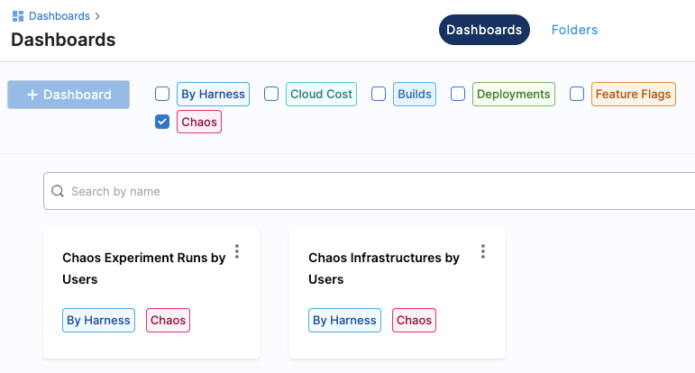
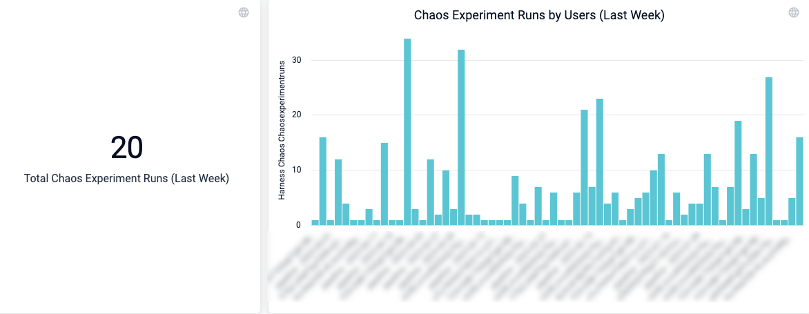
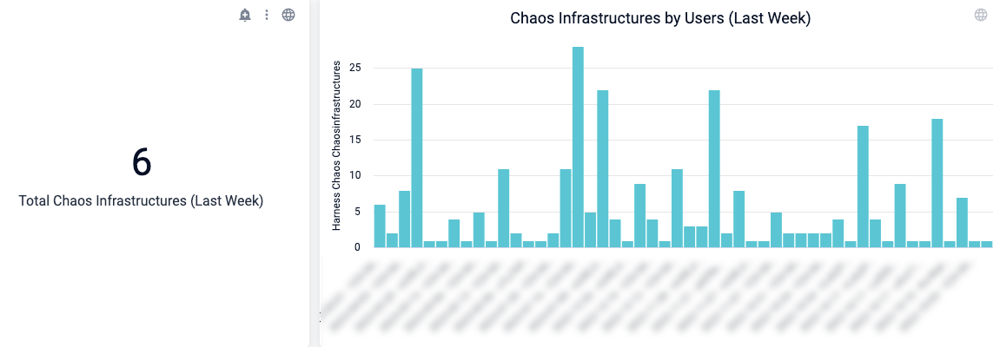
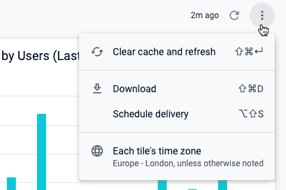
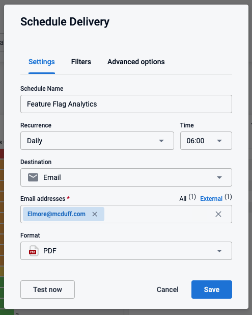
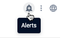
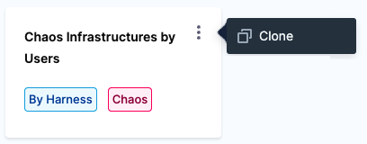
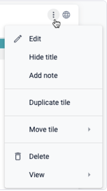

:::note
This feature is currently behind a feature flag named `CHAOS_DASHBOARD_ENABLED`. Contact Harness support to enable this feature.
:::

Harness Chaos Engineering (CE) comes with out-of-the-box dashboards that provide various aggregated views of data about your chaos experiments at an organization level. This includes experiments across all projects and environments in an organization.

With Harness dashboards, you can:

* Edit, customize, and create your own custom dashboards. 
* Download data in multiple formats to use in other tools. 
* Schedule delivery and set up alerts on dashboard data.  

For a complete guide to Harness dashboards, go to [Dashboards](/docs/category/dashboards-1).

This topic provides some highlights and useful information about the CE dashboards.

## CE dashboard highlights

### View the CE dashboards

To view the CE dashboards: 

1. In Harness, select **Dashboards** in the left navigation pane.
1. In the Dashboards page, select **Chaos**, and then select one of the Chaos dashboards.

	

On any dashboard, you can: 

* Hover over elements of a chart with your mouse to view details.
* Select different areas/bars of a chart to view details in tabular form, and download it to use in other tools.
* Schedule delivery of the dashboard data to email addresses.
* Set up alerts to be notified when specific data changes.
* Clone a dashboard to customize it for different needs and audiences.

### View experiment runs by users

This dashboard shows the number of experiments run by each chaos user over time. Three charts are available for: **Last Week**, **Last Month**, and **Last Year**.

* Hover over any bar on the chart to see details.
* Click any bar on the chart to drill down and see information in tabular form. From here, you can download the data in several formats to use in other tools.

### View chaos infrastructures by users

This dashboard shows the number of infrastructures created by each chaos user over time. Three charts are available for: **Last Week**, **Last Month**, and **Last Year**.

* Hover over any bar on the chart to see details.
* Click any bar on the chart to drill down and see information in tabular form. From here, you can download the data in several formats to use in other tools.

## Download, schedule, and share dashboard data

You can download data in many formats to use in other tools, and you can schedule delivery of data to share with others in email.

### Download data

You can download the entire dashboard or individual charts.

#### To download the entire dashboard:

1. At the top of the dashboard, select the **Dashboard actions** icon, and then select **Download**. 

	

1. Modify the settings as needed, and then select **Download**.

#### To download a chart:

1. Select the **Tile actions** icon at the top of the chart, and then select **Download data**. 

	

1. Modify the settings as needed, and then select **Download**.

### Schedule and share data

You can schedule delivery of the dashboard data to share with one or more email addresses.

To schedule delivery of dashboard data:

1. On your dashboard, select the **Dashboard actions** icon at the top, and then choose **Schedule delivery**.

	

1. Adjust the **Settings**, **Filters**, and other options as needed.
1. (Optional) Select **Test now** to test these settings.
1. Select **Save**.

## Alert on dashboard data

You can set up alerts on any chart, specifying the alert condition, when to get the alerts, and where to send them.

To set up alerts on a chart:

1. At the top of the chart, select the alert icon. and then modifying the alert settings for that chart.

	

1. Modify the settings to: 
	* Specify the condition for the alert. 
	* Select where to send the alert. 
	* Specify the alert frequency. 
1. Select **Save Alert**.

## Create a custom dashboard

You can clone and modify existing dashboards or create new ones. 

### Clone and modify an existing dashboard

To clone a dashboard:

1. Find the dashboard, select the actions icon, and then select **Clone**.

	

1. Select a **Folder**, provide a dashboard **Name** and optional **Tags**, and then select **Continue**.

	The new dashboard appears on the **Dashboards** page.

1. To customize it, select your new dashboard, then select the **Dashboard actions** icon at the top, and then choose **Edit dashboard**.

	

1. In the edit view, click the **Tile actions** icon on any chart to customize, hide, delete, or duplicate it.

	

### Create a new dashboard

For detailed instructions for creating dashboards, go to these topics:

* [Best practices for building dashboards](/docs/platform/Dashboards/dashboard-best-practices)
* [Create dashboards](/docs/platform/Dashboards/create-dashboards)
* [Add custom fields](/docs/platform/Dashboards/add-custom-fields)
* [Create visualizations and graphs](/docs/platform/Dashboards/create-visualizations-and-graphs)

